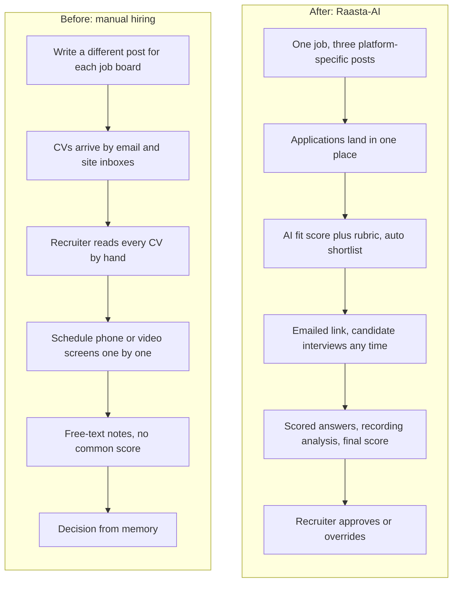
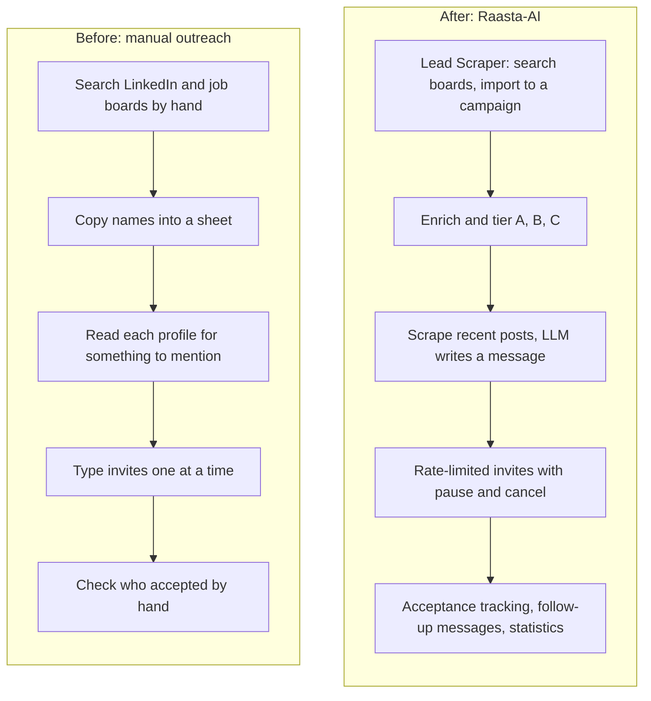
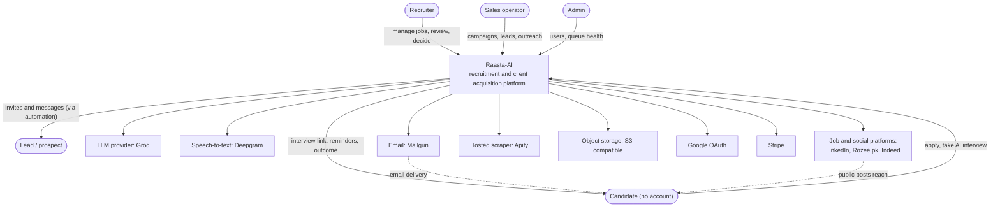
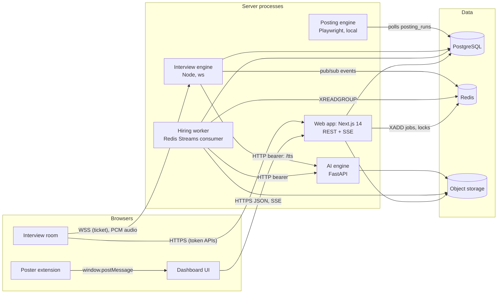
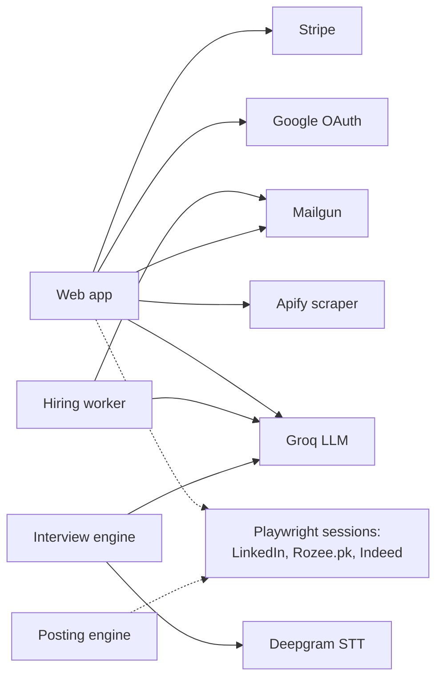
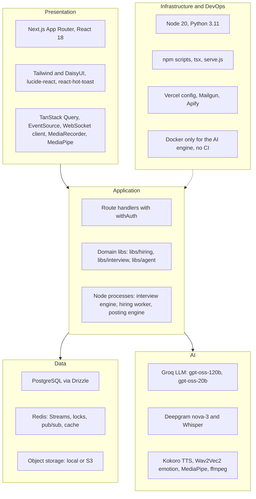
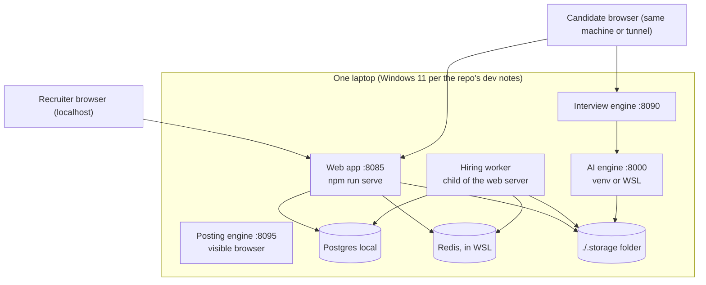
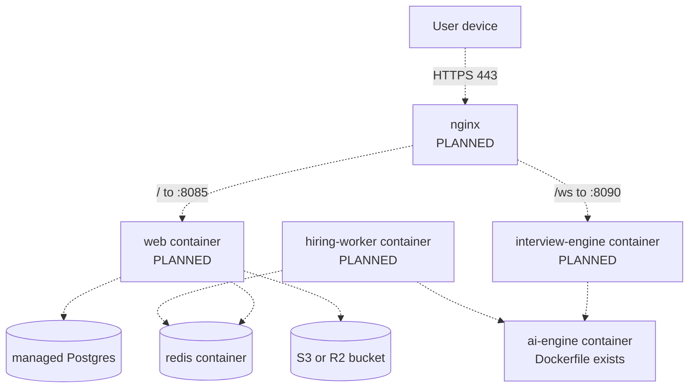
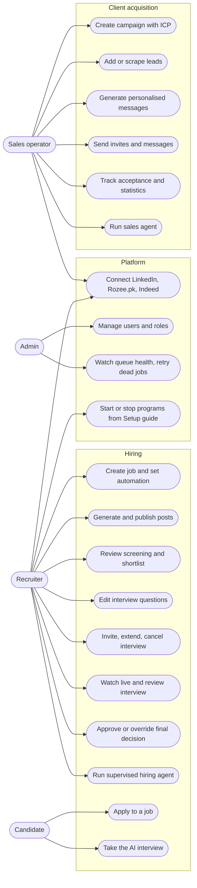

# Part 1 · The Big Picture

[← Index](README.md) · [Inventory](00-inventory.md) · Next: [Part 2A · End-to-end process](02a-end-to-end-process.md)

> **How to read this Part.** Everything here can be drawn on a whiteboard in under five minutes. Markers used throughout the whole document set: **[GAP]** = something that does not exist or is not evidenced; **[PARTIAL]** = exists but incomplete; **[PLANNED]** = designed but not built (drawn with dashed lines). *Recorded* means the reason is written in the repo (docs, commits, code comments); *Reconstructed* means the repo records the choice but not the reason, so the reason given is our best argument and the team must confirm it.

## Contents

* [1.1 Problem statement](#11-problem-statement)
* [1.2 System overview in one paragraph](#12-system-overview-in-one-paragraph)
* [1.3 What "multi-platform" actually means here](#13-what-multi-platform-actually-means-here)
* [1.4 Tech stack table](#14-tech-stack-table)
* [1.5 Glossary](#15-glossary)
* [1.6 The six required diagrams (a–f)](#16-the-six-required-diagrams-af)

---

## 1.1 Problem statement

### 1.1.1 Recruitment: the three problems the code addresses

| # | Problem in manual recruitment | Why it hurts | What Raasta-AI does about it (and where) |
|---|---|---|---|
| R1 | **Manual resume screening.** A posted job can attract dozens or hundreds of CVs; each is opened, read and compared to the job description by a person. | Slow, tiring, and inconsistent: the 5th CV is read differently from the 95th. Good candidates are missed on bad days. | Every application is parsed to structured data and scored 0–100 against the job description by an LLM with a fixed rubric; a deterministic rule then shortlists by threshold and top-N (`libs/hiring/fit-scorer.js`, `shortlist.js`). The recruiter sees *why* (matched/missing skills, strengths, concerns, rationale). |
| R2 | **Slow, expensive first-round interviews.** Shortlisted people must be contacted, a time found, and someone must run a phone/video screen and take notes. | Calendar tennis delays hiring by days; interviewers ask different questions, so candidates are not comparable. | The candidate gets a private, expiring link and does a **spoken interview with the Raasta AI Interviewer** in the browser, any time before expiry (`app/interview/[token]`, `services/interview-engine`). Questions come from a per-job bank that the recruiter can edit, so everyone for a job is asked the same base questions. |
| R3 | **Inconsistent evaluation.** Interview notes are free text; "good communicator" means different things to different interviewers. | Hard to defend a decision; hard to compare candidates; bias risk. | Each answer is scored 0–100 against an *ideal answer and expected keywords*; delivery is measured from the recording (pace, fillers, pauses, eye contact); a fixed, documented formula combines resume, interview and communication into a final score; the recruiter approves (`libs/hiring/final-evaluator.js`). |

Secondary recruitment pain points also handled: writing a different post for each job board (`libs/hiring/platform-content.js`), tracking candidates across stages (Kanban + status machine, `libs/hiring/statuses.js`), and running the whole thing semi-automatically with approvals (`libs/agent/`).

### 1.1.2 Client acquisition: the problems the code addresses

The "Sales" side serves a **service provider that wants clients** (the campaign form asks for *target role, industry, service type*; `campaigns.icp_config`).

| # | Problem | What Raasta-AI does (and where) |
|---|---|---|
| C1 | **Finding leads is manual.** Researching who to contact on LinkedIn or on job boards (a company advertising a vacancy is a visible buying signal for hiring-related services) takes hours. | The Lead Scraper searches Rozee.pk and Indeed job listings and turns companies into leads; LinkedIn profile URLs are added by hand or CSV (`app/api/leads/scrape`, `libs/platforms/*`). Rozee leads are enriched and tiered A/B/C (`libs/lead-conversion.js`). |
| C2 | **Generic outreach gets ignored.** Templated messages are not read. | Recent LinkedIn posts of the lead are scraped and an LLM writes a message that references them; B2B messages to hiring companies use only facts from the job posting (`libs/groq-service.js`). |
| C3 | **Sending at volume risks bans and is tedious.** | Invites and messages are sent by browser automation within **daily per-account limits**, with pause/cancel, progress streaming and connection-acceptance tracking (`libs/linkedin-invite-automation.js`, `libs/rate-limit-manager.js`, `workers/workflow-worker.js`). |
| C4 | **No visibility.** | Per-campaign statistics and a Home overview (`app/api/campaigns/stats`, `libs/dashboard/overview.js`). |

### 1.1.3 Who it is for (as evidenced by the code)

| Actor | Evidence in code | Needs an account? |
|---|---|---|
| **Recruiter** | `users.role`/`modes` (`recruiter`), `app/dashboard/recruiter/**` | Yes |
| **Sales operator** | `role = sales_operator` (the default), `modes` (`sales`) | Yes |
| **Admin** | `role = admin` (assigned manually; `app/dashboard/admin`) | Yes |
| **Candidate** | Apply form and interview room are public; the interview link token is the credential | **No account** |
| **Lead / prospect** | A row in `leads`; never logs in | No |
| **Job platforms** | LinkedIn, Rozee.pk, Indeed (external systems the team automates or hands off to) | n/a |

The market focus is **Pakistan** by evidence rather than by claim: Rozee.pk is a Pakistani job board with a first-class integration, Indeed defaults to the PK country site (`INDEED_JOBS_COUNTRY`, `indeedCountry: "pk"`), and the Rozee.pk posting flow only types rupee budgets ([GAP]: no market study is in the repo, so "Pakistan first" is an inference from the integrations, not a stated requirement).

### 1.1.4 Why existing tools are insufficient (and the honest limits of that claim)

> **[GAP — verify before presenting].** The comparison below is general market knowledge, not something this repository proves. Before the viva, each row must be checked against the current vendor documentation. The *defensible* part is the right-hand column: what Raasta-AI itself does, which you can demonstrate.

| Tool category (examples) | What it typically does | What it typically does *not* do in one product | What Raasta-AI does in one product |
|---|---|---|---|
| **LinkedIn Recruiter / job boards** | Sourcing, search, InMail, posting on that site | Run an interview; score a resume against *your* JD with a visible rubric; post to other boards; manage a pipeline across boards | Posts to three boards, receives applications on its own apply page, screens, interviews, scores |
| **Video-interview products (e.g. HireVue)** | Recorded/live video interviews, structured scoring | Source and screen the CV pool; run client-acquisition outreach; give the recruiter an editable, explainable rubric for free | Open pipeline with editable question bank and explainable score breakdown. *Raasta-AI does **not** claim validated predictive accuracy; HireVue-style vendors publish validation studies, we have none* |
| **Applicant tracking systems (e.g. Greenhouse, Lever, Workable)** | Pipeline, multiposting, scorecards, collaboration | Typically no built-in AI voice interviewer; AI features vary by vendor and tier; enterprise pricing | A free-to-run academic prototype with the AI interviewer built in. *It lacks the ATS maturity: roles/permissions per team, reporting, integrations, compliance (see Part 8b)* |
| **Sales-engagement tools (e.g. LinkedIn automation add-ons)** | Sequences of invites/messages | Hiring-signal leads from job boards; shared platform layer with recruitment | One adapter layer (`libs/platforms`) serves both recruitment and sales |

The honest one-sentence positioning: **Raasta-AI is not a better ATS; it is an integrated prototype that closes the loop from job post to AI-assisted final shortlist, with the human kept in control, plus a sales module on the same platform layer.**

---

## 1.2 System overview in one paragraph

Raasta-AI is a Next.js 14 web application with a PostgreSQL database and a Redis-backed background worker, extended by three further programs that need long-lived state or native tooling: a **WebSocket interview engine** (Node) that runs live voice interviews, a **Python AI engine** (FastAPI) for speech synthesis and recording analysis, and an optional **posting engine** (Node + Playwright) that fills job forms in a visible browser window. A **recruiter** creates a job; the system writes a platform-specific post for LinkedIn, Rozee.pk and Indeed and distributes it automatically or by hand-off; candidates apply on a public form; each resume is stored, parsed to structured data and **scored against the job description by an LLM** with deterministic post-processing; a **threshold-and-cap rule shortlists** the best; shortlisted candidates receive an **emailed single-use link** to a browser-based **spoken interview** conducted by the **Raasta AI Interviewer** (an adaptive loop: ask, listen via streaming speech-to-text, analyse, score against an ideal answer, optionally follow up); the recording and camera signals are analysed, a **deterministic formula** combines resume fit, interview score and communication score into a final score and a suggested decision, and the **recruiter approves or overrides** (optionally via a *supervised agent* that does, asks about or refuses each action by policy). A separate **sales module** turns campaigns, leads, scraped posts and LLM-written messages into rate-limited LinkedIn/Rozee.pk outreach with connection tracking. Both modules share authentication, the platform-account layer, the Redis infrastructure and the LLM client.

---

## 1.3 What "multi-platform" actually means here

The word is used loosely in the project brief. From the code it means **two distinct things**, and the panel may ask which one you mean. Be ready to say *both*, and to say what is **not** included.

### 1.3.1 Multiple external platforms (channels) the product works with

| Platform | Recruitment use | Sales use | How it is integrated (code) | Maturity |
|---|---|---|---|---|
| **LinkedIn** | Post a job to the recruiter's feed (auto, or hand-off to the composer) | Scrape a lead's posts; send connection invites and follow-up messages; check acceptance | Playwright with a stored browser session (`libs/linkedin-*.js`, adapter `libs/platforms/linkedin.js`); hosted scraper for profile posts (`app/api/scrape`) | Most mature; selector-fragile; owner accepts ban risk (CLAUDE.md) |
| **Rozee.pk** | Post a job; import applicants; (auto-apply helper) | Scrape job listings as company leads; enrich and tier them; message | Playwright + stored session (`libs/rozee-*.js`, adapter `libs/platforms/rozee.js`); posting via **posting engine** (visible window) or hand-off; background posting deliberately switched off (the form became a wizard that spends a credit) | Partial (see `docs/ai-hiring/19 §5g`) |
| **Indeed** | Post a job via the **posting engine** or the browser **extension** (background posting blocked by Cloudflare's bot check) | Job search (hosted scraper) to find hiring companies | `libs/indeed-*.js`, `libs/poster/flow-indeed.js`, adapter `libs/platforms/indeed.js` | Posting engine verified against stand-in (**practice**) sites; the first live runs hit a block page and then Indeed **paused the owner's test employer account** (cause unknown), so no further live runs (`docs/ai-hiring/19 §5f`) |
| **Direct (Raasta-AI's own apply page)** | Candidates apply at `/apply/[jobId]` | – | Public Next.js page and API | Complete |

A single interface hides the differences: `libs/platforms/index.js` returns an *adapter* per platform with `getAccount`, `testSession`, `sendMessage`, `publishJob`, `scrapeApplicants`, `search` and `rateLimit.*`. Pipelines iterate over adapters instead of branching on platform names.

### 1.3.2 Multiple client surfaces (the programs and browsers a user touches)

1. **Web dashboard** (recruiters, sales operators, admins).
2. **Public apply form** (candidates, no account).
3. **Public AI interview room** (candidates, token link, desktop Chrome/Edge; uses microphone, camera, WebSocket, MediaRecorder, MediaPipe).
4. **Browser extension** *Raasta-AI Poster* (recruiters, Chrome/Edge/Brave, Manifest V3) that shows the job's fields beside Indeed/Rozee.pk forms.
5. **Local posting engine** (a desktop program that opens a visible browser on the recruiter's machine).
6. **Email** (invites, reminders, outcomes) as a channel to candidates.

### 1.3.3 What is *not* multi-platform

* No native Android/iOS app; the interview room is desktop-only by design.
* No ATS/HR-system integrations (Workday, SAP, etc.), no calendar integration, no Slack/Teams integration.
* Only one LLM provider is wired (Groq via the OpenAI SDK); `LLM_BASE_URL` allows any OpenAI-compatible endpoint, but only Groq is exercised.
* Only one STT provider is used live (Deepgram, with Groq Whisper as fallback).

---

## 1.4 Tech stack table

*Basis* column: **R** = Recorded (reason written in the repo), **C** = Reconstructed (choice recorded, reason inferred).

| Layer | Technology (version) | Used for in Raasta-AI | Chosen over | Why it won | Trade-off | Basis |
|---|---|---|---|---|---|---|
| App framework | **Next.js 14** App Router, React 18 | UI, REST routes, SSE, SSR layout guard | Plain React + Express; Next Pages router; Remix | One codebase for UI and API; the repo started from the ShipFast Next.js template; route handlers are the API layer | Cannot hold WebSockets or long timers → forced a separate engine and worker; dev compile is slow (`docs/ai-hiring/21`) | R (template; `docs/ai-hiring/02` for the split) |
| Language | **JavaScript** (some `.ts`: `libs/db.ts`, `libs/schema.ts`) | Everything Node-side; Python for the AI engine | TypeScript everywhere | Template was JS; relative-import rule lets the same files run under `tsx` | No static types; errors surface at run time (mitigated by 436 unit tests) | C |
| Styling | **Tailwind CSS 3 + DaisyUI 4** | Components (`btn`, `card`, `badge`, `modal`) | MUI, Chakra, hand CSS | Template default; fast to build consistent screens | Class soup; DaisyUI themes tied to template | R (CLAUDE.md conventions) |
| Icons / UI libs | `lucide-react`, `react-hot-toast`, `@headlessui/react`, `@dnd-kit` (question reorder), `reactflow` (workflow canvas) | Icons, toasts, drag-and-drop | – | Small, tree-shakable | – | C |
| Client data | **TanStack Query 5** | Caching/refetch for dashboard data | SWR, manual `useEffect` | Template/earlier code used it; handles refetch intervals | Two styles coexist (`fetch` + Query) | R (CLAUDE.md) |
| Auth | **NextAuth 4** (JWT sessions; Credentials + Google) + `bcryptjs` | Sign-in, session role/modes | Auth0/Clerk, hand-rolled JWT | Template default; no external service; JWT keeps sessions stateless | Role is re-read from DB in the `jwt` callback on every call (extra query); no email verification/reset | R/C |
| DB | **PostgreSQL** | System of record | MongoDB (the earlier interview project used it), SQLite | Relational integrity, transactions and advisory locks; decision recorded: "Postgres only. No MongoDB" | Needs migrations; JSON columns used for flexible blobs | **R** (CLAUDE.md rule 4; `docs/ai-hiring/04`: Replace Mongoose with Drizzle) |
| ORM | **Drizzle ORM 0.44** + `postgres` driver | Typed queries, schema | Prisma, TypeORM, raw SQL | Already in the template; thin, SQL-like; works under `tsx` outside Next | Migration journal out of sync → hand-written SQL (`drizzle/0009`–`0015`) | R (CLAUDE.md rule 3) |
| Cache / queue / pub-sub | **Redis 7** via `ioredis` (+ `redis` client in the sales worker) | Job queue (Streams), locks, rate-limit counters, live events, campaign cache | BullMQ, RabbitMQ, SQS, DB-polled queue | Redis already used by the sales workflows; Streams give consumer groups, ack, reclaim without a new dependency. A `BullMQ` proposal exists in `SCALABILITY_ANALYSIS.md` but the hiring queue is hand-built | We wrote retry/dead-letter/delay logic ourselves (≈ 100 lines) and own its bugs | **R** (`docs/ai-hiring/README` decisions: "Redis Streams consumer") |
| LLM | **Groq** API through the **OpenAI SDK** (`openai@5`); models `openai/gpt-oss-120b` (main) and `openai/gpt-oss-20b` (fast) | Resume parse, fit score, questions, answer analysis/scoring, follow-ups, final summary, job posts, outreach | OpenAI GPT-4o (used by the earlier interview project), Anthropic, self-hosted Llama | Low latency (interview target ≤ 4 s per turn), low cost, OpenAI-compatible so the provider is swappable via `LLM_BASE_URL`. **Reversed once:** Groq retired Llama 3.x, forcing the move to GPT-OSS (commit `3eb4998`) | Vendor dependency; GPT-OSS "reasoning" tokens eat `max_tokens` (handled in `libs/ai/llm.js`) | R (commits `3eb4998`; `docs/ai-hiring/04`, `09`) |
| Speech-to-text | **Deepgram `nova-3`** streaming; **Groq Whisper `whisper-large-v3-turbo`** fallback | Live captions and transcripts | Browser Web Speech API, Whisper only, AssemblyAI | Streaming gives partials and low latency; fallback means no extra key is required to run | Deepgram is paid; Whisper fallback has no partials and invents text on silence (mitigated in `libs/interview/stt/clean.js`) | R (`docs/ai-hiring/README`) |
| Text-to-speech | **Kokoro-82M** in the AI engine; browser `speechSynthesis` fallback | Interviewer voice | Cloud TTS (ElevenLabs, OpenAI TTS) | Local, free, no per-call cost; fallback keeps the interview going when it fails | Heavy model; blocked on one Windows PC by Smart App Control (`docs/ai-hiring/14`) | R |
| Recording analysis | **Python 3.11 + FastAPI**, Wav2Vec2 speech emotion (`r-f/wav2vec-english-speech-emotion-recognition`), MediaPipe, NumPy/SciPy, optional TensorFlow face emotion | Voice, emotion, gaze, face, ffmpeg concat | Do it all in Node | Model ecosystems live in Python | Extra runtime to deploy; now only a **fallback** for pace/fluency/gaze (done in Node) | R |
| Browser vision | **MediaPipe Tasks Vision** (WASM, in the candidate's browser) | Eye contact, head movement, expressions as numbers | Server-side video analysis | Privacy (no frames leave the browser) and no video-processing cost | Depends on the candidate's GPU/CPU; model files must be synced (`npm run sync:mediapipe`) | R (`docs/ai-hiring/10`) |
| Media | **ffmpeg** (on the worker's PATH) | Join 10-second WebM parts, decode audio for pace/pauses | Python-only concat | Removes a hard dependency on the Python service (the cause of a real failed recording) | Must be installed on the worker host | R (`docs/ai-hiring/16` change log 2026-10-07) |
| Real-time | **`ws`** (WebSocket server), SSE for dashboards | Interview audio/events; live view; progress | Socket.IO, polling | Plain, small, standard; tickets are JWTs | Single instance; sessions in memory | R (`docs/ai-hiring/09`) |
| Tokens | **`jose`** (HS256 JWT) + Node `crypto` | 10-minute WebSocket tickets; SHA-256 hashed invite tokens; HMAC signed file links | Session cookies for candidates | Candidates have no account; capability tokens fit | A leaked link is a credential until it expires | R |
| Parsing | **`pdf-parse`**, **`mammoth`** | PDF and DOCX text | Regex over PDF bytes (the original approach), Apache Tika | Real extraction from PDFs; fallback to the old regex | Scanned PDFs have no text → flagged unreadable (no OCR) | R (`docs/ai-hiring/06`) |
| Email | **Mailgun** (`mailgun.js`) | Invites, reminders, outcomes | SMTP/nodemailer, SES | Template default; HTTP API; dev outbox fallback | Domain/DNS setup needed; `config.js` still has `reachly.ai` addresses | R/C |
| Storage | Local disk driver; **S3-compatible** driver (`@aws-sdk/client-s3`) | Resumes, recordings | DB blobs | Large binaries out of Postgres; same key scheme in both drivers | Local driver is single-machine | R |
| Automation | **Playwright** | LinkedIn/Rozee/Indeed sessions, scraping, posting engine | Puppeteer, Selenium, official APIs | Already used by the sales code; persistent profiles | Selector fragility; platform ToS; ban risk accepted by the owner (CLAUDE.md) | R |
| Hosted scraping | **Apify** actors via `apify-client` | LinkedIn profile posts; Indeed jobs | Own scraper | No login risk for the team's account; quick | Per-run cost; third-party actor | C (code comment says "hosted runner") |
| Payments | **Stripe** (`stripe@13`) | Checkout, portal, webhook | Paddle | ShipFast template | Plans in `config.js` are placeholders; no feature gating found | R (template) [PARTIAL] |
| Testing | Node `--test` via `tsx`; `pytest` for the AI engine | 436 + Python tests | Jest, Vitest | No new dependency; works with ESM + TS imports | No browser/E2E suite committed; no coverage tool | R (`docs/ai-hiring/17`) |
| Ops | Vercel config (crons, 300 s), PowerShell/Windows dev, `npm run serve` | Cron for acceptance checks; local production mode | Docker Compose (planned) | – | No CI, no Compose yet | R/[PLANNED] |

---

## 1.5 Glossary

### 1.5.1 Domain terms

| Term | Meaning in Raasta-AI |
|---|---|
| **Job** | A vacancy created by a recruiter (`jobs`): title, required skills, tech stack, experience range, salary, location, description, per-platform posts, and `hiring_config`. |
| **Job description (JD)** | The text the AI compares resumes to: `formalDescription`, else `linkedinPost`, else the title (`jobDescriptionText()` in `libs/ai/prompts/fit.js`). |
| **Candidate** | One application to one job (`candidates`): contact details, the resume file key, parsed data, fit and final scores, status. The same person applying to two jobs is two candidate rows. |
| **Application** | The act of submitting `/apply/[jobId]`; creates a `new` candidate. |
| **Resume parsing** | Turning a PDF/DOCX/TXT into the JSON in `candidates.parsed_data` (skills, experience, education…). |
| **Fit score** | Integer 0–100: how well the resume matches the JD (stage 1). |
| **Screening** | Computing the fit score and moving a candidate from `new` to `screened`. |
| **Shortlisting (first shortlist)** | Choosing who goes to interview: fit ≥ `minFitScore`, best first, up to `maxShortlist`. |
| **Hiring config (`hiring_config`)** | Per-job automation settings (thresholds, weights, toggles). Defaults in `libs/hiring/config.js`. |
| **Question bank** | The job's interview questions with ideal answers and expected keywords (`interview_questions`). |
| **Question snapshot** | A frozen copy of the questions saved when an interview starts (`interviews.question_snapshot`). |
| **Interview (record)** | One invitation + session (`interviews`), identified by a hashed token. |
| **Invite link / token** | `https://…/interview/{43-char token}`; only its SHA-256 hash is stored. |
| **Ticket** | A 10-minute JWT the room exchanges for a WebSocket connection (`libs/interview/tokens.js`). |
| **Raasta AI Interviewer** | The spoken AI interviewer (display name from `INTERVIEWER_NAME`). |
| **Follow-up** | An extra, AI-generated question about the last answer (max 2 per base question by default). |
| **Turn** | One utterance in the transcript (AI or candidate) (`interview_turns`). |
| **Response** | One scored answer (`interview_responses`); follow-ups are responses linked to their base question. |
| **Interview score** | Weighted average of base-question scores (follow-ups average into their base question). |
| **Communication score** | Weighted pace + fluency + eye contact + composure (0–100). |
| **Final score** | `w.resume × fit + w.interview × interview + w.communication × communication` (null parts dropped). |
| **Second shortlist / final shortlist** | The post-interview decision: `final_shortlisted` or `final_rejected`. |
| **Suggested decision** | The system's recommendation (`final_shortlisted`, `final_rejected`, `needs_review`); not applied unless `autoFinalize`. |
| **Human in the loop** | The recruiter approves rejections unless the job opts into `autoFinalize`. |
| **Supervised agent** | The policy-routed recruiter agent in `libs/agent/` (modes *Assisted* / *Autopilot*). |
| **Escalation** | A case the agent never handles automatically (borderline score, unreadable resume, …). |
| **Publication** | One attempt to put a job post on a platform (`job_publications`). |
| **Hand-off** | The recruiter gets the text and a link and posts it themselves. |
| **Posting engine** | A visible-browser program that fills a platform's post form and waits for the person at every check. |
| **Campaign** | A sales outreach project with an ICP (ideal customer profile) (`campaigns`). |
| **Lead** | A prospect (a LinkedIn profile URL or a company from a job listing) in a campaign (`leads`). |
| **Client** | In this project's language, the *customer of the sales operator* (the lead who converts). There is **no `clients` table**; clients are leads whose invite was accepted/replied. [PARTIAL] |
| **ICP** | Ideal Customer Profile: `{targetRole, industry, serviceType}`. |
| **Tier (A/B/C)** | Rozee lead quality from a deterministic score (`libs/lead-conversion.js`). |
| **Operator / mode** | `modes` = `recruiter` and/or `sales`, selecting which nav groups appear. |

### 1.5.2 Technical terms (short; the Primer in [Part 2D](02d-foundational-concepts.md) teaches them)

| Term | Meaning |
|---|---|
| **LLM** | Large language model: predicts text; used here through a chat API. |
| **Prompt / system prompt** | Instructions + data given to the LLM. |
| **JSON mode** | API option forcing valid JSON output (`response_format: json_object`). |
| **Hallucination** | Fluent but unsupported output; guarded against by recomputing skills from the resume. |
| **Embedding** | A numeric vector for text used for similarity. **Raasta-AI does not use embeddings** (see Part 5). |
| **STT / TTS** | Speech-to-text / text-to-speech. |
| **VAD / endpointing** | Detecting when speech starts/stops. |
| **WebSocket** | Persistent two-way connection; carries audio and events. |
| **SSE** | Server-sent events: one-way stream server → browser. |
| **Redis Stream / consumer group** | Append-only log with competing consumers, ack and reclaim; the job queue. |
| **Idempotent** | Safe to run twice with the same effect once. |
| **Advisory lock** | A Postgres application-level lock (`pg_advisory_xact_lock`). |
| **JWT** | Signed token (HS256 here). |
| **Hash vs encrypt** | One-way digest (invite tokens, passwords) vs reversible protection (not used for session cookies). |
| **RBAC** | Role-based access control. |
| **ORM** | Object-relational mapper (Drizzle). |
| **Dead-letter queue** | Where a job goes after its retries are exhausted (`hiring:jobs:dead`). |
| **Half-duplex microphone** | The mic sends nothing while the interviewer speaks (stops echo). |
| **Echo guard** | Code that removes the interviewer's own words from what the mic heard. |
| **MediaPipe** | Google's on-device face-landmark model. |
| **Blendshape** | A 0–1 facial-muscle score from MediaPipe (smile, brow…). |
| **Token budget / reasoning tokens** | GPT-OSS spends output tokens thinking; too small a limit yields empty answers. |

---

## 1.6 The six required diagrams (a–f)

### Diagram a · Problem context: before vs after Raasta-AI

**a1 · Hiring**

*How to read it:* each column is one process, top to bottom. The right column replaces manual steps with the module that automates it, but the last box stays human: the recruiter. Roughly: B1→A1 is Job Distribution, B3→A3 is AI Screening, B4→A4 is the Interview Module, B5→A5 is Evaluation.

**a2 · Client acquisition**

*How to read it:* same convention. The operator still reviews messages (the sales agent has an approval checkpoint in semi-auto mode).

### Diagram b · System context (C4 level 1)

*How to read it:* people on the left/top, external systems below. Arrows are the direction of the main request. Dotted arrows are delivery paths that do not go through Raasta-AI's own servers. Remember: candidates and leads never log in.

### Diagram c · High-level architecture (C4 level 2)

**c1 · Containers and protocols**

*How to read it:* browsers on the left reach exactly two servers, the web app (HTTPS) and, only during an interview, the engine (WebSocket). The worker is never called by a browser; it pulls from Redis. The AI engine is only called by the engine (speech) and the worker (analysis). The extension never talks to a server: it talks to the dashboard page in the same browser.

**c2 · External integrations by process**

*How to read it:* every outbound call goes from one named process. The LLM is the busiest dependency (three processes). Dotted lines are browser automation, which has no API contract and breaks when a page changes.

### Diagram d · Tech stack layers

*How to read it:* each box is a layer; arrows point from a layer to the layers it depends on. The only layer that is thin is Infrastructure: there is no CI and no full Compose file.

### Diagram e · Deployment and request path

There is **no production deployment** in the repository [GAP]. What exists is (1) the topology the team actually runs and demonstrates (one Windows machine) and (2) a documented but unbuilt single-VM plan. Both are shown.

**e1 · As run today (local / demo)**

**e2 · Planned (dashed): single VM with Compose and TLS**

*How to read them:* e1 is real; one machine runs everything, so "deployment" is "start the programs" (the Setup guide page can start/stop them). e2 is the design in `docs/ai-hiring/15`; every dashed box is not built yet. The request path for a normal page is: browser → web app → Postgres (and Redis for queueing) → JSON back. For an interview: browser → web app (token, consent, ticket) → browser opens the WebSocket to the engine → engine talks to Postgres, Deepgram, Groq and the AI engine → events return over the same socket.

### Diagram f · Use cases

*How to read it:* an arrow from an actor to a use case means the actor can start it. Admins can also do everything recruiters and sales operators can (`role = admin` bypasses ownership filters and mode checks). Candidates have only two use cases and need no account.
