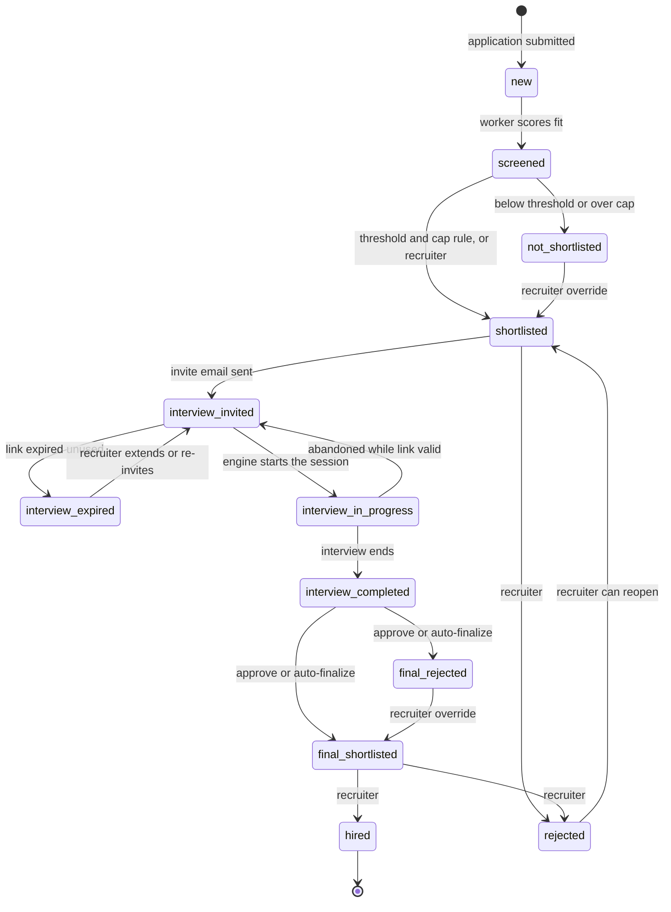
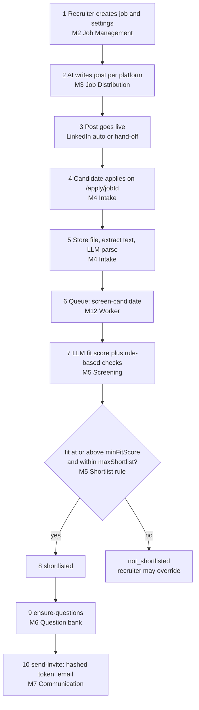
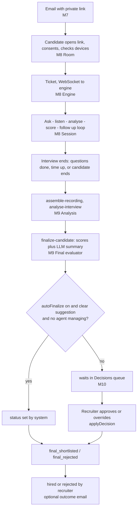
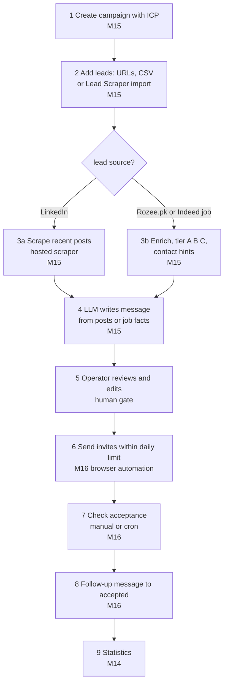
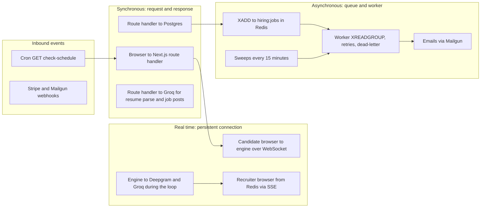
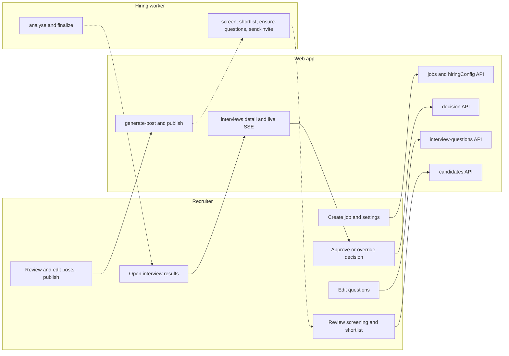
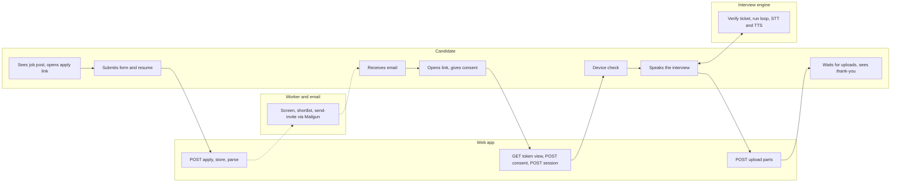
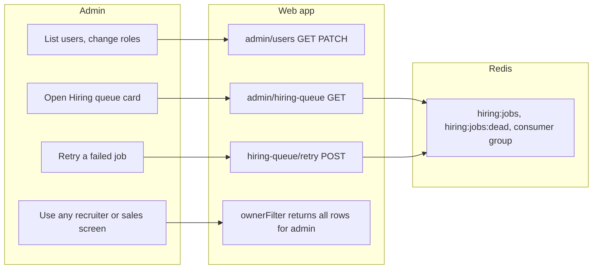
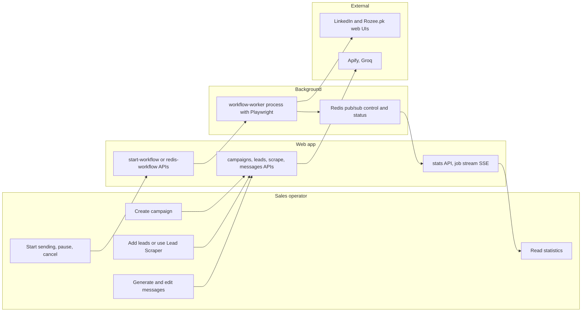
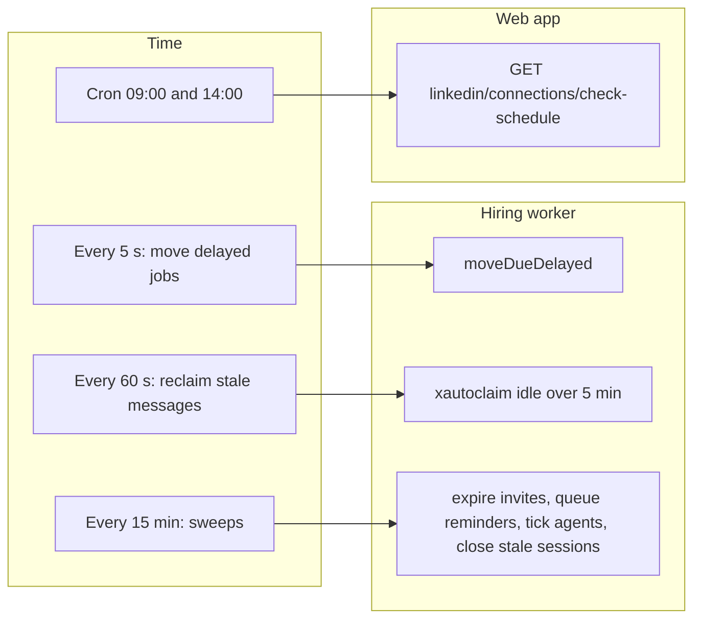

# Part 2A · The End-to-End Process

[← Index](README.md) · Previous: [Part 1](01-big-picture.md) · Next: [Part 2B · Conceptual modules](02b-conceptual-modules.md)

> The goal of this file is that you can tell the whole story of Raasta-AI, stage by stage, **as it is implemented**, and then answer three questions about any stage: *what goes in, what comes out, and who (or what) decides?*

## Contents

* [A.1 The recruitment process as a story](#a1-the-recruitment-process-as-a-story)
  * [Candidate status machine](#a11-the-candidate-status-machine)
  * [Stage cards 1–11](#a12-stage-cards)
  * [Flowcharts](#a13-end-to-end-recruitment-flowcharts)
* [A.2 The client-acquisition process as a story](#a2-the-client-acquisition-process-as-a-story)
* [A.3 Synchronous vs asynchronous, human vs automatic](#a3-synchronous-vs-asynchronous-human-vs-automatic)
* [A.4 Swimlane diagrams per actor](#a4-swimlane-diagrams-per-actor)

---

## A.1 The recruitment process as a story

> **The story in one breath.** A recruiter describes a job. Raasta-AI writes a post for each job board and publishes it (or hands it to the recruiter). Candidates apply on Raasta-AI's own page. Each resume is saved, read by an LLM into structured data, and scored against the job. A rule picks the best. Those people get an email with a private link; they open it, agree to be recorded, test their microphone and talk to the Raasta AI Interviewer. Behind the scenes the system records, transcribes, scores every answer, measures how they spoke, and finally computes one number. The recruiter sees the number, the reasoning and the recording, and presses *approve* or overrides it.

### A.1.1 The candidate status machine

Defined once in `libs/hiring/statuses.js` (`CANDIDATE_STATUS`, `MANUAL_TRANSITIONS`). Every route and screen reads statuses from there (CLAUDE.md rule 5).

*How to read it:* each box is a value of `candidates.status`; each arrow is a legal move and its trigger. Arrows labelled "recruiter" are the **manual overrides** allowed by `MANUAL_TRANSITIONS`; the others are made by the system (worker, engine). `interview_in_progress` cannot be changed by hand. Two legacy values (`reviewed`, `rejected`) remain valid for old data.

The interview itself has its own life-cycle in `interviews.status`: `invited → opened → in_progress → completed`, plus `abandoned`, `expired`, `failed`, `cancelled`. At most one *active* (`invited|opened|in_progress`) interview exists per candidate; this is enforced in code inside a transaction guarded by `pg_advisory_xact_lock('invite:<candidateId>')`, not by a database constraint [PARTIAL].

### A.1.2 Stage cards

Each card: **Receives → Does → Hands over**, then *Module · Key code · Mode · Decided by*.

#### Stage 1 · Job and automation settings

* **Receives:** the recruiter's form (title, required skills, tech stack, experience range, salary, location, type).
* **Does:** `POST /api/hiring/jobs` inserts a `jobs` row (`status = draft`; only the title is validated server-side). Per-job automation lives in `jobs.hiring_config` (thresholds, weights, toggles); `PATCH /api/hiring/jobs/[jobId]` merges and validates it with `validateHiringConfig` (integers in range, weights ≥ 0 and normalised to sum 1).
* **Hands over:** the `jobs` row, which every later AI step reads as the "job description".
* *Module* M2 · *Code* `app/api/hiring/jobs/**`, `libs/hiring/config.js` · *Sync* · *Decided by* the recruiter.
* **Note:** the text the AI treats as the *job description* is `formalDescription || linkedinPost || title`. No screen currently edits `formalDescription`, so in practice it is the **LinkedIn post** (or just the title) plus the structured fields. See the edge cases in [04a](04a-functionality-intake-screening.md).

#### Stage 2 · Write and publish the post

* **Receives:** the job.
* **Does:** `POST /api/hiring/jobs/[jobId]/generate-post` asks the fast LLM for a post per platform (LinkedIn, Rozee.pk, Indeed), then a deterministic clean-up enforces each platform's rules (no markdown, hashtag/emoji limits, apply link present, length). Publishing is either **automatic** (LinkedIn only, through a stored session, with daily caps and a gap) or a **hand-off** (copy + open the platform; optionally with the browser extension or the posting engine). Every attempt is a `job_publications` row.
* **Hands over:** a published job (`jobs.status = published`) and the **public apply link** `/apply/{jobId}` embedded in the post.
* *Module* M3 · *Code* `libs/hiring/platform-content.js`, `publishing.js`, `libs/poster/**` · *Sync* (the engine run is long-lived but tracked in `posting_runs`) · *Decided by* the recruiter (every platform post is confirmed by a person; the agent in Assisted mode asks first).

#### Stage 3 · Resume collection

* **Receives:** the public form: name, email, optional LinkedIn URL, cover note, resume file (PDF/DOCX/TXT ≤ 5 MB).
* **Does:** `POST /api/hiring/apply/[jobId]` (public): validate → fail fast on duplicates → store the original in object storage → extract text → LLM-parse to JSON → insert the candidate (`new`) in a transaction under an advisory lock → enqueue `screen-candidate` if `autoScreen` → notify the recruiter.
* **Hands over:** a `candidates` row with `parsed_data`, `resume_key`, and a queued screening job.
* *Module* M4 · *Code* `app/api/hiring/apply/[jobId]/route.js`, `libs/hiring/resume-text.js`, `storage.js` · *Sync up to the DB insert; screening async* · *Decided by* the system (nobody approves an application).

#### Stage 4 · AI screening

* **Receives:** `candidateId` from the queue.
* **Does:** `screenCandidate` loads candidate + job, calls the LLM with a fixed rubric and the **parsed resume stripped of personal fields**, then post-processes deterministically: clamps the score, **recomputes matched/missing skills from the resume text itself** (synonym-aware), flags LLM claims not supported by the text, and scrubs the candidate's name from the explanation. Saves `fit_score`, `fit_analysis`, `screened_at`; status `new → screened`. An unreadable resume scores 0 and is flagged `manualReview` without calling the LLM.
* **Hands over:** a scored candidate; schedules one debounced `shortlist-job` per job (30 s).
* *Module* M5 · *Code* `libs/hiring/fit-scorer.js`, `libs/ai/prompts/fit.js` · *Async (worker)* · *Decided by* the system (scores are advisory until shortlisted).

#### Stage 5 · First shortlist

* **Receives:** all `screened`/`reviewed` candidates of the job with a score.
* **Does:** `applyShortlist` (in a transaction under `pg_advisory_xact_lock('shortlist:<jobId>')`): sort by fit descending then earliest application; shortlist while `fit ≥ minFitScore` and the cap `maxShortlist` (counting people already past stage 1) allows; everyone else → `not_shortlisted`. Newly shortlisted candidates trigger `ensure-questions`, optional `personalise-questions`, and (if `autoInvite`) `send-invite`.
* **Hands over:** `shortlisted` candidates + queued invites.
* *Module* M5 · *Code* `libs/hiring/shortlist.js`, `shortlist-hooks.js` · *Async* · *Decided by* the **rule** (a recruiter can override any candidate; with a supervised agent the agent's policy decides instead).

#### Stage 6 · Interview questions

* **Receives:** the job (and for personalised questions, the candidate's screening gaps).
* **Does:** `ensureJobQuestions` generates `questionCount` (default 8) questions via the LLM with a fixed mix (1 warm-up, technical medium/hard, role, behavioral), each with an **ideal answer** and **expected keywords**; every question is validated and de-duplicated in code (`question-generator.js`). A per-job Redis lock prevents two generations at once. Recruiters can edit, add, reorder, deactivate; a question used in a started interview is soft-deleted.
* **Hands over:** `interview_questions` rows. At interview start they are frozen into `interviews.question_snapshot`.
* *Module* M6 · *Code* `libs/interview/question-generator.js`, `question-bank.js` · *Async* · *Decided by* the recruiter may edit before candidates start.

#### Stage 7 · Interview invitation

* **Receives:** `candidateId`.
* **Does:** `sendInvite` creates a 43-character random token, stores only its **SHA-256 hash**, creates the `interviews` row (`invited`, expiry `inviteExpiryHours`, default 72), moves the candidate to `interview_invited` in one transaction, and emails the link (Mailgun, or a dev outbox file). If the questions do not exist yet the job retries every 30 s up to 10 times. A reminder (default after 24 h, if unopened) **rotates the token** because the raw token is never stored.
* **Hands over:** an emailed link `https://…/interview/{token}`.
* *Module* M7 · *Code* `libs/hiring/invitations.js`, `emails.js`, `libs/interview/tokens.js` · *Async* · *Decided by* the system (or recruiter via invite/resend/extend/cancel buttons).

#### Stage 8 · The AI interview

* **Receives:** the candidate opening the link in Chrome/Edge.
* **Does:** the room walks **loading → consent → device check → interview → completed**. The token is verified and rate-limited on every API call; `POST …/session` (after consent) returns a 10-minute **ticket**; the browser connects `wss://engine/ws?ticket=…`. The engine loads the interview, freezes the questions, greets the candidate, then loops: *ask (TTS) → listen (STT) → finalise on button or 8 s of silence → analyse → maybe follow up (≤ 2) → score in background → next question*, until questions or the time budget (default 25 min) run out. The browser records audio (and video) in 10-second parts and uploads them, and tracks eye/head/face numbers locally.
* **Hands over:** `interview_turns` (transcript), `interview_responses` (scored answers), `interviews.interview_score`, recording parts in storage, behaviour JSON, integrity events; candidate `interview_completed`; queued `analyse-interview`.
* *Module* M8 · *Code* `app/interview/[token]/**`, `services/interview-engine/**`, `libs/interview/session-engine.js` · *Real time (WebSocket)* · *Decided by* the AI loop (what to ask next) but nothing about the candidate's outcome.

#### Stage 9 · Post-interview analysis

* **Receives:** `interviewId` once the last recording part arrives (`assemble-recording`) or after waiting up to 10 minutes.
* **Does:** join parts with ffmpeg; measure pace/pauses/fillers from audio + transcript (Node); summarise camera behaviour; optionally tone-of-voice emotion from the AI engine; summarise integrity events. Each measurement is independent; a failure is recorded in `analysis.errors` and never stops the others.
* **Hands over:** `interviews.analysis` (JSON) and a queued `finalize-candidate`.
* *Module* M9 · *Code* `libs/interview/analysis.js`, `media-tools.js`, `voice-metrics.js`, `behavior.js` · *Async* · *Decided by* the system.

#### Stage 10 · Final evaluation (second shortlist)

* **Receives:** candidate + completed interview + analysis.
* **Does:** compute communication score (pace 30%, fluency 30%, eye contact 25%, composure 15%, missing parts dropped and re-normalised), compute `finalScore` from resume/interview/communication with the job's weights, ask the LLM for a 3–4 sentence evidence-only summary and recommendation, compute `suggestedDecision` (`final_shortlisted` if ≥ threshold else `final_rejected`; **`needs_review` if < 50% of questions were answered or there is no score**). Store in `candidates.final_*`. Apply it **only if `autoFinalize` is on**, the suggestion is not `needs_review`, the candidate is still `interview_completed`, and **no supervised agent manages the job**. Otherwise notify the recruiter.
* **Hands over:** `final_score`, `final_analysis`, a notification.
* *Module* M9 · *Code* `libs/hiring/final-evaluator.js`, `finalize.js` · *Async* · *Decided by* the **formula** suggests; the **recruiter** decides (default).

#### Stage 11 · Recruiter decision and outcome

* **Receives:** the Decisions queue / candidate page.
* **Does:** `applyDecision` validates the move with `canTransition`, writes `status`, `decided_by` (user id or `system`), `final_decided_at`, and a `decision` record (who, when, note) inside `final_analysis`; a conditional `WHERE status = <validated status>` update prevents two concurrent decisions. If the job enables `sendOutcomeEmails`, an idempotent outcome email (never containing scores) is queued. Bulk approve applies all non-escalated suggestions.
* **Hands over:** the final state `final_shortlisted` / `final_rejected` / `hired` / `rejected`.
* *Module* M9/M10 · *Code* `libs/hiring/decisions.js` · *Sync* · *Decided by* the recruiter.

### A.1.3 End-to-end recruitment flowcharts

Split in two so each can be drawn from memory.

**Flow 1 · From job to invitation**

*How to read it:* boxes are stages tagged with the owning module; the diamond is the only automatic decision before the interview. The recruiter can intervene at every box (re-run, override, edit questions).

**Flow 2 · From invitation to final outcome**

*How to read it:* everything above the diamond is automatic; the diamond is the **human-in-the-loop gate** (CLAUDE.md rule 6: rejections need recruiter approval unless `autoFinalize`). `needs_review` suggestions never auto-apply.

---

## A.2 The client-acquisition process as a story

> **The story in one breath.** A sales operator creates a campaign describing who they sell to. They add leads: LinkedIn profile URLs by hand or CSV, or companies discovered by searching job boards (a company hiring is a signal). For LinkedIn leads the system fetches recent posts; for Rozee.pk leads it reads the job listing, scores it A/B/C, and looks for contact hints. An LLM writes a message per lead from those facts. The operator reviews it. The system then sends connection invites through the operator's logged-in browser session, respecting a daily limit, can run in the background and be paused or cancelled, later checks which invites were accepted, and sends follow-up messages to those people. Statistics roll up per campaign.

| # | Stage | Receives | Does | Hands over | Code | Mode | Decided by |
|---|---|---|---|---|---|---|---|
| 1 | Campaign | name, description, ICP (`targetRole`, `industry`, `serviceType`), sources (`linkedin`, `rozee`) | `POST /api/campaigns`; invalidates and rewrites Redis cache; status `draft` | campaign row | `app/api/campaigns` | sync | operator |
| 2 | Add leads | URLs, CSV rows | `POST /api/campaigns/[id]/leads`: keep only URLs whose platform is allowed by the campaign (`detectPlatformFromUrl`), **skip URLs the user already has in any campaign**, insert `pending` leads, flip campaign `draft → active`, refresh cache | leads | `libs/platform-urls.js` | sync | operator |
| 3 | Discover leads (optional) | platform + filters | `POST /api/leads/scrape` (Rozee.pk, Indeed supported; LinkedIn search "not wired yet") returns results in memory; `POST /api/leads/scrape/import` saves selected rows as `completed` leads | leads with `source_data` | `libs/platforms/*.search` | sync (long, 300 s max) | operator picks rows |
| 4a | LinkedIn: get posts | pending LinkedIn leads | hosted scraper (`POST /api/scrape` → Apify actor) or the optional Playwright scraper; store posts (engagement = likes + 2·comments + 3·shares), lead → `completed` | `posts` rows | `app/api/scrape`, `libs/scraping-utils.js` | sync (third-party run) | operator |
| 4b | Rozee: enrich | a Rozee job lead | `POST /api/leads/[id]/enrich`: scrape the job page, compute score/tier, find email/social hints, optionally research the company website via Google/SerpAPI; store `source_data.conversion` | tier + outreach hints | `libs/lead-conversion.js`, `libs/lead-rozee-enrichment.js` | sync | system rule |
| 5 | Write message | lead + top posts or job facts | `generatePersonalizedMessage` (LLM, top 3 posts × 500 chars) or `generateRozeeJobLeadOutreach` (**only facts given**); saved as `draft` in `messages`, to be sent **after the invite is accepted** | message text | `libs/groq-service.js` | sync / SSE stream | LLM; **operator reviews and may edit** |
| 6 | Send invites | approved leads, active account | check session, daily limit (schema default 30/day for LinkedIn), eligible leads (`inviteStatus` pending/failed), then per lead: open profile, detect already-pending/connected, click Connect and send **without a note** (the `customMessage` argument is ignored by `processInvitesDirectly`; the personalised text goes out after acceptance), 10–30 s random delay between invites; update Redis then Postgres | `invite_status`, counters | `libs/linkedin-invite-automation.js` | **sync in request**, or **background** `workflow-worker` process (1 per user), or **Redis-batched** (5 per batch) | system within limits; operator can pause/cancel |
| 7 | Track acceptance | active account | scrape the connections page (at least 100 newest connections), match profile vanity names to the leads whose invite was sent, mark them `accepted`, then **send each accepted lead's stored message** (daily message cap, 30–90 s between messages); per-account daily cap on checks | `invite_accepted_at`, `message_sent` | `libs/linkedin-connection-checker.js` | manual button, **cron** (09:00 and 14:00 via Vercel cron), or agent step | system |
| 8 | Follow-up message | accepted leads | LinkedIn message (daily cap 10) or Rozee.pk message (daily cap 15) | `messages.status = sent` | `libs/linkedin-message-sender.js`, `libs/rozee-message-sender.js` | sync/background | system within limits |
| 9 | Statistics | leads | counts by invite status, per campaign, timeline | dashboard numbers | `app/api/campaigns/stats` | sync | – |
| 10 | **Sales agent** (optional) | campaign + account | runs steps 4–8 as a pipeline with a **checkpoint** after message generation; `semi_auto` pauses for approval, `full_auto` skips it | `agent_runs/steps` | `libs/agent-runner.js`, `libs/agent-pipelines/sales-operator.js` | async | operator in semi-auto |

*How to read it:* identical convention to the recruitment flows. The only human gate is step 5 (and the pause/cancel buttons while sending). Steps 6–8 are the part that talks to LinkedIn through a stored browser session and is therefore the most fragile.

---

## A.3 Synchronous vs asynchronous, human vs automatic

### A.3.1 What happens inside the HTTP request, and what is deferred

| Action | Sync (the user waits) | Async (deferred) |
|---|---|---|
| Submit application | file validation, storage write, text extraction, **LLM parse**, DB insert | screening, shortlisting, invites, notifications are queued |
| Press "Screen all" | queue N jobs, mark `queuedAt` | the LLM scoring |
| Publish to LinkedIn | the automated post (can take a minute) | – |
| Posting-engine run | creating the `posting_runs` row | the whole browser run (engine polls the table) |
| Send interview invite (button) | `sendInvite` including the email | – |
| Auto invite | – | `send-invite` job |
| Interview | token/ticket APIs | the live loop is a WebSocket (real time) |
| End of interview | – | assemble, analyse, finalize, notify |
| Decision | `applyDecision` | outcome email |
| LinkedIn invites | direct "activate" holds the request open; "start-workflow" returns at once | workflow worker process; Redis batches |

### A.3.2 Sync vs async diagram

*How to read it:* the left column is what users feel as "instant"; the right column is everything the web server hands to Redis and forgets. The engine is **not** part of the queue: it holds live state in memory and only enqueues `analyse-interview` when it finishes.

### A.3.3 Where a human can override the AI

| Decision | System behaviour | Human override | Default |
|---|---|---|---|
| Fit score | LLM + rules | Recruiter can re-screen, or ignore the score and move the candidate by hand (Kanban or buttons) | Advisory |
| First shortlist | threshold + cap rule | Move to/from `shortlisted` (`MANUAL_TRANSITIONS`); change the threshold and re-run | Automatic, but reversible |
| Interview questions | LLM generated | Edit, add, deactivate, reorder before the interview | Recruiter-editable |
| Sending the invite | auto if `autoInvite` | Turn off; send/resend/cancel manually | On |
| Interview conduct | AI loop | Candidate can repeat a question (twice), end the interview; recruiter cannot intervene live (read-only live view) | AI |
| Answer scores | LLM | Recruiter reads the reasoning and the transcript; **there is no UI to edit a score** [GAP] | AI |
| Final decision | formula suggestion | `applyDecision`, bulk approve, or override either way | **Human unless `autoFinalize`** |
| Hiring | – | Only a human sets `hired` (the agent's `hire` action is `human`-only) | Human |

### A.3.4 Where the system decides on its own (inventory of automatic actions)

Screening (always when `autoScreen`), shortlisting (rule), question generation, invite emails (when `autoInvite`), reminders, link expiry, abandoning stale sessions, recording assembly, analysis, final scoring and suggestion, notifications. Only **two** actions can change a candidate's outcome without a click: the first shortlist (reversible, no message to the candidate other than the invite) and, if `autoFinalize` is switched on, the final decision (never for `needs_review`, never while an agent manages the job).

---

## A.4 Swimlane diagrams per actor

Each diagram is a flowchart with one lane per participant; read left to right inside a lane and follow arrows across lanes.

### A.4.1 Recruiter

*Reading:* solid arrows are requests, dashed arrows are things the worker prepared for the recruiter asynchronously. The recruiter never calls the worker or engine directly.

### A.4.2 Candidate

*Reading:* the candidate talks to **two** servers only: the web app (HTTPS) and, during the interview, the engine (WSS). Everything between "submit" and "receive email" is invisible to them.

### A.4.3 Admin

*Reading:* the admin role adds two things: user management and queue visibility; plus it bypasses the per-owner filter. Admin is **assigned manually** (sign-up always creates `sales_operator`).

### A.4.4 Sales operator

*Reading:* the background worker is a **separate Playwright process** spawned per run; the browser listens to its progress through Redis pub/sub relayed by an SSE route, and pause/cancel go back the same way.

### A.4.5 System (time-driven actors)

*Reading:* nothing in the hiring pipeline depends on a user being online. The sweeps are the safety net for lost events (expired links, un-sent reminders, interviews whose engine died).
