# Part 2B · Conceptual Modules (M1–M8: identity, jobs, intake, screening, interview)

[← Index](README.md) · Previous: [Part 2A](02a-end-to-end-process.md) · Continues in: [Part 2B (cont.) M9–M20](02b2-conceptual-modules-cont.md) · Then: [Part 2C](02c-module-interaction.md)

> **Why modules by responsibility, not by folder?** A folder tells you *where* code lives; a module tells you *what question it answers*. "Who is this person and what may they touch?" is Identity & Access, even though its code is spread over `libs/`, `app/api/auth`, `app/dashboard/layout.js` and `components/layout/Sidebar.js`. Each module below uses the same template:
> **Responsibility → Core concept (from first principles) → Inputs & outputs → Internal working → Mapping to code → Dependencies and failure impact → Why it is separate**, plus two diagrams.

## Contents

[M1 Identity & Access](#m1--identity--access) · [M2 Job Management](#m2--job-management) · [M3 Job Distribution](#m3--job-distribution) · [M4 Application Intake & Resume Parsing](#m4--application-intake--resume-parsing) · [M5 AI Screening & Shortlisting](#m5--ai-screening--shortlisting) · [M6 Interview Question Bank](#m6--interview-question-bank) · [M7 Candidate Communication](#m7--candidate-communication) · [M8 Interview Module (Raasta AI Interviewer)](#m8--interview-module-raasta-ai-interviewer)

---

## M1 · Identity & Access

**Responsibility.** Decide *who* a request is from, *what role and modes* they have, and *which rows they may touch*. Also give candidates a way in without an account.

### Core concept: authentication, authorization, tokens, hashing

* **Authentication** = proving who you are (password, Google). **Authorization** = deciding what you may do. They are separate steps: knowing you are Zain does not mean you may read Nawal's jobs.
* **Analogy.** A building: the front desk checks your ID (authentication) and gives you a badge; each door reads the badge (authorization). A *capability link* is like a one-time visitor pass printed with a long random code: whoever holds it may enter one room.
* **Passwords are hashed, not encrypted.** A hash function turns the password into a fixed-length string that cannot be reversed. **bcrypt** adds a random *salt* (so two equal passwords hash differently) and a *cost factor* (so each guess is slow). The server never stores the password; to check a login it hashes the attempt with the stored salt and compares.
* **JWT session.** After login the server issues a signed token (JSON Web Token) in a cookie. Each request carries it; the server verifies the signature and reads claims (user id, role). No server-side session table is needed (stateless), at the price that a token cannot be revoked before it expires.
* **RBAC + ownership.** *Role-based access control* gives broad powers (`admin`); *ownership filters* (`WHERE user_id = me`) give per-record isolation, which is the real protection in a multi-user app.

### How Raasta-AI applies it

* **Two sign-in methods** in `libs/next-auth.js`: Credentials (email + password checked with `bcryptjs.compare`) and Google OAuth. Strategy is `jwt`.
* **Roles** (`users.role`): `admin`, `sales_operator` (default), `recruiter`. **Modes** (`users.modes`, JSON array of `recruiter` / `sales`) chosen in `/onboarding`; modes only decide which navigation groups appear.
* **Layers of enforcement**, from weakest to strongest:
  1. *Navigation* (`components/layout/Sidebar.js`): hides groups by `requireMode`/`requireRole`. **UI only.**
  2. *Page guard* (`app/dashboard/layout.js`, server component): redirect to `/signin` if no session; to `/onboarding` if no modes (admin exempt). There is **no `middleware.js`**, which is why `/apply`, `/interview` and `/api/interview` are public by default.
  3. *API guard* (`withAuth` in `libs/auth-middleware.js`): 401 if no session; attaches the `users` row; every hiring route then filters by owner (`ownerFilter`: admin sees all, others `jobs.userId = user.id`).
  4. *Role check* in admin routes: `if (user.role !== "admin") return 403`.
* **Candidates** have no account. Their credential is the interview token (see M7/M8).

### Inputs & outputs

| In | Out |
|---|---|
| email + password / Google profile / session cookie | `session.user = { id, role, modes, name, hasPassword }`; `user` row in route handlers; 401/403 responses |

### Internal working

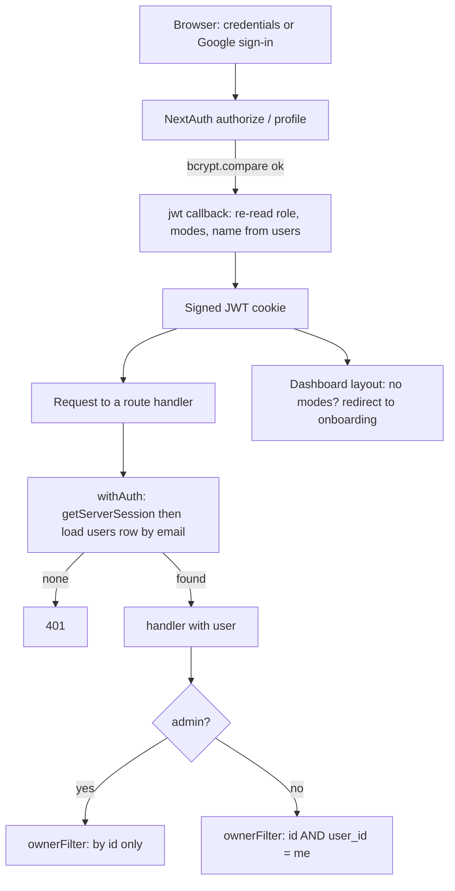
```mermaid
flowchart TD
  A["Browser: credentials or Google sign-in"] --> B["NextAuth authorize / profile"]
  B -->|"bcrypt.compare ok"| C["jwt callback: re-read role, modes, name from users"]
  C --> D["Signed JWT cookie"]
  D --> E["Request to a route handler"]
  E --> F["withAuth: getServerSession then load users row by email"]
  F -->|"none"| G["401"]
  F -->|"found"| H["handler with user"]
  H --> I{"admin?"}
  I -->|"yes"| J["ownerFilter: by id only"]
  I -->|"no"| K["ownerFilter: id AND user_id = me"]
  D --> L["Dashboard layout: no modes? redirect to onboarding"]
```

*How to read it:* the `jwt` callback runs on every session check and **re-reads the role from the database**, so an admin changing someone's role takes effect at their next request (cost: one extra query per session check). `authenticateUser` also creates a `users` row on first sight of a Google user (no adapter is configured).

### Mapping to implementation

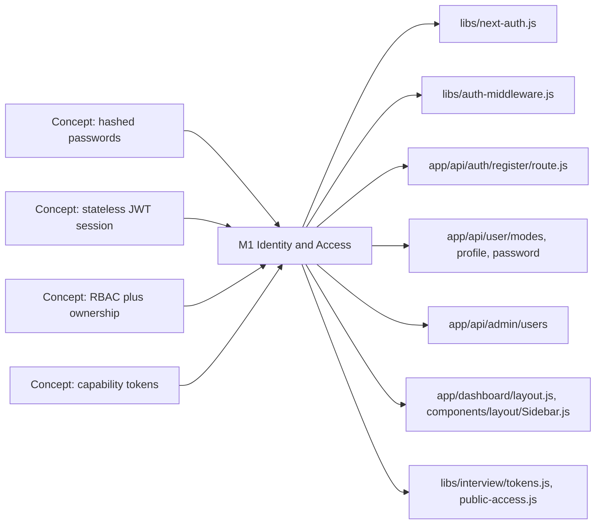
```mermaid
flowchart LR
  K1["Concept: hashed passwords"] --> M["M1 Identity and Access"]
  K2["Concept: stateless JWT session"] --> M
  K3["Concept: RBAC plus ownership"] --> M
  K4["Concept: capability tokens"] --> M
  M --> F1["libs/next-auth.js"]
  M --> F2["libs/auth-middleware.js"]
  M --> F3["app/api/auth/register/route.js"]
  M --> F4["app/api/user/modes, profile, password"]
  M --> F5["app/api/admin/users"]
  M --> F6["app/dashboard/layout.js, components/layout/Sidebar.js"]
  M --> F7["libs/interview/tokens.js, public-access.js"]
```

| Part | File / function | Notes |
|---|---|---|
| Register | `app/api/auth/register/route.js` | all four fields required; email regex; password ≥ 8; `lower(email)` uniqueness; `hash(password, 12)`; `id = nanoid()`; role `sales_operator`; `modes: []` |
| Sign-in | `libs/next-auth.js` → `authorize` | trims/lower-cases email; generic `null` on any failure (no user-enumeration hint) |
| Session shaping | `callbacks.jwt`, `callbacks.session` | adds `role`, `modes`, `name`, `hasPassword` |
| API guard | `withAuth(handler, { requireUser })` | `requireUser: true` also refuses when the DB user is missing |
| Modes | `app/api/user/modes` | accepts only `recruiter`/`sales`, at least one |
| Admin | `app/api/admin/users` | list and change role (`admin`, `sales_operator`, `recruiter`) |
| Pages | `app/signin`, `app/signup`, `app/forgot-password`, `app/onboarding` | `/forgot-password` is UI only: it tells users to email support **[GAP]** |

### Dependencies and failure impact

* **Relies on:** Postgres (`users`), `NEXTAUTH_SECRET`, Google keys (optional).
* **Relied on by:** every authenticated route and page.
* **If it fails:** Postgres down → nobody can sign in and every API returns 401/500 (single point of failure); a wrong `NEXTAUTH_SECRET` after a change invalidates all sessions; Google outage affects only Google sign-in.
* **Known weaknesses:** no login throttling or CAPTCHA, no email verification, no password reset by email, modes are not enforced server-side ([08b](08b-weaknesses-demo-cheatsheet.md)).

### Why it is a separate module

Every other module must ask the same question the same way. Putting identity in one place (`withAuth`, `ownerFilter`) means a security fix is made once, and public surfaces (apply form, interview room) are visibly *outside* it rather than accidentally unguarded.

---

## M2 · Job Management

**Responsibility.** Own the `jobs` record and its **per-job automation policy** (`hiring_config`); expose counts to the UI.

### Core concept: configuration as validated data ("policy as data")

Instead of hard-coding "shortlist at 70", the thresholds live in a JSON column that the recruiter edits. The code merges **defaults + saved values**, then **validates and normalises** on every save (types, ranges, weights that must sum to 1). Why: the same code serves very different jobs (a senior role may want a higher bar), and a bad value is rejected at the door instead of corrupting a run later.

### Inputs & outputs

| In | Out |
|---|---|
| job form fields; `hiringConfig` partial | `jobs` row; list with `counts {applied, shortlisted, interviewed, final}` and `published {linkedin, rozee, indeed}` |

### Internal working

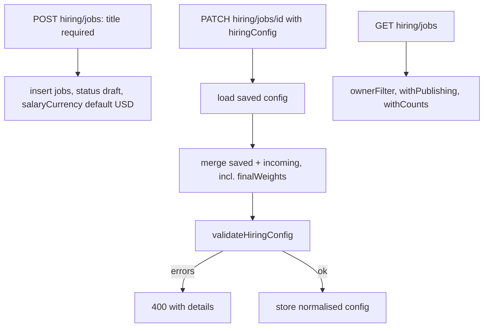
```mermaid
flowchart TD
  A["POST hiring/jobs: title required"] --> B["insert jobs, status draft, salaryCurrency default USD"]
  C["PATCH hiring/jobs/id with hiringConfig"] --> D["load saved config"]
  D --> E["merge saved + incoming, incl. finalWeights"]
  E --> F["validateHiringConfig"]
  F -->|"errors"| G["400 with details"]
  F -->|"ok"| H["store normalised config"]
  I["GET hiring/jobs"] --> J["ownerFilter, withPublishing, withCounts"]
```

### Mapping to implementation

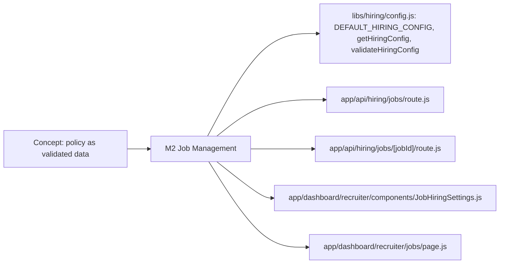
```mermaid
flowchart LR
  K1["Concept: policy as validated data"] --> M["M2 Job Management"]
  M --> F1["libs/hiring/config.js: DEFAULT_HIRING_CONFIG, getHiringConfig, validateHiringConfig"]
  M --> F2["app/api/hiring/jobs/route.js"]
  M --> F3["app/api/hiring/jobs/[jobId]/route.js"]
  M --> F4["app/dashboard/recruiter/components/JobHiringSettings.js"]
  M --> F5["app/dashboard/recruiter/jobs/page.js"]
```

Defaults (`libs/hiring/config.js`): `autoScreen true`, `minFitScore 70`, `maxShortlist 20`, `autoInvite true`, `inviteExpiryHours 72`, `reminderAfterHours 24`, `questionCount 8`, `personalisedQuestions 0`, `maxFollowUps 2`, `interviewMaxMinutes 25`, `resumeWindowMinutes 15`, `recordVideo true`, `trackBehavior true`, `finalWeights {resume .3, interview .5, communication .2}`, `finalThreshold 70`, **`autoFinalize false`**, `sendOutcomeEmails false`. Validation ranges: 0–100 thresholds, 3–15 questions, 5–60 interview minutes, 0–2 personalised, 0–5 follow-ups, 1–720 h expiry.

### Dependencies and failure impact

* **Relies on:** M1 (ownership), Postgres.
* **Relied on by:** every hiring module (all read `getHiringConfig(job)`).
* **If it fails:** a missing/invalid config silently falls back to defaults (so the pipeline keeps working with default thresholds).

### Why separate

All AI steps need the same settings; one validator means a recruiter cannot save weights that sum to zero or a 500-minute interview.

---

## M3 · Job Distribution

**Responsibility.** Turn a job into platform-appropriate posts and get them onto LinkedIn, Rozee.pk and Indeed **without the system ever doing something irreversible or risky without a person present**.

### Core concepts: adapter pattern, guarded side effects, evidence-based automation

* **Adapter pattern.** One interface (`publishJob`, `testSession`, `rateLimit`…) with one implementation per platform, so callers never branch on "if linkedin".
* **Guarded side effects.** Posting publicly is irreversible; the code therefore adds guards: validation, per-account daily caps and a minimum gap, a retry brake after a failure, a **unique partial index** so two posts of the same job cannot be in flight, and a rule that a sign-in/security check **stops** the attempt rather than retrying.
* **Evidence over assumption.** The team ran real attempts. Indeed answered a hidden browser with HTTP 403 (Cloudflare bot check) but passed a visible window with a person present; Rozee.pk replaced its form with a wizard whose last step spends a credit. The code was changed to match: `autoPostAvailability()` returns *not available* for Indeed and Rozee.pk, and a **visible-window posting engine** and a **browser extension** do the supervised work. This is a good story for the panel: design followed measurement.

### Inputs & outputs

| In | Out |
|---|---|
| a job, tone, selected platform(s), connected accounts | saved posts (`jobs.linkedin_post/rozee_post/indeed_post`), `job_publications` rows, `posting_runs` rows, job `status = published` |

### Internal working

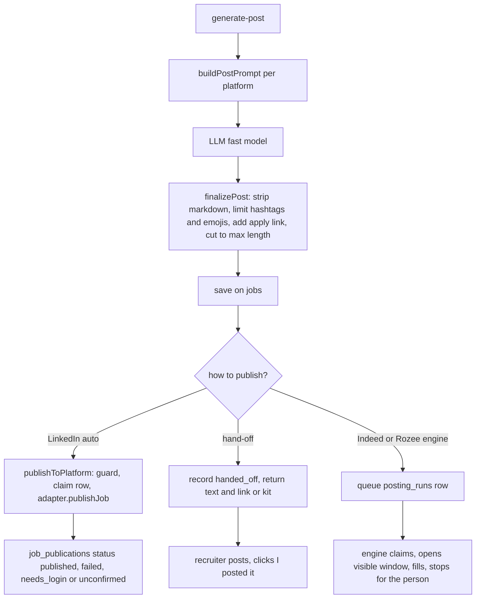
```mermaid
flowchart TD
  A["generate-post"] --> B["buildPostPrompt per platform"]
  B --> C["LLM fast model"]
  C --> D["finalizePost: strip markdown, limit hashtags and emojis, add apply link, cut to max length"]
  D --> E["save on jobs"]
  E --> F{"how to publish?"}
  F -->|"LinkedIn auto"| G["publishToPlatform: guard, claim row, adapter.publishJob"]
  F -->|"hand-off"| H["record handed_off, return text and link or kit"]
  F -->|"Indeed or Rozee engine"| I["queue posting_runs row"]
  I --> J["engine claims, opens visible window, fills, stops for the person"]
  G --> K["job_publications status published, failed, needs_login or unconfirmed"]
  H --> L["recruiter posts, clicks I posted it"]
```

### Mapping to implementation

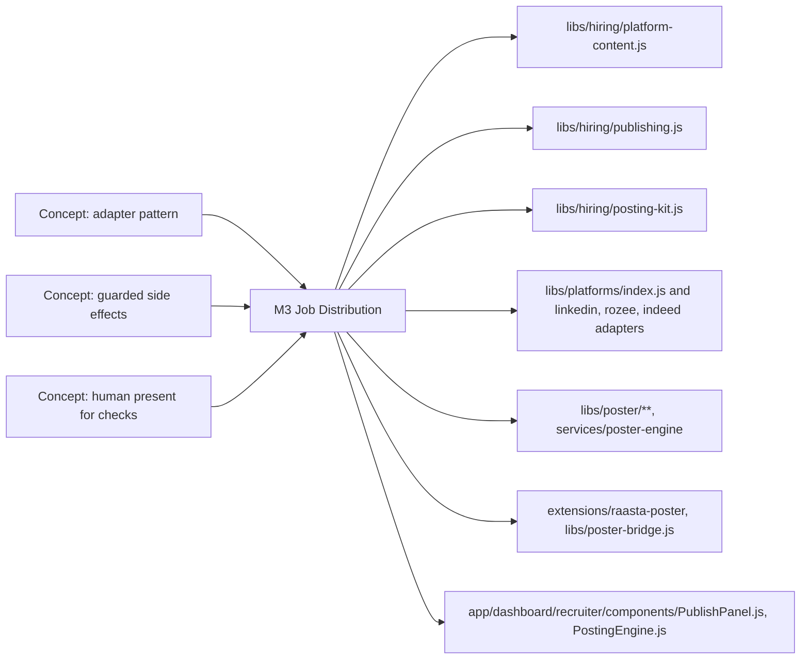
```mermaid
flowchart LR
  K1["Concept: adapter pattern"] --> M["M3 Job Distribution"]
  K2["Concept: guarded side effects"] --> M
  K3["Concept: human present for checks"] --> M
  M --> F1["libs/hiring/platform-content.js"]
  M --> F2["libs/hiring/publishing.js"]
  M --> F3["libs/hiring/posting-kit.js"]
  M --> F4["libs/platforms/index.js and linkedin, rozee, indeed adapters"]
  M --> F5["libs/poster/**, services/poster-engine"]
  M --> F6["extensions/raasta-poster, libs/poster-bridge.js"]
  M --> F7["app/dashboard/recruiter/components/PublishPanel.js, PostingEngine.js"]
```

### Dependencies and failure impact

* **Relies on:** M2, M17 (accounts and sessions), M19 (LLM), Playwright, the platforms themselves.
* **Relied on by:** M11 (the agent publishes through it), M4 (the apply link inside the post).
* **If it fails:** the **core pipeline keeps working**: a recruiter can paste the text anywhere, because candidates only need the apply link. Posting is the fragile edge of the system, deliberately kept off the critical path.

### Why separate

It carries the highest legal/operational risk (platform terms, bans). Isolating it lets the team switch whole routes off (`autoPostAvailability`) without touching screening or interviews.

---

## M4 · Application Intake & Resume Parsing

**Responsibility.** Accept an application from an anonymous person safely, keep the original file, and convert it into structured data.

### Core concepts: safe file upload, document text extraction, LLM structured extraction

* **Safe upload.** Never trust a filename or MIME type: allow-list extensions (`.pdf`, `.docx`, `.txt`), cap the size (5 MB), keep the original under a **server-generated key** (`resumes/<jobId>/<uuid>.<ext>`) so a user cannot choose a path.
* **Text extraction.** A PDF is a page-description language, not text; libraries (`pdf-parse`/pdf.js) reconstruct text from glyph positions. A DOCX is a zip of XML (`mammoth` reads it). A *scanned* PDF is images and yields no text (OCR would be required; not implemented).
* **Structured extraction with an LLM.** Resumes have no standard layout, so rule-based parsers (the originally proposed spaCy approach) need heavy tuning. An LLM given a JSON schema reads any layout and returns structured fields. Risk: invention and layout errors, so the raw text is kept for re-parsing.
* **Idempotency and concurrency.** "One application per (job, email)" is enforced by an early check **and** a transaction under an advisory lock, because two simultaneous submits would both pass the early check.

### Inputs & outputs

| In | Out |
|---|---|
| multipart form: name, email, linkedinUrl?, coverNote?, resume file? | `candidates` row (`new`), stored file key, `parsed_data` JSON incl. `_resumeText` (first 10,000 chars) or `{parseError}`; queued `screen-candidate`; notification |

### Internal working

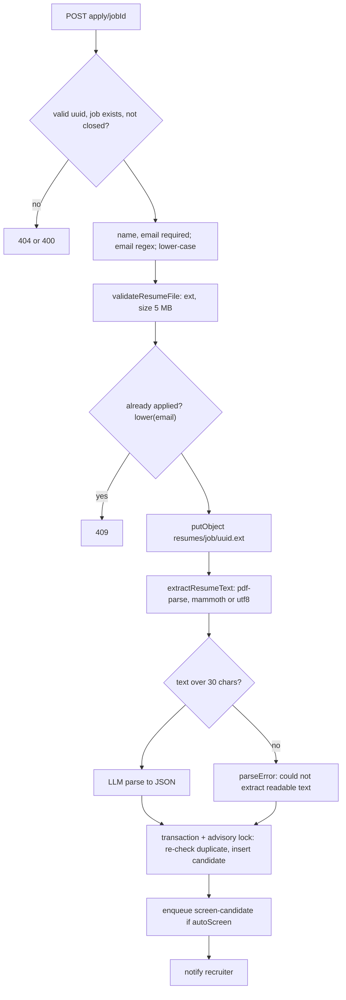
```mermaid
flowchart TD
  A["POST apply/jobId"] --> B{"valid uuid, job exists, not closed?"}
  B -->|"no"| X["404 or 400"]
  B --> C["name, email required; email regex; lower-case"]
  C --> D["validateResumeFile: ext, size 5 MB"]
  D --> E{"already applied? lower(email)"}
  E -->|"yes"| Y["409"]
  E --> F["putObject resumes/job/uuid.ext"]
  F --> G["extractResumeText: pdf-parse, mammoth or utf8"]
  G --> H{"text over 30 chars?"}
  H -->|"no"| I["parseError: could not extract readable text"]
  H --> J["LLM parse to JSON"]
  J --> K["transaction + advisory lock: re-check duplicate, insert candidate"]
  I --> K
  K --> L["enqueue screen-candidate if autoScreen"]
  L --> M["notify recruiter"]
```

### Mapping to implementation

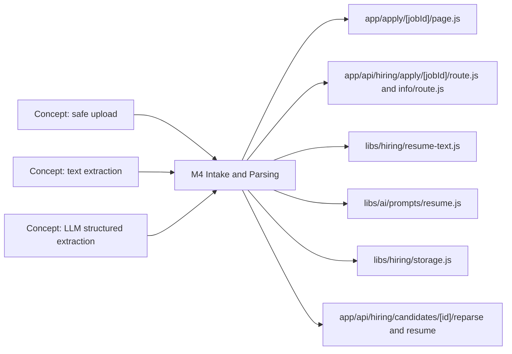
```mermaid
flowchart LR
  K1["Concept: safe upload"] --> M["M4 Intake and Parsing"]
  K2["Concept: text extraction"] --> M
  K3["Concept: LLM structured extraction"] --> M
  M --> F1["app/apply/[jobId]/page.js"]
  M --> F2["app/api/hiring/apply/[jobId]/route.js and info/route.js"]
  M --> F3["libs/hiring/resume-text.js"]
  M --> F4["libs/ai/prompts/resume.js"]
  M --> F5["libs/hiring/storage.js"]
  M --> F6["app/api/hiring/candidates/[id]/reparse and resume"]
```

### Dependencies and failure impact

* **Relies on:** storage (M18), LLM (M19), queue (M12), Postgres.
* **Relied on by:** M5 (reads `parsed_data`), M8 (reads skills for context).
* **If it fails:** storage down → application is **kept** (parsed text still saved), file lost; LLM down → `parseError` plus saved text, so the recruiter can **re-parse** later; queue down → application kept, screening must be triggered by hand ("Screen all new").

### Why separate

It is the only module that handles untrusted public input, so its validation lives in one place and its failure modes are designed to *never lose an application*.

---

## M5 · AI Screening & Shortlisting

**Responsibility.** Score each applicant against the job and select who proceeds, with reasons a human can read.

### Core concept: how resume–JD matching works in general

| Approach | How it works | Strengths | Weaknesses | Used here? |
|---|---|---|---|---|
| **Keyword / Boolean** | Count required terms in the CV | Transparent, fast | Misses synonyms ("k8s" vs "Kubernetes"), rewards keyword stuffing | Partly: the *verification* step is a synonym-aware keyword check |
| **TF-IDF / BM25** | Weight rare terms; rank by overlap | No training data needed | Bag-of-words: no meaning, no experience reasoning | No |
| **Embeddings + cosine similarity** | Map JD and CV to vectors with a neural model; rank by angle between them (closer vectors ≈ similar meaning) | Handles paraphrase | Opaque score, ignores years/requirements structure, needs a model/vector infra | **No** (not used anywhere in the repo) |
| **Supervised ranking** | Train a model on past hire/no-hire labels | Can be accurate | Needs labelled data (we have none), inherits historic bias | No |
| **LLM rubric scoring** | Prompt a language model with the JD, the CV and a rubric; it returns a score and reasons | No training data; explains itself; reads structure and experience | Can hallucinate, vary between runs, mirror bias in its training data | **Yes**, wrapped in deterministic checks |

**Raasta-AI's design:** use an LLM for *judgement* (relevance of experience, projects, education) but **do not trust it for facts**. The matched/missing skills are recomputed from the resume text by code; any skill the LLM claims but the text does not contain is reported as `unverified`; the number is clamped; the candidate's name is removed from the explanation; personal fields are stripped before the prompt; the same input always yields the same *shortlist rule* outcome for a given score.

**Shortlisting is a constrained selection problem:** sort by `fit_score` descending (ties: earlier application first), take while `score ≥ minFitScore` **and** the cap `maxShortlist` has room (counting people already past stage 1). This is deterministic and explainable; the LLM never decides who goes through.

### Inputs & outputs

| In | Out |
|---|---|
| `candidateId`; job; config | `fit_score`, `fit_analysis` {skillMatch, experienceMatch, educationMatch, strengths, concerns, rationale, model, version, manualReview?}, status `screened` → `shortlisted`/`not_shortlisted` |

### Internal working

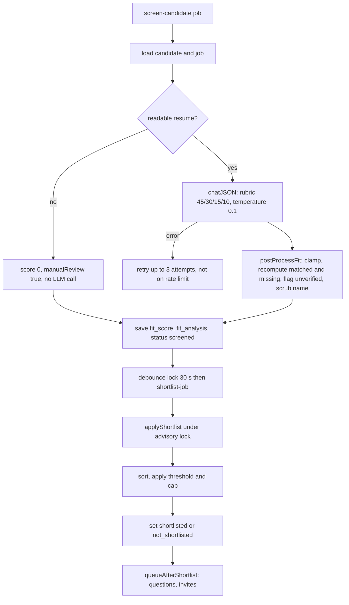
```mermaid
flowchart TD
  A["screen-candidate job"] --> B["load candidate and job"]
  B --> C{"readable resume?"}
  C -->|"no"| D["score 0, manualReview true, no LLM call"]
  C -->|"yes"| E["chatJSON: rubric 45/30/15/10, temperature 0.1"]
  E -->|"error"| F["retry up to 3 attempts, not on rate limit"]
  E --> G["postProcessFit: clamp, recompute matched and missing, flag unverified, scrub name"]
  D --> H["save fit_score, fit_analysis, status screened"]
  G --> H
  H --> I["debounce lock 30 s then shortlist-job"]
  I --> J["applyShortlist under advisory lock"]
  J --> K["sort, apply threshold and cap"]
  K --> L["set shortlisted or not_shortlisted"]
  L --> M["queueAfterShortlist: questions, invites"]
```

### Mapping to implementation

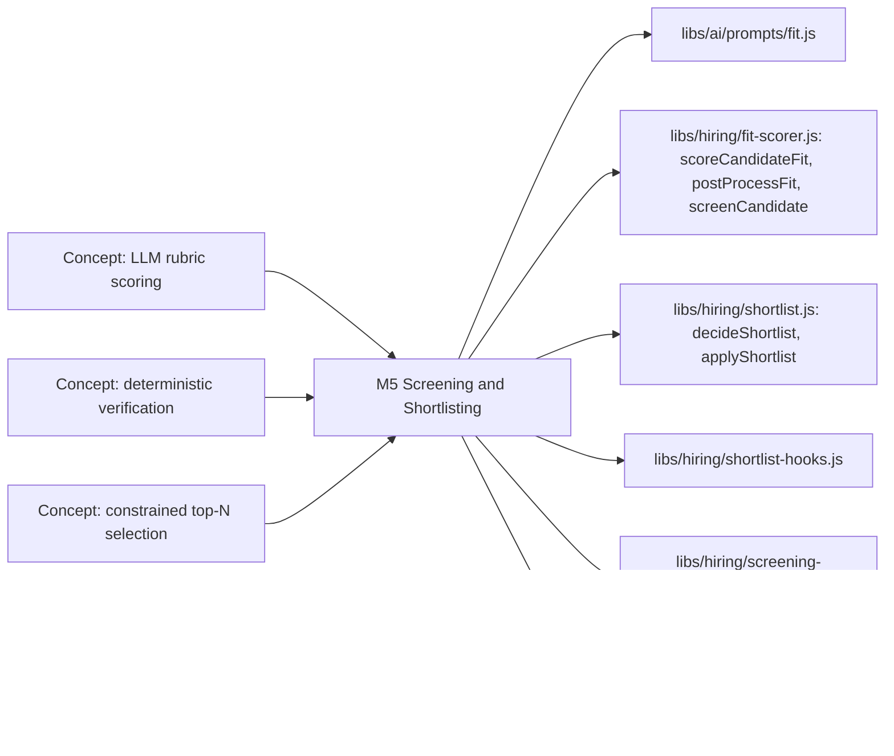
```mermaid
flowchart LR
  K1["Concept: LLM rubric scoring"] --> M["M5 Screening and Shortlisting"]
  K2["Concept: deterministic verification"] --> M
  K3["Concept: constrained top-N selection"] --> M
  M --> F1["libs/ai/prompts/fit.js"]
  M --> F2["libs/hiring/fit-scorer.js: scoreCandidateFit, postProcessFit, screenCandidate"]
  M --> F3["libs/hiring/shortlist.js: decideShortlist, applyShortlist"]
  M --> F4["libs/hiring/shortlist-hooks.js"]
  M --> F5["libs/hiring/screening-queue.js"]
  M --> F6["workers/hiring-worker.js handlers"]
```

### Dependencies and failure impact

* **Relies on:** M4 (parsed data), M19 (LLM), M12 (queue), M2 (thresholds).
* **Relied on by:** M6/M7 (triggered after shortlist), M9 (resume part of the final score), M11 (the agent uses the same rule).
* **If it fails:** an LLM outage leaves candidates `new` with `fit_analysis.error` ("Screening failed – retry"); the stalled-screening fix (`c1d51b2`) flags and stops retrying hopeless jobs. Nobody is auto-rejected because of a failure.

### Why separate

Screening is the module most likely to be challenged for fairness and accuracy. Having the prompt, the post-processing and the shortlist rule in three small, individually tested files (`fit-postprocess.test.js`, `shortlist.test.js`) makes each defensible on its own.

---

## M6 · Interview Question Bank

**Responsibility.** Provide a good, editable, *frozen-per-interview* set of questions, each with an ideal answer and expected keywords.

### Core concept: LLM generation with a validation gate; immutability by snapshot

LLM output is untrusted. The generator asks for a JSON list, then **code validates every item**: required fields present, 2–8 keywords, question under 40 words, category/difficulty in allowed sets, scoreWeight clamped 1–3, de-duplicated case-insensitively against existing questions, warm-up detected, ordered (warm-up → technical → role → behavioral). It retries up to 3 times and accepts a result if it is within two of the target count. **Snapshotting** copies the questions into the interview when it starts so editing the bank later cannot change the rules of an interview in progress or distort the scores already given.

A question carries a **rubric** (`idealAnswer`, `expectedKeywords`, `scoreWeight`): this is what turns "talk to the AI" into a measurable, repeatable evaluation.

### Inputs & outputs

| In | Out |
|---|---|
| job (title, JD, skills, stack, experience); optionally a candidate's gaps | `interview_questions` rows (job-wide, or personalised with `candidate_id`); `interviews.question_snapshot` |

### Internal working

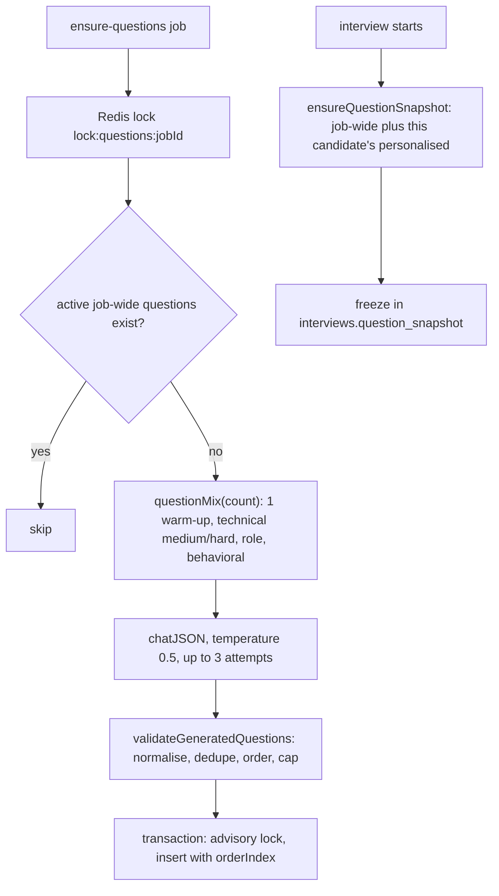
```mermaid
flowchart TD
  A["ensure-questions job"] --> B["Redis lock lock:questions:jobId"]
  B --> C{"active job-wide questions exist?"}
  C -->|"yes"| D["skip"]
  C -->|"no"| E["questionMix(count): 1 warm-up, technical medium/hard, role, behavioral"]
  E --> F["chatJSON, temperature 0.5, up to 3 attempts"]
  F --> G["validateGeneratedQuestions: normalise, dedupe, order, cap"]
  G --> H["transaction: advisory lock, insert with orderIndex"]
  I["interview starts"] --> J["ensureQuestionSnapshot: job-wide plus this candidate's personalised"]
  J --> K["freeze in interviews.question_snapshot"]
```

### Mapping to implementation

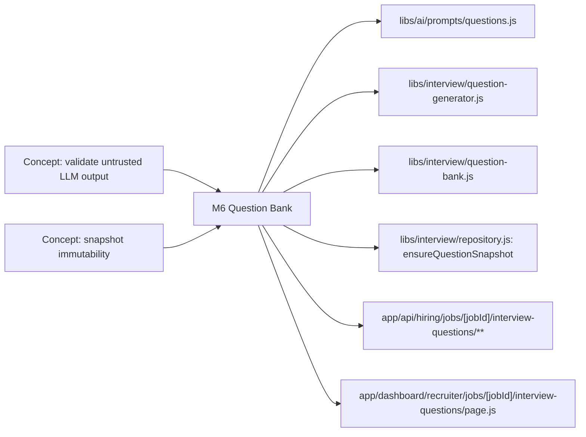
```mermaid
flowchart LR
  K1["Concept: validate untrusted LLM output"] --> M["M6 Question Bank"]
  K2["Concept: snapshot immutability"] --> M
  M --> F1["libs/ai/prompts/questions.js"]
  M --> F2["libs/interview/question-generator.js"]
  M --> F3["libs/interview/question-bank.js"]
  M --> F4["libs/interview/repository.js: ensureQuestionSnapshot"]
  M --> F5["app/api/hiring/jobs/[jobId]/interview-questions/**"]
  M --> F6["app/dashboard/recruiter/jobs/[jobId]/interview-questions/page.js"]
```

### Dependencies and failure impact

* **Relies on:** M19, M5 (trigger), Redis (lock; **proceeds unlocked if Redis fails**), Postgres.
* **Relied on by:** M7 (an invite requires questions) and M8.
* **If it fails:** `send-invite` re-queues itself every 30 s up to 10 times waiting for questions, then fails visibly; the recruiter can add questions manually.

### Why separate

Questions are the recruiter-facing "content" of the interview and have their own editing UI, lifecycle (soft delete when referenced by a started interview) and quality rules.

---

## M7 · Candidate Communication

**Responsibility.** Reach the candidate safely: create single-purpose access links, email them, remind, expire, and (optionally) tell them the outcome.

### Core concepts: capability URLs, hashed tokens, token rotation, transactional email

* **Capability URL.** A link that *is* the credential: 32 random bytes (256 bits) encoded base64url = 43 characters. Guessing is infeasible. Because it is a bearer secret, it must be treated like a password: sent only by email, never logged, and **stored only as a SHA-256 hash**, so a database leak does not leak working links. The server hashes the token from the URL and looks it up by hash.
* **Why SHA-256 and not bcrypt for tokens?** Tokens already have 256 bits of entropy, so brute force is impossible and a fast hash is sufficient; bcrypt is for low-entropy human passwords.
* **Rotation.** Since the raw token cannot be recovered from the hash, a *reminder* issues a **new** token on the same row and invalidates the old link (documented in the reminder email).
* **Transactional email.** Mailgun's HTTP API sends one email per event with `text` and `html` parts. If delivery throws, the row records `invite_email_failed:…` and the job is retried. With no `MAILGUN_API_KEY` in development, the email is written to `.storage/outbox/*.html` so the link can be opened locally; production refuses this unless explicitly allowed.

### Inputs & outputs

| In | Out |
|---|---|
| `candidateId` (+ `resend`) | `interviews` row (`invited`, `token_hash`, `expires_at`), candidate `interview_invited`, an email; reminders; `interview_expired` sweeps; outcome emails |

### Internal working

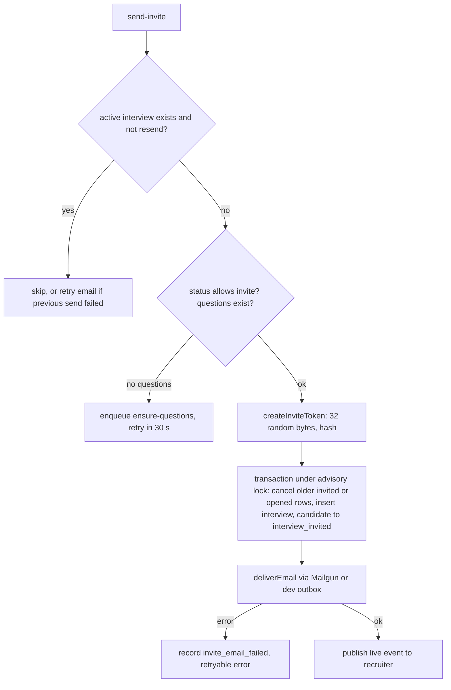
```mermaid
flowchart TD
  A["send-invite"] --> B{"active interview exists and not resend?"}
  B -->|"yes"| C["skip, or retry email if previous send failed"]
  B -->|"no"| D{"status allows invite? questions exist?"}
  D -->|"no questions"| E["enqueue ensure-questions, retry in 30 s"]
  D -->|"ok"| F["createInviteToken: 32 random bytes, hash"]
  F --> G["transaction under advisory lock: cancel older invited or opened rows, insert interview, candidate to interview_invited"]
  G --> H["deliverEmail via Mailgun or dev outbox"]
  H -->|"error"| I["record invite_email_failed, retryable error"]
  H -->|"ok"| J["publish live event to recruiter"]
```

### Mapping to implementation

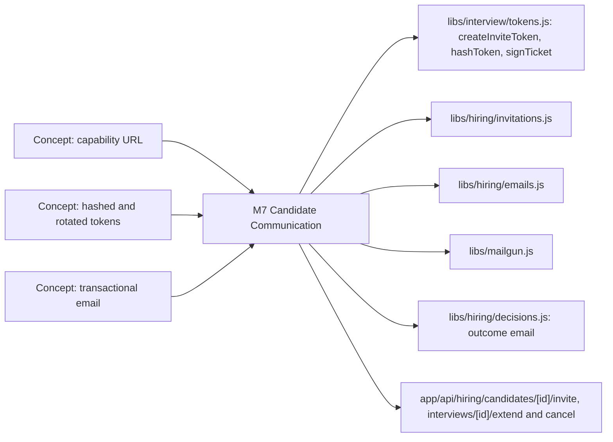
```mermaid
flowchart LR
  K1["Concept: capability URL"] --> M["M7 Candidate Communication"]
  K2["Concept: hashed and rotated tokens"] --> M
  K3["Concept: transactional email"] --> M
  M --> F1["libs/interview/tokens.js: createInviteToken, hashToken, signTicket"]
  M --> F2["libs/hiring/invitations.js"]
  M --> F3["libs/hiring/emails.js"]
  M --> F4["libs/mailgun.js"]
  M --> F5["libs/hiring/decisions.js: outcome email"]
  M --> F6["app/api/hiring/candidates/[id]/invite, interviews/[id]/extend and cancel"]
```

Time rules (`invitations.js`): expiry `inviteExpiryHours` (default 72); reminder when invited ≥ `reminderAfterHours` (24) ago, unopened, never reminded, and more than 2 h left; `extendInvite` = `max(now, expiresAt) + hours`, up to 720 h and revives an expired invite; `cancelInvite` returns the candidate to `shortlisted`.

### Dependencies and failure impact

* **Relies on:** M6 (questions), Mailgun, Postgres, queue.
* **Relied on by:** M8 (token → interview).
* **If it fails:** no email → candidates are never invited; the recruiter sees the interview with the error message and can resend; wrong `EMAIL_TIMEZONE` shows the expiry in UTC.

### Why separate

It is the only module that sends mail to people outside the system, and the only one that mints secrets. Concentrating that makes the privacy statements ("scores are never emailed", "tokens are never logged") auditable in one place.

---

## M8 · Interview Module (Raasta AI Interviewer)

**Responsibility.** Conduct a spoken, adaptive interview in the candidate's browser and persist everything that happens.

> **Provenance, stated once (panel question "Was this built during the FYP?").** The *interview logic* (answer-analysis conditions, scoring rubric, follow-up prompt and fallbacks, skip heuristic, voice/emotion/gaze algorithms) was ported from an earlier standalone interview project and then substantially re-engineered; the *integration* (browser room, WebSocket engine, ticket auth, invitations, persistence in Postgres, STT adapters, echo and junk filtering, recording pipeline, behaviour tracking, evaluation, recruiter views) was built in this repository. The honest ledger is in [Part 7](07-implementation-journey.md#73-the-interview-module-integration) and the panel answer in [Part 8](08a-panel-questions.md).

### Core concepts: real-time voice conversation

1. **Audio as numbers.** A microphone produces a waveform. The room downsamples it to **16 kHz, mono, 16-bit PCM** (`pcm16-downsampler` worklet) in 40 ms frames and sends it as binary WebSocket messages. Raw PCM is simple and is what streaming recognisers accept.
2. **Streaming speech recognition (STT).** The recogniser returns *partial* transcripts quickly (captions) and *final* transcripts when it hears a pause (**endpointing**). Deepgram `nova-3` does this with `interim_results`, `endpointing=300 ms`, `utterance_end_ms=1000`, `vad_events`, `filler_words=true` (so "um/uh" survive for the fluency score). If no Deepgram key exists, a fallback cuts audio on 700 ms of low energy (RMS) or at 15 s and sends WAV chunks to Whisper (finals only).
3. **Text-to-speech (TTS).** Kokoro-82M (in the Python service) turns each question into a WAV; if it fails, the browser's `speechSynthesis` speaks the text.
4. **Turn-taking.** A conversation is a **state machine** (`waiting → greeting → asking → listening → processing → closing → ended`). The answer ends when the candidate presses "I've finished my answer" **or** after `INTERVIEW_SILENCE_MS` (8 s default) of no speech. **Half-duplex microphone:** while the interviewer speaks (plus 450 ms) the room sends no audio, because speakers would otherwise feed the question back into the answer; the engine additionally strips any heard-again question (`echo-guard`).
5. **Concurrency safety.** The loop is **single-flight**: a lock (`isProcessingAnswer`) is taken before any `await`, so two simultaneous triggers (button + silence timer) can never produce two questions. A **pre-speak guard** aborts a planned reply if the candidate has kept talking (> 10 characters) while the AI was thinking; nothing is saved for an aborted plan.
6. **LLM-in-the-loop, with fallbacks.** After each answer a fast model decides whether to follow up (seven conditions, first matching reason wins), a stronger model scores the answer in the background, and a follow-up question is written only if needed. Every LLM call has a deterministic fallback (heuristic follow-up decision, keyword score, fixed fallback question), so an outage degrades the interview instead of stopping it.
7. **Resilience.** The server keeps the live session in memory, snapshots its state to Postgres every 15 s and on each question, and keeps a disconnected session for `resumeWindowMinutes` (15). The clock excludes disconnected time. After an engine restart the saved state resumes the interview.

### Inputs & outputs

| In | Out |
|---|---|
| invite token → ticket; microphone PCM; button events; camera track | `interview_turns` (transcript), `interview_responses` (answers + scores + keywords), `interviews` (status, timings, snapshot, state, integrity events, recording status, `interview_score`), recording parts, behaviour JSON; live events on Redis; queued `analyse-interview` |

### Internal working (what happens between "answer finished" and "next question")

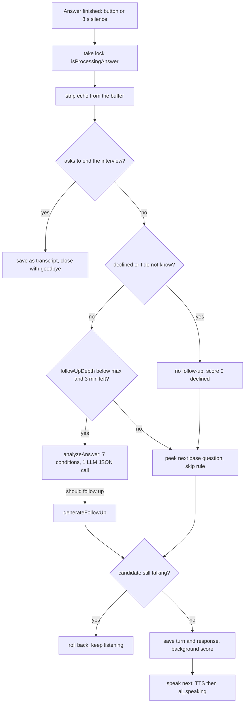
```mermaid
flowchart TD
  A["Answer finished: button or 8 s silence"] --> B["take lock isProcessingAnswer"]
  B --> C["strip echo from the buffer"]
  C --> D{"asks to end the interview?"}
  D -->|"yes"| E["save as transcript, close with goodbye"]
  D -->|"no"| F{"declined or I do not know?"}
  F -->|"yes"| G["no follow-up, score 0 declined"]
  F -->|"no"| H{"followUpDepth below max and 3 min left?"}
  H -->|"yes"| I["analyzeAnswer: 7 conditions, 1 LLM JSON call"]
  I -->|"should follow up"| J["generateFollowUp"]
  H -->|"no"| K["peek next base question, skip rule"]
  G --> K
  J --> L{"candidate still talking?"}
  K --> L
  L -->|"yes"| M["roll back, keep listening"]
  L -->|"no"| N["save turn and response, background score"]
  N --> O["speak next: TTS then ai_speaking"]
```

### Mapping to implementation

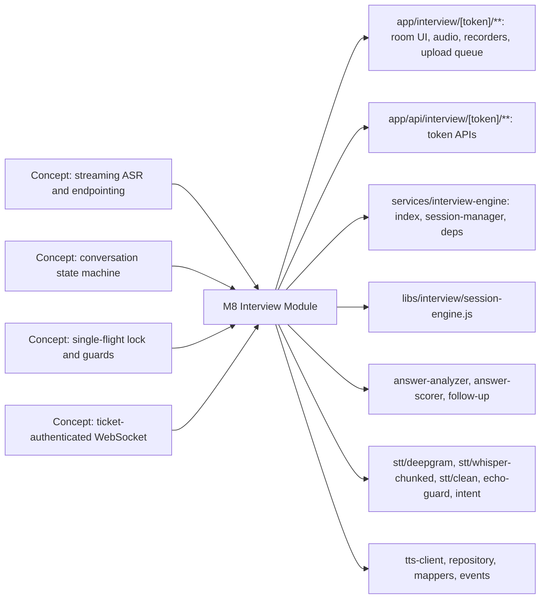
```mermaid
flowchart LR
  K1["Concept: streaming ASR and endpointing"] --> M["M8 Interview Module"]
  K2["Concept: conversation state machine"] --> M
  K3["Concept: single-flight lock and guards"] --> M
  K4["Concept: ticket-authenticated WebSocket"] --> M
  M --> R1["app/interview/[token]/**: room UI, audio, recorders, upload queue"]
  M --> R2["app/api/interview/[token]/**: token APIs"]
  M --> E1["services/interview-engine: index, session-manager, deps"]
  M --> L1["libs/interview/session-engine.js"]
  M --> L2["answer-analyzer, answer-scorer, follow-up"]
  M --> L3["stt/deepgram, stt/whisper-chunked, stt/clean, echo-guard, intent"]
  M --> L4["tts-client, repository, mappers, events"]
```

| Sub-component | File | Responsibility |
|---|---|---|
| Room | `app/interview/[token]/components/InterviewApp.js` and steps | loading → welcome (consent) → device check → room → completed; status screens for 404/410/409/429 |
| Socket client | `lib/interview-socket.js` | ticket request, `ws` connect, reconnect ≤ 5 with exponential backoff (cap 16 s), ping every 15 s |
| Engine | `services/interview-engine/index.js` | HTTP `/health`, WS `/ws?ticket=`; verifies ticket; 64 KB frame limit; 200 msg/s limit; 20 sessions max |
| Session manager | `session-manager.js` | attach/reattach/duplicate (close 4009)/capacity (1013), STT wiring, detach and abandon timer, 15 s snapshots, SIGTERM snapshot |
| Loop | `libs/interview/session-engine.js` (845 lines) | the state machine above; all effects injected through `deps` so it is unit-tested with fake timers |
| AI calls | `answer-analyzer.js` (fast model, `reasoningEffort: low`), `answer-scorer.js` (main model), `follow-up.js` | see [Part 5](05-ai-components.md) for prompts and rubrics |
| Persistence | `repository.js` | Postgres reads/writes; `computeInterviewScore`; `completeInterview`; `abandonInterview` |

### Dependencies and failure impact

| Dependency | If it is down | Result |
|---|---|---|
| Interview engine process | candidate cannot connect | room shows reconnect attempts, then "connection lost"; the invite stays valid so they can retry |
| Groq (LLM) | analysis/scoring/follow-up fail | fallbacks used (heuristics, keyword score, canned follow-up); answers still saved; `fallback: true` flagged on scores |
| Deepgram | stream closes | one automatic reconnect, then `stt_unavailable` error to the client |
| AI engine (TTS) | no audio bytes | `audio: null`, the browser speaks the text |
| Redis | live view + queue | live events dropped (best-effort); `analyse-interview` enqueue failure is logged, analysis can be re-queued |
| Postgres | cannot load/save | attach fails with `internal`, retryable; state snapshots lost |

**Single point of failure:** the engine is a **single instance with in-memory sessions** (documented limitation; horizontal scale-out is out of scope).

### Why it is a separate module

Next.js route handlers cannot hold WebSockets or long timers (and Vercel limits functions to 300 s). The interview needs a long-lived process with per-session timers and a streaming connection to STT. Keeping the loop in `libs/interview/session-engine.js`, with the sockets in `services/interview-engine`, also lets it be tested without a network.
