# Part 2B (continued) · Conceptual Modules M9–M20

[← Index](README.md) · Previous: [M1–M8](02b-conceptual-modules.md) · Next: [Part 2C · Module interaction](02c-module-interaction.md)

Same template as before: **Responsibility → Core concept → Inputs/Outputs → Internal working → Mapping → Dependencies → Why separate**, with two diagrams per module.

## Contents

[M9 Interview Evaluation & Scoring](#m9--interview-evaluation--scoring) · [M10 Recruiter Decision Support](#m10--recruiter-decision-support) · [M11 Supervised Hiring Agent](#m11--supervised-hiring-agent) · [M12 Background Processing & Operations](#m12--background-processing--operations) · [M13 Notifications](#m13--notifications) · [M14 Dashboard & Analytics](#m14--dashboard--analytics) · [M15 Client Acquisition](#m15--client-acquisition-sales) · [M16 Outreach Automation](#m16--outreach-automation) · [M17 Platform Accounts & Sessions](#m17--platform-accounts--sessions) · [M18 Storage](#m18--storage) · [M19 AI Platform Layer](#m19--ai-platform-layer) · [M20 Billing & Public Site](#m20--billing--public-site)

---

## M9 · Interview Evaluation & Scoring

**Responsibility.** Turn a finished interview into numbers and a recommendation: interview score, communication score, final score, suggested decision, and a short evidence-only summary.

### Core concepts

* **LLM-as-judge with a rubric.** Each answer is compared with an *ideal answer* and *expected keywords*; the model returns a 0–100 score with reasoning. The rubric is in the prompt (90–100 excellent, 70–89 good, 50–69 adequate, 30–49 weak, 0–29 poor). Weakness: models can be inconsistent across runs, which is why scoring uses `temperature 0.3`, a fixed rubric, a deterministic keyword fallback, and the *recruiter sees the reasoning and keyword coverage*.
* **Signal processing for speech.** *Energy-based voice activity detection*: split audio into 25 ms frames every 10 ms, compute RMS (root-mean-square loudness), declare "speech" above a threshold (the higher of the 10th percentile, 10% of the loud level and an absolute floor), ignore bursts shorter than 40 ms, and treat gaps ≥ 0.2 s *inside the spoken span* as pauses. **Pace** = words ÷ speaking seconds × 60. **Filler rate** = count of um/uh/like/you know… per minute from the transcript.
* **Computer vision on-device.** MediaPipe Face Landmarker gives head pose, iris position and ~50 blendshape scores per frame. *Eye contact* is gaze measured **against the candidate's own usual posture** (webcams sit above/below eye level), not a fixed "straight ahead".
* **Missing-data-safe weighted averaging.** If a component is unavailable (no camera), drop it and **renormalise** the remaining weights so the score is still on a 0–100 scale rather than silently penalising the candidate.
* **Decision threshold + abstention.** A suggestion is only made when there is enough evidence: fewer than half of the questions answered, or no score, gives `needs_review`, which is never applied automatically.
* **Honest limits.** Pace/eye-contact/expressions are *secondary signals*; the final-summary prompt tells the model never to penalise accent or language background, expression readings "say nothing about honesty or competence" (comment in `libs/interview/behavior.js`), and tab-hidden events are "not proof of misconduct".

### Inputs & outputs

| In | Out |
|---|---|
| `interviewId`; recording parts; `interview_turns`; behaviour batches; `interviews.integrity_events`; `interview_responses` scores; candidate `fit_score`; job `finalWeights/threshold` | `interviews.analysis` (voice, emotion, gaze, behavior, integrity, errors, version 2), `communication_score`, `candidates.final_score`, `final_analysis` (breakdown, recommendation, summary, strengths, risks, next steps, `suggestedDecision`) |

### Internal working

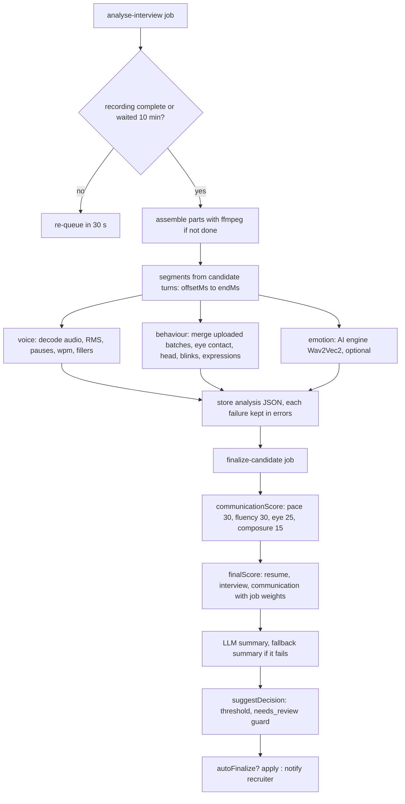
```mermaid
flowchart TD
  A["analyse-interview job"] --> B{"recording complete or waited 10 min?"}
  B -->|"no"| W["re-queue in 30 s"]
  B -->|"yes"| C["assemble parts with ffmpeg if not done"]
  C --> D["segments from candidate turns: offsetMs to endMs"]
  D --> E["voice: decode audio, RMS, pauses, wpm, fillers"]
  D --> F["behaviour: merge uploaded batches, eye contact, head, blinks, expressions"]
  D --> G["emotion: AI engine Wav2Vec2, optional"]
  E --> H["store analysis JSON, each failure kept in errors"]
  F --> H
  G --> H
  H --> I["finalize-candidate job"]
  I --> J["communicationScore: pace 30, fluency 30, eye 25, composure 15"]
  J --> K["finalScore: resume, interview, communication with job weights"]
  K --> L["LLM summary, fallback summary if it fails"]
  L --> M["suggestDecision: threshold, needs_review guard"]
  M --> N["autoFinalize? apply : notify recruiter"]
```

### Mapping to implementation

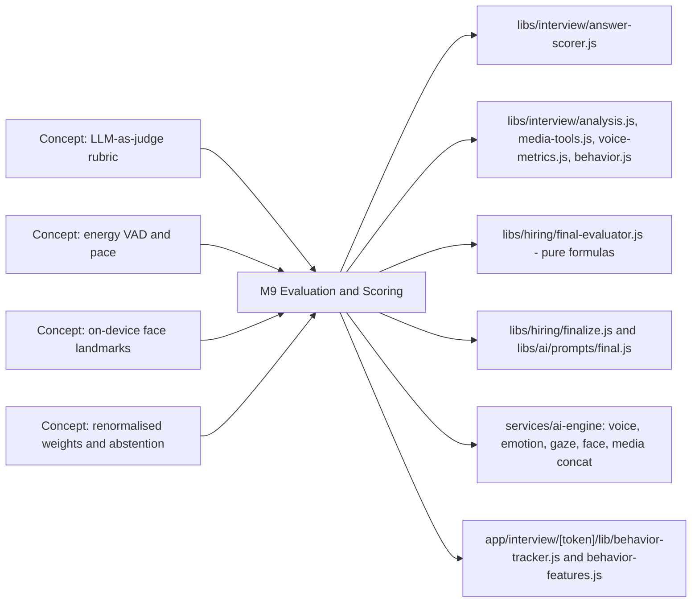
```mermaid
flowchart LR
  K1["Concept: LLM-as-judge rubric"] --> M["M9 Evaluation and Scoring"]
  K2["Concept: energy VAD and pace"] --> M
  K3["Concept: on-device face landmarks"] --> M
  K4["Concept: renormalised weights and abstention"] --> M
  M --> F1["libs/interview/answer-scorer.js"]
  M --> F2["libs/interview/analysis.js, media-tools.js, voice-metrics.js, behavior.js"]
  M --> F3["libs/hiring/final-evaluator.js - pure formulas"]
  M --> F4["libs/hiring/finalize.js and libs/ai/prompts/final.js"]
  M --> F5["services/ai-engine: voice, emotion, gaze, face, media concat"]
  M --> F6["app/interview/[token]/lib/behavior-tracker.js and behavior-features.js"]
```

**Formulas, exactly as coded** (`libs/hiring/final-evaluator.js`):

| Quantity | Formula |
|---|---|
| Pace score | 100 for 110–160 wpm; linear to 0 at ≤ 70 (`(wpm−70)/40×100`) and at ≥ 210 (`(210−wpm)/50×100`) |
| Fluency score | `100 − min(100, fillerPerMin×12)×0.6 − min(100, pauseRatio×200)×0.4`; if only one part is known, that part alone |
| Composure | `100 × share(neutral, happy, calm)` from the tone-of-voice model; else the camera's expression `composure` |
| Communication | weighted average of `{pace .30, fluency .30, eyeContact .25, composure .15}` over available parts, weights re-normalised |
| Interview score | per **base question**: mean of its answer and follow-up scores; then weighted mean by `scoreWeight`; rounded (`computeInterviewScore`) |
| Final score | `Σ w·part / Σ w` over available of `{resume: fit, interview, communication}`; defaults `.3/.5/.2` |
| Suggested decision | `needs_review` if answered base questions `< 50%` or no score; else `final_shortlisted` if `score ≥ finalThreshold` (70) else `final_rejected` |
| Fallback recommendation | `strong_yes` ≥ max(threshold+15, 85); `yes` ≥ threshold; `maybe` ≥ threshold−15; else `no` |

### Dependencies and failure impact

* **Relies on:** M8 (data), M18 (recordings), ffmpeg (worker PATH), M19 (summary), AI engine (optional: emotion, voice/gaze fallbacks), Redis (queue/lock).
* **Relied on by:** M10/M11 (decisions), M14.
* **If it fails:** no ffmpeg → recording cannot be joined (the exact failure that motivated moving the join into the worker); the analysis still completes with transcript-only filler estimates. AI engine down → no tone-of-voice, everything else works. LLM down → deterministic summary (`fallback: true`). Analysis worker exhausts retries → `analysis_status = failed` and the recruiter can press **Re-analyse**.

### Why separate

Evaluation must be *re-runnable* without re-interviewing anyone (`reanalyse`, `force: true`) and its formulas must be unit-tested in isolation (`final-evaluator.test.js`, `analysis-pipeline.test.js`).

---

## M10 · Recruiter Decision Support

**Responsibility.** Give the recruiter the evidence and the controls: candidates list, Kanban, interviews list/detail (Live, Summary, Q&A, Transcript, Recording, Communication, Integrity, Behaviour), Decisions queue, analytics.

### Core concepts

* **Read models.** The detail page does not expose raw tables; `libs/hiring/interview-views.js` builds a payload (interview without token hash/engine state, scored answers, transcript, 15-minute signed recording links).
* **Server-sent events (SSE) vs polling vs WebSocket.** SSE is a one-way, auto-reconnecting stream over plain HTTP, ideal for "watch what the engine publishes". The live view subscribes to a Redis channel (`interview:{id}`) with a dedicated subscriber and forwards each message, with a 15 s heartbeat.
* **Audit trail.** Every final decision records `{decision, by, at, note}` in `final_analysis.decision` plus `decided_by` and `final_decided_at`.
* **Seekable media.** Recordings are served through `GET /api/files/[token]` with HTTP Range support (206/416) so the video can jump to a transcript timestamp.

### Internal working and mapping

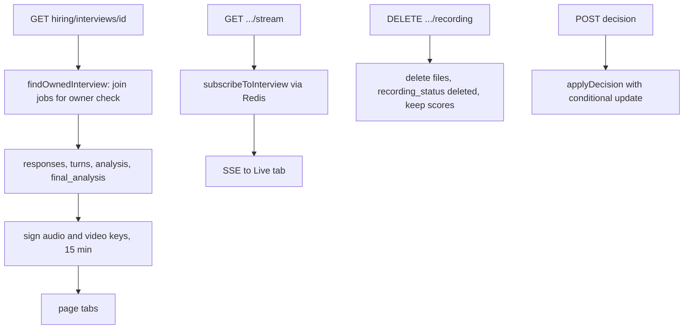
```mermaid
flowchart TD
  A["GET hiring/interviews/id"] --> B["findOwnedInterview: join jobs for owner check"]
  B --> C["responses, turns, analysis, final_analysis"]
  C --> D["sign audio and video keys, 15 min"]
  D --> E["page tabs"]
  F["GET .../stream"] --> G["subscribeToInterview via Redis"]
  G --> H["SSE to Live tab"]
  I["DELETE .../recording"] --> J["delete files, recording_status deleted, keep scores"]
  K["POST decision"] --> L["applyDecision with conditional update"]
```

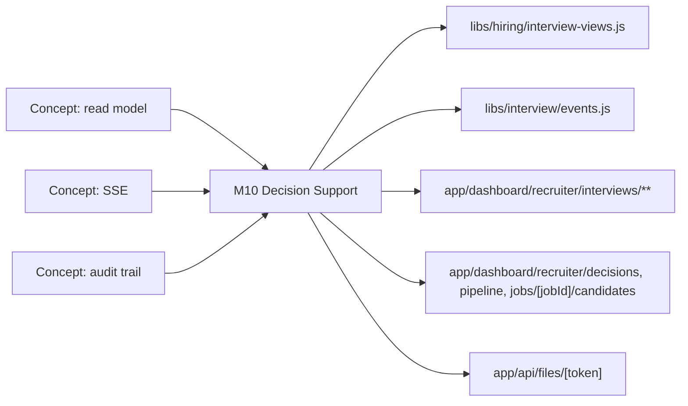
```mermaid
flowchart LR
  K1["Concept: read model"] --> M["M10 Decision Support"]
  K2["Concept: SSE"] --> M
  K3["Concept: audit trail"] --> M
  M --> F1["libs/hiring/interview-views.js"]
  M --> F2["libs/interview/events.js"]
  M --> F3["app/dashboard/recruiter/interviews/**"]
  M --> F4["app/dashboard/recruiter/decisions, pipeline, jobs/[jobId]/candidates"]
  M --> F5["app/api/files/[token]"]
```

### Dependencies and failure impact

Relies on M9 data, M18 signing, Redis (live tab only). If Redis is down the page works without the Live tab ("Live updates are unavailable"). Everything is ownership-filtered through the job.

### Why separate

It is the *only* place where AI output meets a human decision. Isolating it keeps the audit and override rules (e.g. "recording deletion keeps scores", "re-analysis refused after deletion") in one file.

---

## M11 · Supervised Hiring Agent

**Responsibility.** Optionally run the hiring pipeline for one job on the recruiter's behalf, **routing each action by policy** to *do it*, *ask first* or *leave it to a human*.

### Core concepts

* **Workflow agent vs autonomous agent.** An autonomous LLM agent chooses its own steps; a *workflow* (supervised) agent follows a fixed set of known steps and uses AI **inside** steps. Hiring's steps are known in advance, so the design deliberately avoids a free-roaming agent (recorded rationale in `docs/ai-hiring/13`). That choice is what makes it auditable.
* **Policy table.** Each action has an *effect* (none, public, positive, outward, adverse, final) and a route per mode:

| Action | Effect | Assisted | Autopilot |
|---|---|---|---|
| write_post | none | auto | auto |
| publish_post | public | **ask** | auto |
| import_applicants, screen, prepare_questions | none | auto | auto |
| shortlist | positive | **ask** | auto |
| hold_back (not shortlisted) | adverse | **ask** | **ask** |
| send_invites | outward | **ask** (approved with the shortlist) | auto, up to a daily cap (default 20) |
| final_decision | adverse | **ask** | **ask** |
| hire | final | **human only** | **human only** |

  *Rule:* anything that harms or finalises a candidate is never automatic; an **escalation** (score within 5 points of the threshold, unreadable resume, no score, fewer than half answered, tab hidden ≥ 3 times or ≥ 30 s) turns `auto` into `ask` in both modes, and escalated items cannot be bulk-approved.
* **Event-driven, idempotent ticks.** The agent never waits inside a step. A *tick* (`agent-advance`) runs whenever something changes (screening done, interview evaluated, approval given) and on a 15-minute sweep. Each action has a `dedupe_key` (e.g. `shortlist:<candidateId>`), so repeating a tick never duplicates work, and a rejected request is not asked again.
* **One switch per job.** While an agent manages a job, the worker's own auto-shortlist, auto-invite and auto-finalize **stand down** (`isJobManagedByAgent`), so two automations never fight.

### Inputs & outputs

In: run config (job, mode, accounts, tone, daily invite cap), job state. Out: `agent_runs`, `agent_steps`, `agent_actions` (the approval inbox *and* the audit trail), candidate status changes, notifications.

### Internal working

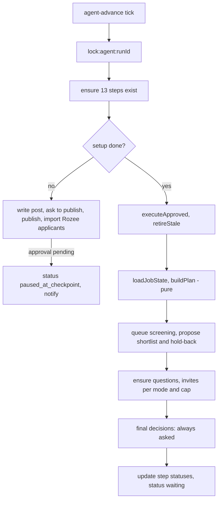
```mermaid
flowchart TD
  A["agent-advance tick"] --> B["lock:agent:runId"]
  B --> C["ensure 13 steps exist"]
  C --> D{"setup done?"}
  D -->|"no"| E["write post, ask to publish, publish, import Rozee applicants"]
  E -->|"approval pending"| P["status paused_at_checkpoint, notify"]
  D -->|"yes"| F["executeApproved, retireStale"]
  F --> G["loadJobState, buildPlan - pure"]
  G --> H["queue screening, propose shortlist and hold-back"]
  H --> I["ensure questions, invites per mode and cap"]
  I --> J["final decisions: always asked"]
  J --> K["update step statuses, status waiting"]
```

### Mapping to implementation

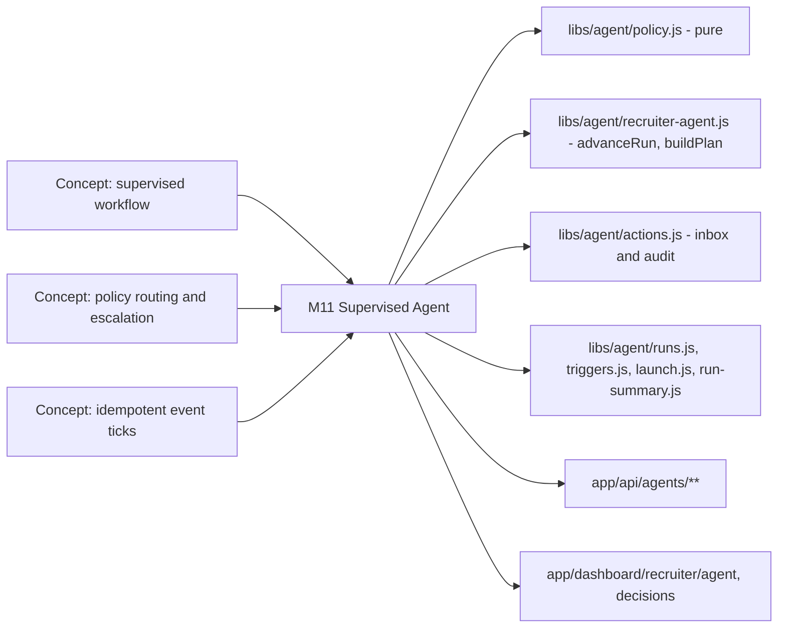
```mermaid
flowchart LR
  K1["Concept: supervised workflow"] --> M["M11 Supervised Agent"]
  K2["Concept: policy routing and escalation"] --> M
  K3["Concept: idempotent event ticks"] --> M
  M --> F1["libs/agent/policy.js - pure"]
  M --> F2["libs/agent/recruiter-agent.js - advanceRun, buildPlan"]
  M --> F3["libs/agent/actions.js - inbox and audit"]
  M --> F4["libs/agent/runs.js, triggers.js, launch.js, run-summary.js"]
  M --> F5["app/api/agents/**"]
  M --> F6["app/dashboard/recruiter/agent, decisions"]
```

### Dependencies and failure impact

Relies on M5/M6/M7/M9 (it calls their functions), M3 (publishing), M12 (queue and triggers). If the worker is down the agent simply does nothing until it returns (the UI says "Still waiting for the hiring worker"). A failed tick marks the run `failed` and notifies; open requests are superseded.

### Why separate

It is policy, not pipeline. Keeping every rule in one pure file (`policy.js`, 13 tests) lets the team show the panel exactly which actions are allowed to be automatic.

---

## M12 · Background Processing & Operations

**Responsibility.** Run slow or retryable work outside web requests, and make the machinery visible and controllable.

### Core concepts

* **Message queue semantics: at-least-once.** A worker reads a job, processes it, then *acknowledges* it. If it crashes before the ack, another worker reclaims it later, so a job may run twice; therefore every handler must be **idempotent** (check state first, e.g. "invite already active → do nothing").
* **Redis Streams.** An append-only log (`XADD`) read by a *consumer group* (`XREADGROUP`); each message goes to one consumer; `XACK` removes it from the pending list; `XAUTOCLAIM` takes over messages idle too long (crashed worker).
* **Retry with backoff and dead-letter queue (DLQ).** Failure → re-enqueue with delay `2^attempt × 10 s` (or Groq's `retry-after`); after 3 attempts → `hiring:jobs:dead`; admins can retry from the UI. Errors can declare themselves non-retryable (`error.retryable === false`).
* **Delayed jobs.** A sorted set `hiring:delayed` scored by run-at time; the worker moves due entries to the stream every 5 s (only the worker whose `ZREM` succeeds enqueues it, so multiple workers are safe).
* **Locks with TTL.** `SET key value NX PX ms` as a cheap mutual exclusion (`lock:questions:*`, `lock:analyse:*`, `lock:agent:*`, `lock:shortlist-pending:*`) used for *debounce* and *single-flight*.
* **Supervision.** The web server spawns the worker as a child, restarts it with backoff (1, 2, 5, 10, 30 s), stops after 5 starts in 2 minutes for 5 minutes (circuit breaker), and the worker exits if its parent PID disappears.

### Inputs & outputs

In: `enqueue(type, payload, {delayMs, attempt})`. Out: handler side effects; log lines (no PII); dead-letter entries; status report for the Setup guide.

### Internal working

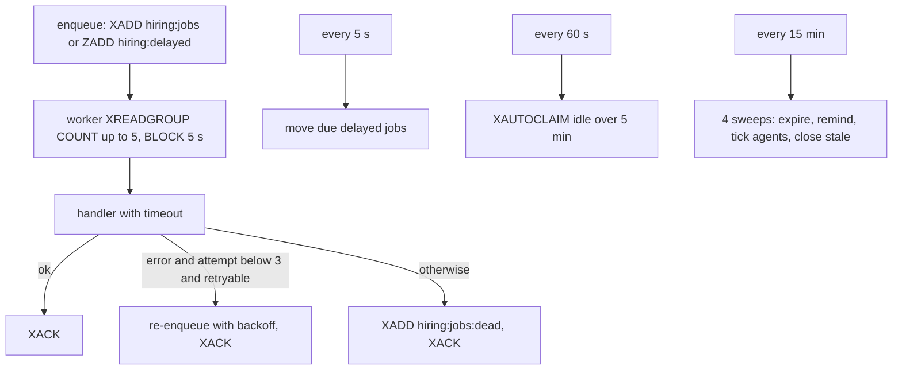
```mermaid
flowchart TD
  A["enqueue: XADD hiring:jobs or ZADD hiring:delayed"] --> B["worker XREADGROUP COUNT up to 5, BLOCK 5 s"]
  B --> C["handler with timeout"]
  C -->|"ok"| D["XACK"]
  C -->|"error and attempt below 3 and retryable"| E["re-enqueue with backoff, XACK"]
  C -->|"otherwise"| F["XADD hiring:jobs:dead, XACK"]
  G["every 5 s"] --> H["move due delayed jobs"]
  I["every 60 s"] --> J["XAUTOCLAIM idle over 5 min"]
  K["every 15 min"] --> L["4 sweeps: expire, remind, tick agents, close stale"]
```

### Mapping to implementation

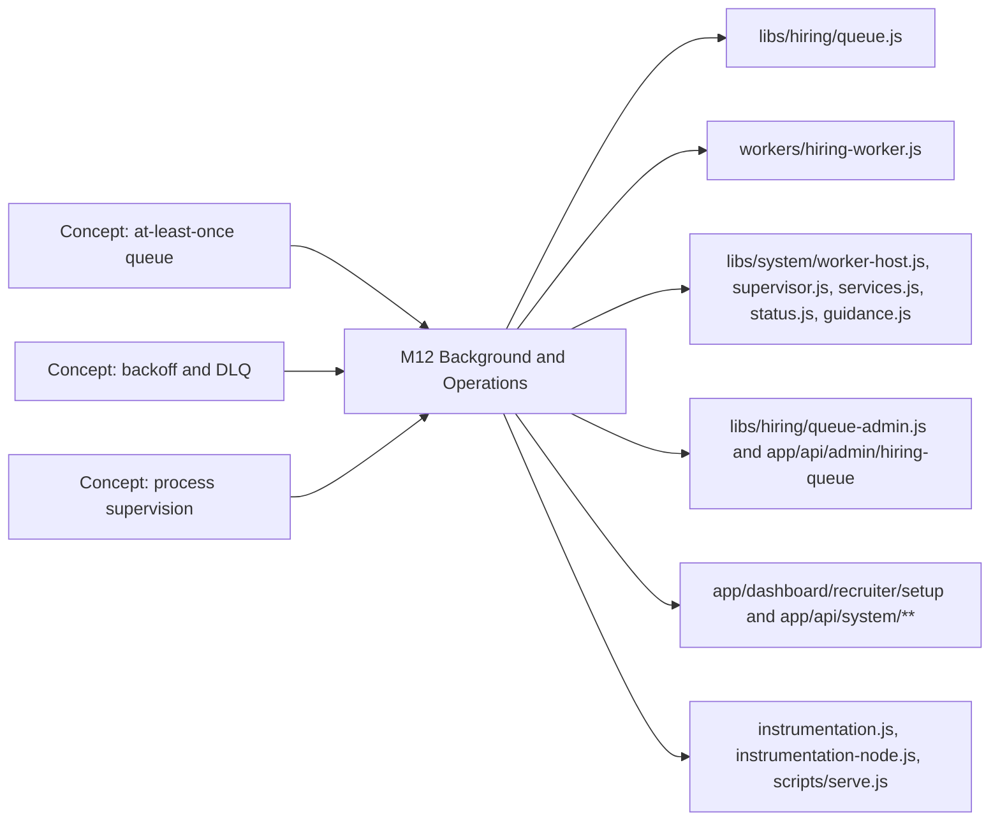
```mermaid
flowchart LR
  K1["Concept: at-least-once queue"] --> M["M12 Background and Operations"]
  K2["Concept: backoff and DLQ"] --> M
  K3["Concept: process supervision"] --> M
  M --> F1["libs/hiring/queue.js"]
  M --> F2["workers/hiring-worker.js"]
  M --> F3["libs/system/worker-host.js, supervisor.js, services.js, status.js, guidance.js"]
  M --> F4["libs/hiring/queue-admin.js and app/api/admin/hiring-queue"]
  M --> F5["app/dashboard/recruiter/setup and app/api/system/**"]
  M --> F6["instrumentation.js, instrumentation-node.js, scripts/serve.js"]
```

### Dependencies and failure impact

Single point of failure: **Redis**. If it is down, enqueue throws (the apply route catches it and keeps the application), `rateLimit` fails *open*, locks for question generation proceed unlocked. The Setup guide reports Redis/Postgres state and each program's state (running, starting, stopped, crashed, not responding).

### Why separate

It is the infrastructure that every asynchronous feature shares. Keeping retry/DLQ/locks in one file means correctness is argued once.

---

## M13 · Notifications

**Responsibility.** Tell the signed-in user about things that happened while they were away (new application, screening finished, interview evaluated, agent needs approval/finished/failed).

**Concept.** A write-optimised table plus a paged read with a cheap `unread` counter. The key design rule is **"notify never throws"** (`libs/notifications.js`): a failed notification must not fail the action that caused it. Timestamps are written from JavaScript, not the column default, because the local database's clock was found to be hours off UTC.

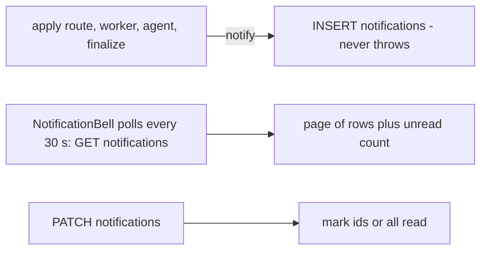
```mermaid
flowchart LR
  A["apply route, worker, agent, finalize"] -->|"notify"| B["INSERT notifications - never throws"]
  C["NotificationBell polls every 30 s: GET notifications"] --> D["page of rows plus unread count"]
  E["PATCH notifications"] --> F["mark ids or all read"]
```

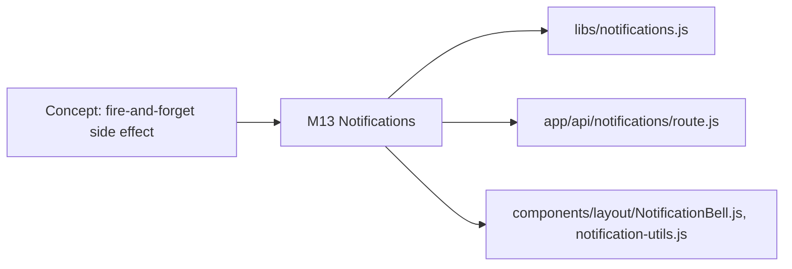
```mermaid
flowchart LR
  K1["Concept: fire-and-forget side effect"] --> M["M13 Notifications"]
  M --> F1["libs/notifications.js"]
  M --> F2["app/api/notifications/route.js"]
  M --> F3["components/layout/NotificationBell.js, notification-utils.js"]
```

**Dependencies.** Postgres only. **Separate** because five modules emit notifications and none should know how they are stored.

---

## M14 · Dashboard & Analytics

**Responsibility.** Summaries: hiring funnel, per-job stats, application timeline, sources; sales campaign statistics; the Home overview.

**Concept: pure aggregation.** `buildHiringAnalytics({jobs, candidates, days, now})` takes rows and returns numbers with no database access, so it is trivially unit-tested. Funnel definitions: *applied* (all), *screened* (has fit score), *shortlisted* (any status after stage 1), *interviewed* (completed or later), *final* (`final_shortlisted` or `hired`), *hired*; rates are integer percentages (`shortlistRate = shortlisted/screened`, `interviewRate = interviewed/shortlisted`, `hireRate = hired/applied`). Sales stats count invite statuses per campaign.

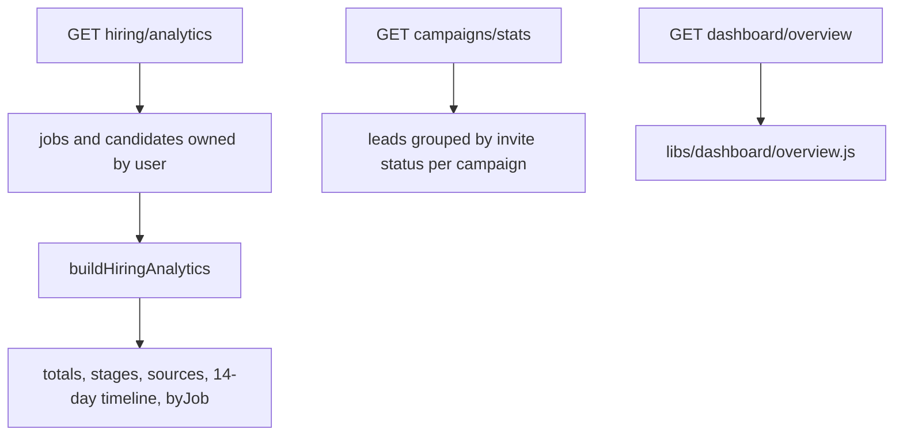
```mermaid
flowchart TD
  A["GET hiring/analytics"] --> B["jobs and candidates owned by user"]
  B --> C["buildHiringAnalytics"]
  C --> D["totals, stages, sources, 14-day timeline, byJob"]
  E["GET campaigns/stats"] --> F["leads grouped by invite status per campaign"]
  G["GET dashboard/overview"] --> H["libs/dashboard/overview.js"]
```

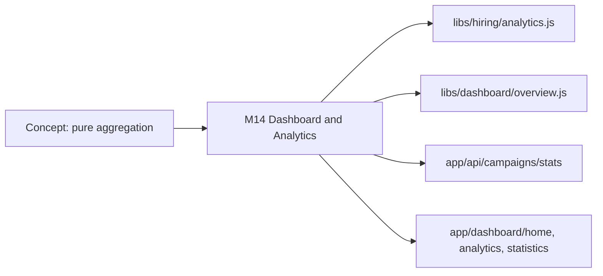
```mermaid
flowchart LR
  K1["Concept: pure aggregation"] --> M["M14 Dashboard and Analytics"]
  M --> F1["libs/hiring/analytics.js"]
  M --> F2["libs/dashboard/overview.js"]
  M --> F3["app/api/campaigns/stats"]
  M --> F4["app/dashboard/home, analytics, statistics"]
```

**Dependencies.** Postgres. Limitation: aggregation runs in Node over all rows of the user (no SQL `GROUP BY`), fine at FYP scale, a bottleneck at tens of thousands of candidates.

---

## M15 · Client Acquisition (Sales)

**Responsibility.** Campaigns, leads, lead discovery, lead enrichment and tiering, and **AI-written outreach messages**.

### Core concepts

* **ICP (ideal customer profile)** = who the campaign targets. It is also passed to the Rozee B2B message prompt as "sender / offer context".
* **Deterministic lead scoring (not ML).** `scoreRozeeJobLead` starts at 28 and adds points for evidence of a real, specific vacancy: company name +14, title +10, location +6, description > 200 chars +14 (> 900 +8 more), ≥ 4 skills +16 (1–3: +7), salary +6; capped at 100; **tier A ≥ 72, B ≥ 52, else C**. A is "company-focused" personalisation, B/C "job-focused". It is a transparent heuristic for *prioritising*, not a prediction of conversion. No labelled data exists to validate it [GAP].
* **Grounded generation.** The Rozee outreach prompt says: use ONLY the FACTS block; do not invent revenue, team size, awards; one soft call to action; ≤ 180 words. The LinkedIn prompt personalises from the lead's **top posts** (ordered by engagement) so the message "references specific content".
* **Cache-aside (Redis-first).** The campaign list and lead hashes are cached for 5 minutes; every write invalidates; any Redis error falls back to Postgres.

### Internal working

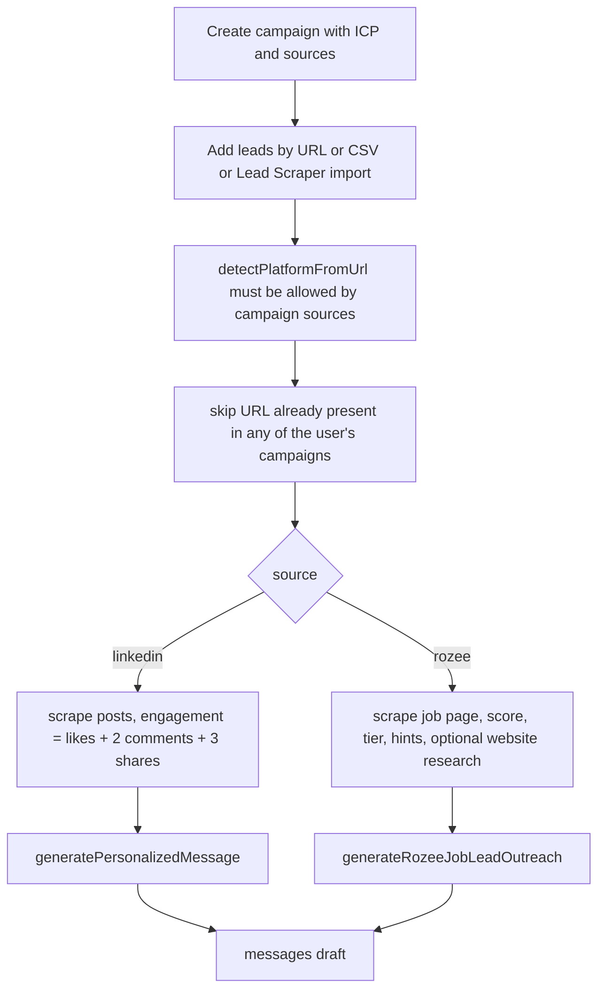
```mermaid
flowchart TD
  A["Create campaign with ICP and sources"] --> B["Add leads by URL or CSV or Lead Scraper import"]
  B --> C["detectPlatformFromUrl must be allowed by campaign sources"]
  C --> D["skip URL already present in any of the user's campaigns"]
  D --> E{"source"}
  E -->|"linkedin"| F["scrape posts, engagement = likes + 2 comments + 3 shares"]
  E -->|"rozee"| G["scrape job page, score, tier, hints, optional website research"]
  F --> H["generatePersonalizedMessage"]
  G --> I["generateRozeeJobLeadOutreach"]
  H --> J["messages draft"]
  I --> J
```

### Mapping to implementation

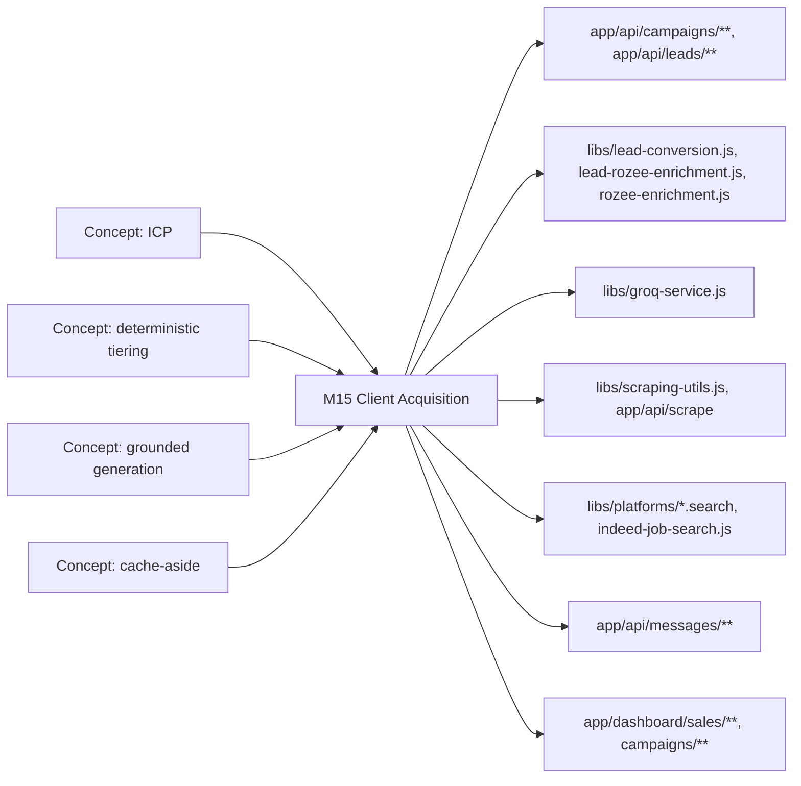
```mermaid
flowchart LR
  K1["Concept: ICP"] --> M["M15 Client Acquisition"]
  K2["Concept: deterministic tiering"] --> M
  K3["Concept: grounded generation"] --> M
  K4["Concept: cache-aside"] --> M
  M --> F1["app/api/campaigns/**, app/api/leads/**"]
  M --> F2["libs/lead-conversion.js, lead-rozee-enrichment.js, rozee-enrichment.js"]
  M --> F3["libs/groq-service.js"]
  M --> F4["libs/scraping-utils.js, app/api/scrape"]
  M --> F5["libs/platforms/*.search, indeed-job-search.js"]
  M --> F6["app/api/messages/**"]
  M --> F7["app/dashboard/sales/**, campaigns/**"]
```

### Dependencies and failure impact

Relies on M19 (but **via a separate client** `libs/groq-service.js`, with hard-coded model `llama-3.1-8b-instant`, **a model Groq retired**; see below), Apify, Playwright, Redis cache. **Known issue [GAP]:** commit `3eb4998` switched the hiring code to GPT-OSS because Llama 3.x returned `model_not_found`; the sales message generators (`app/api/messages/*`, `libs/groq-service.js`, the sales agent step) still default to `llama-3.1-8b-instant`, so message generation fails until the default is updated. The UI dropdown (`useMessages.js`) also offers only Llama models.

### Why separate

Different user, different data (leads vs candidates), different risk (outbound contact), and an older code style (`console.log` heavy, `@/` imports) that predates the hiring work.

---

## M16 · Outreach Automation

**Responsibility.** Carry out the outreach in the real platforms: invites, messages, acceptance checks, background runs, progress and control.

### Core concepts

* **Session replay.** The system stores a logged-in browser session (cookies, localStorage, sessionStorage), then launches Playwright, injects them and acts as the user. No official API is used.
* **Rate limiting as a safety property.** Daily counters per account (invites default 30, messages 10 for LinkedIn; Rozee.pk 20 and 15), rolling 24-hour reset since `lastDailyReset`, connection-check counters, human-like random delays (10–30 s between invites, 30–90 s between messages).
* **Three execution models** for sending invites: (1) *direct* — one HTTP request holds a browser for the whole batch (`redis-workflow/.../activate`); (2) *background process* — `start-workflow` inserts `workflow_jobs` and **spawns `workers/workflow-worker.js`** (detached), which processes 10-lead batches, publishes progress on `job:{id}:status`, and listens on `job:{id}:control` for pause/cancel; (3) *Redis-batched* — leads pushed to a stream `campaign:{id}:invite-sending`, processed 5 per batch under a lock.
* **Pub/Sub for control and SSE for progress.** The browser opens `GET /api/jobs/[id]/stream`; pause/cancel `POST`s publish to the control channel; the worker exits immediately on a signal, with a database fallback if Redis is unreachable.

### Internal working

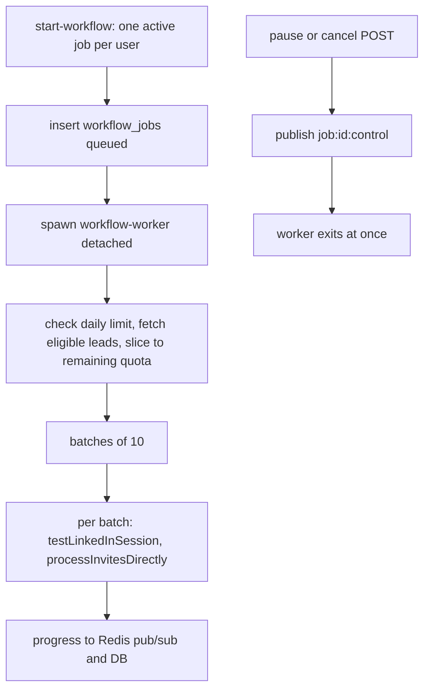
```mermaid
flowchart TD
  A["start-workflow: one active job per user"] --> B["insert workflow_jobs queued"]
  B --> C["spawn workflow-worker detached"]
  C --> D["check daily limit, fetch eligible leads, slice to remaining quota"]
  D --> E["batches of 10"]
  E --> F["per batch: testLinkedInSession, processInvitesDirectly"]
  F --> G["progress to Redis pub/sub and DB"]
  H["pause or cancel POST"] --> I["publish job:id:control"]
  I --> J["worker exits at once"]
```

### Mapping to implementation

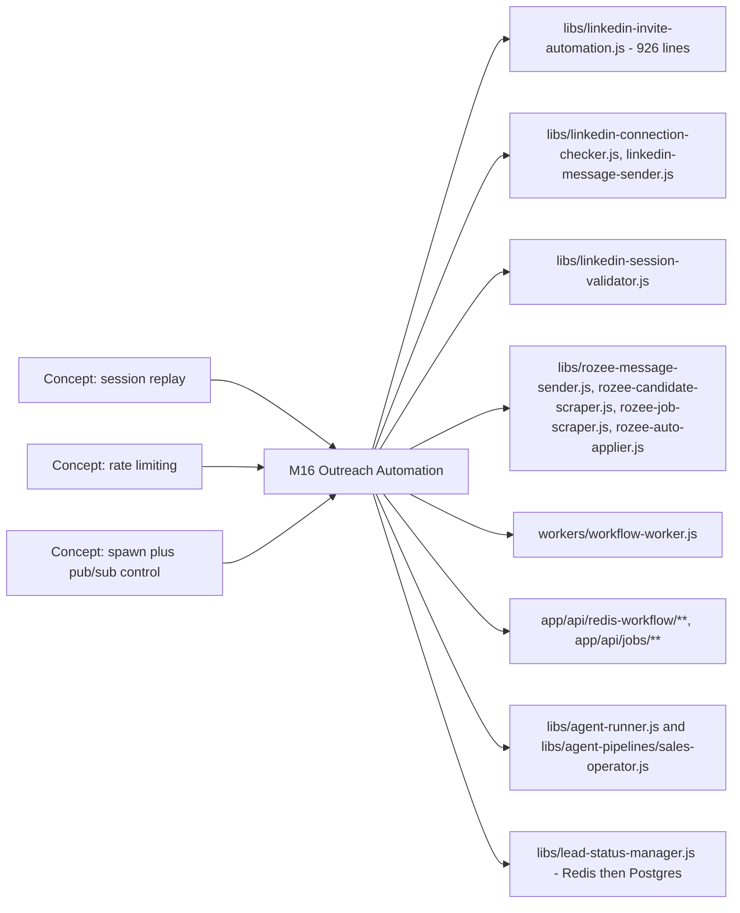
```mermaid
flowchart LR
  K1["Concept: session replay"] --> M["M16 Outreach Automation"]
  K2["Concept: rate limiting"] --> M
  K3["Concept: spawn plus pub/sub control"] --> M
  M --> F1["libs/linkedin-invite-automation.js - 926 lines"]
  M --> F2["libs/linkedin-connection-checker.js, linkedin-message-sender.js"]
  M --> F3["libs/linkedin-session-validator.js"]
  M --> F4["libs/rozee-message-sender.js, rozee-candidate-scraper.js, rozee-job-scraper.js, rozee-auto-applier.js"]
  M --> F5["workers/workflow-worker.js"]
  M --> F6["app/api/redis-workflow/**, app/api/jobs/**"]
  M --> F7["libs/agent-runner.js and libs/agent-pipelines/sales-operator.js"]
  M --> F8["libs/lead-status-manager.js - Redis then Postgres"]
```

### Dependencies and failure impact

Relies on M17, Playwright (installed by `postinstall`), Redis (optional: DB fallback), LinkedIn's DOM. The code carries many selector fallbacks (commit history shows a dozen "fix: detect connect button…" commits on 2026-03-12), which is the signature of a UI-automation dependency. **Risks:** LinkedIn ToS and account restriction (accepted by the owner per CLAUDE.md), selectors drifting, running Chromium inside web requests, `spawn('npx', …)` on a serverless host not possible (Vercel). Scaling limits were analysed (`SCALABILITY_ANALYSIS.md`, dated 2025-10-21 for the earlier "Reachly" code): one process per concurrent user; proposed BullMQ pool not implemented [PLANNED].

### Why separate

Different failure domain from hiring: it is the one module that automates a third-party site on behalf of a user. Keeping it behind `libs/platforms` adapters is what lets recruitment reuse the *post a job* capability without inheriting the invite code.

---

## M17 · Platform Accounts & Sessions

**Responsibility.** Store and manage the connections to LinkedIn, Rozee.pk and Indeed, test them, activate/deactivate them, and hold per-account limits.

### Core concepts and mapping

* **Connect = the user logs in once in a browser Playwright controls; only the resulting session is kept.** LinkedIn and Rozee.pk: the recruiter types their email and password into Raasta-AI's form and the **server** performs the login (`app/api/linkedin/connect`, `rozee/connect`), meaning the password passes through the server (not stored) [GAP vs best practice]. Indeed: a real browser window opens on the machine and the *person* signs in themselves; no password or code touches Raasta-AI (`libs/indeed-connect.js`).
* **Storage.** One row per account in `linkedin_accounts` / `rozee_accounts` / `indeed_accounts` with `cookies`, `local_storage`, `session_storage` as **plain JSON**; `session_id` unique; `is_active`; counters and limits. **No encryption at rest** (despite the claim in `LINKEDIN_INTEGRATION.md`) [GAP].
* **Sharing.** Commit `59442f2` ("share linkedin accounts across admin, sales operator and recruiter") makes publishing pick an account via `resolveAccount`: the account asked for, else the owner's active one, else the team's only active one. Impact: any operator can act as any connected account [GAP, documented in `docs/ai-hiring/19`].
* **Limits.** `libs/rate-limit-manager.js` offers `checkDailyLimit`, `incrementDailyCounter`, message and connection-check variants, and `*ForPlatform` wrappers used by the adapters.

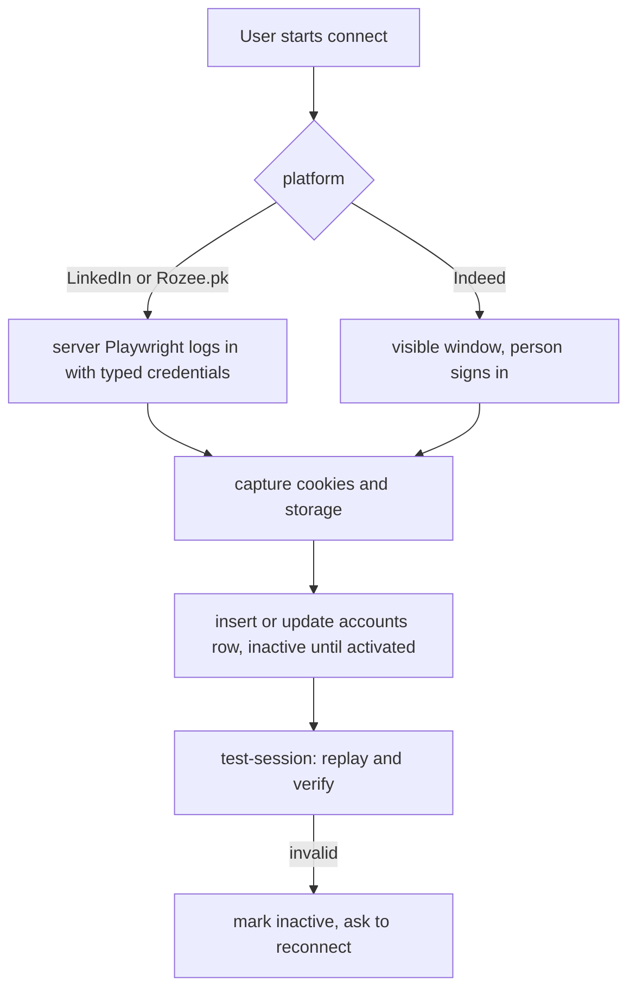
```mermaid
flowchart TD
  A["User starts connect"] --> B{"platform"}
  B -->|"LinkedIn or Rozee.pk"| C["server Playwright logs in with typed credentials"]
  B -->|"Indeed"| D["visible window, person signs in"]
  C --> E["capture cookies and storage"]
  D --> E
  E --> F["insert or update accounts row, inactive until activated"]
  F --> G["test-session: replay and verify"]
  G -->|"invalid"| H["mark inactive, ask to reconnect"]
```

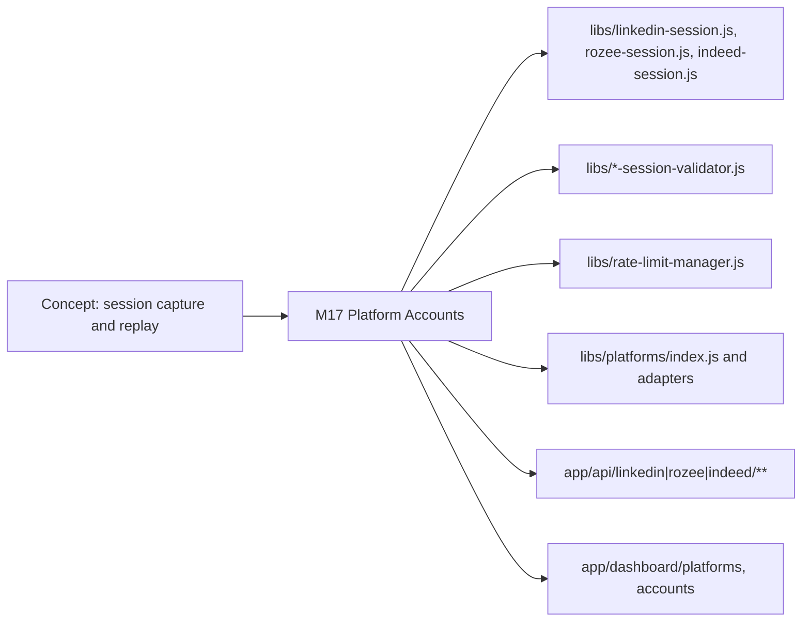
```mermaid
flowchart LR
  K1["Concept: session capture and replay"] --> M["M17 Platform Accounts"]
  M --> F1["libs/linkedin-session.js, rozee-session.js, indeed-session.js"]
  M --> F2["libs/*-session-validator.js"]
  M --> F3["libs/rate-limit-manager.js"]
  M --> F4["libs/platforms/index.js and adapters"]
  M --> F5["app/api/linkedin|rozee|indeed/**"]
  M --> F6["app/dashboard/platforms, accounts"]
```

**Dependencies/failure.** If a session expires, `testSession` fails and the account is flagged inactive; publishing returns `needs_login`. **Why separate:** it holds the most sensitive data in the system (live sessions) and must be audited as a unit.

---

## M18 · Storage

**Responsibility.** One interface for saving and reading binary files (resumes, recording parts, assembled recordings, dev emails) in local disk or S3-compatible storage; time-limited access.

### Core concepts

* **Driver abstraction.** `putObject/getObjectStream/getSignedUrl/listKeys/deleteObject` are the same for `local` (default) and `s3` drivers (`STORAGE_DRIVER`).
* **Key validation = path-traversal defence.** `assertValidKey` rejects empty, `..`, `.`, leading `/`, backslash, NUL, > 512 chars, and `.meta.json`; the local path is resolved and must stay under the base directory.
* **Signed, expiring links.** For the local driver: token = `base64url(JSON{k:key,e:expiry,n:filename}) + "." + HMAC-SHA256(secret)`; `verifySignedToken` uses `timingSafeEqual` and rejects expiry; whoever holds an unexpired token may download that one key. For S3: AWS presigned GET URLs.
* **HTTP range.** `parseRange` supports `bytes=a-b`, `a-`, `-n`; 416 for unsatisfiable.

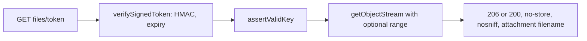
```mermaid
flowchart LR
  A["GET files/token"] --> B["verifySignedToken: HMAC, expiry"]
  B --> C["assertValidKey"]
  C --> D["getObjectStream with optional range"]
  D --> E["206 or 200, no-store, nosniff, attachment filename"]
```

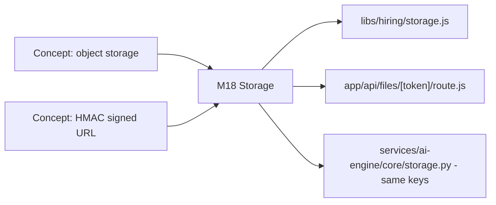
```mermaid
flowchart LR
  K1["Concept: object storage"] --> M["M18 Storage"]
  K2["Concept: HMAC signed URL"] --> M
  M --> F1["libs/hiring/storage.js"]
  M --> F2["app/api/files/[token]/route.js"]
  M --> F3["services/ai-engine/core/storage.py - same keys"]
```

**Failure impact.** Storage down at apply time: the application is kept without the file. At recording time: parts are retried 3 times by the browser queue, then counted as failed; the interview itself continues. **Gap:** no retention/purge job; deleted candidates leave files behind.

---

## M19 · AI Platform Layer

**Responsibility.** One reliable way to call the LLM and the Whisper API for the whole hiring side.

### Core concepts in `libs/ai/llm.js`

| Concern | Implementation |
|---|---|
| Provider | OpenAI SDK pointed at Groq (`baseURL`), overridable with `LLM_BASE_URL` |
| Models | `DEFAULT_MODEL openai/gpt-oss-120b`, `DEFAULT_FAST_MODEL openai/gpt-oss-20b`, `whisper-large-v3-turbo`; env overrides |
| Timeouts / retries | 30 s timeout, SDK `maxRetries: 0` (callers own retry policy so it can be bounded) |
| Error taxonomy | `LlmError.code ∈ {parse, rate_limit, upstream}` with `retryAfterMs` from `retry-after(-ms)` headers |
| JSON mode | `response_format: json_object`; `parseJsonContent` tolerates ``` fences and surrounding text; one retry with "Return ONLY valid JSON"; Groq's 400 `json_validate_failed` treated as unparseable output |
| Reasoning models | GPT-OSS spends output tokens on hidden reasoning: if `finish_reason = length` the call is retried once with 3× budget (max 8000); `reasoning_effort` (`low/medium/high`) is sent only to `gpt-oss*` models |
| Whisper | `verbose_json`, language fixed (default `en`), per-segment filter `isSpeechSegment` dropping segments with `compression_ratio > 2.4`, low `avg_logprob`, or high `no_speech_prob` |
| Testing | `setLlmClient(fake)` injects a fake provider (`tests/hiring/llm.test.js`) |

```mermaid
flowchart TD
  A["chatJSON(system, user, schemaHint)"] --> B["build messages, append schema hint"]
  B --> C["complete: create completion with json mode"]
  C -->|"length reached, first time"| D["retry with 3x tokens"]
  C --> E["parseJsonContent"]
  E -->|"undefined"| F["retry once: Return ONLY valid JSON"]
  F -->|"still bad"| G["throw LlmError parse"]
  E -->|"object"| H["return"]
  C -->|"429"| I["throw LlmError rate_limit with retryAfterMs"]
```

```mermaid
flowchart LR
  K1["Concept: robust LLM client"] --> M["M19 AI Platform Layer"]
  M --> F1["libs/ai/llm.js"]
  M --> F2["libs/ai/prompts/resume, fit, questions, interview, final"]
  M --> F3["libs/hiring/platform-content.js - post prompts"]
```

**Not part of M19 (the second LLM client):** `libs/groq-service.js` (sales) creates its own OpenAI client and has no retries, no error taxonomy and a retired default model. **Why separate:** one choke point for provider changes - proven when Groq retired Llama 3.x and the fix was three lines in `libs/ai/llm.js` (for the hiring side).

---

## M20 · Billing & Public Site

**Responsibility.** Marketing pages, legal pages, the blog, and Stripe subscriptions.

* **Public site.** `app/page.js` renders landing components from `components/*` (Hero, Problem, FeaturesAccordion, Pricing, FAQ, CTA…) from the ShipFast template, rebranded to "Raasta-AI". `app/blog/**` serves articles from `app/blog/_assets/content.js`. `app/privacy-policy`, `app/tos` are template legal pages. `POST /api/lead` accepts landing-page emails and **discards them** (comment in code).
* **Billing.** `app/api/stripe/create-checkout` and `create-portal` create Stripe sessions; `app/api/webhook/stripe` verifies the signature with `stripe.webhooks.constructEvent` but **every event branch is a no-op** (comments say "integrate with your active database"; the Mongo code was removed), so `users.stripe_customer_id`/`subscription_status` are never updated by payments. `config.js` defines two plans (Starter $49, Pro $99) with **placeholder price IDs** in production mode. **No feature is gated by subscription status** (the only reads of `subscriptionStatus` are the admin user list) [PARTIAL: checkout exists, entitlement does not].
* **Template leftovers.** `package.json` name `ship-fast-code`; `config.js` `domainName: "reachly.ai"` and Mailgun addresses `@mg.reachly.ai` (the earlier product name); `README.md` is ShipFast boilerplate.

```mermaid
flowchart LR
  A["Pricing button"] --> B["POST stripe/create-checkout"]
  B --> C["Stripe Checkout"]
  C -->|"webhook checkout.session.completed"| D["POST webhook/stripe: verify signature"]
  D --> E["event branches are no-ops: no DB update"]
```

```mermaid
flowchart LR
  K1["Concept: webhook signature verification"] --> M["M20 Billing and Public Site"]
  M --> F1["app/api/stripe/**, app/api/webhook/stripe"]
  M --> F2["libs/stripe.js, config.js"]
  M --> F3["app/page.js, components/*, app/blog/**"]
```

**Why separate:** none of it belongs to the product's value; isolating it makes it easy to say honestly "this is template code and is not part of our contribution".
