# Part 2C · Module Interaction

[← Index](README.md) · Previous: [Part 2B (cont.)](02b2-conceptual-modules-cont.md) · Next: [Part 2D · Foundational concepts](02d-foundational-concepts.md)

## Contents

* [C.1 Conceptual module maps](#c1-conceptual-module-maps)
* [C.2 Interaction and dependency diagrams, single points of failure](#c2-interaction-and-dependency-diagrams)
* [C.3 Sequence diagrams for the three key scenarios](#c3-sequence-diagrams)

---

## C.1 Conceptual module maps

The full system has 20 modules; to keep each diagram drawable, it is shown as three maps. **Each box contains the module's single responsibility.**

### C.1.1 Hiring modules

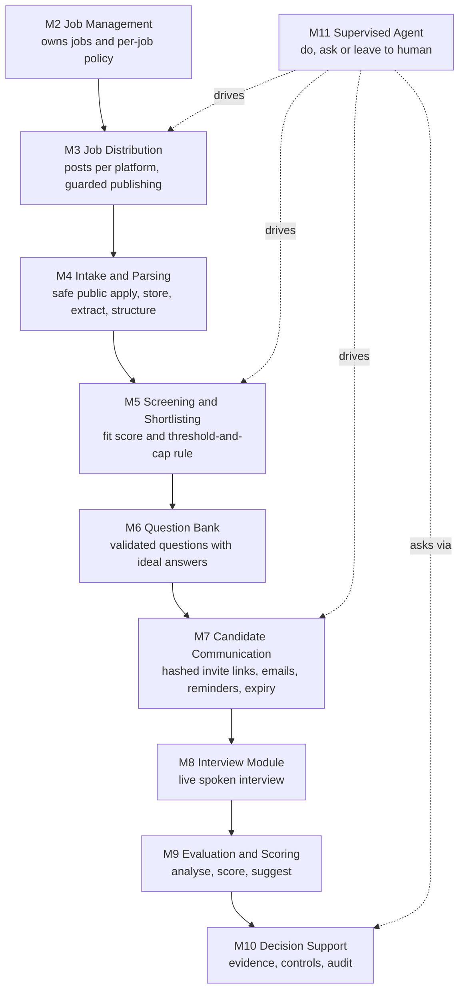

*Reading:* the solid chain is the candidate's journey; dotted arrows show the agent steering the same steps by policy instead of the worker's built-in automation.

### C.1.2 Shared platform modules

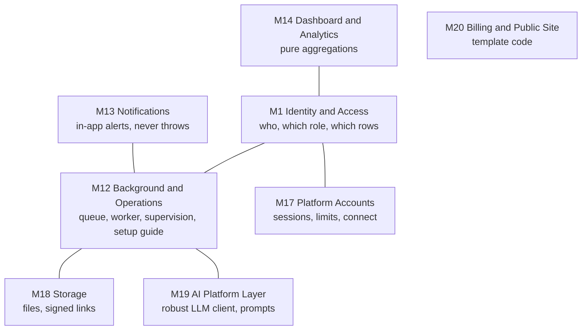

*Reading:* these have no business story of their own; every other module uses them. A line means "talks to".

### C.1.3 Client-acquisition modules

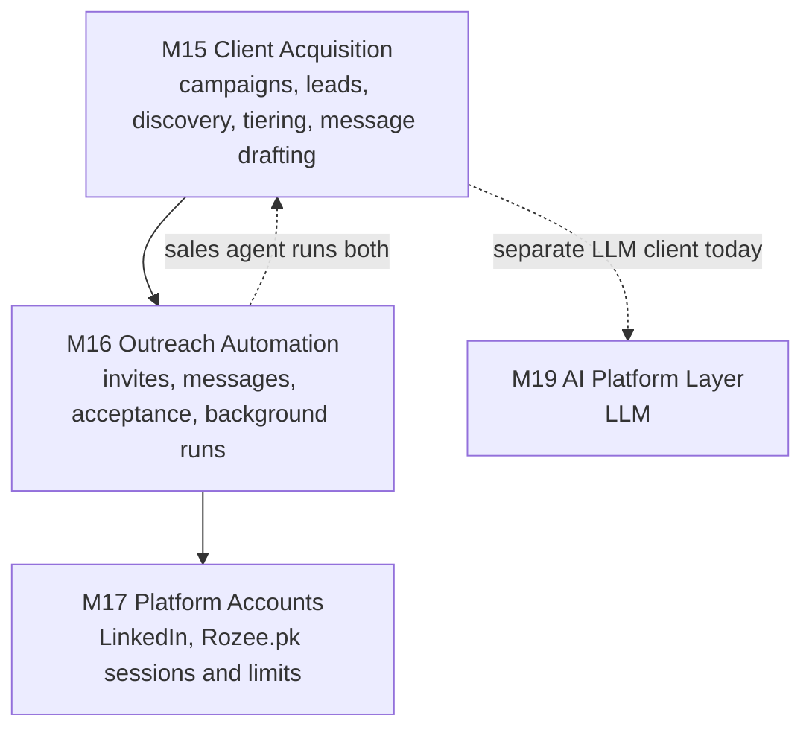

*Reading:* the only dotted line that is a **design smell** is M15 → M19: the sales side has its own OpenAI client (`libs/groq-service.js`) instead of `libs/ai/llm.js`.

---

## C.2 Interaction and dependency diagrams

### C.2.1 Synchronous calls (who calls whom, direction = caller to callee)

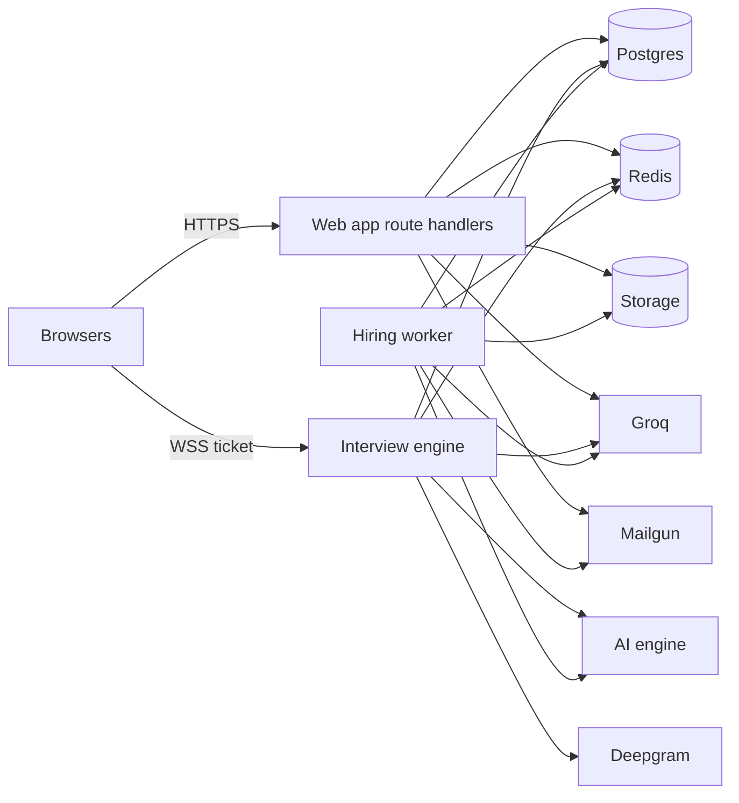

*Reading:* the arrows that matter for failure analysis are the ones into the three data boxes (Postgres, Redis, Storage). The web app and the worker never call the engine; the engine never calls the worker directly (it only writes jobs to Redis).

### C.2.2 Events and queues (asynchronous, direction = producer to consumer)

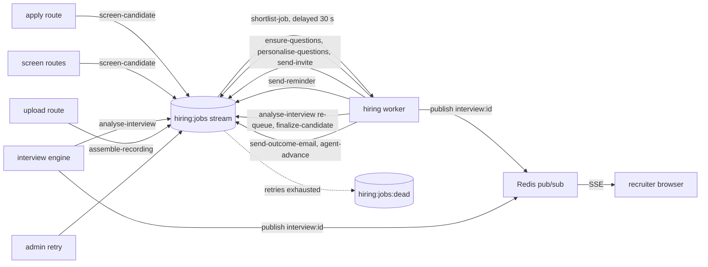

*Reading:* nearly every arrow ends in the same stream: the queue is the system's spine. The engine and the upload route are the two producers that run outside the worker.

### C.2.3 Single points of failure

Highlighted in red in the diagram; the table gives the blast radius and the mitigation that actually exists in code.

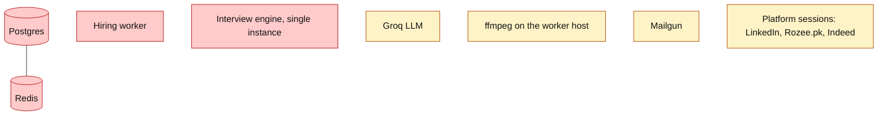

| Component | Why it is a single point | What stops | What still works | Mitigation present | Mitigation missing |
|---|---|---|---|---|---|
| **Postgres** | System of record; every module reads it | Everything: logins, apply, interviews | Nothing | Pool of 10 connections, idle timeout, UTC session | Replica, backups documented but not scripted |
| **Redis** | Queue, locks, rate limits, live events, caches | Screening/invites/analysis (jobs cannot be enqueued; apply route logs and keeps the application); live view | Public pages, apply (saved), interviews already connected (engine does not need Redis to run the loop) | `rateLimit` fails open; question lock proceeds unlocked; sales cache falls back to DB; Setup guide reports it | HA Redis; durable AOF settings not documented |
| **Hiring worker** | All async work | Screening, shortlist, invites, reminders, analysis, finalize, agent | Interviews (engine), manual actions (invite button calls `sendInvite` directly) | Embedded mode restarts it with backoff and circuit breaker; Setup guide + admin card warn "jobs waiting but no worker" | More than one worker is supported by the consumer group, but none is run |
| **Interview engine** | Holds live sessions in memory; one process | All live interviews at once | Everything else | 15 s state snapshots; resume window 15 min; SIGTERM snapshot; clients reconnect ≤ 5 times; sweep closes orphans | Horizontal scale-out (documented out of scope) |
| **Groq** | One LLM provider | New applications get `parseError`/`error` and wait; interviews degrade to fallbacks | Everything non-AI | Retries, fallbacks, re-parse button, "Screening failed – retry" | Second provider/failover |
| **ffmpeg** | Needed to join and decode recordings | Recording assembly, pace/fluency | Transcript-based estimate; AI-engine fallback if running | `ffmpegAvailable` check in Setup guide; AI-engine `/media/concat` fallback | Container image bundling it |
| **Mailgun** | Only way candidates learn of the interview | Invites/reminders | Everything else; links can be re-sent | Failure recorded on the interview and retried; dev outbox | Second channel (SMS/WhatsApp) |
| **Platform sessions** | Stored cookies expire/are challenged | Auto-posting, invites, messages | Hand-off posting, hiring pipeline | `needs_login` stop, 12 h agent cool-off, 24 h/30 min engine cool-off | Official APIs |

---

## C.3 Sequence diagrams

### C.3.1 Scenario (i): a candidate applies and is auto-shortlisted

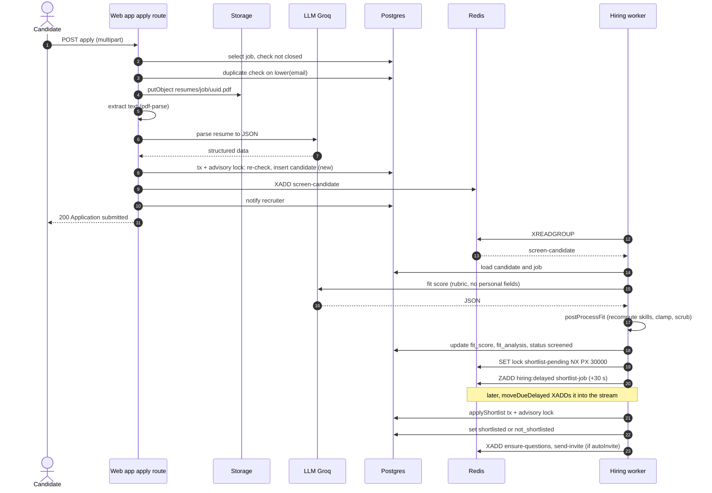

*How to read it:* numbered steps run top to bottom. The line `W-->>C: 200` is the end of the **synchronous** part. Everything after it happens even if the candidate closes the tab. The 30-second delay lets several applicants arriving together share one shortlist run (so the cap compares everybody).

### C.3.2 Scenario (ii): a shortlisted candidate receives the link, takes the interview and is evaluated

**(ii-a) Invite and access**

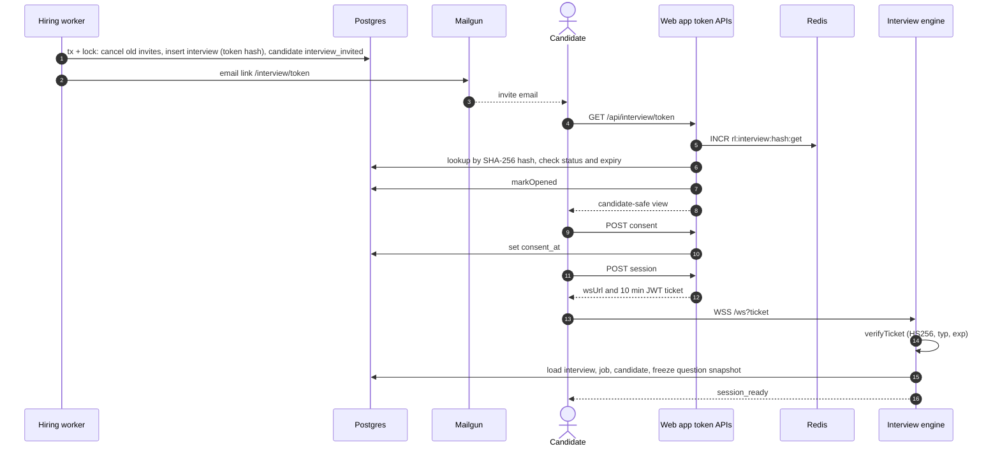

**(ii-b) One question cycle inside the engine**

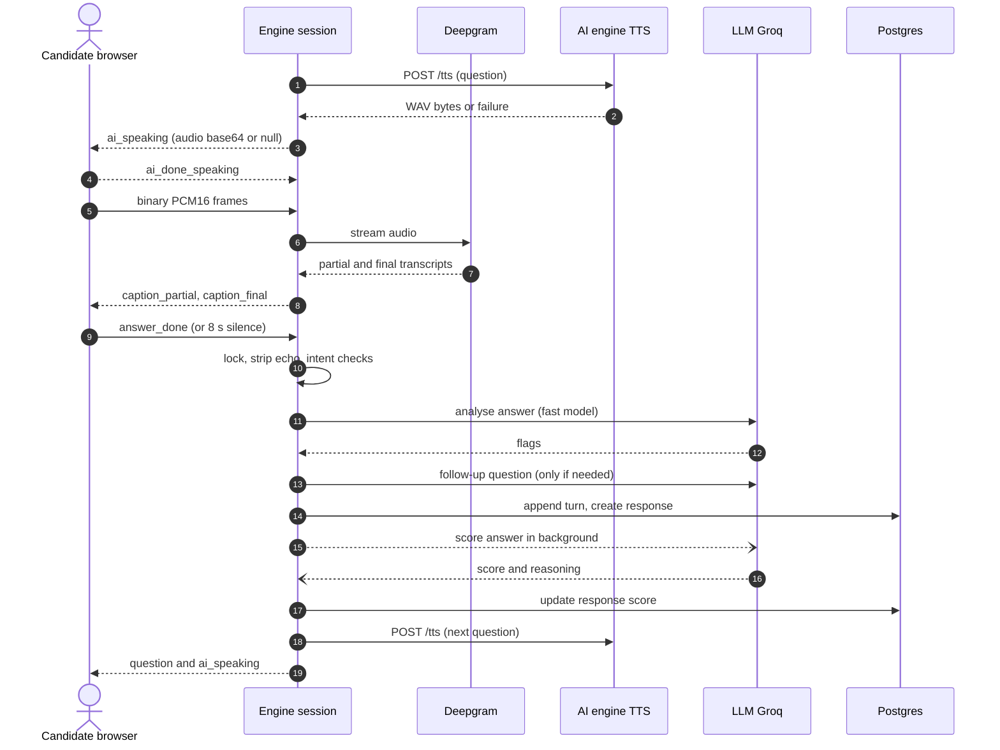

**(ii-c) After the interview**

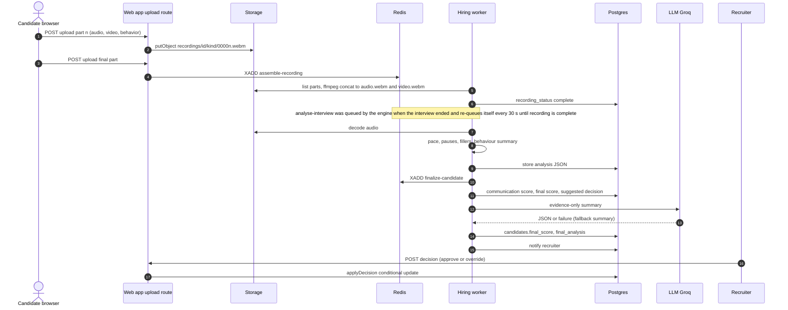

*How to read the three:* (ii-a) is **security-heavy** (hash lookup, rate limit, consent gate, ticket); (ii-b) is the **real-time loop** (the "score in background" arrow is open-headed because it does not block the next question); (ii-c) is **fully asynchronous** and can take minutes.

### C.3.3 Scenario (iii): a key client-acquisition flow

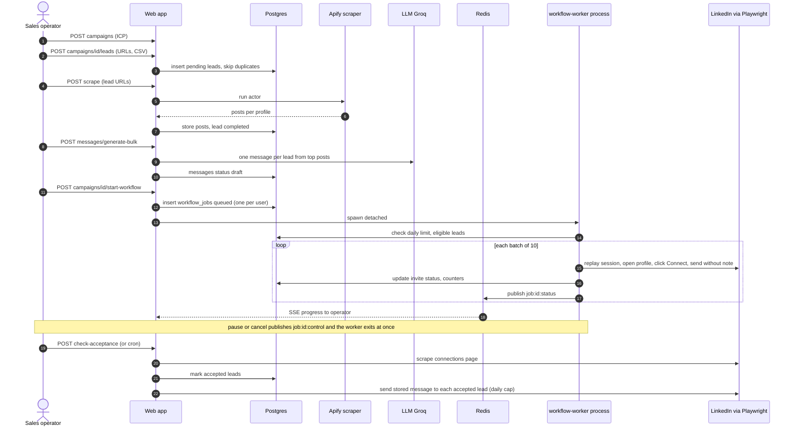

*How to read it:* the middle `loop` is the part that takes tens of minutes; it is the reason this flow uses a detached process and Redis pub/sub rather than a single HTTP request. The operator's review of drafts happens between steps 11 and 12 and is optional in the manual flow (mandatory checkpoint in the sales agent's `semi_auto` mode).
