# Part 2D · Foundational Concepts Primer

[← Index](README.md) · Previous: [Part 2C](02c-module-interaction.md) · Next: [Part 2E · Development process](02e-development-process.md)

> **How to use this primer.** Each concept has the same five parts: **(1) definition + everyday analogy, (2) how it works under the hood, (3) a simple diagram, (4) where and why Raasta-AI uses it, (5) classic viva questions with answers.** Only concepts the system actually depends on are included, with one deliberate exception (embeddings, §D.7) because a panel will ask why they are *not* used.

## Contents

[D.1 Client–server and HTTP](#d1-clientserver-model-and-http) · [D.2 API styles: REST, SSE, WebSocket](#d2-api-design-rest-sse-websocket) · [D.3 Databases](#d3-databases-schema-indexes-transactions-locks) · [D.4 Authentication, authorization, hashing, tokens](#d4-authentication-authorization-hashing-vs-encryption-tokens) · [D.5 File upload and document parsing](#d5-file-upload-and-document-parsing) · [D.6 LLMs, prompts, prompt engineering](#d6-llms-prompts-and-prompt-engineering) · [D.7 Embeddings and similarity (not used)](#d7-embeddings-and-similarity-scoring-not-used) · [D.8 AI evaluation and its limits](#d8-ai-evaluation-and-its-limits-hallucination-bias-variance) · [D.9 Speech and voice processing](#d9-speech-and-voice-processing) · [D.10 Computer vision in the browser](#d10-computer-vision-on-device) · [D.11 Email delivery](#d11-email-delivery) · [D.12 Background jobs and queues](#d12-background-jobs-and-queues) · [D.13 Concurrency control](#d13-concurrency-control-locks-idempotency-single-flight) · [D.14 Caching](#d14-caching) · [D.15 Browser automation](#d15-browser-automation) · [D.16 Rate limiting](#d16-rate-limiting) · [D.17 Testing with injected dependencies](#d17-testing-with-injected-dependencies) · [D.18 Containers, CI/CD and cloud deployment](#d18-containers-cicd-and-cloud-deployment) · [D.19 Logging and observability](#d19-logging-and-observability)

---

## D.1 Client–server model and HTTP

**Definition.** A *client* (browser) asks; a *server* answers. **HTTP** is the language: a request has a *method* (GET read, POST create/act, PATCH partial update, PUT replace, DELETE remove), a *path*, headers and an optional body; a response has a *status code*, headers and a body.
**Analogy.** A restaurant: the order slip is the request, the dish is the response, the number on the receipt is the status code. HTTP is **stateless**: the kitchen does not remember you between orders, so you show a *cookie* (your session) each time.

**Under the hood.** Browser → DNS lookup → TCP/TLS connection → request → Next.js routes by file path (`app/api/hiring/jobs/route.js` → `/api/hiring/jobs`) → handler runs → JSON response.

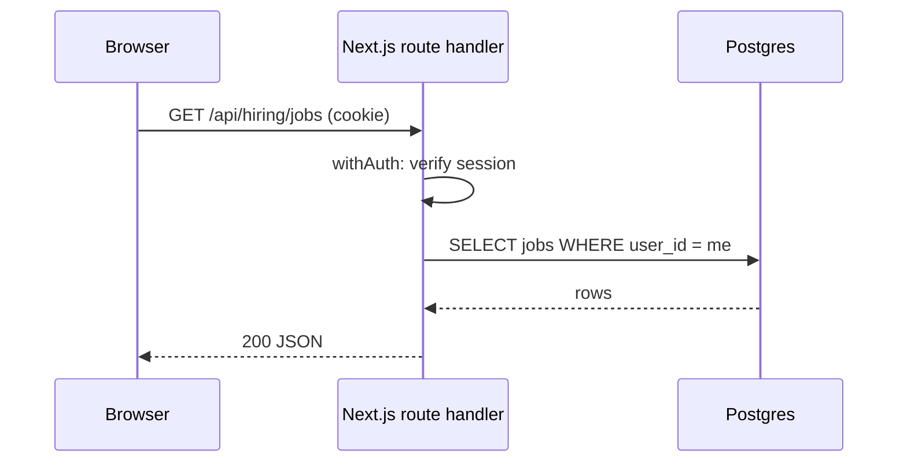

**In Raasta-AI.** Route handlers export `GET/POST/PATCH/DELETE`. Status codes carry meaning, used consistently:

| Code | Meaning in this codebase | Example |
|---|---|---|
| 200 / 201 | OK / created | job created (201) |
| 400 | Bad input | invalid hiring config; missing name |
| 401 | Not signed in | `withAuth` |
| 403 | Signed in but not allowed | non-admin on `admin/users`; no consent yet on `session` |
| 404 | Not found **or not yours** (does not reveal existence) | job of another owner (job routes); unknown interview token. *Candidate, interview and question routes answer **403** for a foreign record, which does reveal that the id exists [PARTIAL]* |
| 409 | Conflict with current state | duplicate application; invite from wrong status; concurrent decision |
| 410 | Gone | interview link expired or cancelled |
| 413 / 415 | Too large / wrong type | recording part > 10 MB / not WebM |
| 416 | Range not satisfiable | media seek past the end |
| 429 | Too many requests | per-token rate limit; posting guard |
| 502 / 503 | Upstream problem / dependency unavailable | email send failed; screening queue down |
| 501 | Not implemented here | Indeed sign-in window on a server without a screen |

**Viva Q&A.**
* *Why 404 instead of 403 for another user's job?* So an attacker cannot learn which IDs exist. (The job routes do this; the candidate/question/interview routes return 403, a small inconsistency.) IDs are random UUIDs, so enumeration is not practical either way.
* *Why 409 for a duplicate application?* The request is well-formed but conflicts with stored state.
* *Is HTTP secure?* No; HTTPS (TLS) is what protects it. In development the app runs on `http://localhost`, which browsers allow for the microphone; any other host needs HTTPS (stated in `docs/ai-hiring/15`).

---

## D.2 API design: REST, SSE, WebSocket

**Definition.** **REST** models *resources* with URLs and standard verbs (`/jobs/{id}/candidates`). **SSE (server-sent events)** is a long-lived HTTP response where the server pushes lines (`data: {...}\n\n`) and the browser's `EventSource` reconnects automatically. **WebSocket** is a persistent, *two-way* channel after an HTTP upgrade.
**Analogy.** REST = letters; SSE = a radio broadcast you tune into; WebSocket = a phone call.

**Under the hood and diagram.**

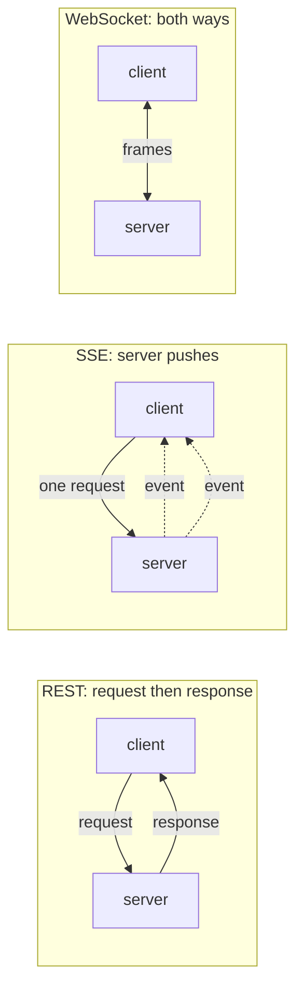

**In Raasta-AI.**

| Style | Where | Why this one |
|---|---|---|
| REST JSON | all CRUD (`app/api/**`) | Simple, cacheable, testable |
| SSE | `hiring/interviews/[id]/stream` (live interview), `agents/runs/[id]/stream` (DB polling every 1 s ≤ 5 min), `jobs/[id]/stream` (workflow progress) | One-way updates; works through ordinary proxies; auto-reconnect |
| WebSocket | `wss://engine/ws?ticket=` | Needs **binary audio in** and **JSON events out** continuously; REST cannot do it |
| Polling | Notification bell (30 s), publish panel, posting runs (1.5 s), system status (20 s) | Simplest when freshness needs are low |

WebSocket protocol (`docs/ai-hiring/09`): client → engine `ready, begin, ai_done_speaking, answer_done, repeat_question, end_interview, client_event, ping` and binary PCM16; engine → client `session_ready, ai_speaking, question, listening, caption_partial, caption_final, processing, time_warning, interview_complete, error, pong`. Close codes: 4001 bad/expired ticket, 4004 not found, 4009 duplicate session, 4010 already completed, 4011 expired, 1012 restart, 1013 try again later.

**Viva Q&A.**
* *Why not do the interview over REST polling?* Audio is a continuous stream with sub-second latency; HTTP request/response per chunk would add overhead and lose ordering guarantees.
* *Why SSE for the live view, not WebSocket?* The recruiter only listens; SSE is simpler and reconnects by itself.
* *Why can't Next.js host the WebSocket?* Serverless-style route handlers have no long-lived process or in-memory state, and the hosting target (Vercel) limits function time; hence a separate Node process.

---

## D.3 Databases: schema, indexes, transactions, locks

**Definition.** A **relational database** stores data in *tables* with typed columns; *primary keys* identify rows; *foreign keys* link tables and can cascade deletes; *constraints* (NOT NULL, UNIQUE) enforce rules. A **transaction** groups statements so they all happen or none do (**ACID**). An **index** is a sorted lookup structure (a B-tree) that makes `WHERE` and `ORDER BY` fast at the cost of slower writes.
**Analogy.** Tables = spreadsheets with strict columns; an index = the alphabetical tabs of a phone book; a transaction = a bank transfer (debit and credit both, or neither).

**Under the hood.**

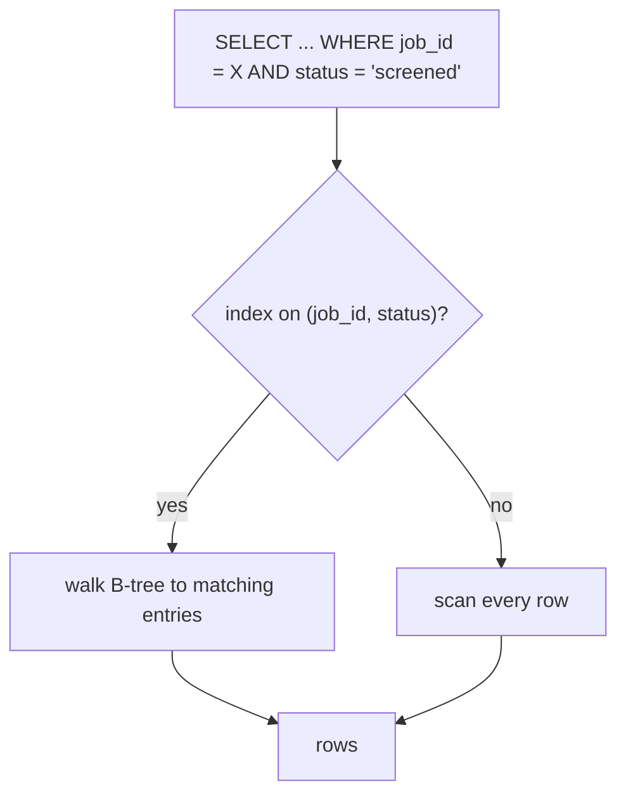

**In Raasta-AI.**
* **Postgres + Drizzle** (type-safe query builder). 22 tables in `libs/schema.ts`. Primary keys: `uuid` default random; `users.id` is `text` (Google ids and `nanoid`).
* **Foreign keys with cascade:** deleting a user deletes their campaigns, jobs, candidates, interviews… (`onDelete: cascade`). Some use `set null` (e.g., `interview_responses.question_id`, `agent_runs.job_id`) to preserve history.
* **JSON columns** (`json`, not `jsonb`) hold flexible blobs: `parsed_data`, `fit_analysis`, `analysis`, `hiring_config`, `state`. Trade-off versus a NoSQL document store: we keep integrity and joins for the core entities and use JSON only for variable, rarely-queried shapes (queried with casts when needed, e.g. `fit_analysis::jsonb`).
* **Indexes added deliberately** (`0013_hiring_indexes.sql` and schema): `candidates (job_id, status)` and `(user_id, applied_at)`; `jobs (user_id, created_at)`; `interviews (candidate_id)`, `(job_id, status)`, `(user_id, status)`; `interview_questions (job_id, is_active)`; `interview_responses (interview_id)`; `agent_runs (job_id, status)`, `(user_id, created_at)`; `agent_steps (agent_run_id, step_index)`; `agent_actions (agent_run_id, created_at)`, `(user_id, status)`, `(dedupe_key)`; `notifications (user_id, created_at)`; `job_publications (job_id, platform, created_at)` and `(account_id, created_at)`; `posting_runs (job_id, platform, created_at)` and `(status, created_at)`. Reason recorded in `docs/ai-hiring/05`: "Postgres does not index foreign keys by itself".
* **Unique and partial unique indexes:** `interview_turns (interview_id, seq)` (transcript order and replay safety), `interviews.token_hash` UNIQUE, `job_publications (job_id, platform) WHERE status='publishing'` (never two posts in flight), `posting_runs (job_id, platform) WHERE status IN (live statuses)`.
* **Transactions + advisory locks** (`pg_advisory_xact_lock(hashtext(key))`): application insert (`<job>:<email>`), shortlist (`shortlist:<job>`), invite (`invite:<candidate>`), question write (`questions:<job>`). These serialise logically-unique operations that the schema does not constrain.
* **Timestamps are written by the app, not `defaultNow()`,** in newer tables, and `libs/db.ts` sets the session `TimeZone: 'UTC'` because the local database's clock was hours off.

**Viva Q&A.**
* *Why Postgres not MongoDB?* Relational integrity (jobs→candidates→interviews→responses), transactions, and advisory locks; the earlier interview prototype used MongoDB and was deliberately re-implemented on Postgres (CLAUDE.md rule 4).
* *Why advisory locks instead of unique constraints?* The "one application per (job, email)" rule uses `lower(email)` and the "one active interview per candidate" rule depends on status values; a partial unique index could express both, but they were implemented as locks first. A DB-level constraint would be stronger [PARTIAL; proposed in Part 9].
* *What does ACID give you here?* The invite flow cancels the old interview, inserts the new one and updates the candidate in **one** transaction, so a crash cannot leave a candidate "invited" with no interview row.
* *What breaks at 10× rows?* Aggregations done in Node over all rows (`buildHiringAnalytics`); `LIKE`-style JSON text search in `deleteQuestion` (`position(id in questionSnapshot::text)`).

---

## D.4 Authentication, authorization, hashing vs encryption, tokens

(Core ideas introduced in [M1](02b-conceptual-modules.md#m1--identity--access); this section adds the comparison table the viva expects.)

| | **Hashing** | **Encryption** | **Signing (HMAC/JWT)** |
|---|---|---|---|
| Reversible? | No | Yes, with the key | Not applicable: proves integrity/origin |
| Purpose | Store something you only need to *verify* | Protect something you need to *read back* | Prove "I issued this and it was not altered" |
| Used for | passwords (bcrypt cost 12), invite tokens (SHA-256) | **nothing** (platform cookies are stored in plain JSON) [GAP] | JWT session, 10-min WebSocket ticket (HS256), storage download tokens (HMAC-SHA256) |

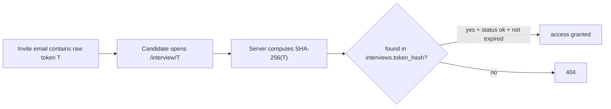

**In Raasta-AI:** passwords bcrypt cost 12; tokens 256 bits random, SHA-256 at rest, constant-time comparison for HMAC tokens (`timingSafeEqual`), `typ: interview_ws` claim in tickets so a ticket cannot be used as any other token, 10-minute TTL, `sub` = interview id and `cid` = candidate id so the engine can check that the ticket matches the interview row.

**Viva Q&A.**
* *If the database leaks, can an attacker open interviews?* No: only hashes of tokens are stored. They could still read candidates' data, which is the real exposure.
* *Why does a reminder change the link?* The raw token cannot be recovered from its hash; a fresh token is minted on the same row and the old link stops working (404).
* *JWT downside?* Cannot be revoked before expiry; mitigated by re-reading role from the DB on each session check and by short ticket TTL.
* *Is anything encrypted at rest?* No [GAP] — recommended fix: AES-GCM for platform sessions.

---

## D.5 File upload and document parsing

**Definition.** Accepting a user's file safely and extracting text from it.
**Analogy.** A mailroom: check the parcel's label and weight, put it in a numbered locker you chose (not one the sender asks for), and open a copy to read the contents.

**Under the hood.** `multipart/form-data` carries the file; the server validates *extension allow-list and size*, writes bytes to storage under a server key, then runs extractors: PDF → `pdf-parse` (pdf.js reconstructs text from positioned glyphs), DOCX → `mammoth` (reads XML inside a zip), TXT → UTF-8. If a PDF yields no text it is probably scanned images → flagged unreadable (no OCR).

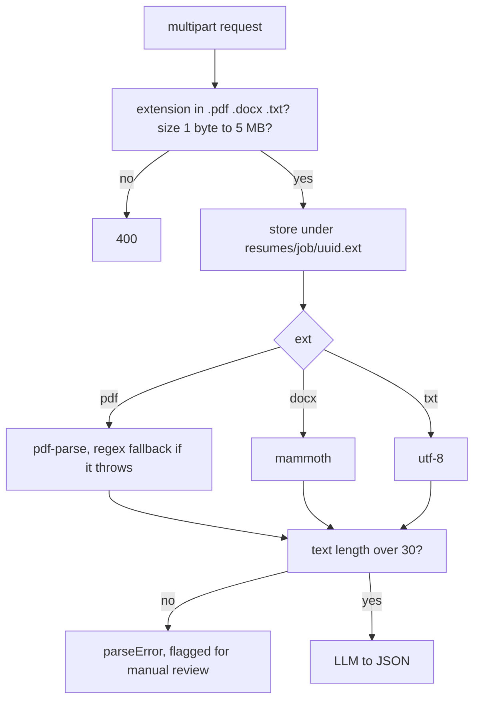

**Where and why.** `libs/hiring/resume-text.js` (`validateResumeFile`, `extractResumeText`, `buildParsedData`). The interview recordings use the same idea differently: 10-second `webm` parts, ≤ 10 MB each, MIME `audio|video/webm` or octet-stream, server-chosen key `recordings/<id>/<kind>/<00000>.webm`. **Known limits:** only the *extension* is checked for resumes (no magic-byte sniffing, no antivirus), no OCR for scans, `pdf-parse` must be an external package for Next (it breaks when bundled; `next.config.js`).

**Viva Q&A.** *What if someone uploads a `.exe` renamed `.pdf`?* The extension passes; `pdf-parse` fails, the regex fallback produces junk text, the file is stored but never executed or served inline (`Content-Disposition: attachment`, `nosniff`) [PARTIAL: no content sniffing]. *Why store the original?* Re-parsing, audit, and recruiter download (signed 5-minute link).

---

## D.6 LLMs, prompts and prompt engineering

**Definition.** A **large language model** predicts the next token given text; with instruction tuning it follows directions. A **prompt** = system instructions + user content (+ examples). **Prompt engineering** = shaping those instructions so output is reliable. A **token** ≈ ¾ of a word; models have a context window and an output limit (`max_tokens`). **Temperature** controls randomness (0 = near-deterministic).
**Analogy.** An intern who has read most of the internet: very fluent, sometimes confidently wrong, does best with a checklist and a template.

**Under the hood.**

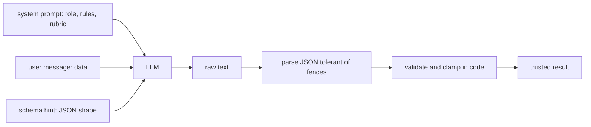

**Techniques actually used (with the file where you can see each):**

| Technique | Example | File |
|---|---|---|
| Role + rules + rubric in the system prompt | "impartial technical recruiter… rubric: skills 45%, experience 30%, projects 15%, education 10%" | `libs/ai/prompts/fit.js` |
| Output schema in the prompt + JSON mode | `chatJSON({ schemaHint })` | `libs/ai/llm.js` |
| Grounding / "use only the facts" | Rozee outreach: "Use ONLY information from the FACTS block" | `libs/groq-service.js` |
| Excluding irrelevant/biasing inputs | `stripPersonalFields` removes name, email, phone, location, links, raw text from the structured block; the model is told to ignore gender, age, religion, nationality… | `libs/ai/prompts/fit.js` |
| Few constraints, many validators | question list validated in code | `libs/interview/question-generator.js` |
| Low temperature for judgement, higher for creativity | fit 0.1, analyzer 0.3, scorer 0.3, questions 0.5, posts 0.7, follow-up 0.7 then 0.3 | each caller |
| Fast vs strong model split | analysis (per answer, latency critical) on `gpt-oss-20b`, scoring and summaries on `gpt-oss-120b` | `getFastModel()` / `getModel()` |
| Fallbacks when the model fails | keyword score, canned follow-up, deterministic summary | scorer, follow-up, final evaluator |

**Viva Q&A.**
* *Why JSON mode instead of function calling?* Provider-neutral and simpler; the earlier prototype used OpenAI tool-calling, which was replaced (`docs/ai-hiring/04`). Output is validated either way.
* *What is a reasoning model's pitfall?* Hidden "thinking" tokens consume `max_tokens`; the visible answer can be empty. Fixed with one automatic 3× retry and `reasoning_effort: low` for latency-critical calls.
* *How do you stop prompt injection?* See [Part 5](05-ai-components.md#54-failure-modes-and-guards): resume text is untrusted data placed in the *user* message, outputs are re-derived or validated, and no LLM output triggers an irreversible action.

---

## D.7 Embeddings and similarity scoring (not used)

> **Honest label: Raasta-AI does NOT use embeddings, vector databases or cosine similarity anywhere** (no dependency, no code). This section exists so you can explain it and defend the choice.

**Definition.** An **embedding** is a list of numbers (a vector, e.g. 768 dimensions) produced by a neural network so that texts with similar meaning land near each other. **Cosine similarity** measures the angle between two vectors (1 = same direction, 0 = unrelated).
**Analogy.** Placing every sentence on a huge map where meaning is distance; "Kubernetes engineer" and "k8s DevOps" sit close, "graphic designer" far away.

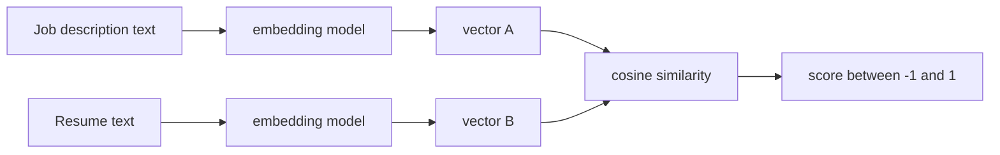

**Why the team chose an LLM rubric instead (reconstructed reasoning, flagged as such):**
1. *Explainability:* the panel and recruiters need "why": matched/missing skills, experience verdict, rationale. A cosine number cannot say that.
2. *Structure:* the decision depends on **required** skills and **years**, which similarity blurs (a CV can be "similar" to a Kubernetes JD without having Kubernetes).
3. *No infrastructure:* no embedding model hosting or vector store; one provider.
4. *Volume:* tens of applicants per job; cost of one LLM call each is negligible.
**Trade-offs/limits:** LLM scores vary run to run (±5 accepted in the acceptance criteria), cost scales linearly with applicants, and there is no cheap pre-filter. **Where embeddings would help:** pre-ranking thousands of CVs before the LLM, or sourcing candidates from a pool (Part 9).

**Viva Q&A.**
* *"Isn't keyword matching enough?"* It misses synonyms and rewards stuffing; we use it only to **verify** claims, with a synonym table (`js`↔`javascript`, `k8s`↔`kubernetes`, …).
* *"How would you evaluate matching accuracy?"* Build a labelled set (recruiter-ranked CVs per JD) and measure Spearman/NDCG against the system's order; see [Part 5 §5.6](05-ai-components.md#56-how-quality-was-measured-and-how-it-should-be).

---

## D.8 AI evaluation and its limits (hallucination, bias, variance)

**Definition.** *Hallucination* = plausible but unsupported output. *Bias* = systematically different outcomes for different groups unrelated to merit. *Variance* = the same input yields different outputs.
**Analogy.** A confident assessor who sometimes remembers things that did not happen, may be swayed by irrelevant details such as an accent or name, and might grade the same essay differently on Monday and Friday.

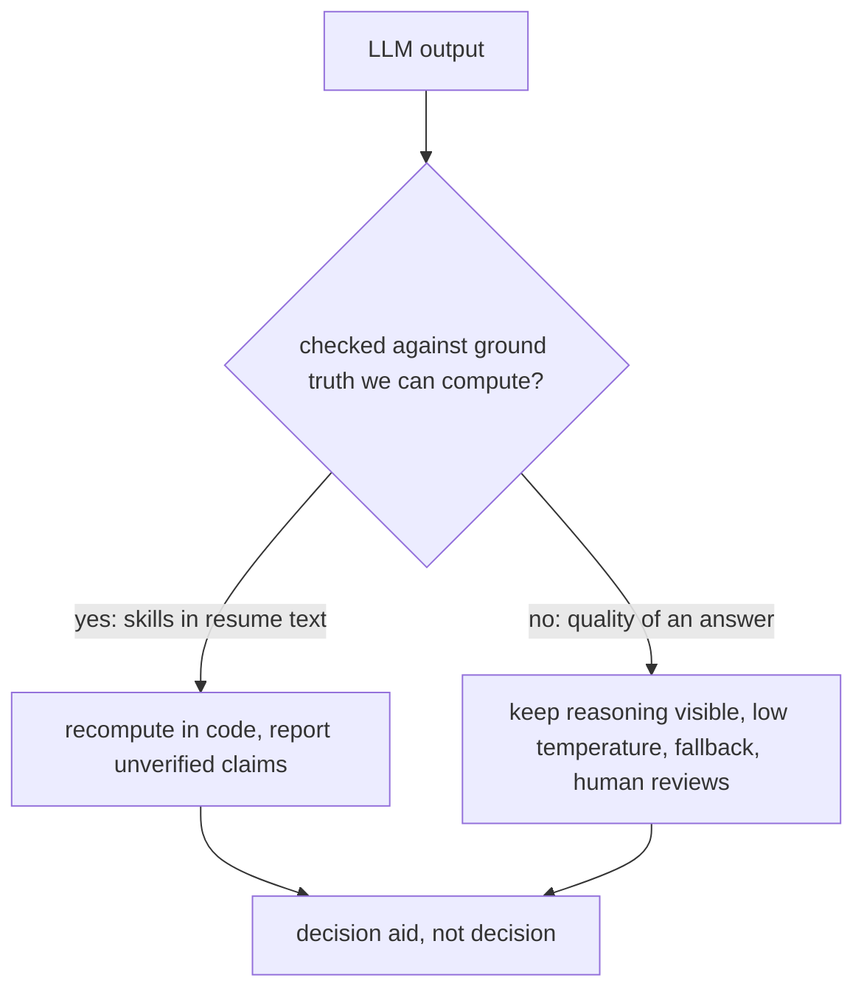

**Mitigations present in code:**

| Risk | Guard | Where |
|---|---|---|
| Hallucinated skills | matched/missing recomputed from the resume text with whole-term, synonym-aware regex; claims not found are reported as `unverified` | `postProcessFit` |
| Out-of-range scores | clamp to 0–100, round; invalid verdict → `unknown` | `postProcessFit`, `scoreAnswer` |
| Protected-attribute leakage | personal fields stripped from the prompt; name scrubbed from outputs (`scrubName`); prompts forbid protected attributes and say "never penalise accent or language background" | `fit.js`, `final.js` |
| Variance | `temperature 0.1` for the fit score; acceptance criterion ±5; recruiter can re-screen | `fit-scorer.js` |
| Over-reliance | suggestions only; `needs_review` abstains; escalations near the threshold; recruiter approval default | `final-evaluator.js`, agent policy |
| Unfair weight on delivery | communication is 20% by default and described as "secondary evidence"; composure/expression readings explicitly "not a verdict" | config, prompts, `behavior.js` |
| Non-native speakers | STT language fixed to English and Whisper junk filtered **(English-only is itself a limitation: candidates must interview in English)** | `stt/clean.js` |

**Viva Q&A.** *"Can you show the AI is not biased?"* No: no fairness audit has been run [GAP]. What we can show is *design* controls (above) and a human gate; Part 5 §5.5 proposes a counterfactual test (swap names/genders in the same CV and compare scores).

---

## D.9 Speech and voice processing

**Definition.** *ASR/STT* converts audio to text; *TTS* converts text to audio; *VAD* detects speech vs silence; *PCM* is uncompressed audio samples; *sample rate* = samples per second.
**Analogy.** A court stenographer (STT) and a reader (TTS); VAD is the person who knows when someone has stopped talking.

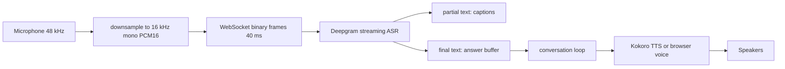

**In Raasta-AI:** `public/worklets/pcm16-downsampler.js` (AudioWorklet; falls back to a `ScriptProcessorNode` after 5 s if worklets don't load, `lib/pcm.js`); STT adapters under `libs/interview/stt/`; TTS client with a 20 s timeout and a per-voice in-memory cache for greeting/closing; analysis of recordings by energy (see M9). **Hygiene problems solved:** echo (interviewer's voice heard again), Whisper inventing "Thank you." on silence, foreign-script junk, repeated decoding loops, "end the interview" requests, refusals. Each has a function and tests in `tests/hiring/interview-conversation.test.js`.

**Viva Q&A.**
* *Why 16 kHz?* Enough bandwidth for speech (up to 8 kHz); standard for ASR; smaller than 48 kHz.
* *What is endpointing?* The recogniser's decision that an utterance ended (300 ms of silence here). The app additionally waits 8 s of silence before treating the *answer* as finished, because people pause to think.
* *How is accent bias handled?* Not measured; `STT_LANGUAGE=en` fixed; the final-summary prompt forbids penalising accent; communication is a minority of the score. Accent-robustness testing is [GAP].

---

## D.10 Computer vision on-device

**Definition.** A *face landmarker* finds ~478 3-D points on a face per video frame; *blendshapes* turn muscle positions into scores (smile, brow down…); head *pose* (yaw/pitch/roll) comes from a transformation matrix.
**Analogy.** A tracker that draws a skeleton on the face; from the skeleton you can tell where someone looks and whether they smile.

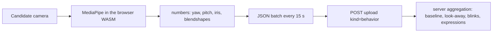

**Why in the browser:** privacy (no image leaves the device for this purpose) and no GPU server. **Calibration:** gaze is measured relative to the candidate's own median posture (webcams are above/below eye level). **Limits:** accuracy depends on camera angle, lighting and the device GPU; expression scores are "approximate (speaking moves the mouth)". The video itself *is* still recorded and uploaded if `recordVideo` is on; "only numbers leave the browser" is true of the *tracking*, not of the recording.

**Viva Q&A.** *"Does eye contact predict job performance?"* No evidence is claimed; it is a weak secondary signal with a 25% share of a 20% component (≈ 5% of the final score by default).

---

## D.11 Email delivery

**Definition.** Sending mail through a provider's API rather than running a mail server. **Transactional email** = triggered by an event (invite), unlike marketing blasts.
**Under the hood.** Your app POSTs `from/to/subject/text/html` to Mailgun with an API key; Mailgun signs with your domain (SPF/DKIM DNS records) and delivers; bounces are reported by webhook/dashboard (not consumed here).

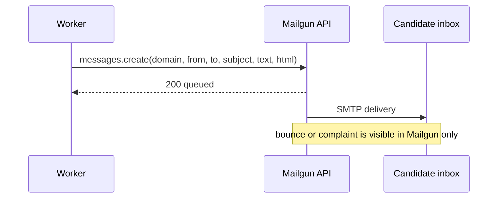

**In Raasta-AI:** `libs/mailgun.js`, `libs/hiring/emails.js` (HTML escaped with `escapeHtml`; `text` alternative included; never contains scores; expiry shown in `EMAIL_TIMEZONE`); development outbox when no key. **Bounces [GAP]:** nothing reads Mailgun delivery events; an invalid address means the interview stays `invited` until it expires. **Viva Q&A:** *Why HTML and text?* Accessibility and spam-score; *what if the email never arrives?* The recruiter sees "Invited 2 h ago, expires in 70 h" and can resend, which rotates the link.

---

## D.12 Background jobs and queues

(Mechanics in [M12](02b2-conceptual-modules-cont.md#m12--background-processing--operations).)

**Definition.** Move slow/retryable work out of the request and into a *worker*, with a *queue* between them.
**Analogy.** A restaurant ticket rail: waiters (web requests) clip tickets; cooks (workers) take them in order; a ticket nobody finishes is re-posted; a ticket that burns three times goes in a "problem" tray (dead-letter).

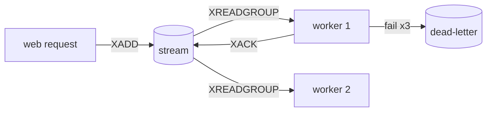

**Viva Q&A.** *At-most-once vs at-least-once?* This is at-least-once: ack after processing; therefore idempotent handlers. *Why not BullMQ?* The sales code already used Redis directly; Streams needed no new package, and the team wrote ~100 lines for retry/DLQ/delay. *Ordering?* Not guaranteed across workers; handlers don't depend on order.

---

## D.13 Concurrency control: locks, idempotency, single-flight

**Definition.** When two things can happen at once, make the result correct anyway. *Idempotent* = doing it twice equals once. *Single-flight* = only one execution at a time.
**Analogy.** Two cashiers closing the same till; a rule "only one may hold the key".

| Mechanism | Example in code |
|---|---|
| DB transaction + advisory lock | apply (duplicates), shortlist, invite, question insert |
| Optimistic conditional update | `applyDecision`: `UPDATE … WHERE id = ? AND status = <status I validated>`; zero rows → 409 "changed in the meantime" |
| Unique/partial unique index | `job_publications_one_inflight`, `posting_runs_one_live` |
| Redis `SET NX PX` lock | analysis, question generation, agent tick, shortlist debounce |
| In-process single-flight flag | `isProcessingAnswer` set before any `await` in the interview loop |
| Compare-and-set claim | `claimNext` for posting-engine runs |
| Dedupe keys | `agent_actions.dedupe_key = shortlist:<candidateId>` |

**Viva Q&A.** *What is a race condition you actually hit?* Two simultaneous `assemble-recording` jobs (audio and video) overwrote each other's status; fixed by writing only own key and computing `recording_status` in one SQL `CASE` (Phase 7 notes). Another: concurrent decisions on the same candidate (conditional update).

---

## D.14 Caching

**Definition.** Keep a copy of expensive-to-get data closer, accepting it may be stale.
**Where used:**

| Cache | Key / store | TTL / invalidation | Fallback |
|---|---|---|---|
| Campaign list | Redis `user:{id}:campaigns:list` | 300 s; deleted on write | DB |
| Campaign leads/data | Redis hashes `campaign:{id}:leads`, `:data` | refreshed on lead add; updated per lead status | DB (`fetchEligibleLeads`) |
| Greeting/closing TTS audio | in-memory `Map`, 50 entries | process lifetime | synthesise again |
| System status | shared reading for 2–3 s (throttle) | time | – |
| Compiled screens | `onDemandEntries` (dev) / production build | 30 min | – |

**Viva Q&A.** *Cache invalidation problem?* Writes delete the key (cache-aside); worst case is a 5-minute stale list. *Why no cache for hiring data?* Volumes are small and freshness matters (status changes).

---

## D.15 Browser automation

**Definition.** Programmatically driving a real browser (Playwright) to do what a person would click.
**Analogy.** A remote-controlled hand on a keyboard.
**Under the hood.** Playwright launches Chromium (headless or visible), loads cookies/localStorage, navigates, finds elements by CSS/text selectors, types, clicks; a *persistent profile* keeps sign-in between runs.

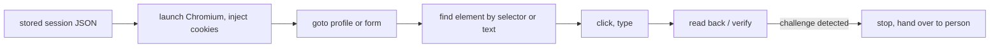

**In Raasta-AI:** LinkedIn/Rozee/Indeed sessions; the *posting engine* adds human-like typing (uneven key gaps, occasional corrected typos, curved mouse path), **read-back verification of each field** (verified/unverified/skipped), step screenshots (account name blacked out), heartbeats, a practice site, and gates for check/sign-in/field/page/confirm/sponsor/account. **Risks:** selector breakage, ToS, account bans; the owner's 2026-10-07 decision allows human-like input and stealth but ranks "visible window with a person" first; Indeed's reaction (block page then a paused employer account, cause unknown) is documented in `docs/ai-hiring/19 §5f`.

**Viva Q&A.** *Is this legal?* Platform terms restrict automation; the project documents the risk and the owner accepts it [Part 6]. *Why not official APIs?* LinkedIn's posting API needs approval; Indeed/Rozee.pk offer no open posting API (`docs/ai-hiring/19 §5e`).

---

## D.16 Rate limiting

**Definition.** Restrict how often something may happen.
**Kinds used here:** (1) *fixed-window counter in Redis* for candidate routes (`rl:interview:{tokenHash}:{route}`: get 120/h, consent 20/h, session 60/h, upload 900/h, event 300/h) that **fails open** if Redis is down (so candidates are never locked out by an outage); (2) *per-account daily quotas* in Postgres with rolling 24 h reset (LinkedIn invites 30, messages 10; Rozee.pk 20/15); (3) *per-platform publish limits* derived from `job_publications` (LinkedIn 3/day & 10 min gap, Rozee.pk 5 & 5, Indeed 3 & 10) plus a 2-minute retry brake and 12-hour agent cool-off after a sign-in check; (4) *per-connection WebSocket* limit of 200 messages/s and 64 KB frames; (5) *AI limits*: engine max 20 sessions.
**Gap:** the public apply endpoint and sign-in/sign-up have **no** rate limiting.

---

## D.17 Testing with injected dependencies

**Definition.** Write code so that effects (clock, network, database, LLM) are *arguments*; in tests pass fakes. **Analogy.** A flight simulator instead of a real plane.

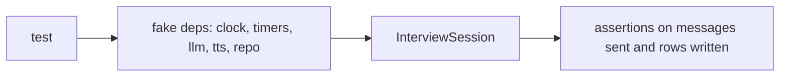

**In Raasta-AI:** `InterviewSession`, `SessionManager`, `finalizeCandidate`, `sendInvite`, `publishToPlatform` accept `deps`; the LLM client can be replaced with `setLlmClient`; time is controlled with `tests/hiring/helpers/fake-clock.js`. 436 Node tests run in ~92 s; **real browser tests** exist for the extension and posting engine (headless Chromium against stand-in pages) and for the Indeed debug recorder. **Not tested:** the Next.js UI components (no React testing library), the real LLM output quality, live platforms, load. Coverage percentage is not measured [GAP].

---

## D.18 Containers, CI/CD and cloud deployment

**Definition.** A **container** packages an app with its dependencies; **CI** runs checks on each change; **CD** deploys automatically; **cloud** = rented machines/services.
**Honest status:**

| Concept | In the repo |
|---|---|
| Container | `services/ai-engine/Dockerfile` (python:3.11-slim, ffmpeg, espeak-ng, `/models` volume, one Uvicorn worker). No other Dockerfile, no Compose [PLANNED, `docs/ai-hiring/15`] |
| CI | none [GAP]. Quality gates are manual: `npm run lint`, `build`, `check:branding`, `test:hiring`, `pytest` (`docs/ai-hiring/17 §5`) |
| CD / cloud | `vercel.json` (build command, Playwright install, 300 s functions, two crons for acceptance checks) suits only the Next.js app; the engine, worker and AI engine need a VM [PLANNED] |
| Config | environment variables only (`.env.local`, `.env.example` lists names) |

**Viva Q&A.** *Where is it deployed?* Not deployed; demonstrated locally (`npm run serve`); see Part 6 for the plan and its gaps.

---

## D.19 Logging and observability

* **Structured JSON logs** in the worker, engine and posting engine (`{service, level, at, ...}`), never containing resume text, transcripts, tokens or emails (CLAUDE.md rule 7; enforced by review and a few tests that grep for leaks).
* **Setup guide + `/api/system/status`:** health of Postgres, Redis, four programs, ffmpeg, env settings; last log lines of programs started from the app.
* **Admin Hiring-queue card:** waiting, in-flight, delayed, worker seen, failed jobs with Retry.
* **Gaps:** no metrics (Prometheus), no tracing, no error tracker (Sentry is only proposed in `SCALABILITY_ANALYSIS.md`), sales code still logs profile URLs and names with `console.log`.
