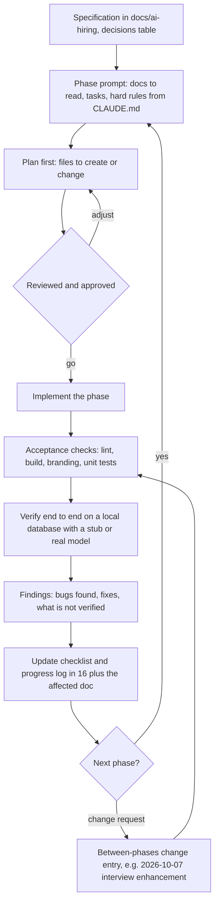
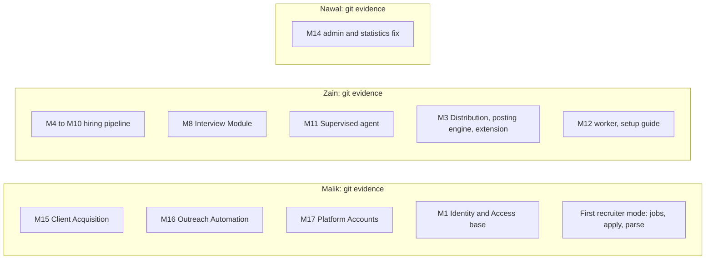
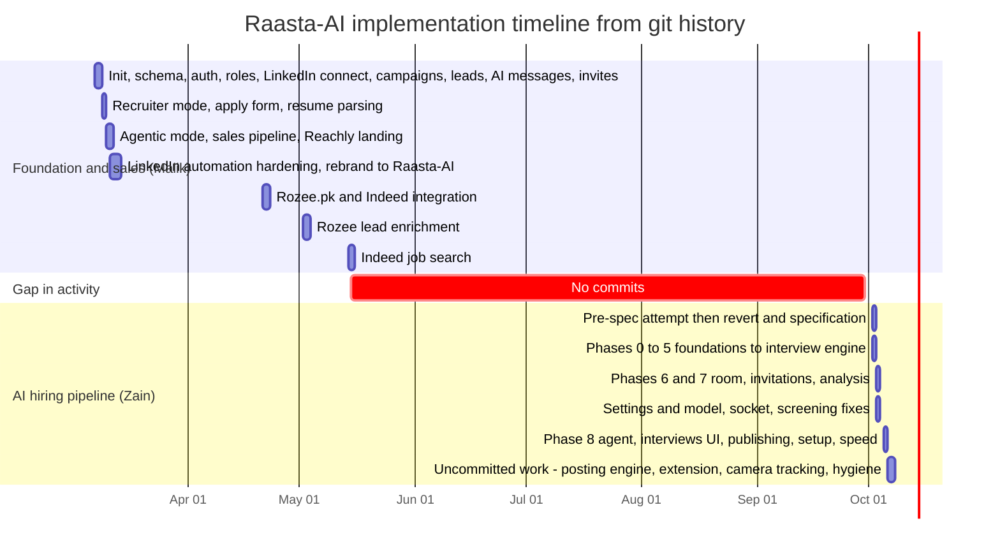

# Part 2E · Development Process

[← Index](README.md) · Previous: [Part 2D](02d-foundational-concepts.md) · Next: [Part 3 · Architecture & data](03-architecture-and-data.md)

> **Rule for this file.** It describes how Raasta-AI was *actually* built, using only evidence in the repository: git history (121 commits, 12 distinct commit days), the commit messages, the specification and progress log in `docs/ai-hiring/`, and the working tree. Where the repository is silent (supervisor meetings, requirements interviews, sprint boards, who wrote the report) the file says **[GAP]** and leaves a table for the team to fill in. A panel will ask; inventing an answer is worse than saying "we kept that outside the repo, here it is."

## Contents

* [E.1 Methodology as practised](#e1-methodology-as-practised)
* [E.2 Requirements gathering](#e2-requirements-gathering)
* [E.3 How the design was reached](#e3-how-the-design-was-reached)
* [E.4 Division of work among the team](#e4-division-of-work-among-the-team)
* [E.5 Version-control workflow](#e5-version-control-workflow)
* [E.6 Testing approach as practised](#e6-testing-approach-as-practised)
* [E.7 Supervisor review checkpoints](#e7-supervisor-review-checkpoints)
* [E.8 Evolution: prototype to now (timeline)](#e8-evolution-from-prototype-to-now)
* [E.9 AI-assisted development: what the repository says](#e9-ai-assisted-development-what-the-repository-says)

---

## E.1 Methodology as practised

There was **no single textbook method**; two different working styles are visible in the history, and the honest summary is that the project moved from the first to the second.

| Period | Style (evidence) | Characteristics |
|---|---|---|
| **Mar–May 2026** (Malik) | *Feature-slice, fix-forward.* Commits like `feat: LinkedIn invite sending workflow with background workers…` followed by 15+ one-line `fix:` commits against LinkedIn's real DOM (`fix: detect connect button without aria-label`, `fix: scope connect search to profile header…`, 2026-03-12). | Build the feature, run against the real platform, patch selectors until it works. No written spec in the repo for this period. Large commits (`a5fcef3`: 78 files, +8,401/−2,700) |
| **Oct 2026** (Zain) | *Specification-first, phase-gated iterative delivery.* A 21-document specification (`docs/ai-hiring/01…21`) was written and committed first (`4426509`), then Phases 0–8 were implemented one at a time, each with **tasks, acceptance checks and a progress-log row** (`docs/ai-hiring/16`). | Plan → implement → run acceptance checks (`lint`, `build`, `check:branding`, `test:hiring`) → verify end to end on a local database → record findings → next phase |

The second style followed a **reset**: on 2026-10-02 an initial, unspecified attempt (`f51fd8e` "shared AI resume parser", `5692c3e` "candidate AI evaluation fields, pipeline stages and activity timeline") was **reverted** 30 minutes later (`08899de` "undo pre-spec hiring changes before phased implementation") and replaced by the specification. That is a good, honest decision story: *we stopped coding, wrote the design, then built to it.*

### The methodology cycle as followed (Oct 2026)

*How to read it:* the loop is the same for all nine phases; the bottom branch shows how later real-world failures (a failed recording, a retired model, a blocked platform) re-enter the loop as numbered "changes between phases" instead of silent edits.

**Evidence of the "findings" step** (progress log): the Phase 5 end-to-end run found that Whisper's final transcripts lag speech, so the silence window was changed to count voice activity; Phase 6 found AudioWorklets never loading in some shells, so a `ScriptProcessor` fallback was added after 5 s; Phase 7 found a concurrent audio/video assembly race; the 2026-10-07 change fixed a real interview that had no recording because the join depended on a service that was not running.

---

## E.2 Requirements gathering

| What the repository shows | What it does not show |
|---|---|
| The FYP report (Overleaf, outside the repo) contains use-case IDs (UC-HR-07…13 are listed as additions in `docs/ai-hiring/18`), functional requirements (FR-HR-10…17), a scope section, user classes (Recruiter, Candidate), figure numbers (Fig 2.1, Fig 2.12) and a testing chapter. | **[GAP]** The SRS itself, any stakeholder interview, survey, recruiter feedback or competitor study. |
| `docs/ai-hiring/18-report-updates.md` lists *non-functional* requirements the implementation targets: next question within 4–5 s, explicit consent, tokens hashed, recordings deletable, prompts exclude protected attributes, communication metrics secondary, resume after a 15-minute disconnect. | **[GAP]** Evidence of who asked for these. |
| `docs/ai-hiring/README.md` "Decisions already made" and "Open questions" (deployment target, Deepgram key, default thresholds, facial emotion in demo) | The answers to the open questions were never filled in the file. |

**What the team should prepare to say:** requirements came from the FYP proposal/SRS agreed with the supervisor; list the actual sources (supervisor feedback sessions, any HR contact, existing-tool review) and add dates in the table in §E.7.

---

## E.3 How the design was reached

1. **Starting point (Mar 2026):** a Next.js 14 + Drizzle + NextAuth template (ShipFast) carrying a LinkedIn-outreach product named *Reachly*; the repo's first commit message says "initialize project with Next.js 14, Tailwind CSS, DaisyUI, Drizzle ORM". The team added a recruiter mode (`jobs`, `candidates`, apply form, LLM resume parsing) in the same style within days (2026-03-09), then an "agentic mode" (`1ec38e6`), and rebranded to Raasta-AI on 2026-03-12 (`4aac84e`).
2. **Observation:** the recruiter flow screened with a naive substring count (`minSkillMatch`), stored no resume file and extracted PDF text with a regex (`docs/ai-hiring/03`). The FYP report promised more (AI screening, an interview module).
3. **Specification (2026-10-02):** `docs/ai-hiring/01…21` were written. Design decisions were recorded as a table (README): in-browser interview room (no Google Meet or meeting bot), Postgres only, Groq via a shared client, Deepgram `nova-3` with Whisper fallback, Kokoro TTS, Redis Streams, S3-compatible storage, rejections need approval unless `autoFinalize`, name "Raasta AI Interviewer".
4. **Port map (`docs/ai-hiring/04`):** which parts of the earlier standalone interview project to keep (rules), rewrite (storage, transport, UI) or drop; the interview-loop rules were written out so they would be preserved.
5. **Iteration by observation:** real runs changed the design: Groq retiring Llama 3.x, the recording failure, Indeed's bot check, Rozee.pk's wizard, the posting engine and extension that followed. See [Part 7](07-implementation-journey.md).

---

## E.4 Division of work among the team

> **Source: git authorship only.** The three people named in the brief are Zain Abbas, Nawal Hassan and Malik Noman Ahmad. In git they appear as *Zain Abbas*, *nawalhasn2738* and *Malik Nouman Ahmed* (the GitHub repository belongs to the `NOMI9797` account). Git cannot show design work, report writing, testing done by hand, UI design, or supervision. Treat the table as a **floor**, not a ceiling, and let each member add what the history cannot show.

| Member | Commits | Lines added / deleted (excl. lockfiles, snapshots, media) | Areas the commits touch (top) | What that adds up to |
|---|---|---|---|---|
| **Malik Nouman Ahmed** | 99 (2026-03-07 → 2026-05-14) | ≈ 51.9 k / 5.2 k | `libs` (LinkedIn/Rozee/Indeed automation, session, rate limits, Redis), `components`, `app/dashboard/{campaigns,workflow,hiring,accounts,agents}`, `app/api/{redis-workflow,linkedin,campaigns,rozee}`, drizzle migrations 0000–0008 | Foundation (project setup, schema, auth, roles, admin panel); the **Client-Acquisition module** (campaigns, leads, scraping, AI messages, invite workflow, acceptance tracking, statistics); first **recruiter workflow** (jobs, AI job post, apply form, LLM resume parsing, agentic mode); **multi-platform** Rozee.pk and Indeed integration; rebrand to Raasta-AI |
| **Zain Abbas** | 22 (2026-10-02 → 2026-10-05) + uncommitted work | ≈ 32.5 k / 3.6 k (of which ≈ 3.9 k test lines and ≈ 2.9 k Markdown) | `libs` (ai, hiring, interview, agent, system), `docs`, `tests`, `services`, `app/api/hiring`, `app/dashboard/recruiter`, `workers/hiring-worker.js`, migrations 0009–0015 | The **AI Hiring Pipeline**: screening, shortlist, question bank, interview engine and room, invitations, analysis and final evaluation, supervised agent, publishing, posting engine, extension, setup guide, performance work, settings screen, 436-test suite, the specification |
| **Nawal Hassan (`nawalhasn2738`)** | 1 (2026-10-02): "Fix admin analytics errors and access" (5 files, +78/−23) on branch `frontend-and-QA` | 78 / 23 | `app/dashboard/statistics`, `app/api/campaigns/{stats,[id]/leads}`, `app/dashboard/admin` | The branch name says *frontend and QA*; the repository holds one committed fix to admin/statistics. **[GAP]** Everything else Nawal contributed (UI design, QA, report, diagrams, testing sessions) must be stated by the team. |

**Panel sentence that is true and safe:** "The sales/client-acquisition module and the platform automation were built first by Malik; the AI hiring pipeline, including integrating the interview module, was built by Zain; Nawal worked on [state it] and the admin analytics fix. We all understand all modules because…" — and then make that last clause true by reading this document.

**Module ownership (as evidenced):**

---

## E.5 Version-control workflow

| Aspect | Evidence |
|---|---|
| Host / remote | GitHub, `origin = https://github.com/NOMI9797/Raasta-Ai_FYP.git` |
| Branches | `main` (last commit `fa594fe`, 2026-05-14), `feature/ai-hiring-pipeline` (Zain; current), `frontend-and-QA` (Nawal; 1 commit, an ancestor of the feature branch), `backup-before-sync` (Zain; local safety branch) |
| Commit convention | Conventional Commits: `feat:`, `fix:`, `chore:`, `refactor:`, `docs:`, `revert:`; phases use `feat(hiring): phase N – name` (prescribed in `docs/ai-hiring/16`) |
| Merging | Merge commits visible (`82689bf`, `cfd5dfc` in March; `194aa50` in October). **The feature branch has not been merged to `main`.** |
| Pull requests / reviews | **[GAP]** not visible in git (no merge-PR messages) |
| Uncommitted work | 134 paths (see inventory §1): the posting engine, extension, Indeed integration, camera tracking, ffmpeg tools, echo/intent filters, Home overview, 15 test files. **Risk:** not in history; commit before the viva |
| Line endings | `.gitattributes` keeps LF for shell scripts (`e0356f7`) |
| Quality gates before merge (documented, manual) | `npm run lint`, `npm run build`, `npm run check:branding`, `npm run test:hiring`, `pytest services/ai-engine/tests`; no secrets in the diff (`docs/ai-hiring/17 §5`) |
| Hard repository rules (CLAUDE.md) | single product identity; legacy source outside the repo and never copied wholesale; schema changes in both `schema.js` and `schema.ts` plus hand-written SQL (never `drizzle-kit generate`); Postgres only; statuses from `statuses.js`; human in the loop for rejections; never log tokens/resumes/keys; one phase at a time; don't touch sales code unless a phase says so; no native dialogs |

---

## E.6 Testing approach as practised

1. **Unit tests per module**, written with the code: formulas, parsers, state machines, policies (436 tests, 42 files, all passing on 2026-10-08).
2. **Dependency injection** so that the interview loop, the manager, the invite service, the final evaluator and the publisher are tested without a network, a database or real time (fake clocks, fake LLM).
3. **Fixtures with made-up people** (`tests/fixtures/`): 10 résumés (3 strong, 3 partial, 2 unrelated, 1 unreadable scanned PDF, 1 duplicate email), a DevOps job, short 16 kHz answer WAVs, a sample recording. No real candidate data in the repo.
4. **Phase end-to-end runs** on a local Postgres/Redis (stub LLM or real) with throw-away users, recorded in the progress log (e.g. Phase 6: 56/56 API checks and 17/17 browser checks; Phase 7: 39/39).
5. **Real-browser tests** (headless Chromium via Playwright) for the extension, the posting engine against practice pages, and the Indeed debug recorder.
6. **Incident-driven tests:** each production-like failure got a regression test (recording join, echo, phantom sentences, decision race, junk follow-ups).
7. **Manual demo script** (`docs/ai-hiring/17 §4`) rehearsal plan.

**What was not done:** UI component tests, load test (3 concurrent interviews planned), coverage measurement, accuracy evaluation of the AI, security testing, any test of the sales module (`tests/hiring` has no sales tests).

---

## E.7 Supervisor review checkpoints

**[GAP] The repository records none.** The supervisor named in the brief is Dr. Isma ul Hassan. Fill this table from your own records before the viva (dates, what was shown, what was decided):

| Date | Checkpoint (proposal, mid-term, demo…) | What was shown | Feedback / decision | Evidence (email, minutes) |
|---|---|---|---|---|
| | | | | |
| | | | | |

Useful facts you *can* tie to the history if a review happened on those days: the 2026-03-12 rebrand to Raasta-AI, the 2026-04-21 multi-platform integration, and the 2026-10-02/05 hiring milestones.

---

## E.8 Evolution from prototype to now

*How to read it:* each bar is a stretch of commit activity (not effort). The red block is a **4.5-month period with no commits** (2026-05-15 → 2026-09-30); the team should be ready to explain what happened then (exams? report writing? supervisor feedback?) since the panel can see the history.

### Major phases in words

| Phase | Dates | What was built | Key commits |
|---|---|---|---|
| 1 · Foundation | 2026-03-07 | Next.js app shell, Drizzle schema, auth (email/password + Google), RBAC, LinkedIn connect by Playwright with daily limits, campaigns with ICP, leads (URL/CSV), Apify scraping, Groq message generation, Redis-queued invite workflow with SSE and pause/resume/cancel, acceptance tracking and statistics, admin panel, role at signup | `54809e5`…`ee86f9a` |
| 2 · Recruiter v1 | 2026-03-09/10 | Job preferences, AI job post, public apply form, LLM resume parsing, recruiter home, agentic mode for recruiter and sales operator | `abdb9cd`, `9211ae6`, `9ca39c0`, `1ec38e6` |
| 3 · Hardening and rebrand | 2026-03-11/13 | Agent pipelines with real LinkedIn automation, shared accounts, Redis TLS fixes, many selector fixes, rebrand Reachly → Raasta-AI, optional Playwright post scraper | `fd86b3c`, `59442f2`, `4aac84e`, `2c86570` |
| 4 · Multi-platform | 2026-04-21 → 05-14 | Rozee.pk and Indeed sources for campaigns, lead scraper, Rozee enrichment and tiering, Indeed job search | `a5fcef3`, `591872b`, `fa594fe` |
| 5 · AI hiring pipeline | 2026-10-02 → 10-05 | Phases 0–8 (see Part 7) | `d18727d`…`a11db5f` |
| 6 · Real-world hardening (uncommitted) | 2026-10-06 → 10-08 | Interview hygiene (echo guard, STT cleaning, intent), ffmpeg recording join, camera behaviour tracking, Indeed/Rozee posting engine, browser extension, Home overview, dialogs | working tree |

### The interview-module integration in the timeline

The interview module's logic came from an earlier standalone interview project and was re-implemented inside Raasta-AI in **Phases 3–7** between 2026-10-02 and 2026-10-03 (question bank, Python AI engine, interview engine, room and invitations, analysis and final evaluation) and then extended on 2026-10-07 (hygiene fixes and camera behaviour). The full account (starting state, debranding, architecture changes, problems, current status) is in [Part 7 §7.3](07-implementation-journey.md#73-the-interview-module-integration).

---

## E.9 AI-assisted development: what the repository says

The repository itself documents the way the hiring pipeline was produced, so it belongs in an honest account:

* `CLAUDE.md` (project instructions for the Claude Code assistant) and `docs/ai-hiring/README.md` "How to work with Claude Code" prescribe: one phase per session, **plan first and wait for approval**, restate the hard rules, finish with changed files and how to test, and a human runs the acceptance checks.
* `docs/ai-hiring/16-phases-and-prompts.md` contains the **phase prompts** used.
* Phases 0–5 were committed within about 5.5 hours on 2026-10-02 (16:22–21:45); phases 6–7 on 2026-10-03.
* Quality controls that make this defensible: a written specification before coding, a branding/identity check script, 436 passing tests, acceptance criteria, an explicit list of what was *not* verified live, and recorded findings.

**How to answer "Did you write this yourselves?"** (full model answer in [Part 8](08a-panel-questions.md)): "The architecture, requirements, decisions, specification, acceptance criteria and review were ours; we used an AI coding assistant to implement phases from that specification, as our own repository documents. We can explain every module, we found and fixed real defects the tooling did not, and the tests and live runs are the evidence." Each member must be able to walk through at least their own modules at code level.
