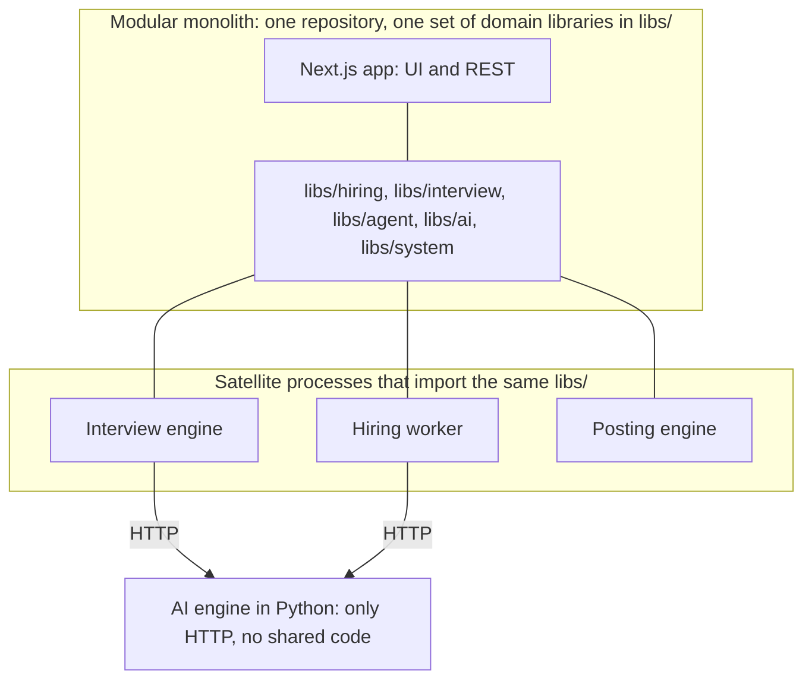
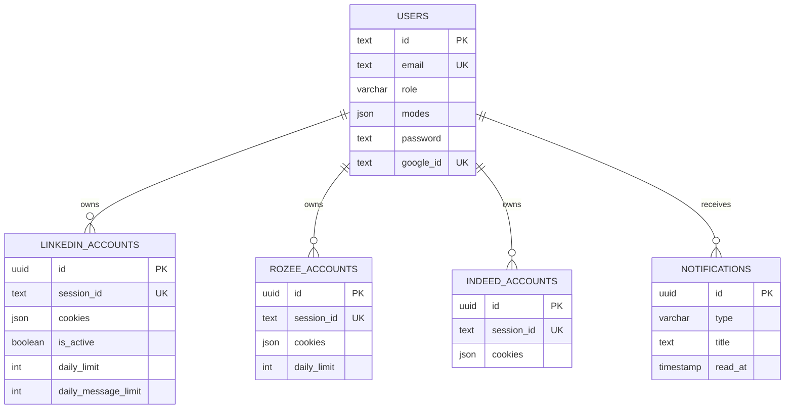
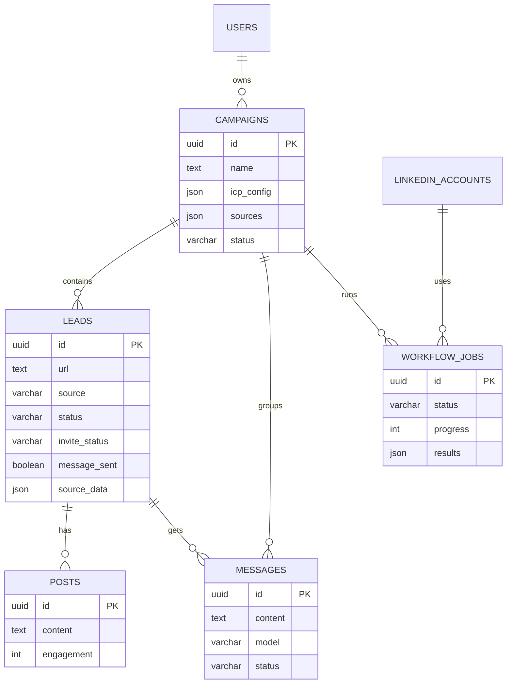
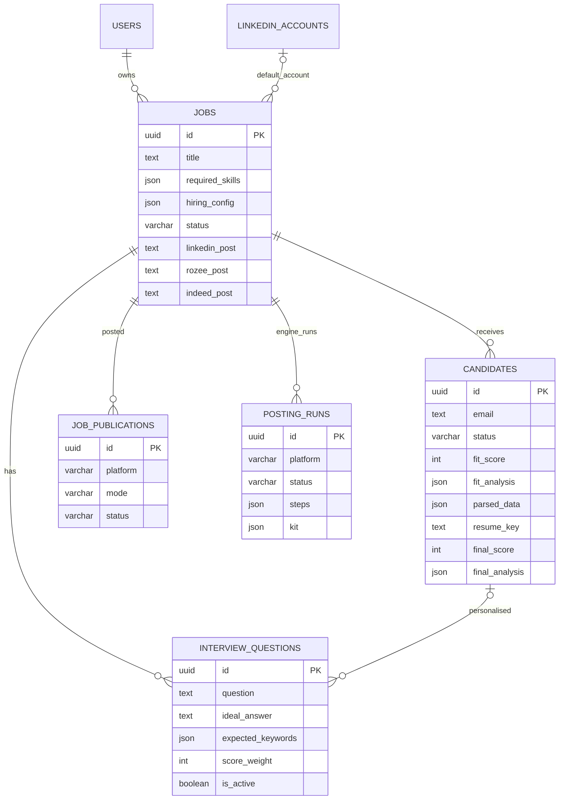
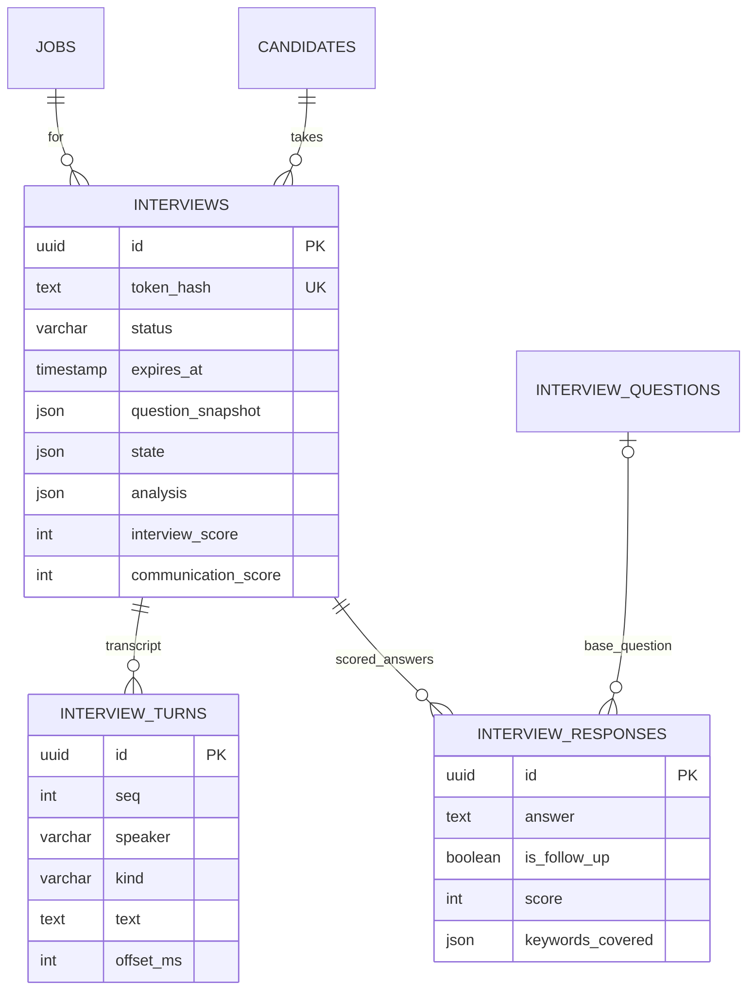
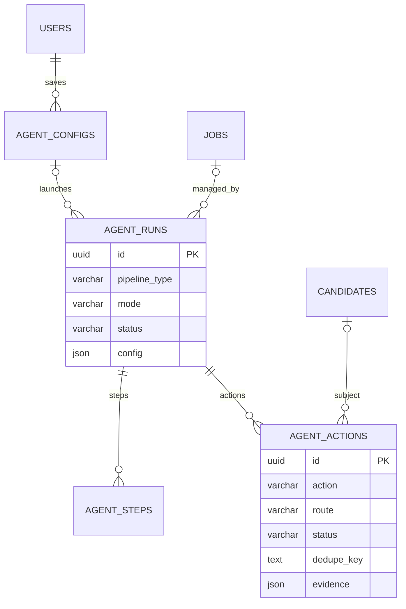

# Part 3 · Architecture & Data

[← Index](README.md) · Previous: [Part 2E](02e-development-process.md) · Next: [Part 4A · Functionality: intake & screening](04a-functionality-intake-screening.md)

## Contents

1. [Architectural style and justification](#1-architectural-style-and-justification)
2. [Repository and folder structure](#2-repository-and-folder-structure)
3. [Complete data model](#3-complete-data-model)
4. [Data lifecycle and protection of personal data](#4-data-lifecycle-and-protection-of-personal-data)
5. [External integrations](#5-external-integrations)

---

## 1. Architectural style and justification

### 1.1 The style in one sentence

**A modular monolith (Next.js + shared domain libraries) with four satellite processes, joined by a Redis-Streams job queue and a WebSocket, using a Postgres database as the only source of truth and a status-machine (workflow) to orchestrate the recruiting pipeline.**



*How to read it:* three Node programs reuse the exact same business code as the web app (this is why the repo rule says libraries must use relative imports, not `@/`, so `tsx` can run them). The Python service is the only truly separate codebase.

### 1.2 Why this style, and what was rejected

| Option | Why it was **rejected** (or accepted) | Recorded? |
|---|---|---|
| **Single Next.js app only (serverless)** | Rejected for interviews and background work: route handlers can't hold WebSockets, per-session timers or a streaming STT connection; Vercel caps functions at 300 s (`vercel.json`) | **Recorded** (`docs/ai-hiring/02`: "Why separate") |
| **Full microservices (one service per module)** | Rejected: a three-person FYP cannot operate 10+ services; the modules share one schema and change together | Reconstructed |
| **Modular monolith + a few specialised processes** | **Accepted:** keeps one deploy for CRUD/UI, isolates only what needs a different runtime (long-lived sockets, Python models, a visible browser) | Recorded in `docs/ai-hiring/02` ("Processes" table) |
| **Do everything in Python (e.g. FastAPI)** | Rejected: the existing app and team skill is JavaScript; only the model-heavy parts need Python | Reconstructed |
| **Queue = BullMQ / RabbitMQ / SQS** | Redis Streams chosen: Redis already in the stack, consumer groups + ack + reclaim are enough; the sales code already used Redis directly | Recorded (`README` decisions) |
| **DB-polling instead of a queue** | Rejected: latency and load, no consumer groups | Reconstructed |
| **Meeting bot / Google Meet for interviews** | Rejected: third-party dependency and cost; chosen: **in-browser room** (decision table) | Recorded |
| **Event sourcing / CQRS** | Not needed: simple status column + audit JSON | Reconstructed |

### 1.3 Patterns used (each is visible in the code)

| Pattern | Where | Why |
|---|---|---|
| **Layered by responsibility** | route handler (thin) → `libs/*` (domain) → `db`/`storage`/`llm` (infrastructure) | Handlers stay small; domain code is reusable by routes, worker and engine |
| **State machine / workflow** | `libs/hiring/statuses.js` (candidate), `INTERVIEW_STATUS`, `InterviewSession.stage`, `RUN_STATUS`, `STEP_STATUS` | Makes legal moves explicit and testable |
| **Adapter** | `libs/platforms/*` (platform), `libs/hiring/storage.js` (local/S3), `libs/interview/stt/*` (Deepgram/Whisper) | Swap or add a provider without touching callers |
| **Dependency injection** | `deps` parameters in the interview loop, manager, invitations, finalize, publishing | Unit tests without network/time |
| **Policy as pure functions** | `libs/agent/policy.js`, `final-evaluator.js`, `shortlist.decideShortlist` | Rules are readable, testable and demonstrable |
| **Producer/consumer queue with idempotent handlers** | `queue.js` + `hiring-worker.js` | Reliability under retries |
| **Optimistic concurrency** | `applyDecision` conditional update | No lost updates without long locks |
| **Graceful degradation** | fallbacks for LLM, TTS, STT, ffmpeg, Redis | The interview or pipeline continues, flagged |
| **Capability URL** | interview token, signed file token | Access without accounts |
| **Strangler / coexistence** | New hiring agent beside the old `AgentRunner` (sales); `libs/agent-pipelines/recruiter.js` replaced by `libs/agent/` | Replace without breaking sales |

### 1.4 Trade-offs accepted

* **One shared database schema** couples modules (a column rename touches several). Benefit: transactions across modules.
* **Satellite processes share code by path**, so they must be deployed from the same repository version.
* **The interview engine is stateful and single-instance.** Simpler than distributed session storage; caps concurrency (default 20 sessions) and means an engine restart interrupts live interviews (they resume).
* **Two LLM clients** exist (`libs/ai/llm.js` and `libs/groq-service.js`), a consequence of the sales code predating the hiring layer.
* **Two schema files** (`schema.js` + `schema.ts`) must be kept identical manually (CLAUDE.md rule 3).

---

## 2. Repository and folder structure

```text
Raasta-Ai_FYP/
├─ app/                      Next.js App Router: pages and API routes
│  ├─ api/                   167 route handlers (see 00-inventory §5)
│  ├─ dashboard/             authenticated UI: recruiter, sales, agents, accounts, admin, analytics, settings
│  ├─ interview/[token]/     PUBLIC candidate interview room (components + browser libs)
│  ├─ apply/[jobId]/         PUBLIC application form
│  ├─ blog/, privacy-policy/, tos/, signin/, signup/, forgot-password/, onboarding/   public/auth pages
│  └─ layout.js, page.js, error.js, not-found.js, globals.css
├─ components/               shared UI: layout (Sidebar, TopBar, NotificationBell), system (Setup guide hooks), ui (DialogProvider), landing sections
├─ libs/                     ALL domain logic and infrastructure clients
│  ├─ ai/                    llm.js (Groq client) and prompts/ (resume, fit, questions, interview, final)
│  ├─ hiring/                config, statuses, fit-scorer, shortlist, invitations, emails, finalize, final-evaluator, decisions,
│  │                         analytics, interview-views, platform-content, publishing, posting-kit, queue, queue-admin, storage,
│  │                         resume-text, rate-limit, screening-queue, shortlist-hooks
│  ├─ interview/             session-engine, answer-analyzer/scorer, follow-up, question-generator/bank, repository, tokens,
│  │                         public-access, analysis, media-tools, voice-metrics, behavior, echo-guard, intent, events,
│  │                         tts-client, mappers, analysis-client, stt/{deepgram,whisper-chunked,clean,index}
│  ├─ agent/                 supervised hiring agent: policy, recruiter-agent, actions, runs, triggers, launch, run-summary, config-validation
│  ├─ agent-pipelines/       sales-operator.js (generic AgentRunner pipeline)
│  ├─ platforms/             adapter layer: index, meta, linkedin, rozee, indeed
│  ├─ poster/                posting engine: engine, runner, flows (indeed, rozee), human typing, page tools, runs store, shots, practice sites
│  ├─ system/                setup guide backend: services, status, supervisor, worker-host, guidance, features, dev-warmup, access, paths
│  ├─ dashboard/             overview.js (Home numbers)
│  ├─ linkedin-*.js, rozee-*.js, indeed-*.js   platform automation, sessions, validators, scrapers, publishers
│  ├─ rate-limit-manager.js, lead-*.js, groq-service.js, scraping-utils.js, redis*.js, db.ts, schema.{js,ts}, next-auth.js, auth-middleware.js, notifications.js, mailgun.js, stripe.js, seo.js, api.js, gpt.js, mongoose.js (stub), load-env.js, platform-urls.js, playwright-utils.js
├─ services/                 long-running programs
│  ├─ interview-engine/      index.js, session-manager.js, deps.js          (Node, WebSocket)
│  ├─ ai-engine/             main.py, routers/, core/, tests/, Dockerfile    (Python, FastAPI)
│  └─ poster-engine/         index.js                                        (Node + Playwright)
├─ workers/                  hiring-worker.js (queue consumer), workflow-worker.js (sales one-shot)
├─ extensions/raasta-poster/ browser extension (Manifest V3): bridge, panel, lib/{fill,kit}
├─ drizzle/                  SQL migrations 0000–0015 (+ meta snapshots up to 0003 and journal up to 0007)
├─ tests/                    hiring/*.test.js (42 files), fixtures/ (resumes, jobs, answers, recording)
├─ scripts/                  check-branding.sh, serve.js, sync-mediapipe.js, interview-test-client.js, update-daily-limits*.js
├─ public/                   worklets/pcm16-downsampler.js; (git-ignored) mediapipe/ synced assets
├─ docs/ai-hiring/           the 21-document specification + progress log; docs/fyp-documentation/ = this set
├─ instrumentation.js, instrumentation-node.js   start the embedded worker with the web server
├─ config.js, next.config.js, tailwind.config.js, postcss.config.js, jsconfig.json, drizzle.config.ts, vercel.json, next-sitemap.config.js, .eslintrc.json, package.json
├─ CLAUDE.md                 project rules; README.md (ShipFast boilerplate); LINKEDIN_INTEGRATION.md, OPTIMISTIC_UI_EXAMPLE.md, SCALABILITY_ANALYSIS.md (older notes)
├─ debug-enrichment/         two screenshots from Rozee enrichment debugging (tracked)
├─ test-prefetch.js          manual script that calls the Redis pre-fetch API (uses node-fetch which is not a dependency)
└─ (git-ignored runtime) .next/, .next-prod/, .runtime/ (logs, pids, poster profiles, shots), .storage/ (local object store + dev outbox), debug-indeed/, debug-recruiter-posts/, linkedin-browser-profiles/
```

### 2.1 Folder responsibilities (table form for revision)

| Folder | Responsibility | Part that explains it |
|---|---|---|
| `app/api/hiring` | Recruiter REST API (ownership-filtered) | 4a–4d |
| `app/api/interview` | Token-authenticated candidate API | 4b |
| `app/api/{campaigns,leads,messages,scrape,redis-workflow,jobs,rozee,linkedin}` | Sales/outreach APIs | 4e |
| `app/api/{agents,admin,system,user,auth,notifications,dashboard,files,stripe,webhook}` | Agent, admin, ops, identity, files, billing | 4c, 4f |
| `app/dashboard/recruiter` | Recruiter UI | 4a–4d |
| `app/dashboard/{campaigns,sales,workflow,agents}` | Sales UI | 4e |
| `app/interview/[token]` | Candidate room | 4b |
| `libs/ai` | LLM client + prompts | 5 |
| `libs/hiring`, `libs/interview`, `libs/agent` | Hiring domain | 4a–4c |
| `libs/system` | Programs, status, supervisor | 4f |
| `libs/poster`, `extensions/raasta-poster` | Supervised posting | 4d |
| `libs/platforms`, `libs/{linkedin,rozee,indeed}-*.js` | Platform adapters and automation | 4d, 4e |
| `services/interview-engine` | Live interview server | 4b |
| `services/ai-engine` | Python analysis/TTS | 4c, 5 |
| `workers` | Queue worker; sales one-shot worker | 4f, 4e |
| `drizzle`, `libs/schema.*`, `libs/db.ts` | Data layer | this Part |
| `tests`, `scripts` | Verification and tooling | 6, 4f |
| `docs` | Specification, progress, this documentation | – |

---

## 3. Complete data model

> **Conventions.** PK = primary key; FK = foreign key (`cascade` unless stated); `uuid` default `random`; `ts` = `timestamp` (no time zone, written by the app as UTC); JSON columns are `json` (not `jsonb`). Source: `libs/schema.ts`. The two schema files are identical in structure (they differ only in comments).

### 3.1 ER diagrams (split by domain)

**ER-1 Identity, accounts, notifications**



**ER-2 Client acquisition**



**ER-3 Hiring core and publishing**



**ER-4 Interview**



**ER-5 Agents**



*How to read the ER diagrams:* `||--o{` means "one to many"; `|o--o{` means "zero-or-one to many" (the child may have no parent). Only key columns are drawn; the tables below list all columns. Every table except `users` has `user_id` pointing to `users` with cascade delete (ownership), which is the basis of multi-user isolation.

### 3.2 Table specifications

#### `users`
| Column | Type | Constraints / default | Notes |
|---|---|---|---|
| id | text | PK | Google `sub` or `nanoid()` |
| email | text | NOT NULL, UNIQUE | compared with `lower(email)` in code |
| name, image | text | | |
| password | text | nullable | bcrypt hash (cost 12); null for Google-only accounts |
| google_id | text | UNIQUE | |
| role | varchar(20) | NOT NULL, default `sales_operator` | `admin` / `sales_operator` / `recruiter` |
| modes | json | default `[]` | `["recruiter","sales"]` |
| stripe_customer_id | text | | unused (webhook is a no-op) |
| subscription_status | varchar(20) | default `free` | shown in admin list only |
| created_at, updated_at | timestamp | NOT NULL default now | |

*Why modelled this way:* text PK because OAuth ids are strings; `modes` as JSON because it is a small set that only drives navigation; role kept separately because it gates privileged routes.

#### `campaigns`, `leads`, `posts`, `messages`, `workflow_jobs` (client acquisition)
| Table | Columns (type, notes) |
|---|---|
| **campaigns** | id uuid PK; user_id → users; name text NOT NULL; description text; **icp_config json** `{targetRole, industry, serviceType}`; **sources json** default `["linkedin"]` (`linkedin`, `rozee`); status varchar(20) default `draft` (`draft/active/completed`, derived on read); timestamps |
| **leads** | id; user_id; campaign_id → campaigns; **url text NOT NULL**; name, title, company; status varchar(20) default `pending` (`pending/completed/error`); **source** varchar(20) default `linkedin` (`linkedin/rozee/indeed`); **source_data json** (Rozee skills, salary, `conversion` block); profile_picture; posts json; **invite_sent** bool; **invite_status** varchar(20) default `pending` (`pending/sent/accepted/rejected/failed`); invite_retry_count; invite_sent_at; invite_accepted_at; last_connection_check_at; **message_sent** bool; message_sent_at; message_error; added_at; timestamps |
| **posts** | id; user_id; lead_id → leads; content text NOT NULL; timestamp NOT NULL; likes, comments, shares, engagement ints; timestamps |
| **messages** | id; user_id; lead_id; campaign_id; content text NOT NULL; **model** varchar(50) default `llama-3.1-8b-instant`; custom_prompt; posts_analyzed int default 3; source varchar(20) default `linkedin`; **status** varchar(20) default `draft` (`draft/sent/scheduled`); sent_at; timestamps |
| **workflow_jobs** | id; campaign_id; user_id; account_id → linkedin_accounts; status varchar(20) default `queued` (`queued/processing/paused/cancelled/completed/failed/timeout`); progress int 0–100; total_leads; processed_leads; results json; error_message; custom_message; created_at; started_at; completed_at; paused_at; resumed_at; pause_count |

*Design notes:* duplicates per lead URL are prevented in code across all of the user's campaigns (no unique index). `leads` mixes LinkedIn profile leads and Rozee/Indeed company-job leads through `source` + `source_data` to avoid separate tables (trade-off: nullable columns and untyped JSON).

#### `linkedin_accounts`, `rozee_accounts`, `indeed_accounts` (platform sessions)
| Column | Notes |
|---|---|
| id uuid PK; user_id; **session_id text UNIQUE**; email text NOT NULL; user_name; profile_image_url | identity of the connected account |
| **cookies json NOT NULL; local_storage json; session_storage json** | the captured browser session, **plain JSON** |
| is_active bool default false; tags json | switch + labels |
| LinkedIn only: connection_invites, follow_up_messages ints; sales_nav_active bool; **daily_invites_sent, daily_limit (default 30), last_daily_reset**; **daily_connection_checks, last_connection_check_reset**; **daily_messages_sent, daily_message_limit (default 10), last_message_reset** | counters with rolling 24 h reset |
| Rozee only: daily_invites_sent, daily_limit (20), daily_messages_sent, daily_message_limit (15), resets | |
| Indeed: no counters (hiring only; limits come from `job_publications`) | |
| last_used, created_at, updated_at | |

#### `jobs`
| Column | Type / default | Notes |
|---|---|---|
| id | uuid PK | |
| user_id | text → users NOT NULL | owner |
| linkedin_account_id | uuid → linkedin_accounts, `set null` | preferred account |
| title | text NOT NULL | |
| required_skills, tech_stack | json | string arrays |
| experience_range | varchar(50) | free text such as "2-4 years" |
| salary_min, salary_max | int; salary_currency varchar(10) default `USD` | |
| location text; location_type varchar(20) | remote / onsite / hybrid | |
| employment_type varchar(20) | full-time / part-time / contract | |
| linkedin_post, rozee_post, indeed_post | text | AI-written/edited posts, one per platform |
| formal_description | text | the JD if set; **no UI sets it** |
| linkedin_post_url, rozee_post_url, indeed_post_url | text | |
| rozee_account_id, indeed_account_id | uuid | FKs exist in SQL (0007, 0014), not declared in the Drizzle schema |
| rozee_published_at, indeed_published_at, published_at | timestamp | |
| **hiring_config** | json | per-job automation settings (defaults in code) |
| status | varchar(20) default `draft` | draft / published / closed |
| created_at, updated_at | | |
| **Index** | `jobs_user_created_idx (user_id, created_at)` | the recruiter's job list |

#### `candidates`
| Column | Type / default | Notes |
|---|---|---|
| id | uuid PK | |
| job_id | uuid → jobs NOT NULL | |
| user_id | text → users NOT NULL | the recruiter owning the job (denormalised for filtering) |
| name text NOT NULL; email text NOT NULL; linkedin_url; cover_note | | email lower-cased on insert |
| resume_url | text | **original filename for display** (older rows: `uploaded:<name>`) |
| **resume_key** | text | storage key of the original file |
| **parsed_data** | json | LLM output + `_resumeText` (first 10,000 chars) or `{parseError}` |
| source varchar(20) default `linkedin`; source_data json | `linkedin/rozee/indeed/direct` (note: the apply route does not set it, so public applications keep the default `linkedin` [PARTIAL]) |
| **status** | varchar(30) NOT NULL default `new` | see state machine (30 chars because `interview_in_progress` is 21) |
| **fit_score** int; **fit_analysis** json; **screened_at** ts | stage 1 result | |
| **final_score** int; **final_analysis** json; final_decided_at ts; decided_by text | stage 2 result; `decided_by` = user id or `system` | |
| applied_at, updated_at | | |
| **Indexes** | `candidates_job_status_idx (job_id, status)`; `candidates_user_applied_idx (user_id, applied_at)` | pipeline/worker/list queries |
| **Missing** | UNIQUE (job_id, lower(email)) | enforced in code under an advisory lock |

#### `interview_questions`
| Column | Notes |
|---|---|
| id uuid PK; user_id; job_id (cascade); **candidate_id** nullable (null = job-wide; set = personalised) | |
| question text NOT NULL; category varchar(20) default `technical` (`technical/role/behavioral`); difficulty varchar(10) default `medium` | |
| **ideal_answer** text NOT NULL; **expected_keywords** json default `[]`; **score_weight** int default 1 (1–5; generated 1–3) | the scoring rubric |
| order_index int default 0; source varchar(10) default `ai` (`ai/manual`); is_active bool default true | soft delete flag |
| **Index** `interview_questions_job_idx (job_id, is_active)` | |

#### `interviews`
| Column | Notes |
|---|---|
| id; user_id (job owner); job_id; candidate_id | |
| **status** varchar(20) default `invited` | `invited/opened/in_progress/completed/abandoned/expired/failed/cancelled` |
| **token_hash** text NOT NULL **UNIQUE** | SHA-256 of the raw token |
| expires_at NOT NULL; invited_at; reminder_sent_at; opened_at; consent_at; started_at; ended_at; last_activity_at; duration_sec | life-cycle timestamps |
| **question_snapshot** json | frozen questions |
| **state** json | live session snapshot for resume (see 3.3) |
| client_info json | `{ua, devices:{mic,cam}}` |
| **integrity_events** json default `[]` | `[{type, at}]` (capped at 200) |
| recording_audio_key, recording_video_key text; **recording_status** varchar(20) default `none` | `none/uploading/complete/failed/deleted` |
| total_questions, total_answers, follow_up_count ints; **interview_score**, **communication_score** ints | |
| **analysis** json; **analysis_status** varchar(20) default `pending` | `pending/processing/complete/failed/skipped` |
| error_message text | e.g. `invite_email_failed: …`, `recording_failed: …`, `analysis_failed: …` |
| **Indexes** | `(candidate_id)`, `(job_id, status)`, `(user_id, status)` |
| **Missing** | a partial unique index "one active interview per candidate" (code-enforced) |

#### `interview_turns`
`id; interview_id (cascade); seq int NOT NULL; speaker (ai/candidate); kind (greeting/question/follow_up/answer/closing/system); question_id text (base uuid or `fu-…`); text NOT NULL; started_at NOT NULL; ended_at; offset_ms` · **UNIQUE (interview_id, seq)** ensures ordered, replay-safe transcript (`onConflictDoNothing`). `offset_ms` = time since recording start excluding disconnected time, used for video seek and segment windows.

#### `interview_responses`
`id; interview_id (cascade); question_id → interview_questions (set null); question_text NOT NULL (denormalised so history survives edits); answer NOT NULL; is_follow_up bool; follow_up_depth int; follow_up_reason varchar(30); score int; score_reasoning text; keywords_covered, keywords_missed json; scored_at; answered_at NOT NULL; created_at` · index `(interview_id)`. Follow-ups point at their **base** question id.

#### `agent_configs`, `agent_runs`, `agent_steps`, `agent_actions`
| Table | Columns |
|---|---|
| **agent_configs** | id; user_id; pipeline_type varchar(30) (`recruiter` / `sales_operator`); name; mode varchar(20) default `semi_auto` (recruiter: `assisted/autopilot`); config json NOT NULL; is_active; timestamps |
| **agent_runs** | id; agent_config_id (set null); user_id; pipeline_type; **job_id** → jobs (set null) (recruiter runs); mode; **status** varchar(30) default `queued`; current_step varchar(50); total_steps; **config json** (snapshot); results json; error_message; started_at; completed_at; created_at; indexes `(job_id, status)`, `(user_id, created_at)` |
| **agent_steps** | id; agent_run_id (cascade); step_key varchar(50); step_index; status varchar(30) default `pending`; input, output json; started_at; completed_at; index `(agent_run_id, step_index)` |
| **agent_actions** | id; agent_run_id; user_id; job_id; candidate_id; **action** varchar(40); **route** (`auto/ask/human`); **status** (`pending/approved/rejected/executed/failed/superseded`); blocking bool; summary NOT NULL; payload, **evidence**, escalations json; result json; **dedupe_key** text; decided_by (user id or `agent`); decided_at; decision_note; executed_at; timestamps; indexes `(agent_run_id, created_at)`, `(user_id, status)`, `(dedupe_key)` |

#### `job_publications`, `posting_runs`, `notifications`
| Table | Columns |
|---|---|
| **job_publications** | id; job_id; user_id; platform varchar(20); account_id uuid; **mode** (`auto/handoff/engine`); **status** (`publishing/published/failed/needs_login/handed_off/unconfirmed`); initiated_by (`user/agent`); content text; post_url; error; created_at; updated_at; completed_at; indexes `(job_id, platform, created_at)`, `(account_id, created_at)`; **partial UNIQUE (job_id, platform) WHERE status = 'publishing'** |
| **posting_runs** | id; job_id; user_id; platform; mode (`rehearsal/post/practice`); status (`queued/running/needs_you/awaiting_confirm/published/rehearsed/failed/cancelled`); **gate json** `{kind, message, since}`; **steps json** (timeline with per-field `verified/unverified/skipped`); **kit json NOT NULL** (job text, never credentials); outcome json; cancel_requested bool; engine_id; **heartbeat_at**; created_at; updated_at; started_at; completed_at; indexes `(job_id, platform, created_at)`, `(status, created_at)`; **partial UNIQUE (job_id, platform) WHERE status IN (queued, running, needs_you, awaiting_confirm)** |
| **notifications** | id; user_id; type varchar(40); title NOT NULL; body; link; read_at; created_at; index `(user_id, created_at)` |

### 3.3 Shapes of the important JSON columns

| Column | Shape (from the code that writes it) |
|---|---|
| `candidates.parsed_data` | `{name, location, email, phone, github, linkedin, summary, skills[], skillsByCategory{languages,frontend,backend,databases,tools,other}, yearsExperience, jobTitles[], experience[{title,company,period,bullets[]}], projects[{name,description,technologies[]}], education[{degree,institution,period}], availability, strengths[], _resumeText}` or `{parseError, _resumeText?}` |
| `candidates.fit_analysis` | `{fitScore, skillMatch{matched[], missing[], extra[], unverified[]?}, experienceMatch{required, candidateYears, verdict: meets/below/above/unknown}, educationMatch{verdict, note}, strengths[≤5], concerns[≤5], rationale(≤800 chars), manualReview?, model, version:1}` plus transient `queuedAt`, `error`, `failedAt` |
| `candidates.final_analysis` | `{recommendation: strong_yes/yes/maybe/no, summary, strengths[], risks[], suggestedNextSteps[], suggestedDecision, breakdown{resume, interview, communication, weights, finalWeights, threshold}, communication{score, components{pace,fluency,eyeContact,composure}, weights, sources}, answered, totalQuestions, interviewId, computedAt, version:1, fallback?, decision?{decision,by,at,note}, outcomeEmail?{outcome,sentAt}}` |
| `interviews.analysis` | `{voice{source,estimated?,wpm,pauseRatio,pauseCount,longPauses,longestPauseSec,fillerPerMin,fillerTop[],jitter,shimmer,pitchMean,durationSec,hasTranscript}, voiceSegments[], emotion{dominant,distribution,confidenceAvg}, emotionSegments[], gaze{eyeContactScore,attentionScore,lookAwayCount,longestLookAwaySec,faceDetectionRate,scope,source: camera/video}, gazeTimeline[], behavior{…}, face{…}, integrity{tabHiddenCount,tabHiddenSec,micMutedCount,offlineCount}, media: ok/partial/missing, segments, errors{}, version:2, analysedAt}` |
| `interviews.state` | `{stage, hasGreeted, begun, questionQueue[], questionsAsked[], questionsAnswered[], currentQuestionId/Text/BaseQuestionId/Kind, followUpDepth, followUpContext, lastAnswerAt, startedAt, pausedMs, questionIndex, totalQuestions, seq, skipped[], warningsSent[], history[], recentAnswers[], repeatCount, timeUpAt, endedByCandidate, pausedAt, savedAt}` (never persists a half answer) |
| `interviews.question_snapshot` | `[{id, candidateId, question, category, difficulty, idealAnswer, expectedKeywords[], scoreWeight}]` |
| `jobs.hiring_config` | the keys listed in M2 (`autoScreen … sendOutcomeEmails`, `finalWeights{resume,interview,communication}`) |
| `leads.source_data.conversion` | `{version, tier, score, signals{…}, personalizationMode, enrichment{enrichedAt, jobDescription≤8000, descriptionExcerpt≤1400, skillsFromJob, companyResearch, evidence{…}}, outreach{canEmail, emailsFound[], socialLinks[], externalLinks[], primaryChannel, note}}` |
| `posting_runs.kit` | the posting kit built by `libs/hiring/posting-kit.js`: `fields[{key,label,value}]`, `platform`, `options` (e.g. `practiceCheck`), `expiresAt` |

### 3.4 Why the model looks like this (design decisions)

| Decision | Alternatives | Why this | Trade-off |
|---|---|---|---|
| **One `candidates` row per application** (job_id + email) | Global `people` table + `applications` | Simplest; ownership filter by job; the same email applying to two jobs is two rows | Duplicated personal data across jobs; no cross-job history |
| **Status as a string column + code-side transitions** | DB enum / separate status-history table | Easy to extend (`varchar(30)`); one source of truth in `statuses.js` | No DB-level guard; no history table (only `final_analysis.decision` for the last decision) [PARTIAL] |
| **JSON for AI outputs** (`fit_analysis`, `analysis`, `final_analysis`) | Normalised tables per metric | Output shapes evolve (`version` field); recruiters view them whole | Hard to query across candidates by a sub-metric |
| **Separate `interviews` from `candidates`** | Interview columns on candidates | A candidate can be re-invited (many rows over time); each has its own token, recording and score | Joins; "latest interview" via `DISTINCT ON` |
| **`interview_turns` + `interview_responses`** | one table | Turns = full transcript incl. AI speech and timings; responses = scoring unit. Different shapes and indexes | Two writes per answer |
| **Question snapshot in the interview** | Join live questions | Edits can't alter a started interview | Duplicated text |
| **Store only token hashes** | Store tokens | DB leak ≠ link leak | Reminders must rotate tokens |
| **Platform sessions in dedicated tables** | in `users` JSON | Per-platform counters and activity; many accounts per user | Sensitive data (cookies) in plain JSON [GAP] |
| **Publication attempts as rows** (`job_publications`) | boolean `published` on job | Audit, limits, in-flight guard (partial unique index) | More rows |
| **Agent actions as inbox + audit** | separate tables | One structure answers "what is waiting?" and "what happened?" | Statuses mix both roles |

---

## 4. Data lifecycle and protection of personal data

### 4.1 Lifecycle of a candidate's data

```mermaid
flowchart LR
  A["Apply form: name, email, LinkedIn, note, resume file"] --> B["Storage: original file"]
  A --> C["Postgres candidates row"]
  B --> D["Text extraction in memory"]
  D --> E["LLM Groq: resume text up to 8000 chars"]
  E --> F["parsed_data JSON plus _resumeText 10000 chars"]
  F --> G["Prompt to Groq for scoring: structured data without PII, plus text up to 6000 chars"]
  G --> H["fit_score and fit_analysis"]
  H --> I["Invite email: name, job title, link"]
  I --> J["Interview: audio to Deepgram, answers to Groq, recording parts to storage"]
  J --> K["turns, responses, analysis, behaviour numbers"]
  K --> L["Final analysis and decision"]
  L --> M["Retention: until a person deletes it [GAP: no automatic purge]"]
```



### 4.2 Where each kind of data lives

| Data | Created | Transformed | Stored | Cached | Deleted |
|---|---|---|---|---|---|
| Resume file | apply route | text extracted; LLM parse | object storage `resumes/…` | no | only by the race-cleanup in the apply route; **not** when the candidate/job is deleted [GAP] |
| Resume text | apply route | – | `candidates.parsed_data._resumeText` (≤ 10,000 chars) | no | with the candidate row (cascade) |
| Parsed profile | apply / re-parse | LLM | `candidates.parsed_data` | no | cascade |
| Fit analysis | worker | post-processed | `candidates.fit_analysis` | no | cascade |
| Invite token | `createInviteToken` | SHA-256 | **hash only** in `interviews.token_hash`; raw token only in the email | no | with interview |
| Consent | consent route | – | `interviews.consent_at` | no | cascade |
| Live audio | candidate browser | PCM → Deepgram (or Groq Whisper fallback) | **not stored by us** from this path | no | – |
| Recording parts | browser | joined by ffmpeg | `recordings/{id}/…` | no | **recruiter button** deletes files and keeps scores; no automatic retention [GAP] |
| Transcript / answers | engine | echo/junk cleaned | `interview_turns`, `interview_responses` | in-memory session state, snapshot in `interviews.state` | cascade |
| Camera behaviour | candidate browser (MediaPipe) | aggregated | `recordings/{id}/behavior/*.json` (numbers only) and summary in `analysis.behavior` | no | with recording deletion (`recordings/{id}/` prefix) |
| Client info | WebSocket `ready` | UA truncated to 300 chars, device flags | `interviews.client_info` | no | cascade |
| Integrity events | browser | counted | `interviews.integrity_events` | no | cascade |
| Scores/decision | worker / recruiter | formulas | `candidates.final_*`, `decided_by` | no | cascade |
| Outcome email | worker | – | Mailgun + `final_analysis.outcomeEmail` | no | – |
| Lead data (sales) | scrape/import | enrich | `leads`, `posts`, `messages` | Redis hashes (5 min list / per-campaign) | cascade; Redis keys expire or are refreshed |
| Platform sessions | connect | – | `*_accounts` JSON | no | on account delete |

### 4.3 How personal data is protected (controls that exist)

* **Access control:** ownership filter on every recruiter route; candidate routes are token-only and expose a *candidate-safe view* (first name, job title, company name, timings; **never scores, analysis or question text**, `publicInterviewView`).
* **Link security:** 256-bit tokens, hashed at rest, expiry, cancellation, rotation on reminder, per-route rate limits, `Cache-Control: no-store` and `X-Robots-Tag: noindex` on candidate responses, no token in logs (`maskToken`).
* **Short-lived downloads:** resume link 5 minutes; recording links 15 minutes; HMAC-signed; `nosniff`; attachment disposition.
* **Consent and notice:** explicit consent required before any session ticket or upload is allowed; invitation email states recording, AI evaluation and (when enabled) camera analysis.
* **Data minimisation in AI calls:** personal fields are stripped from the resume block sent for scoring; names are scrubbed from model outputs; the final summary gets the strongest/weakest 3 answers truncated to 400 chars, not the whole transcript.
* **Privacy by architecture:** camera analysis runs in the browser and uploads numbers, not frames (the recording itself is separate and optional per job).
* **Logs:** structured logs without resume text, transcripts, tokens or emails (CLAUDE.md rule 7).
* **Deletion by the recruiter:** `DELETE …/recording` removes audio/video and keeps scores; candidate delete cascades rows.

### 4.4 What is **not** protected or defined (honest list)

| Gap | Effect | Fix (Part 9) |
|---|---|---|
| No encryption at rest at application level (resume text, transcripts, platform cookies in plain columns) | A database/disk breach exposes everything | Field-level encryption for sessions; managed-DB encryption |
| No retention policy or purge job; deleting a candidate or job leaves resumes/recordings in storage | Data outlives its purpose | Scheduled retention job; delete-by-prefix on cascade |
| No "export/delete my data" for candidates | Cannot honour data-subject requests | Admin tool + endpoint |
| `parsed_data._resumeText` duplicates the resume in the DB | Larger exposure | Keep only on demand or truncate |
| Third-party processing: resume text/answers go to Groq, audio to Deepgram | Data leaves the system | Document DPAs; allow self-hosted models |
| Sales: LinkedIn profile data and post text are scraped from a third party | ToS/privacy exposure | Review legality, minimise fields |
| No cookie banner / privacy policy specific to the interview | Template legal pages only | Draft real notice |

---

## 5. External integrations

For each: **what is called, when, with what data, and how failure, timeout, cost and rate limits are handled.**

### 5.1 Groq (LLM and Whisper)

| Aspect | Detail |
|---|---|
| Called by | Web app (resume parse, job posts, sales messages), worker (fit score, questions, final summary), engine (analysis, scoring, follow-up, Whisper fallback) |
| Calls & data | **Resume parse:** first 8,000 chars of resume text. **Fit score:** job fields + resume structure without PII + first 6,000 chars of resume text. **Questions:** job title, description, skills, existing questions. **Analyzer:** question, expected keywords, the answer, resume skills. **Scorer:** question, ideal answer, keywords, answer. **Follow-up:** role, candidate name and skills, question, answer, analysis flags, last 6 history items (each cut to 100 chars). **Final summary:** job, fit analysis, strongest/weakest answers (≤ 400 chars each), delivery metrics. **Posts:** job facts. **Sales:** lead name/title/company and top 3 posts, or company job facts |
| Timeouts / retries | Client timeout 30 s, SDK retries 0. Fit: up to 3 attempts, no retry on 429. JSON: one stricter retry. Length truncation: one retry with 3× tokens. Worker: 3 job attempts, delay `2^attempt×10 s` or `retry-after` |
| Error handling | `LlmError {parse, rate_limit, upstream}`; fallbacks per call (see M8, M9) |
| Rate limits | Plan limits are not recorded in the repo [GAP]; 429s are honoured |
| Cost | **Not measured [GAP].** Upper bounds from the code: per screened candidate 1 parse + 1 fit call (≤ 3 attempts); per job 1 question call (≤ 3 attempts) + optional personalised calls; **per interview with 8 base questions and 2 follow-ups each at most 24 scorer calls + 16 analyzer calls + 16 follow-up generations (≤ 2 attempts each)** + 1 final summary |

### 5.2 Deepgram (streaming STT)

Called by the engine for the whole interview: raw PCM16 audio, 16 kHz mono, options in `DEEPGRAM_OPTIONS` (`nova-3`, `language en`, interim results, `endpointing 300`, `utterance_end_ms 1000`, `vad_events`, `filler_words true`). One reconnect on unexpected close, then error `stt_unavailable`. KeepAlive every 5 s. Cost: per audio minute (rate not in the repo). Fallback: Groq Whisper chunks (≤ 15 s each, finals only).

### 5.3 Mailgun

Called for invites, reminders, outcomes (and the inbound-reply forwarder). Data: candidate email address, first name, job title, expiry, link. Failure: recorded on the interview (`invite_email_failed: …`), error is retryable (job retried with backoff). Dev: outbox files. Limits: Mailgun plan limits not recorded. Bounces not consumed.

### 5.4 Object storage (S3-compatible)

Called for resumes and recordings. Data: binary files. `putObject` has no retry in the server code; the browser retries recording parts 3× with exponential backoff (1, 2, 4 s). Presigned URLs for download (300 s resumes, 900 s recordings). Cost: storage + egress (not modelled).

### 5.5 Apify (hosted scraping)

`POST /api/scrape` (no auth) runs actor `Wpp1BZ6yGWjySadk3` with the profile URLs; Indeed job search runs actor `misceres/indeed-scraper`. Token from `SCRAPER_API_TOKEN` (aliases). Failure: HTTP 500 to the caller, leads marked `error`. Cost: per run (not modelled); one request can scrape many URLs.

### 5.6 Platform web UIs via Playwright (LinkedIn, Rozee.pk, Indeed)

Called when: connect, test session, publish, invite, message, check acceptance, scrape, posting engine runs. Data: stored session (cookies etc.), message text, job text. Failure/limits: described in M3, M16, M17; no SLA; selectors drift; checkpoints stop the run; per-account daily limits; posting caps and cool-offs.

### 5.7 Google OAuth, Stripe, Google Custom Search / SerpAPI, Hugging Face, MediaPipe model host

* **Google OAuth:** sign-in; failure → use credentials.
* **Stripe:** checkout/portal creation; webhook verified but inert.
* **Google Custom Search / SerpAPI:** optional company-website research for Rozee leads; skipped without keys.
* **Hugging Face:** model weights downloaded on first use into `MODEL_CACHE_DIR`; blocked hosts caused the Phase 4/5 notes "TTS tested with stand-in models only"; at runtime `ModelUnavailable` → 503 → browser voice.
* **MediaPipe model URL:** the 4 MB face model is fetched once by `npm run sync:mediapipe`.

### 5.8 The AI engine as an internal integration

Authenticated by `Authorization: Bearer ${AI_ENGINE_TOKEN}` (fail-closed: unset token returns 503, comparison uses `secrets.compare_digest`); endpoints `/tts`, `/media/concat`, `/analyze/{voice,emotion,gaze,face}`, `/auth/check`, `/health`. TTS timeout 20 s; failure → `audio: null`. Analysis calls are per-measurement and failures are recorded, never fatal.
