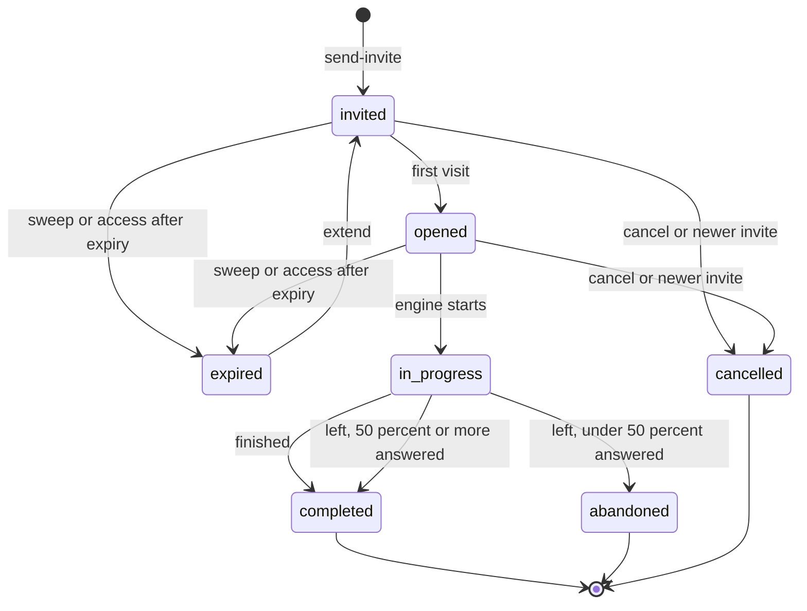
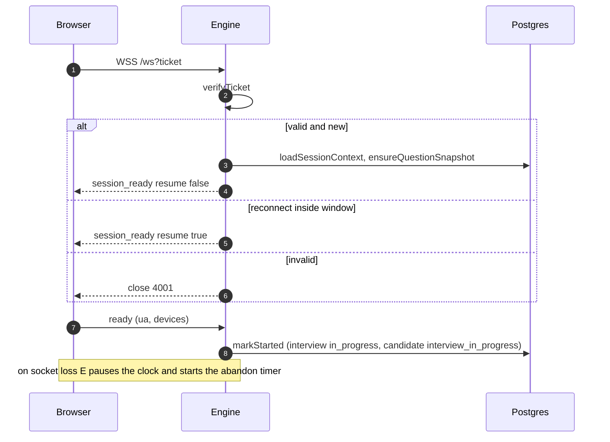
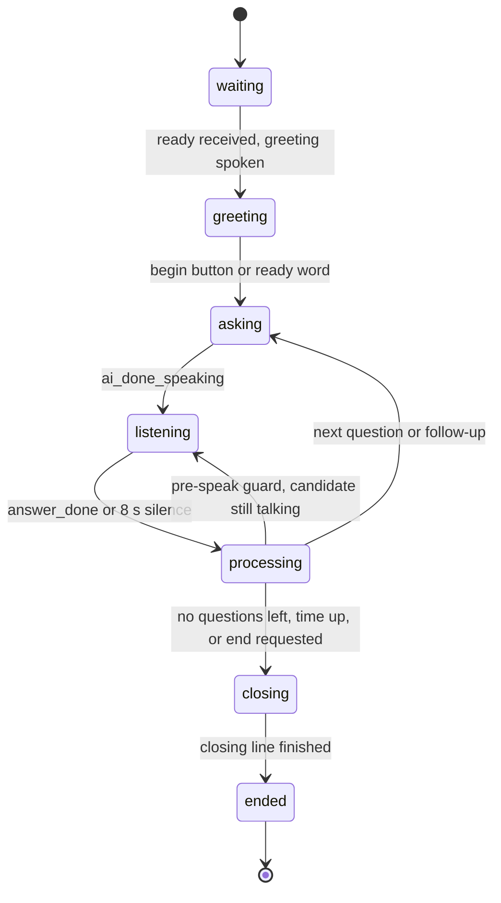

# Part 4B · Functionality Deep Dive: The Interview Module

[← Index](README.md) · Previous: [Part 4A](04a-functionality-intake-screening.md) · Next: [Part 4C · Evaluation, decisions, agent](04c-functionality-evaluation-decisions.md)

**Features in this file:** H13 Question bank · H14 Invitations · H15 Candidate room · H16 Interview engine · H17 Conversation loop · H18 Speech-to-text and transcript hygiene · H19 Text-to-speech · H20 Per-answer AI (analysis, scoring, follow-ups) · H21 Recording capture and upload · H22 Camera behaviour tracking · H23 Integrity events.

> The interview module is described here as Raasta-AI's own module ("Raasta AI Interviewer"). Its origin is covered once, in [Part 7 §7.3](07-implementation-journey.md#73-the-interview-module-integration) and [Part 8](08a-panel-questions.md).

---

## H13 · Interview question bank  *(special depth: question generation)*

**Purpose.** Give every shortlisted candidate a consistent, measurable set of spoken questions, each with an *ideal answer* and *expected keywords* that the scorer uses.

**Trigger.** (a) after the first shortlist (`queueAfterShortlist` → `ensure-questions`); (b) `send-invite` finding no questions (`questions_missing` → enqueues `ensure-questions`, retries every 30 s ≤ 10×); (c) recruiter: *Interview questions* page → Generate (append/replace), add, edit, reorder (drag and drop with `@dnd-kit`), delete; (d) `personalise-questions` per candidate when `personalisedQuestions > 0`.

**Flow.**
1. `ensureJobQuestions(jobId)` (worker, under Redis lock `lock:questions:{jobId}` 60 s): if any active job-wide question exists → skip; else `generateAndStore(jobId, {mode:"append"})`.
2. `generateJobQuestions({job,count,existing})`: `questionMix(count)` chooses the shape. For **8** questions: 1 warm-up ("Walk me through your background and why this role interests you.", category *role*, easy, weight 1), 2 technical *medium*, 2 technical *hard*, 1 *role* scenario, 2 *behavioral* (STAR) — derived as `max(1, round(count×0.25))` behavioural and `max(1, round(count×0.125))` role questions (when enough remain), the rest technical split half medium (rounded up) and half hard; at least one technical question is always kept.
3. `chatJSON` with `QUESTIONS_SYSTEM` (one sentence, under 30 words, answerable verbally in 1–3 minutes, 3–6-sentence ideal answer, 3–8 keywords, weights 1–3, never repeat existing) at temperature 0.5, 3000 tokens, up to **3 attempts**.
4. `validateGeneratedQuestions` (code, not LLM): `normaliseQuestion` requires non-empty question + ideal answer + ≥ 2 keywords, question ≤ 40 words, valid category/difficulty (defaults technical/medium), keywords unique/trimmed/≤ 8, weight 1–3 (defaults by category: technical 3, role 2, behavioural 2; warm-up forced to 1); de-duplicates against existing and within the batch (normalised text); sorts warm-up → technical → role → behavioural; caps to `count`. If the warm-up is missing it is added from `WARMUP_FALLBACK`. Accepts the batch if ≥ `count − 2` valid; else retries; after 3 attempts throws "Only N of M generated questions were valid".
5. `generateAndStore` inserts in a transaction under `pg_advisory_xact_lock('questions:<jobId>')`; `append` puts new rows after the current max `order_index`; `replace` deactivates the job's AI questions (manual ones are kept and moved after the new block).
6. **Snapshot:** on the first engine attach `ensureQuestionSnapshot(interview)` builds the candidate's list (job-wide + this candidate's personalised, personalised ones inserted after the last technical question) and writes it to `interviews.question_snapshot` with `UPDATE … WHERE question_snapshot IS NULL` (first writer wins; the loser re-reads the stored copy).
7. **Personalised questions** (`generatePersonalisedQuestions`): only if the candidate's `fit_analysis` has concerns (other than "Resume could not be read") or missing skills; the prompt asks 1–2 technical/role questions that let the candidate address those gaps and forbids mentioning scores or personal attributes; behavioural results are converted to *role*.

**Inputs → outputs → side effects.** Job fields in; question rows out; one LLM call (≤ 3); a Redis lock; DB writes in a transaction.

**Validation.** *Manual edit* (`validateQuestionInput`): question ≤ 500 chars; category/difficulty enums; ideal answer ≤ 4,000; keywords ≤ 15 unique; weight integer 1–5; `orderIndex` ≥ 0. The ideal answer may be empty (UI warns), in which case the answer cannot be scored (`scoreAnswer` returns `null`).

**Errors & edge cases.** Concurrent generate → 409 "already being generated" (lock); LLM invalid JSON/short list → 502 (or 429 on rate limit) with "AI question generation failed. Try again."; Redis down → generation proceeds unlocked; delete a question used by any interview of that job (text search of its id inside `question_snapshot`) → **soft delete** (`is_active=false`), otherwise hard delete; editing questions after interviews started never changes those interviews (snapshot).

**Security.** Owner-only; prompts contain job data only; personalised prompts exclude scores and personal attributes.

**Design decision.** Validation gate + deterministic mix instead of "trust the model"; *ideal answer + keywords* chosen because they make scoring auditable. *Rejected:* a fixed global question set (not job-specific); live LLM-invented questions without a bank (not comparable between candidates). *Limits:* question quality is checked structurally, not semantically (a plausible but wrong "ideal answer" would mis-score) — hence the recruiter edit screen.

**30 seconds.** "We generate a validated bank per job, each with an ideal answer and keywords; the recruiter can edit it; at interview start we freeze a copy so later edits can't change an interview in progress."

---

## H14 · Interview invitations  *(special depth: link generation and access control)*

**Purpose.** Create a private, expiring, single-candidate link and deliver it.

**Trigger.** Worker `send-invite` (auto) or *Send interview invite* / *Resend* (`POST /api/hiring/candidates/[id]/invite {resend?}`); reminders and expiry by sweep; recruiter *Extend* / *Cancel*.

**Flow (`libs/hiring/invitations.js`, `emails.js`, `libs/interview/tokens.js`).**
1. `loadCandidateContext` (candidate, job, owner name for the email's "hiring team").
2. Idempotency: if an **active** interview (`invited|opened|in_progress`) exists and `resend` is false → `{skipped:"already invited"}`, except when the previous email failed (then a fresh token is minted on the same row and the email retried).
3. Status guard: allowed from `shortlisted`/`interview_expired` (and `interview_invited` when resending); otherwise `InviteError invalid_status 409` (not retryable). A candidate currently `in_progress` cannot be re-invited (409).
4. `hasActiveJobQuestions` or enqueue `ensure-questions` and throw `questions_missing` (retryable).
5. `createInviteToken()` → `crypto.randomBytes(32).toString('base64url')` (43 chars) and its SHA-256 hex hash. `expiresAt = now + inviteExpiryHours`.
6. Transaction under `pg_advisory_xact_lock('invite:<candidateId>')`: mark any older `invited|opened` interviews of this candidate `cancelled`; insert the new `interviews` row (stores the **hash only**); set candidate `interview_invited`.
7. `deliverEmail` (Mailgun or dev outbox) with `inviteEmail(vars)`: subject "Your AI interview for {job}", text + HTML (escaped), requirements list (quiet place, Chrome/Edge desktop, microphone ± camera, stable internet), "press I've finished my answer", **privacy line** (recorded, evaluated with the help of AI, camera analysis when enabled, reviewed by the hiring team), expiry in `EMAIL_TIMEZONE`, button "Start my interview". Failure → `invite_email_failed:…` saved, `InviteError email_failed 502 retryable`.
8. Publishes `invite_sent` on `hiring:{userId}` (best effort; no current subscriber).

**Reminders.** `findDueReminders` (invited, unopened, never reminded, `invitedAt ≤ now − reminderAfterHours`, > 2 h left) → `send-reminder` → `sendReminder`: claims the reminder with a conditional update (so two workers don't both send), **rotates the token** (new hash on the same row), emails the reminder template ("This link replaces the one in our earlier email").
**Expiry.** `expireStaleInvites` (15-min sweep) sets `expired` and the candidate `interview_expired`; access also checks expiry on the spot (`resolveInterviewToken` → `expireNow`).
**Extend.** `extendInvite(id, hours)`: integer 1–720; `expiresAt = max(now, expiresAt) + hours`; an expired row returns to `opened` or `invited` and the candidate to `interview_invited`.
**Cancel.** Allowed from `invited|opened|expired`; row `cancelled`, candidate back to `shortlisted`.

**What a candidate sees for each link state** (`public-access.js` `ACCESS_ERRORS`): unknown, replaced, or rotated token → 404 "This link is no longer valid…"; cancelled → 410 same message; expired → 410 "This interview link has expired. Contact the recruiter…"; abandoned/failed → 410 "no longer available"; completed → 409 "You've already completed this interview. Thank you!" (uploads are still accepted for 2 hours after the end); too many requests → 429 + `Retry-After`.

**Edge cases requested by the brief.** *Expired link:* 410 and the row is flagged immediately. *Reused link:* a completed interview refuses a second run (409), and `/session` only accepts `opened` or `in_progress`; a second browser tab while one is live gets close code 4009 "already open in another window". *Candidate disconnects:* see H16/H17. *Email bounce:* not detected by the system [GAP]; the recruiter sees the invite "sent" and no opening; remedies are Resend (new link) or Extend.

**Security.** 256-bit random token (cannot be guessed), hashed at rest, in the URL **path** (not query) and `Cache-Control: no-store`, `X-Robots-Tag: noindex`, per-token per-route rate limits, malformed tokens rejected by regex (`^[A-Za-z0-9_-]{20,100}$`) before hashing, constant error text for unknown vs replaced, raw tokens never logged (`maskToken`), scores never emailed. **Risk:** a forwarded email is a usable credential until expiry (no second factor; documented trade-off).

**Design decision.** Capability link instead of candidate accounts (no sign-up friction, nothing to forget). *Rejected:* one-time codes by SMS (cost, no phone number collected); a signed JWT link (cannot be revoked without a table anyway). *Limit:* one interview attempt per invite; the recruiter must resend for a retake.

**30 seconds.** "We email a random 256-bit link; we only store its hash. Each request hashes the link, looks it up, checks status and expiry, and is rate-limited. Reminders rotate the link, resend cancels the old one, and expired or finished links return clear errors."

---

## H15 · Candidate interview room

**Purpose.** The browser side of the interview.

**Trigger.** Candidate opens `/interview/{token}` (`app/interview/[token]/page.js` → `InterviewApp`).

**Steps and what each does.**

| Step | Component | Server calls | Rules |
|---|---|---|---|
| Loading | `InterviewApp` | `browserSupport()` (needs `getUserMedia`, `AudioWorkletNode`, `MediaRecorder`, `WebSocket`) → `GET /api/interview/{token}` | unsupported browser → "Please use Chrome or Edge on a computer"; 404/409/410/429 → `StatusScreen` with the specific message; network error → retry button |
| Welcome + consent | `WelcomeStep` | `POST …/consent {accepted:true}` | required checkbox: agreement to **recording (audio, video if enabled), AI-assisted evaluation, camera analysis if enabled, sharing with the hiring team**; narrow screens (< 768 px) get a "use a computer" hint; shows what to expect (≈ N questions, ≤ M minutes, up to K follow-ups, cannot pause) |
| Device check | `DeviceCheck` | latency probe `GET /api/interview/{token}` | requests mic (+ camera) with echo cancellation, noise suppression, auto-gain; the **mic level must peak** (candidate says hello) and a **test sound** must be confirmed; network < 1500 ms is "Good" (slower is a warning, not a block); if tracking is on, loads the face model and shows "Your face is visible" or advice; **Start** requires stream + mic OK + heard sound + a latency reading |
| Interview | `InterviewRoom` | `POST …/session` (ticket), `wss://engine/ws?ticket`, uploads | see below |
| Completed | `CompletedStep` | – | "Thank you!" and "Finishing upload… don't close this tab" until the upload queue drains; the browser warns on `beforeunload` while the interview or uploads run |

**Room behaviour.** Top bar: job title, "Question i of N", countdown from `remainingSec` (time disconnected is not counted), red recording dot, "Camera analysis on" when tracking runs, **End interview** with an in-page confirmation. Centre: an `InterviewerOrb` (no human avatar), the question text, live captions (partial grey, final normal), a state chip (*Interviewer speaking / Listening… / Thinking…*). Buttons: **I've finished my answer** (enabled when listening and ≥ 3 words, `MIN_ANSWER_WORDS`), **Repeat question** (max 2 per question), **I'm ready, start** during the greeting (sends `begin` so a missed "yes" never blocks). Toasts for `time_warning` (5 and 1 minutes) and reconnection.

**Half-duplex microphone.** While the interviewer speaks the mic pipeline is disabled (`setEnabled(false)`), re-enabled 450 ms after playback ends (`MIC_TAIL_MS`), because speakers feed the voice back into the microphone.

**Reconnect.** `InterviewSocket` asks `/session` for a **fresh ticket** at every (re)connect and reconnects up to 5 times with delays 1, 2, 4, 8, 16 s; fatal close codes (4004 not found, 4009 duplicate, 4010 completed, 4011 expired) stop retrying; ping every 15 s; audio is dropped when the socket's send buffer exceeds 64 KB (prefers freshness over backlog).

**Security.** The browser never sees scores, ideal answers or analysis (the engine never sends them; `publicInterviewView` omits them). Camera/microphone access is user-granted. `beforeunload` is only a warning.

**Design decision.** Browser-based room instead of a meeting-bot/Google Meet (decision table): zero install, one product identity, full control of audio and recording. *Limits:* Chrome/Edge desktop only; microphone permission and echo handling are the candidate's environment risk.

**30 seconds.** "The candidate goes through consent, a device check and then the room. The browser streams microphone audio to the engine, plays the interviewer's voice, records audio and video in 10-second parts, and reconnects automatically with fresh tickets if the network blips."

---

## H16 · Interview engine (WebSocket server and session manager)

**Purpose.** Hold live sessions, authenticate them, wire STT/TTS/LLM to the loop, survive disconnects and restarts.

**Trigger.** Browser opens `wss://…/ws?ticket=<jwt>`.

**Flow (`services/interview-engine/index.js`, `session-manager.js`).**
1. HTTP server: `GET /health` → `{ok, activeSessions, stt}`; anything else 404; WebSocket upgrade only on path `/ws` (`noServer: true`, `maxPayload` 64 KB).
2. `verifyTicket(ticket)` (`libs/interview/tokens.js`, HS256 via `jose`, requires `typ = interview_ws`, `sub`, `cid`); failure → close **4001**; the ticket itself is never logged.
3. `manager.attach(ws, {interviewId, candidateId})`:
   * already attaching or an open socket exists → error `duplicate_session` + close **4009**;
   * an in-memory session exists (reconnect inside the resume window) → check `candidateId` match, cancel the abandon timer, bind the socket, send `session_ready {resume:true}`;
   * `sessions.size ≥ INTERVIEW_MAX_SESSIONS` (20) → error "busy" + close **1013**;
   * otherwise `loadSessionContext` from Postgres; not found → **4004**; candidate mismatch → **4001**; `expired` or an invite past expiry → **4011**; any status other than `opened`/`in_progress` → **4010**;
   * `ensureQuestionSnapshot` → `toSessionQuestions`; zero questions → error + **1011**;
   * build `InterviewSession` with `maxFollowUps`, `interviewMaxMinutes`, `silenceMs` (`INTERVIEW_SILENCE_MS`, 8000), restored `state` and `pausedAt` (an engine that stopped mid-interview freezes the clock at the last activity), send `session_ready {interviewId, resume, totalQuestions, maxMinutes, interviewerName, jobTitle, remainingSec}`.
4. Messages: binary frames → `stt.write` only if the room said `ready`, size ≤ 64 KB and even length (PCM16); JSON allowed types `ready, begin, ai_done_speaking, answer_done, repeat_question, end_interview, client_event, ping`; rate limit **200 messages/s per socket**; `ready` opens STT and the keep-alive (every 5 s) then `session.start`; `answer_done` first `await stt.flush()` (≤ 2.5 s) so words in flight are not lost.
5. STT lifecycle: `onFinal` text goes through `cleanTranscript` then `session.onSttFinal`; an unexpected close triggers **one** reconnect, then `stt_unavailable` to the client.
6. **Disconnect** (`detach`): close STT, `session.pause()` (timers and clock frozen), save state, keep the entry for `resumeWindowMinutes` (default 15); when the timer fires and nobody returned → `session.end("abandoned")` (completed if ≥ 50% of base questions answered, otherwise `abandoned`).
7. **Snapshots:** every 15 s and at each question change `saveState`; **SIGTERM**: pause all, snapshot, close sockets with **1012** ("Engine restarting"), exit within 5 s.
8. **Orphans:** if the engine itself died, the worker sweep `abandonStaleSessions` closes `in_progress` interviews idle for `resumeWindowMinutes + 5` (complete if ≥ 50% answered, else abandon).

**Errors & edge cases.** AI provider outage mid-interview: see H20 (fallbacks keep the loop moving; Deepgram loss → one retry, then client error; TTS failure → browser voice). Engine crash: state in Postgres; the candidate's socket closes (1006), the room reconnects up to 5 times with new tickets; when the engine is back the session resumes with "Welcome back, let's continue" and the current question re-asked; the clock excludes the downtime. Concurrency: duplicates blocked (4009); capacity 20.

**Security.** Ticket proves identity and binds `interviewId`+`candidateId`; 10-minute TTL limits replay; no ticket in logs; frame and rate limits resist floods; the engine trusts the database row, not client claims (it re-checks status/expiry).

**Design decision / limits.** In-memory sessions with persisted snapshots (simple) vs Redis-backed shared sessions (scale-out). **Single instance, ≤ 20 sessions** by design; the Python AI engine and Deepgram are shared resources.

**30 seconds.** "A small WebSocket server verifies a short-lived ticket, loads the interview and questions from Postgres, runs the conversation loop in memory, snapshots its state every 15 seconds, and lets the candidate reconnect within 15 minutes without losing their place."

---

## H17 · Conversation loop  *(special depth: conversation flow)*

**Purpose.** Decide, moment by moment, who speaks and what happens to what was said.

**Where.** `libs/interview/session-engine.js`, class `InterviewSession` (all effects through `deps`).

**Stages** (`state.stage`): `waiting → greeting → asking → listening → processing → closing → ended`.

**Rules as implemented.**

1. **Greeting:** "Hello {firstName}! I'm the Raasta AI Interviewer for the {job} role. I'll ask you about {N} questions; take your time, and press 'I've finished my answer' when you're done. Are you ready to begin?" Greeting audio is cached per voice/text.
2. **Start:** `begin` from the button, or a ready word (`yes|ready|sure|okay|ok|yeah|let's|start|begin`) heard while *not* AI-speaking. Words said before the first question are never an answer.
3. **Accumulating an answer:** each final transcript, after echo stripping, is appended to `currentAnswerBuffer`; `lastAnswerAt` updates also on voice activity or partials (Whisper finals can lag many seconds).
4. **Finalising:** `answer_done`, or silence ≥ `silenceMs` (8 s) measured from the last sign of speech (the timer re-checks `quietFor` when it fires).
5. **Single-flight lock:** `isProcessingAnswer = true` is set **before any `await`**; a second trigger returns immediately.
6. **Processing (`runProcessing`):** strip echo → if the answer is an *end request* (`detectEndRequest`) keep it in the transcript, do not count it as an answer, close politely → `isDecline` → `planNext` (below) → **pre-speak guard**: if the buffer grew by more than `GUARD_CHARS` (10) while we were thinking, put the answer back at the front of the buffer, go back to `listening`, persist nothing → otherwise `saveAnswer` (turn + response rows, background scoring) and speak.
7. **`planNext`:** if time is up/forced → closing; else if the answer is non-empty, **not a decline**, `followUpDepth < maxFollowUps` and ≥ **3 minutes** remain → `analyzeAnswer`; if it says follow up → `generateFollowUp`. Otherwise if < **1.5 minutes** remain → closing; else `peekNextQuestion()`.
8. **Skip rule** (`peekNextQuestion`): skip a base question if it was already answered, or if ≥ 50% of its words longer than 3 characters appear in the last 10 answers; the rule is **disabled when fewer than 6 questions remain**; every skip is logged in `state.skipped` with a reason.
9. **Speaking (`speak`):** save the AI turn, ask TTS, send `question` and `ai_speaking {turnId, audio|null}`; an acknowledgement timer (speech length + 4 s slack) continues the loop if the browser never answers `ai_done_speaking`. Anything the candidate says while the AI is speaking goes to a **side buffer** (barge-in rule) and is merged only if they keep talking after the question ends.
10. **Repeat:** `repeat_question` re-speaks the current question, max `MAX_REPEATS = 2` per question.
11. **Time budget:** clock = `now − startedAt − pausedMs − (current pause)`. Warnings at 5 and 1 minutes (only the most urgent after a reconnect). At 0: if listening with an empty buffer → close now; if a partial answer exists → give a 60 s grace then force-process; otherwise close after the grace.
12. **End:** `finished`, `time_up`, `candidate_ended` → `completed`; `abandoned`/`error` → `completed` if ≥ 50% of base questions answered else `abandoned`; someone who ends before answering anything is `abandoned`. `repo.complete` computes statistics and the interview score; `interview_complete` is sent; `analyse-interview` is enqueued (failure logged, not fatal).

**Inputs → outputs → side effects.** In: STT events, client messages, clock. Out: WebSocket messages, `interview_turns`, `interview_responses`, state snapshots, Redis live events (`question`, `caption_final`, `answer_finalized`, `answer_scored`, `status`, `integrity`), final statistics.

**Edge cases.**

| Situation | Behaviour |
|---|---|
| Candidate silent for the whole interview | answers are empty; the first empty-silence processing is skipped (`!buffer && trigger==="silence"`), so the room waits; with time up it closes; < 50% answered → `needs_review` later |
| Candidate says "I don't know" | `isDecline`: no follow-up, score 0 "The candidate declined to answer.", move on |
| Candidate says "please end the interview" in a short utterance | transcript keeps it, goodbye line, interview ends; a long technical answer mentioning "end the session" is *not* an end request (limits: ≤ 40 words / ≤ 14 for the short form) |
| Network drops mid-answer | the partial answer buffer is discarded; on return "Welcome back, let's continue. {question}" |
| Two triggers at once (button + timer) | single-flight lock; only one next question |
| Candidate keeps talking after clicking done | pre-speak guard rolls back |
| LLM analysis/scoring/follow-up fails | fallbacks (H20), flagged `fallback` |
| TTS fails | text-only, browser voice |
| Session paused (disconnected) while a score is pending | scores finish in the background (`pendingScores` awaited at `end`) |

**Security.** Nothing sent to the candidate except question text, captions and status (no ideal answers, scores, reasons).

**Design decision.** Deterministic state machine + injected effects, with LLM only inside well-bounded calls — easy to test (29 tests in `session-engine.test.js` with fake timers, plus `interview-conversation.test.js`). *Rejected:* a single "conversational" LLM that drives everything (unpredictable, hard to score consistently, higher latency). *Limit:* English only; silence-based finalisation can cut off a slow thinker (hence the 8 s default and the button).

**30 seconds.** "It's a state machine: greet, ask, listen, then when the answer ends — by button or eight seconds of silence — it locks, checks for echo and 'end the interview', asks a fast model whether a follow-up is warranted, saves and scores the answer in the background, and speaks the next question. If the candidate kept talking while it was thinking, it throws the plan away."

---

## H18 · Speech-to-text and transcript hygiene

**Purpose.** Turn audio into trustworthy text and keep non-speech out of the answer.

**Components.**

| Piece | Parameters (from code) |
|---|---|
| Provider choice (`libs/interview/stt/index.js`) | `DEEPGRAM_API_KEY` set → Deepgram, else Whisper chunked |
| Deepgram (`deepgram.js`) | `nova-3`, `en`, `linear16`, 16000 Hz, mono, `interim_results`, `smart_format`, `punctuate`, `endpointing=300`, `utterance_end_ms=1000`, `vad_events`, `filler_words=true`; `SpeechStarted` and interim results count as activity; `flush()` sends `Finalize` and waits ≤ 1.2 s for the next final |
| Whisper fallback (`whisper-chunked.js`) | cut on **700 ms** of low RMS (`rmsThreshold 0.015`) or **15 s**, 300 ms pre-roll, drop chunks with < 300 ms of speech, transcribe in order via Groq `whisper-large-v3-turbo` (`verbose_json`, language fixed, `temperature 0`), segments filtered by `isSpeechSegment` (reject `compression_ratio > 2.4`, `avg_logprob < −1.2`, or `no_speech_prob > 0.6 && avg_logprob < −0.6`) |
| `cleanTranscript` (`stt/clean.js`) | when language is English, remove words in non-Latin scripts (Cyrillic, Han, Hiragana, Katakana, Hangul, Arabic, Devanagari, Thai, Hebrew, Greek); drop whole phantom sentences ("Thank you.", "Bye.", "Thanks for watching", "Mm-hmm", "Obrigado", …); collapse a sentence repeated ≥ 3 times in a row; return "" if no letters/digits remain |
| Echo guard (`echo-guard.js`) | for each recent interviewer sentence (≥ 4 words) find where the heard text starts echoing it (allowing ≤ 4 junk words before, ≤ 3 inserted/dropped words inside, ≥ 60% matched) and cut the matched span plus following punctuation; up to 3 rounds; active for 90 s after the interviewer spoke |
| Intent (`intent.js`) | regex rules for "end the interview" (≤ 40 words, with a stricter short-form ≤ 14 words that requires filler-only objects) and for decline/"I don't know" (≤ 14 words) |

**Why rules and not an LLM for intent.** They run on every answer and must be predictable; a wrong guess has a cost either way (ending an interview by mistake vs. asking someone who refused to elaborate) — recorded in the file header.

**Edge cases.** The interviewer says "Are you ready to begin?" and the mic hears it → echo stripped, so it doesn't count as "ready"; the candidate speaks Urdu/Hindi → Devanagari/Arabic-script words are removed under `STT_LANGUAGE=en` (**a limitation for multilingual candidates**); accents → Deepgram/Whisper accuracy unmeasured [GAP].

**30 seconds.** "We stream audio to Deepgram, fall back to Whisper, and then clean the text: remove echoes of the interviewer's own voice, foreign-script junk and phrases the models invent on silence. Simple rules also detect 'please end the interview' and 'I don't know'."

---

## H19 · Text-to-speech

`libs/interview/tts-client.js` → `POST {AI_ENGINE_URL}/tts` with bearer token `{text (≤ 600 chars), voice: TTS_VOICE or am_michael}`, 20 s timeout; response WAV (24 kHz mono) with `X-Audio-Duration-Ms`. Python side (`routers/tts.py`): Kokoro-82M `KPipeline(lang_code="a")`, voices `af_heart, af_bella, af_nicole, af_sarah, af_sky, am_adam, am_michael`, validated against that list. Greeting and closing lines are cached in memory (50 entries, key voice+text). **Any** failure returns `null` → `ai_speaking {audio:null}` → the browser reads the text with `speechSynthesis` (an English voice, safety timer if `onend` never fires). **Why Kokoro:** local, free, no per-call cost (recorded in decisions); **limit:** heavy to install; on one Windows PC Smart App Control blocked the model's DLL so TTS was served by the browser voice.

**30 seconds.** "The engine asks a local Kokoro model to speak each question, and if it can't, the browser speaks it instead, so the interview never stalls on audio."

---

## H20 · Per-answer AI: analysis, scoring, follow-up

(Prompts and rubrics are in [Part 5 §5.3](05-ai-components.md#53-interview-conducting-and-answer-evaluation).)

**Analyzer (`answer-analyzer.js`).** Seven conditions; the **first** that fires is the *reason for follow-up*: (1) answer incomplete (< 15 words; or a "how" question answered without how-words under 25 words; or a "why" question without why-words under 20 words; or completeness score < 60 where completeness = `min(100, words/30×100)` + 10 each for explanation, example and detail words); (2) new topic opened (LLM); (3) expected keywords avoided (< 50% mentioned); (4) contradiction (LLM, also against the resume's skills); (5) deep experience (LLM; fallback: ≥ 2 advanced terms); (6) natural cues ("I can explain more", "should I continue"…); (7) multi-step required (behavioural category or "tell me about a time…"). Conditions 2, 4, 5 come from **one** JSON call on the fast model (temperature 0.3, `reasoningEffort: low`); if it fails, heuristics are used and contradiction defaults to false. *Known behaviour:* behavioural questions nearly always trigger a follow-up (intended; capped by depth and time).

**Scorer (`answer-scorer.js`).** `score = 0` for empty; else LLM JSON `{score 0–100, reasoning, keywordsCovered, keywordsMissed}` against the question's `idealAnswer` and keywords (rubric 90–100 excellent … 0–29 poor; transcription noise and fillers are to be ignored), main model, temperature 0.3, 1,500 tokens. On any failure: **fallback score = 0.7 × keyword coverage + 0.3 × min(100, words/30×100)** (50% coverage assumed when there are no keywords), flagged `fallback: true`. A decline scores 0 without a call. Follow-up answers are scored against the **base** question's ideal answer with the follow-up text appended.

**Follow-up generator (`follow-up.js`).** Prompt includes role, candidate name and skills, original question and category, keywords, the answer, the reason, analysis metrics and the last 6 history lines (rules: one clear question, probing but respectful, don't repeat, build on the answer, 1–2 sentences, drill deeper at depth > 0). Two attempts (500 tokens/temp 0.7, then 900/0.3); the text must be ≤ 400 chars and end in terminal punctuation or it is treated as cut off; otherwise a **fixed fallback question per reason** ("Could you add a bit more detail to your answer?", …).

**Interview score.** `computeInterviewScore`: mean of all responses per base question, then mean weighted by `scoreWeight`, rounded.

**Edge cases.** All three calls can fail independently; every failure is isolated (a scoring failure is logged, the loop continues, the response keeps `score null` until fixed); rate limits are not retried inside the loop.

**30 seconds.** "After each answer a fast model checks whether to probe further, a stronger model scores the answer against our ideal answer and keywords in the background, and a short prompt writes the follow-up. If a model call fails, simple rules produce a score or a canned follow-up, and it's flagged."

---

## H21 · Recording capture, upload and assembly

**Purpose.** Preserve the interview for the recruiter and feed the delivery analysis.

**Trigger.** Room start → `startRecorders` (`lib/recorders.js`).

**Flow.**
1. Two `MediaRecorder`s: **audio-only** (`audio/webm;codecs=opus`) and, if the job has `recordVideo`, **video+audio** (`video/webm;codecs=vp8,opus`, 1 Mbps). `timeslice` = **10 s**. Each recorder holds one chunk back so the last can be sent with `final=true`.
2. `UploadQueue` (sequential): `POST /api/interview/{token}/upload` multipart `{kind, part, final, file}`; up to **3 retries** with 1, 2, 4 s back-off; client errors other than 408/429 are not retried; failures are counted.
3. Server (`upload/route.js`): token + rate limit (900/h); interview must be `opened|in_progress|completed` (completed accepted for **2 h** after `endedAt`); **consent required**; `content-length` ≤ 10 MB + 64 KB; `kind ∈ {audio, video, behavior}`; `part` integer 0–99999; file ≤ 10 MB; MIME must be `audio/webm`, `video/webm` or `application/octet-stream`; stores `recordings/{id}/{kind}/{00000}.webm`; first part sets `recording_status = uploading`; `final=true` enqueues `assemble-recording {interviewId, kind}`.
4. **After a reload** `GET /api/interview/{token}` returns `nextRecordingPart {audio, video, behavior}` (computed from stored keys) so numbering continues instead of overwriting.
5. **Assembly** (`libs/interview/analysis.js` `assembleRecording` → `media-tools.js`): list parts sorted by number; download; `groupIntoStreams` (a new recorder stream begins at every part starting with the EBML magic `1A 45 DF A3`; leading header-less fragments are dropped); each stream is concatenated byte-wise then remuxed with `ffmpeg -c copy`; several streams (a reload) are joined with the concat demuxer (re-encoding if parameters differ); result `recordings/{id}/audio.webm` / `video.webm`. `recording_status` is then set in **one SQL `CASE`** from the row's current keys (so concurrent audio and video jobs cannot overwrite each other): `complete` when audio (and video if it has parts) exist; a join failure is written to `error_message` as `recording_failed:…` and **thrown** so the worker retries (unless it is hopeless: `ffmpeg_missing` / `no_header`).

**Edge cases.** Parts arrive after the interview ended (slow networks) → accepted for 2 h; analysis waits up to **10 minutes** (`RECORDING_WAIT_MS`), re-queueing itself every 30 s, then proceeds with what exists (`analysis.media = "partial"|"missing"`); ffmpeg missing → AI engine `/media/concat` fallback; deleted recording → analysis refuses to recompute (scores kept).

**Security & privacy.** Consent gate; parts are not publicly addressable; downloads via 15-minute signed links; recruiter **Delete recording** removes the whole `recordings/{id}/` prefix and sets `recording_status = deleted` (refused while the interview is active or being analysed); no automatic retention [GAP].

**Design decision.** Chunked browser upload (10 s parts) rather than one big upload at the end: resilience to refresh/crash, progressive transfer. *Rejected:* streaming raw video over the interview WebSocket (competes with audio, no resume). *Limit:* WebM only; browsers other than Chromium may not support the chosen MIME types.

**30 seconds.** "The browser records in 10-second WebM chunks and uploads them with retries; the server stores them under numbered keys; at the end the worker stitches them with ffmpeg, even if the candidate reloaded in the middle."

---

## H22 · In-browser camera behaviour tracking

**Purpose.** Produce eye-contact, head-movement, blink and expression *signals* without uploading frames.

**Trigger.** Room start when `info.recordVideo && info.trackBehavior`.

**Flow (`app/interview/[token]/lib/behavior-tracker.js`, `behavior-features.js`).**
1. `loadFaceLandmarker` loads MediaPipe Tasks Vision from `/mediapipe/wasm` and `/mediapipe/face_landmarker.task` (GPU delegate first, then CPU), up to **2 faces**, with blendshapes and the facial transformation matrix. Files are placed there by `npm run sync:mediapipe`.
2. A hidden `<video>` plays the camera track; every 100–400 ms (adaptive to the device) the tracker samples: number of faces, head yaw/pitch/roll, iris position (horizontal/vertical) and ~10 selected blendshape scores.
3. Samples are buffered (cap 2,400 ≈ 4 minutes), converted to a columnar JSON batch `{v:1, startedAt, t[], f[], yaw[], …}` and uploaded every **15 s** as `kind=behavior` through the same `UploadQueue`, before the recorders' final parts.
4. Server stores each batch with the **server receive time** (`{receivedAt, batch}`) so the analysis can correct a candidate's wrong clock (`estimateSkew`); batches that cannot start report `{unavailable: "<reason>"}`.
5. At analysis: `loadBehavior` → `flattenBatches` → `summariseBehavior(samples, {windows: answerWindows(turns)})`: **baseline** = the candidate's own median head pose and iris position (rejecting an implausible baseline), then eye contact, look-aways (≥ 1 s, gaze beyond 18° sideways or 15° up/down from baseline), blink rate, head nods/shakes, expression shares (happy, surprise, concern, tense), **composure**, face-absent (≥ 5 s) and multiple-faces (≥ 3 s) flags, a 2-second timeline, per-answer figures, and the same measures restricted to the time the candidate was **answering**.

**Edge cases.** Model cannot load (blocked, offline, unsupported GPU) → the interview continues and the recruiter's report says why; slow device → the sampling interval stretches; no face for long → flagged, not penalised in the score.

**Privacy.** Frames are not uploaded by the tracker; the consent text and the invitation email say camera analysis is on; the job-level switch `trackBehavior` (default on, requires `recordVideo`) controls it. The *video recording itself*, if enabled, still contains the face.

**Fairness/limits.** "These are signals, not verdicts" (file header): expressions are approximate (speech moves the mouth), lighting/camera angle/glasses/skin tone can affect landmarks, and it says nothing about honesty or competence; eye contact is 25% of the communication score (≈ 5% of the default final score). No bias audit of MediaPipe on our population [GAP].

**30 seconds.** "A face-landmark model runs in the candidate's browser and sends only numbers — where they look, how their head moves, expression scores. The server measures them against that candidate's own usual posture, so camera placement doesn't count against them."

---

## H23 · Integrity events

The room reports `tab_hidden` / `tab_visible` (Page Visibility API) and `net_offline` / `net_online` (browser events) via `client_event` on the socket, or via `POST /api/interview/{token}/event` when the socket is down. The engine (`onClientEvent`) whitelists seven event names (also `mic_muted`, `mic_unmuted`, `fullscreen_exit`, which **no client code currently emits** [PARTIAL]), caps at 200 per interview, normalises timestamps, appends to `interviews.integrity_events` (SQL JSON concat) and publishes `integrity` to the live view. `summariseIntegrity` (analysis) pairs hidden/visible events into `tabHiddenCount` and `tabHiddenSec`; ≥ 3 hidden events or ≥ 30 s hidden raise the agent escalation **"integrity"**. The recruiter UI states plainly that this is **not proof of misconduct** (a notification, a second monitor or a phone call can hide the tab).
