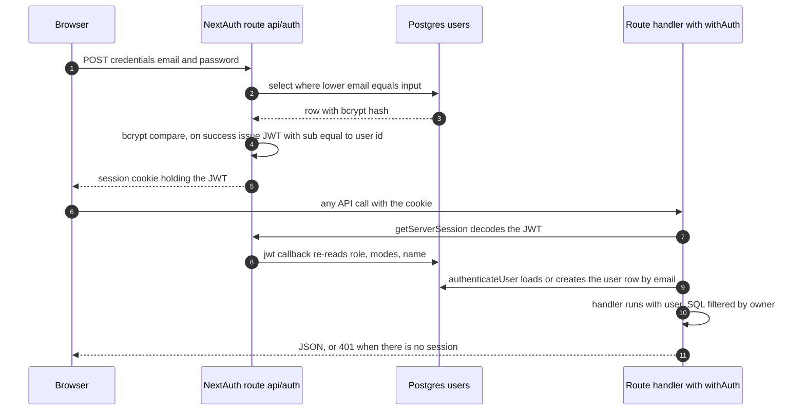
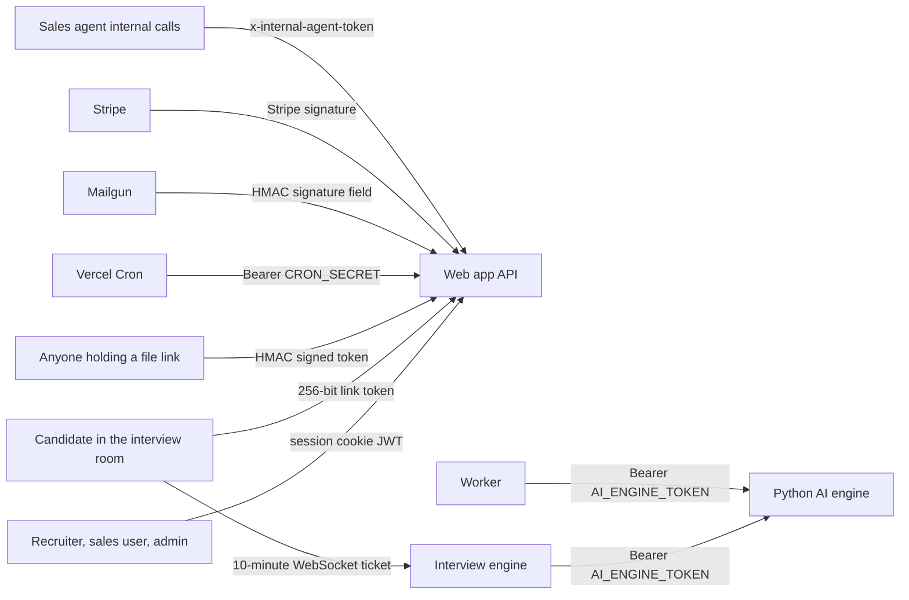
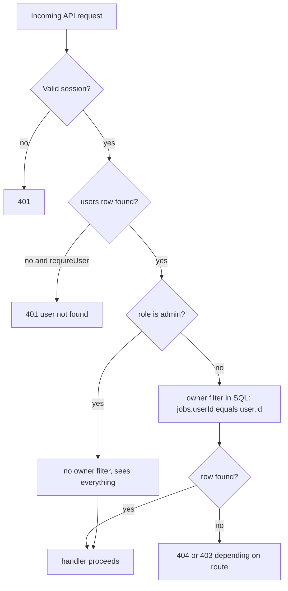
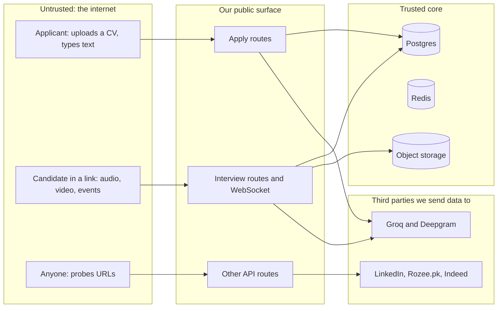
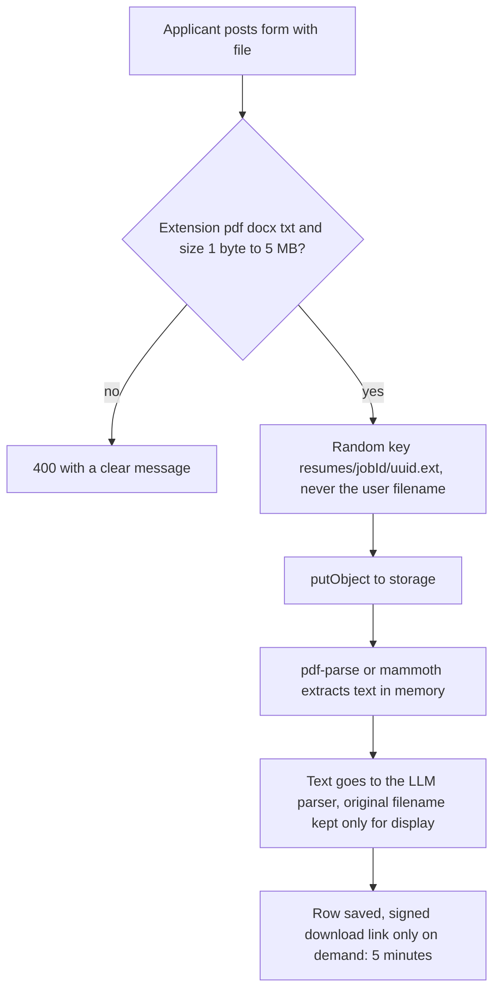
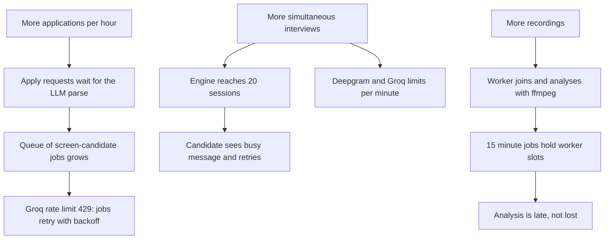
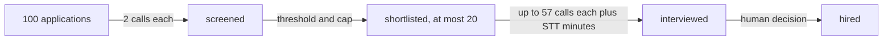
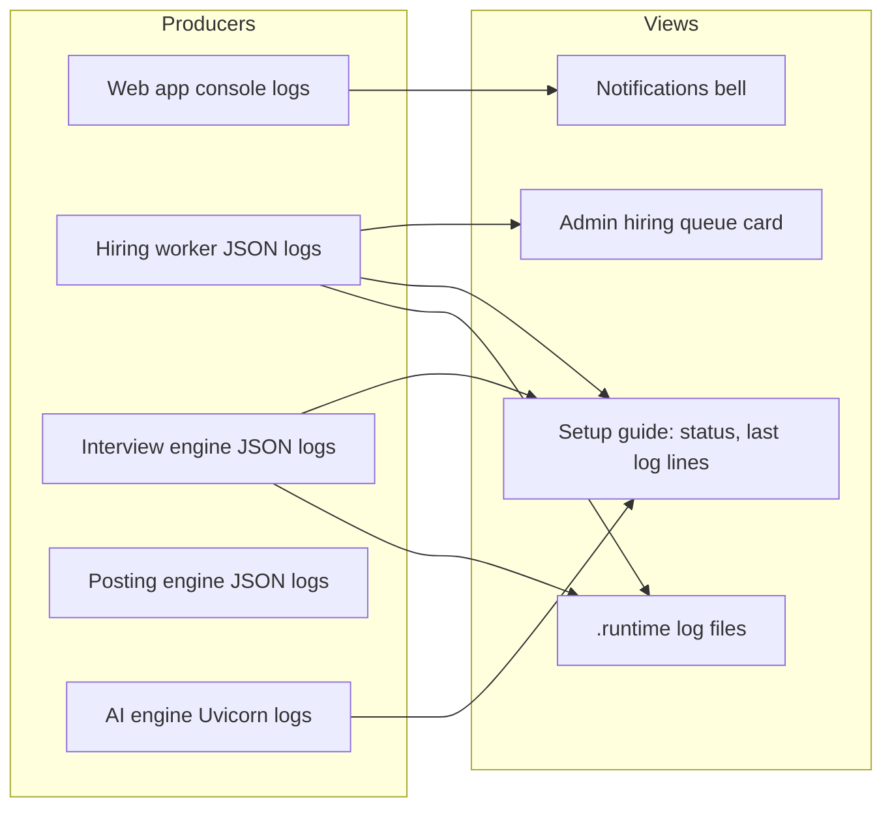
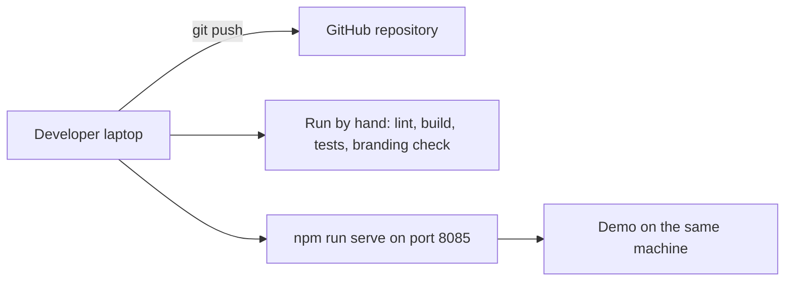
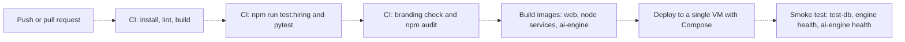

# Part 6 · Cross-cutting Concerns

[← Index](README.md) · Previous: [Part 5 · AI components](05-ai-components.md) · Next: [Part 7 · Implementation journey](07-implementation-journey.md)

> **What "cross-cutting" means.** These are the concerns that touch every feature rather than belong to one: *who may do what* (auth), *what can go wrong* (security), *what happens to people's data* (privacy), *how it behaves under load* (performance, cost), *how we know it works* (logging, testing) and *how it reaches users* (deployment, configuration). Each section ends with a **panel soundbite** and an honest **gaps** list. Every statement was checked against the code on 2026-10-08; where a number comes from a test run it says so.

## Contents

* [6.1 Authentication and authorization](#61-authentication-and-authorization)
* [6.2 Security](#62-security) (threat model · validation · uploads · rate limiting · secrets · OWASP · findings register)
* [6.3 Privacy and data protection](#63-privacy-and-data-protection)
* [6.4 Third-party platform automation: legal and ethical position](#64-third-party-platform-automation-legal-and-ethical-position)
* [6.5 Performance and scalability](#65-performance-and-scalability) (measured facts · bottlenecks · 10× / 100× · AI cost)
* [6.6 Logging, monitoring and observability](#66-logging-monitoring-and-observability)
* [6.7 Testing and coverage](#67-testing-and-coverage)
* [6.8 Deployment pipeline](#68-deployment-pipeline)
* [6.9 Environment configuration](#69-environment-configuration)
* [6.10 Consolidated risk register: what to fix first](#610-consolidated-risk-register-what-to-fix-first)

---

## 6.1 Authentication and authorization

(Module-level explanation of identity and roles: [M1](02b-conceptual-modules.md#m1--identity--access). Hashing vs encryption vs signing: [D.4](02d-foundational-concepts.md#d4-authentication-authorization-hashing-vs-encryption-tokens). This section gives the **whole-system picture**.)

**Two words first.** *Authentication* = proving who you are. *Authorization* = deciding what you may touch once we know who you are. Raasta-AI has **nine different ways a caller proves itself** because it has nine kinds of caller; most of the complexity is that no single login fits recruiters, anonymous candidates, background programs and third-party webhooks.

### 6.1.1 Diagram A: sign-in and an authenticated request (recruiter or sales user)



**How to read it.** Steps 1–4 happen once at sign-in; steps 5–10 happen on **every** request. Step 8 is the important design choice: the role and modes are **re-read from the database each time** instead of trusted from the cookie, so promoting or demoting a user takes effect at once even though a JWT cannot be revoked. The cost is one extra small query per request. Google sign-in replaces steps 1–3 with Google's check; there is no database adapter, so the `users` row is created lazily in step 9 (`libs/auth-middleware.js` `authenticateUser`, `createUser` default true).

### 6.1.2 Diagram B: who proves what, and to whom



**How to read it.** Arrows are labelled with the credential. Left of the web app are **humans**, right/bottom are **programs**. The only credential a *candidate* ever holds is the link token, and it is exchanged for a short WebSocket ticket so the long-lived link never travels to the engine. Nothing here is a username-password pair except the first arrow.

### 6.1.3 Credential catalogue

| # | Credential | Held by | Format and lifetime | Verified by | Stored as | What it unlocks | Evidence |
|---|---|---|---|---|---|---|---|
| 1 | **Session cookie** (JWT) | Staff user's browser | NextAuth JWT, `session.strategy: "jwt"`, default library lifetime (30 days; no `maxAge` set) [PARTIAL: default not overridden] | `getServerSession` + `authenticateUser` | cookie only (no server session table) | every `withAuth` route; dashboard pages | `libs/next-auth.js`, `libs/auth-middleware.js` |
| 2 | **Password** | Staff user | ≥ 8 characters (no other rule) | `bcryptjs.compare` | bcrypt hash, **cost 12**, `users.password` | getting credential 1 | `app/api/auth/register/route.js`, `libs/next-auth.js` |
| 3 | **Google identity** | Staff user | Google OAuth profile (`sub` becomes `users.id`) | Google | `users.googleId` | getting credential 1 | `libs/next-auth.js` |
| 4 | **Interview link token** | Candidate (email) | `randomBytes(32)` base64url (256 bits), expiry `inviteExpiryHours` (default 72), rotated by each reminder | SHA-256 of the presented token compared to `interviews.token_hash`; shape check `^[A-Za-z0-9_-]{20,100}$` first | **hash only** | `GET/POST /api/interview/[token]/*` (view, consent, session, event, upload) | `libs/interview/tokens.js`, `libs/interview/public-access.js` |
| 5 | **WebSocket ticket** | Candidate's browser | HS256 JWT, 10 min, claims `sub` = interview id, `cid` = candidate id, `typ: "interview_ws"` | `jose.jwtVerify` with `INTERVIEW_TICKET_SECRET`, algorithms pinned to HS256 | not stored | one WebSocket session on the engine | `libs/interview/tokens.js`, `services/interview-engine/index.js` |
| 6 | **Signed file token** | Anyone given a link | HMAC-SHA256 over `{key, filename, expiry}`; resumes 5 min, recordings 15 min | `timingSafeEqual` against recomputed HMAC (`STORAGE_SIGNING_SECRET`) | not stored | `GET /api/files/[token]` for exactly one stored object | `libs/hiring/storage.js` (`verifySignedToken`) |
| 7 | **Service bearer token** | Engine, worker | `AI_ENGINE_TOKEN` | `secrets.compare_digest`; **fails closed**: 503 if the token is unset | env only | every AI-engine route except `/health` | `services/ai-engine/main.py` |
| 8 | **Cron secret** | Vercel Cron | `Authorization: Bearer ${CRON_SECRET}`; **falls back to the literal `dev-cron-secret-change-in-production` when unset** | string compare | env | `GET /api/linkedin/connections/check-schedule` (checks every active account's invitations) | `check-schedule/route.js:23` [GAP] |
| 9 | **Webhook signatures** | Mailgun, Stripe | provider HMAC | recomputed signature (Mailgun: `signature` form field; Stripe: SDK) | env | inbound-reply forwarding; (Stripe handlers are inert) | `app/api/webhook/*` |

A tenth, minor one: the sales agent's internal self-calls use `x-internal-agent-token` = `INTERNAL_AGENT_TOKEN` for the manual acceptance check; the other internal self-calls carry **no credential at all** (findings SEC-02 to SEC-04).

### 6.1.4 Authorization layers



**How to read it.** Layer 1 (session) is the `withAuth()` wrapper; layer 2 (ownership) is a SQL condition copied into each hiring route (`ownerFilter()`, found in 20 files under `app/` and `libs/`); layer 3 (admin) is an `isAdmin` branch that removes the condition. **Modes (`recruiter` / `sales`) are not part of authorization**: they only choose which sidebar groups are shown, so a sales-only user who knows a recruiter URL still passes layers 1–2 (they would see only their own, i.e. empty, data) [PARTIAL, by design]. Because there is **no `middleware.js`**, protection is *per handler*: forgetting `withAuth` leaves a route open. A scan of all 167 handlers (`app/api/**/route.js`, 2026-10-08) shows 149 that authenticate (134 wrapped in `withAuth`, 15 that call `getServerSession`, `authenticateUser` or verify a token inside the handler) and **18 that do not**; those 18 are classified below.

| Class of the 18 handlers without in-handler session auth | Count | Verdict |
|---|---|---|
| Intentionally public by design: apply form `POST` and `GET …/info`, `auth/register`, `lead` (accepts and discards an email), `test-db` (returns only `SELECT 1` success) | 5 | Correct for their purpose; need abuse limits (SEC-08) |
| Protected by a different secret: `webhook/mailgun` (HMAC), `webhook/stripe` (signature), `check-schedule` (cron bearer) | 3 | Correct, except the default cron secret (SEC-06) |
| `check-acceptance` (the scan flagged it because the token path and the session path are in helper code) | 1 | Has both a session path and an internal-token path; fine |
| **Unprotected and should not be**: `PUT messages/[id]`, `POST messages/generate`, `GET messages/generate-bulk`, `POST scrape`, `POST redis-workflow/.../queue-invites`, `POST redis-workflow/workers/invite-sender`, `POST init-db`, `POST migrate-message-tracking`, `GET debug-schema` | 9 | **Defects** (SEC-01 to SEC-05). All are in the *sales* half or are development utilities; none touches hiring data |

*Note on `GET messages/generate-bulk`:* the file's `POST` is `withAuth`, but its `GET` is a plain export that takes `?campaignId=` and returns the names and LinkedIn URLs of that campaign's leads to **any caller**, with no owner check (and writes the same names to the server log). It is therefore a defect (SEC-04), not a false alarm.

**Panel soundbite (30 s).** "A staff user signs in with a password or Google and gets a JWT; on every request we re-read their role and filter every query by owner, so one recruiter can never see another's candidates. Candidates have no account: they get a 256-bit link whose hash we store, and a ten-minute ticket for the live connection. Background programs use shared secrets. The honest weakness is that protection is per route, not global; our audit found nine sales-side or developer routes that were left open, and fixing them is the first item in our risk register."

**Gaps in 6.1.** No login throttling, CAPTCHA, email verification or email-based password reset; no MFA; session lifetime not tuned; role changes require a DB edit or the admin screen; Google/credentials accounts with the same email are resolved by email in `authenticateUser` but the session's `sub` is the Google id, so role and modes for such a user would be read for the wrong id by the `jwt` callback — a reading of the code, **not tested** [verify].

---

## 6.2 Security

### 6.2.1 Threat model in one picture



**How to read it.** Data enters on the left over three public surfaces and lands in the core store; the two dangerous directions are *in* (malicious uploads, forged tokens, injected text) and *out* (personal data leaving to model providers; automation against platforms we do not control). The five assets to protect, in order: (1) candidates' personal data and recordings, (2) the platform sessions (cookies) of the owner's LinkedIn/Rozee.pk/Indeed accounts, (3) the integrity of hiring decisions, (4) the API keys that spend money (Groq, Deepgram, Apify, Mailgun), (5) availability during a live interview.

### 6.2.2 Input validation and sanitisation, by entry point

| Entry point | Validation actually done | Where | Not done |
|---|---|---|---|
| Register | all four fields present; email regex `^[^\s@]+@[^\s@]+\.[^\s@]+$`; password length ≥ 8; case-insensitive uniqueness | `auth/register/route.js` | no complexity rule, no breach check, no verification email; "User already exists" reveals which emails are registered (account enumeration) |
| Apply form | `jobId` must match a UUID pattern (else 404); job must exist and not be closed; name and email required; email regex; resume extension in {pdf, docx, txt}, non-empty, ≤ **5 MB**; duplicate `(job, lower(email))` checked before and again inside a transaction under a Postgres advisory lock | `apply/[jobId]/route.js`, `libs/hiring/resume-text.js` | file **content** is not sniffed (a renamed file passes the extension check); request body is buffered by the framework before the size check; no rate limit, no CAPTCHA (SEC-08); free-text `name`, `coverNote` are stored as given |
| Job and settings forms | `validateHiringConfig`: booleans, integer ranges (e.g. `minFitScore` 0–100, `questionCount` 3–15, `interviewMaxMinutes` 5–60), weights normalised, unknown keys dropped | `libs/hiring/config.js` | – |
| Candidate interview routes | token shape check, hash lookup, status and expiry checks, consent required before session/upload, `kind` ∈ {audio, video, behavior}, `part` integer 0–99999, size ≤ 10 MB, content type must be WebM/octet-stream, behaviour JSON size ≤ 1 MB and normalised through `normaliseBatch` | `app/api/interview/[token]/*`, `libs/interview/behavior.js` | upload content is not decoded until ffmpeg runs in the worker |
| WebSocket | ticket verified on connect; `maxPayload` = 64 KB; ≤ 200 messages/s per connection; message types validated by the session manager | `services/interview-engine/*` | no `Origin` header check (not needed for CSRF because the ticket is a bearer credential obtained from an authenticated-by-token route) |
| Storage keys | no leading `/`, no `.`/`..`/empty segment, then `path.resolve` must stay under the base directory (both in Node and in the Python engine) | `libs/hiring/storage.js`, `services/ai-engine/core/storage.py` | – |
| Database | all queries go through Drizzle's parameterised builders or the `sql` tag (values are bound as parameters); `grep` finds **no** `sql.raw` on user input; the only `sql.raw` is the fixed `ALTER TABLE` list in `migrate-message-tracking` | `libs/**`, `app/api/**` | the development routes (SEC-05) |
| Output to HTML | React escapes by default; the two `dangerouslySetInnerHTML` uses are static blog content and JSON-LD; emails pass every interpolated value through `escapeHtml`; candidate-supplied LinkedIn/GitHub strings become `https://…` links unless they already start with `http` | `components`, `libs/hiring/emails.js`, recruiter candidates page | – |
| LLM input | resume text truncated (8,000 / 6,000 chars), personal fields stripped before scoring; **no** instruction-injection filtering (see [5.4](05-ai-components.md#54-failure-modes-and-guards)) | `libs/ai/prompts/*` | injection is mitigated by design (no tools, bounded outputs), not filtered |

### 6.2.3 The upload path, step by step



**How to read it.** The two decisions that matter are the allow-list (B) and the **random storage name** (C): the user's filename is never used as a path, which removes path-traversal and overwrite attacks; it is kept only as display text, cut to 255 characters. Download (G) is never a public URL: recruiters get a signed link valid for five minutes, served with `Content-Disposition: attachment`, `X-Content-Type-Options: nosniff` and `Cache-Control: private, no-store`. **Residual risk:** the PDF and DOCX parsers receive attacker-controlled bytes; a malformed file could crash or exhaust the parser (the apply request fails with a 500 and nothing else is affected, but there is no sandbox, no antivirus scan and no time/memory limit on parsing) [GAP].

### 6.2.4 Rate limiting and abuse control (consolidated)

| Surface | Control | Fails open? | Gap |
|---|---|---|---|
| Candidate routes | Redis fixed window per token hash and route: get 120/h, consent 20/h, session 60/h, upload 900/h, event 300/h | **Yes** (a Redis outage must not lock a candidate out of their own interview) | – |
| WebSocket | 200 messages/s, 64 KB frames, ≤ 20 sessions per engine, one session per interview | n/a | a flood of valid tickets cannot be created without link tokens |
| Platform accounts | daily quotas in Postgres (LinkedIn invites 30, messages 10; Rozee.pk 20/15), publish caps (LinkedIn 3/day, Rozee.pk 5, Indeed 3) with minimum gaps | n/a | protects the *account* from the platform, not our server |
| Register, sign-in, apply, `lead`, `scrape` | **none** | – | credential stuffing, spam applications, cost abuse (SEC-03, SEC-08) |

### 6.2.5 Secrets management

| Rule | Evidence |
|---|---|
| Secrets live in environment variables only; `.env*.local` and `.env` are git-ignored; only `.env.example` (names/placeholders) is tracked | `.gitignore`, `git ls-files` |
| No secret is hard-coded, with **one exception pattern**: the cron secret falls back to a literal default | SEC-06 |
| Secrets that are checked at startup or first use fail closed with a clear error: `INTERVIEW_TICKET_SECRET` and `STORAGE_SIGNING_SECRET` must be ≥ 32 characters; the AI engine returns 503 without its token | `libs/interview/tokens.js`, `libs/hiring/storage.js`, `main.py` |
| Logs never contain raw tokens, tickets, resume text or API keys (`maskToken()`); this is CLAUDE.md rule 7 | tests grep for leaks in a few places |
| The memory note from the project: when checking whether a key is set, print "set/empty + length", never the value | project convention |
| **Platform session cookies are stored as plain JSON** in `linkedin_accounts.cookies`, `rozee_accounts.cookies`, `indeed_accounts.cookies`; `LINKEDIN_INTEGRATION.md` claims they are encrypted, which is **not true in the code** | `libs/schema.ts` lines 103, 322, 348 (SEC-07) |
| `.env.example` lists only the 55 hiring-pipeline names; core names (`NEXTAUTH_SECRET`, `NEXTAUTH_URL`, `GOOGLE_*`, `CRON_SECRET`, `INTERNAL_AGENT_TOKEN`, `SCRAPER_API_TOKEN`, Stripe, `MAILGUN_SIGNING_KEY`, `SERVICE_CONTROL`, …) are missing, so a new machine can start with an unset secret without any hint | `grep` of `.env.example` (SEC-11) |

### 6.2.6 OWASP Top 10 (2021) mapped to Raasta-AI

| OWASP category | Status | Why / evidence | Fix |
|---|---|---|---|
| **A01 Broken access control** | **PARTIAL** | Hiring routes: ownership filter + token model, good. Sales/dev routes: nine unprotected handlers; one with mass assignment (`PUT messages/[id]` spreads the request body into `set`) | SEC-01 to SEC-05 |
| **A02 Cryptographic failures** | **PARTIAL** | Passwords bcrypt-12, tokens hashed, signatures constant-time, TLS to Postgres (`ssl: 'require'` by default). But platform cookies, resume text and transcripts are unencrypted at rest; WebSocket ticket travels in the URL query | SEC-07, SEC-09 |
| **A03 Injection** | **Mostly OK** | SQL parameterised; no shell with user input in hiring paths (ffmpeg arguments are built from internal keys); HTML escaped. *Prompt injection* is a separate, mitigated-not-solved risk (Part 5) | – |
| **A04 Insecure design** | **PARTIAL** | Good: capability-URL design, human gate, bounded automation. Weak: no abuse limits on public routes; routes secured one by one | SEC-08, global guard |
| **A05 Security misconfiguration** | **GAP** | **No HTTP security headers** are configured (`next.config.js` defines no `headers()`: no CSP, HSTS, X-Frame-Options, Referrer-Policy); `.env.example` incomplete; dev utilities exposed; `SERVICE_CONTROL` (can start/stop programs) is on in development | SEC-10 |
| **A06 Vulnerable components** | **GAP** | Dependencies have caret ranges; `npm audit` and Python `pip-audit` are not part of any routine; no Dependabot | add to CI |
| **A07 Identification and authentication failures** | **PARTIAL** | Strong hashing, but no throttling/CAPTCHA/MFA/verification; enumeration on register; JWT not revocable (mitigated by role re-read) | SEC-08 |
| **A08 Software and data integrity failures** | **PARTIAL** | Webhooks verify signatures; uploaded recordings are only concatenated by ffmpeg in a separate process; no signed builds or SBOM; the Chrome extension is "load unpacked" | – |
| **A09 Logging and monitoring failures** | **PARTIAL** | Structured logs without PII in the new services; no alerting, no central store, no audit log of recruiter actions beyond `decided_by` and agent action records | see 6.6 |
| **A10 SSRF** | **Low exposure** | The server fetches only fixed provider endpoints and storage keys it generated; the candidate's LinkedIn URL is only displayed, never fetched; the sales scraper forwards URLs to Apify, not to our network | keep it so |

### 6.2.7 Security findings register (ranked)

Severity reflects impact **if the system were exposed to the internet today**. All are in code that exists; none was exploited.

| ID | Sev. | Finding | Evidence | Why it matters | Fix (small) |
|---|---|---|---|---|---|
| SEC-01 | **High** | `PUT /api/messages/[id]` has no authentication, no ownership check, and writes `{...request.json()}` straight into the row | `app/api/messages/[id]/route.js:41-72` | Anyone who knows or leaks a message id can rewrite any user's drafted outreach, and can change any column including `userId` or `status` | wrap in `withAuth`, filter by `userId`, whitelist `content` and `status` |
| SEC-02 | **High** | `queue-invites` and `invite-sender` are unauthenticated; the `x-internal-call` / `x-user-id` headers are read **only for logging**, they grant nothing and verify nothing | `…/queue-invites/route.js:20-28`, `…/invite-sender/route.js:21-31` | A caller who knows a campaign id can queue invites or trigger the worker that opens LinkedIn with the stored session | `withAuth` plus owner check; for internal calls, a shared secret |
| SEC-03 | **High (cost)** | `POST /api/scrape` is unauthenticated and runs a paid Apify actor on caller-supplied URLs | `app/api/scrape/route.js:5-27` | Anyone can spend the owner's scraping credit | `withAuth`; the internal agent call must send the token |
| SEC-04 | **Medium** | `POST /api/messages/generate` is unauthenticated (needs a lead id, spends LLM tokens, saves a draft on that lead); `GET /api/messages/generate-bulk?campaignId=` returns lead names and LinkedIn URLs of any campaign without a check | `messages/generate/route.js:8`; `messages/generate-bulk/route.js:216-283` | token spend, writes to and reads from another user's data if an id leaks | `withAuth` and owner filter on both |
| SEC-05 | **High if deployed** | `POST /api/init-db` (runs migrations), `POST /api/migrate-message-tracking` (runs `ALTER TABLE`), `GET /api/debug-schema` (lists `users` columns, inserts and deletes a test user row) are unauthenticated and not gated on environment | the three route files | schema disclosure and unauthorised writes | delete them, or gate on `NODE_ENV !== "production"` **and** admin |
| SEC-06 | **High if unset** | Cron secret has a published default string | `check-schedule/route.js:23` | If `CRON_SECRET` is not set in production, anyone can trigger acceptance checks for all LinkedIn accounts | refuse to run when unset |
| SEC-07 | **Medium** | LinkedIn/Rozee.pk/Indeed session cookies stored unencrypted; documentation claims otherwise | `libs/schema.ts`, `LINKEDIN_INTEGRATION.md` | A database leak would hand over logged-in sessions of real accounts | AES-GCM with a key from env; correct the document |
| SEC-08 | **Medium** | No rate limiting or bot control on register, sign-in, apply, `lead`, `scrape` | see 6.2.4 | spam applications flood the pipeline and spend LLM tokens (each application triggers a parse and a fit call); credential stuffing | per-IP Redis limiter (the helper `rateLimit()` already exists and is reusable); CAPTCHA on apply |
| SEC-09 | **Low** | WebSocket ticket is passed as `?ticket=` in the URL | `services/interview-engine/index.js:65` | URLs can be written to proxy logs; mitigated by 10-minute life, single-purpose `typ`, and not logging it ourselves | send it as the first message or a subprotocol |
| SEC-10 | **Medium** | No security headers (CSP, HSTS, frame-ancestors, Referrer-Policy, Permissions-Policy). The interview room needs camera and microphone, so Permissions-Policy should allow them only on that route | `next.config.js` has none | clickjacking, content sniffing on non-file routes, weaker XSS containment | add `headers()` in `next.config.js` |
| SEC-11 | **Low** | `.env.example` incomplete; `debug-enrichment/` has two tracked LinkedIn screenshots; package name still `ship-fast-code` | repo | operational and hygiene | complete the file; remove the PNGs |
| SEC-12 | **Medium** | Parser attack surface: no content check, sandbox or time limit for PDF/DOCX parsing | 6.2.3 | denial of service on one request | content sniff (magic bytes), run parsing in the worker with a timeout |

**Panel soundbite (30 s).** "We designed security around three ideas: capability links for candidates (256-bit, hashed at rest, expiring, rotated), ownership filtering for staff, and bounded automation so the AI can never reject someone on its own. An audit of our 167 endpoints found 18 without in-handler authentication; nine are public on purpose or protected by signatures, and nine are real defects in the older sales half and developer utilities. We have a ranked list and each fix is a few lines; we would not expose the system to the internet before closing SEC-01 to SEC-06."

---

## 6.3 Privacy and data protection

(The full lifecycle table is in [Part 3 §4](03-architecture-and-data.md#4-data-lifecycle-and-protection-of-personal-data); this section answers the questions a panel asks.)

**What personal data do we hold, about whom, and why?**

| Subject | Data | Purpose | Legal-style basis we assume |
|---|---|---|---|
| Applicant | name, email, optional LinkedIn URL, cover note, CV file and extracted text, parsed profile | assess fit for the job they applied to | their own submission to the job |
| Interview candidate | link token (hash), consent time, browser info (UA ≤ 300 chars, device flags), audio, optional video, transcript, answers and scores, voice and camera *numbers*, integrity events | conduct and evaluate the interview they agreed to | **explicit consent** recorded in `interviews.consent_at` before anything is captured |
| Recruiter or sales user | name, email, password hash, role, modes, notification history | operate the product | account |
| Sales lead (a third party who never dealt with us) | name, title, company, LinkedIn URL, public post text | outreach | **legitimate-interest style assumption, not assessed** [GAP] |

**Questions and honest answers.**

* *Do candidates know what happens to them?* Partly. The invitation email and the pre-interview screen state recording, AI evaluation and (if enabled) camera analysis, and consent is required before any session ticket or upload. There is **no** separate candidate-facing privacy notice for the interview, no description of Groq/Deepgram as processors, and no way for a candidate to request access, correction or deletion (Part 3 §4.4).
* *Is the camera biometric?* The browser computes face landmarks locally with MediaPipe and uploads **aggregated numbers** (never frames) for behaviour analysis; the separate video recording, if the job enables `recordVideo`, is stored. No face recognition or identity matching is done. The legal treatment of face video is jurisdiction-specific and was **not reviewed** [GAP].
* *Does personal data leave the system?* Yes, by design: CV text to Groq (parsing, scoring), interview audio to Deepgram (or Groq Whisper), answers to Groq, emails to Mailgun, scraped lead data from Apify. Provider data-processing terms are not recorded in the repo [GAP].
* *Minimisation:* personal fields are removed before the scoring call; the final summary receives only the three strongest and three weakest answers; names are scrubbed from model output; candidate views never expose scores.
* *Retention:* **no automatic deletion**. Deleting a candidate or job removes rows by cascade but leaves resumes and recordings in storage; only the recruiter's "delete recording" button removes recording files (and keeps scores). A purge job is proposed in Part 9.
* *Security of storage:* signed short-lived links, no public bucket paths, ownership checks; no application-level encryption at rest (rely on managed-database and bucket encryption in production).
* *Which law applies?* The project has not been assessed against a specific statute; the sensible framework to cite is the common data-protection principles (purpose limitation, minimisation, storage limitation, integrity, accountability) and a documented DPIA before real use. Stating this plainly is better than claiming compliance.
* *Children, special categories:* not collected deliberately; the prompts forbid inferring protected attributes. CVs may contain them (date of birth, religion, photo) and sit in the raw resume text (Part 5.5).

**Panel soundbite.** "We built consent, minimisation and short-lived access into the architecture; we did not build retention, subject-access or a legal review, and we list those as the privacy to-do before any real deployment."

---

## 6.4 Third-party platform automation: legal and ethical position

Raasta-AI automates LinkedIn (invites, messages, post scraping, job posts), Rozee.pk and Indeed through browsers, because none of them offers an open API for these actions to this kind of user. **Their terms restrict automated access** (stated in `docs/ai-hiring/19` §5 and §5f). The project's recorded position:

| Question | Answer, with the evidence |
|---|---|
| Who decided? | The project owner, on **2026-10-07**: human-like behaviour and stealth measures are allowed; the owner accepts that an account can be restricted or banned. Automation should run on an account that can be lost (`docs/ai-hiring/19` §5; `CLAUDE.md` conventions). |
| What is the order of preference? | (1) a **visible window with a person** for every check and decision, (2) human-like input, (3) stealth only if needed. Stealth in the posting engine is off by default (`POSTER_STEALTH`). |
| What does the system never do on its own? | The posting engine hands over to the person at every check, sign-in and decision. On Rozee.pk it never presses **Publish Job**, **Apply Credit**, **Post with free Featured Job credit** or **Upgrade to Top Job** (publishing spends a credit, so it is the recruiter's choice; `docs/ai-hiring/19` §5g). Neither Rozee.pk nor Indeed is posted in the background (`autoPostAvailability`). |
| What limits exist? | Per-account daily quotas and publish caps with minimum gaps, cool-offs after a pause or block page (30 minutes for a block page, `POSTER_PAUSED_COOLOFF_HOURS` default 24 h after a pause), a **practice site** per platform so the engine can be demonstrated and tested with no account. |
| What happened in practice? | During the first live runs (2026-10-07 and 2026-10-08) the owner's test Indeed employer account was **paused** by Indeed and the engine's window was shown a block page; *the cause is unknown* (the automation, a test job, or the account details; nothing observed separates them). Live runs against that account were stopped and the practice site is used instead (`docs/ai-hiring/19` §5f). |
| What is the exposure? | Account restriction (certain risk class), possible contractual (terms) breach, and, for scraping personal data of people who did not interact with the product, privacy exposure. None of this is a criminal-law opinion; **no legal review was done** [GAP]. |
| How do we answer the panel? | "We know it is against the platforms' terms; the supervisor and owner accept the risk for a research prototype; we mitigated with a human in the loop, caps, a practice mode, and a copy-and-paste path (Copy and open / browser extension) that works without any automation. A production product would use official partner APIs." |

**Panel soundbite.** "Automation of third-party sites is the project's biggest external risk and we state it rather than hide it. The product still works if every platform blocks us, because manual and assisted paths exist."

---

## 6.5 Performance and scalability

**Honest framing first.** The system has **never been load-tested** (the load test is an unchecked Phase 9 item in `docs/ai-hiring/16`), so this section separates three things: *measured* facts, *limits that are visible in the code* (constants and design), and *scenario reasoning* about 10× and 100×. Scenario numbers below are assumptions made for the argument, not targets the team set and not measurements.

### 6.5.1 What was actually measured

| Measurement | Result | Where it comes from | Caveat |
|---|---|---|---|
| Dev server vs production-mode server, first visit of 17 screens and APIs on a dual-core laptop | sum of first visits **≈ 51 s** (`npm run dev`) → **≈ 2.5 s** (`npm run serve`); JavaScript per screen ≈ 12 MB → ≈ 120–150 KB; server memory ≈ 1–1.5 GB → ≈ 110 MB; sign-in to Home ≈ 1.2 s; moving between screens 0.15–0.3 s | team's own timings, `docs/ai-hiring/21` §1–2, §6 | empty database; one laptop |
| Dev warm-up | the same first visits fall to **< 4 s** after the background warm-up (21 of 21 screens opened) | `docs/ai-hiring/21` §3, §6 | development only |
| Interview loop overhead | `answer_done` → next question in **< 50 ms** with a stub model (pure loop cost: locks, state, persistence) | Phase 5 acceptance, `docs/ai-hiring/16` | real-model latency was **not recorded** |
| Recording analysis on one real session | 858 s audio and 848 s video joined; face found in 99.8 % of camera samples; communication score 59 | `docs/ai-hiring/16` entry of 2026-10-07 | n = 1 |
| Test suites | JavaScript 436 tests in 92 s; Python 37 tests in 70 s | re-run on 2026-10-08 | about the suites, not the product |
| Target (not a measurement) | ≤ 4 s from the end of an answer to the next question's audio | `docs/ai-hiring/09` | unverified with real providers [GAP] |

**Never measured [GAP]:** p50/p95 latency of any API; end-to-end screening time per candidate; memory or CPU per live interview; how many interviews one engine really carries; LLM tokens and money per candidate; Postgres query times with real volumes.

### 6.5.2 Where the limits come from, component by component

| Component | State it keeps | Scales by | Hard limits visible in the code | Becomes the problem when |
|---|---|---|---|---|
| **Web app** (Next.js) | none between requests, except open SSE streams (agent run stream, live interview view) and the Setup guide's child processes | more instances behind a load balancer | Postgres pool `max: 10` **per process**; the apply request does text extraction and the LLM *parse* inside the request (screening itself is queued); signed links and cookies work on any instance | many simultaneous applications (each holds a request while the LLM parses); SSE connections held open |
| **Hiring worker** | none (state in Redis and Postgres) | more worker processes; Redis Streams **consumer group** hands each job to one worker | concurrency `HIRING_WORKER_CONCURRENCY` (default 3 jobs at once per process); per-job timeouts (screen 60 s, analyse 15 min); 3 attempts with backoff `2^attempt × 10 s` or Groq `retry-after`; per-key locks keep one job per interview/job at a time | a burst of applications faster than 3 LLM calls at a time can absorb: the queue grows (that is its purpose) and screening is late, not lost |
| **Periodic sweeps** | none | every worker runs every sweep every 15 minutes; they are **safe to repeat** because each acts through conditional updates (for example a reminder is claimed with `WHERE reminder_sent_at IS NULL`, `libs/hiring/invitations.js:187-190`) | no leader election | duplicate work, never duplicate emails |
| **Interview engine** | **all live sessions in memory** (state machine, STT stream, timers); snapshot to Postgres every 15 s | **vertically only**: one process; code comment states "horizontal scaling is out of scope" | `INTERVIEW_MAX_SESSIONS` default **20**; the 21st candidate is told "The interviewer is busy" (`retryable: true`); 200 messages/s per socket; 64 KB frames | more than ~20 simultaneous interviews, or a crash (sessions resume from the last snapshot within the 15-minute window) |
| **AI engine** (Python) | models loaded in RAM | more containers | one Uvicorn worker (`Dockerfile`); CPU inference for Whisper-base, Wav2Vec2, Kokoro; TTS call timeout 20 s, failure falls back to the browser voice | many analyses or TTS calls at once; model download on first use |
| **Postgres** | all durable state | managed larger instance; read replicas not needed yet | pool 10 per process × (web + worker + engine); indexes added in migration `0013` for jobs/candidates/agent runs by owner, status and job | connection count (the older `SCALABILITY_ANALYSIS.md`, written for the earlier sales code, warns of exactly this at 500 users and proposes PgBouncer [PLANNED]) |
| **Redis** | queue, locks, rate-limit counters, pub/sub | managed Redis | single logical instance; rate limiter **fails open**; queue enqueue failure is logged and the application is still saved | Redis down = no background progress (screening, invitations, analysis wait) but no data loss |
| **Object storage** | resumes, recording parts | S3-compatible | local disk in development; recording parts ≤ 10 MB each; HTTP Range supported for playback | disk space on the local driver; egress cost for video |
| **Third parties** | – | provider plans | Groq requests/tokens per minute, Deepgram concurrent streams: **plan limits not recorded in the repo** [GAP] | the first limit hit under load is almost certainly one of these |

**Single points of failure** (also in [02c](02c-module-interaction.md)): Postgres, Redis, the interview engine process, the Groq API, and the owner's machine for the posting engine. The design reaction is graceful degradation, not redundancy: LLM down → fallbacks (keyword score, canned follow-up, deterministic summary); STT down → Whisper; TTS down → browser voice; AI engine down → analysis recorded as partial; email down → retried and surfaced; engine busy or down → candidate sees a clear message and retries.

### 6.5.3 Diagram: what breaks first as load grows



**How to read it.** Each chain starts with a kind of growth (left column) and follows the first thing that gives. Notice that **every chain ends in "late" or "retry", not "wrong" or "lost"**: the queue and the retry rules turn overload into delay. The one chain that ends in a visible refusal is the interview engine's cap, because a live conversation cannot be queued.

### 6.5.4 What breaks at 10× and at 100× (scenario reasoning)

*Assumed baseline "1×" (for the argument only): one recruiter team, a few open jobs, tens of applicants per job, one or two interviews at a time. This matches what the project demonstrates, not a measured capacity.*

| | **10×** (≈ ten teams; hundreds of applicants a day; up to ~20 interviews at the same moment) | **100×** (≈ a hundred teams; thousands of applicants a day; ~100–200 simultaneous interviews) |
|---|---|---|
| **Applications and screening** | Works if Groq limits allow ~1 parse + 1 fit call per application; raise `HIRING_WORKER_CONCURRENCY` or run 2–3 workers (already supported by the consumer group). Expect LLM rate limits before CPU limits | Needs a higher provider tier or a second provider (`LLM_BASE_URL` already makes the endpoint swappable); batch low-priority screening; move resume *parsing* out of the apply request into the queue (it is the one LLM call in the public applicant path that still runs inside the web request: `buildParsedData` → `parseResumeWithLLM`) [PLANNED] |
| **Live interviews** | At the engine's default cap; run two engines on different ports **with sticky routing** by interview id (the ticket has the id), because sessions are in memory; verify Deepgram concurrency | Requires redesign: sessions externalised or a sharding router; autoscaled engine pool; a per-session memory/CPU measurement that does not exist yet; a Deepgram enterprise plan. `docs/ai-hiring` states this is out of scope [GAP by declaration] |
| **Recording analysis** | ffmpeg and Python analysis are CPU-bound; more worker processes and a bigger AI-engine container | A separate analysis fleet; hardware acceleration for Wav2Vec2; skip video analysis for low-score candidates |
| **Database** | Fine on a managed instance; pool 10 × processes is still small | PgBouncer; review indexes against real queries; partition `interview_turns` / `interview_responses` if they dominate |
| **Storage** | Cheap on S3; video is the cost driver | Lifecycle rules (retention) become mandatory, and are currently absent [GAP] |
| **Web tier** | Two instances behind a load balancer; SSE needs a long-lived server (not a short-lived function), as `docs/ai-hiring/15` notes | CDN for static assets; separate API and UI deployments |
| **Money (AI cost)** | linear in candidates (see 6.5.6) | the dominant operating cost; needs the usage logging that does not exist yet |
| **Platform automation** | does not scale: one browser session per account, daily caps by design | not applicable; this is a limit of the platforms, not of the code |

**What I would say to the panel.** "The queue and the fallbacks mean overload becomes delay. At ten times our demo load the answer is more worker processes and a better provider plan. At a hundred times the live interviewer is the part that has to be redesigned, because its sessions live in one process's memory; we chose that deliberately because it made the conversation loop simple and testable, and we wrote the limit down."

### 6.5.5 Optimisations that exist in the code

| Optimisation | Where | Effect |
|---|---|---|
| Production-mode serving, split bundles, `serverComponentsExternalPackages`, `onDemandEntries`, dev warm-up | `scripts/serve.js`, `next.config.js`, `libs/system/dev-warmup.js` | 51 s → 2.5 s first visits (measured) |
| Database indexes on owner/status/job | migration `0013`, `libs/schema.ts` | keeps list screens fast as rows grow (not measurable at demo size) |
| Debounced shortlist run (30 s lock) | `lock:shortlist-pending:{jobId}` | one shortlist computation per burst of screenings, not one per candidate |
| Fast model for cheap, frequent calls | `LLM_FAST_MODEL` (analyzer, job posts) | lower latency/cost on the hot path |
| Truncated model inputs | 8,000 / 6,000 chars of resume; last 6 history items cut to 100 chars | bounded tokens per call |
| Streaming STT and half-duplex timing | Deepgram `nova-3`, endpointing | low turn latency without busy-waiting |
| Chunked, resumable uploads with Range playback | 10 MB parts, retries 1/2/4 s, `HTTP 206` | large recordings without one huge request |
| Single-flight and idempotent handlers | locks, conditional updates | no duplicate work under retries |
| Redis caching for the sales campaign and lead lists (5 min) | `libs/redis.js` users | fewer database reads in the sales UI |
| React Query `staleTime`, background polling only while visible | `components/system/useSystem.js` | fewer requests |

**Polling that exists (so a reviewer is not surprised):** notifications every 30 s (`components/layout/notification-utils.js`), system status every 15 s by default while the tab is visible (`useSystem.js`), Home overview every 60 s, settings notifications every 30 s. If all three were active in each of 1,000 open tabs (an upper bound, since they live on different screens) that would be roughly 33 + 67 + 17 requests per second; the older `SCALABILITY_ANALYSIS.md` recommends SSE instead (partly done for agent runs and the live interview view).

### 6.5.6 AI cost

**The cost has three parts: language-model tokens (Groq), speech-to-text minutes (Deepgram), and everything else (email, storage, hosting).** TTS, voice/emotion/gaze analysis and face tracking run on our own machines, so they cost compute, not per-call fees.

**What the code lets us state exactly: how many model calls each stage can make.**

| Stage | Model | Calls | Output cap per call (`max_tokens`) | Retry rule |
|---|---|---|---|---|
| Resume parse | main | 1 per application | 2,000 | one stricter JSON retry |
| Fit score | main | 1 per application | 1,200 (3,600 on a length-truncation retry) | ≤ 3 attempts, none on 429 |
| Question bank | main | 1 per job (+1 personalised per shortlisted candidate if `personalisedQuestions` > 0) | 3,000 | ≤ 3 attempts |
| Answer analysis | fast | 1 per answer that can still get a follow-up | 600 | falls back to rules |
| Answer score | main | 1 per answer | 1,500 | keyword formula on failure |
| Follow-up question | main | 1 per follow-up asked | 500, then 900 | ≤ 2 attempts, then a fixed sentence |
| Final summary | main | 1 per interview | 900 | deterministic summary |
| Job post drafts | fast | 1 per platform post | – | – |
| Sales message | (default model name in code is a retired one) | 1 per message | – | – |

**Ceiling counts for an interview** with `Q` base questions and `F` follow-ups allowed per question (defaults `Q = 8`, `F = 2`): scorer calls `Q(1+F)` = 24, analyzer calls `Q·F` = 16, follow-up generations `Q·F` = 16, plus 1 final summary = **57 calls**, and an output ceiling of 24×1,500 + 16×600 + 16×(500+900) + 900 = **68,900 tokens**. These are **ceilings from the caps**, not typical use. Typical use is far lower for two reasons the code enforces: the **25-minute time budget** (`interviewMaxMinutes`) stops the interview long before 24 answers are given, and many follow-ups are not triggered.

**The funnel is the cost control.** An application costs **2 calls**; an interview costs up to **57**. By interviewing only the shortlisted (`minFitScore` 70, `maxShortlist` 20, and a human or auto-invite gate), the system spends up to about 28 times more model calls (57 versus 2) only on a candidate who has already passed the cheap filter.



**How to read it.** The width of the funnel falls left to right while the *cost per person* rises. Illustration with the defaults: 100 applicants and 20 shortlisted is at most 200 + 1 + 20 × 57 = **1,341 model calls** (screening retries aside), of which 1,140 belong to the 20 interviews. Speech-to-text adds at most 20 × 25 min = 500 audio minutes.

**Dollar figures are deliberately absent.** Provider prices are not recorded in the repository, `libs/ai/llm.js` does not log token usage, and no invoice or usage export was captured, so any "cost per hire" would be invented. The Groq console and Deepgram dashboard hold the true numbers. **How to measure (proposed):** (1) log `response.usage` per call with a label (stage, job id) in `libs/ai/llm.js`; (2) run 10 real interviews with the supervisor's key; (3) report tokens and money per stage, per interview, per application; (4) compare against a recruiter's time. **Cost levers already present:** funnel order, fast model for frequent calls, input truncation, follow-up and time caps, local TTS and analysis, `autoScreen` off per job, `maxShortlist`.

**Panel soundbite.** "Cost is linear in candidates and dominated by interviews, so we put the cheap resume screen in front of them and cap everything that loops. We can state the maximum number of model calls per stage from the code; we cannot yet state dollars, because we never logged token usage, and we say so."

---

## 6.6 Logging, monitoring and observability



**How to read it.** Left are the programs; right are the places a human can look. Only the recruiter-facing views (Setup guide, queue card, bell) are built; there is **no log aggregator, metrics system or alerting** behind them. Programs started from the Setup guide write `.runtime/<program>.log` and `.runtime/<program>.pid.json` (git-ignored); programs started by hand log to their own terminal.

| Source | Format | Contains | Never contains |
|---|---|---|---|
| Hiring worker (`workers/hiring-worker.js`) | one JSON object per line: `service`, `level`, `worker`, `at`, `msg`, ids | job type, attempt, duration, sweep counts, failures | resume text, transcripts, tokens, emails |
| Interview engine (`services/interview-engine/index.js`) | same shape; `LOG_LEVEL=debug` adds per-answer loop lines | session open/close, rejected tickets (reason only), STT/provider errors, snapshot failures | the ticket, raw audio, transcripts at info level |
| Posting engine (`libs/poster/engine.js`) | same shape | run steps, hand-overs, errors (first line only) | page content, credentials |
| Web app | `console.log/warn/error` (about 450 call sites in `libs/`, `workers/` and `services/`, more under `app/`); hiring routes log only a short message | errors | – (sales code still logs profile URLs and lead names, e.g. `generate-bulk` writes lead names) |
| AI engine | Uvicorn default | request lines, model-unavailable errors | – |

**Business metrics that exist:** `GET /api/hiring/analytics` (`libs/hiring/analytics.js`) computes the funnel (applied → screened → shortlisted → interviewed → final → hired), conversion percentages and averages from rows, as pure functions (2 tests). `GET /api/dashboard/overview` feeds the Home page.

**Health and status endpoints:** `GET /api/test-db` (database ping), interview engine `GET /health` (active sessions, STT provider), AI engine `GET /health`, `GET /api/system/status` (Postgres, Redis, the four programs, ffmpeg, key settings) which the Setup guide polls.

**Debugging playbook** (what to do when something is stuck; useful in the demo):

| Symptom | First look | Likely cause | Action |
|---|---|---|---|
| Candidate stays "New" | Setup guide: is the worker running and Redis up? | worker not started, Redis down, no `GROQ_API_KEY` | start it; admin queue card shows waiting/failed jobs; **Retry** a dead-lettered job |
| Screening "stalled" | candidate row shows a stalled flag (commit `c1d51b2`) | repeated LLM failures | check key and model name; re-screen |
| No invitation email | interview row `invite_email_failed…`; outbox folder `.storage/outbox` | Mailgun missing/failed (dev falls back to files) | fix key; resend invite |
| "Interviewer is busy" | engine `/health` | 20 sessions | wait; raise `INTERVIEW_MAX_SESSIONS` cautiously |
| No voice from the interviewer | engine logs for TTS | AI engine down or model not downloaded | browser voice is used automatically |
| Analysis never finishes | queue card; `lock:analyse:{id}`; ffmpeg on PATH | uploads incomplete (re-queues every 30 s), ffmpeg missing | check `ffmpeg -version`; re-analyse button |

**Gaps [GAP]:** no metrics (Prometheus/Grafana), no tracing, no error tracker or alerting (Sentry is only proposed), no request-id correlation across web → queue → worker, no audit log of who viewed a candidate, console noise in the sales code.

**Panel soundbite.** "Our new services log structured JSON without personal data, and the recruiter can see program health and the job queue inside the product. What we do not have is the operations stack (metrics, alerts, tracing); for a prototype we chose a self-diagnosing Setup guide over an observability platform."

---

## 6.7 Testing and coverage

### 6.7.1 What exists (verified by running it on 2026-10-08)

| Suite | Result | Command | Time |
|---|---|---|---|
| JavaScript unit and light-integration tests, **42 files** in `tests/hiring/` using Node's built-in `node:test` run through `tsx` | **436 tests, 436 pass, 0 fail, 0 skipped** | `npm run test:hiring` | 92 s |
| Python AI-engine tests, **8 files** in `services/ai-engine/tests/` using `pytest` and FastAPI's test client (stand-in models, tiny fixtures) | **37 passed** | `.venv/Scripts/python.exe -m pytest` in `services/ai-engine` | 70 s |
| Lint, type-check, production build | **not re-run for this document**; `npm run lint` is ESLint `next/core-web-vitals` + `eslint:recommended` with `no-unused-vars` as a warning; there is no separate type-check script | `npm run lint`, `npm run build` | – |
| Scripted/manual acceptance | per-phase checklists with dated results in `docs/ai-hiring/16` (for example Phase 7: 39/39 checks with a stub LLM); a scripted interview client `scripts/interview-test-client.js` | see `docs/ai-hiring/17` | – |

### 6.7.2 The 436 tests, by area (counts per file verified; they sum to 436)

| Area | Files (tests) | What they protect |
|---|---|---|
| **Screening and hiring core** (41) | `fit-postprocess` (10), `resume-text` (7), `config` (6), `dashboard-overview` (6), `shortlist` (5), `statuses` (5), `analytics` (2) | clamp and skill recomputation, hallucination flags, name scrubbing, unreadable CVs; upload validation and text extraction; config bounds and weight normalisation; shortlist threshold/cap/tie-break; the status transition matrix; funnel arithmetic |
| **LLM layer and questions** (23) | `question-generator` (12), `llm` (11) | question validation/dedupe/mix, JSON parsing, retry and truncation rules, error taxonomy |
| **Interview conversation and access** (95) | `session-engine` (29), `interview-modules` (24), `session-manager` (11), `interview-room` (11), `interview-conversation` (9), `interview-views` (6), `tokens` (5) | the live loop with fake timers (single-flight, pre-speak guard, follow-up cap, time budget, resume), the seven follow-up conditions, scorer fallbacks, engine attach/duplicate/close codes, candidate-safe view (never scores or ideal answers), token hash and ticket verify/expiry/type |
| **Recording, storage and analysis** (47) | `behavior` (13), `analysis-pipeline` (11), `media-tools` (6), `storage` (5), `behavior-features` (5), `analysis` (4), `storage-range` (3) | camera batches normalised, voice/communication metrics, ffmpeg wrapper, signed links and path rules, HTTP ranges |
| **Evaluation and the supervised agent** (40) | `agent-policy` (13), `final-evaluator` (11), `agent-plan` (8), `run-summary` (8) | the Assisted/Autopilot policy table, final-score formula, `needs_review`, `autoFinalize`, plan and run summaries |
| **Invitation email** (7) | `emails` (7) | template content, escaping, outbox, timezone |
| **Publishing and posting** (116) | `poster-core` (24), `poster-runner` (16), `indeed-debug` (16), `publishing` (14), `poster-extension` (13), `platform-content` (11), `poster-rozee` (9), `indeed` (7), `posting-kit` (6) | caps/gaps/cool-offs, post content rules per platform, the posting engine against stand-in pages in a **real headless Chromium** (4 files), the browser extension, Indeed diagnostics |
| **Platform operations** (67) | `system-services` (30), `worker-host` (18), `queue-admin` (11), `dev-warmup` (5), `serve` (3) | Setup guide supervisor, embedded worker start/stop, queue admin, dev tooling |

### 6.7.3 Test technique (how the tests are possible)

* **Injected dependencies.** `InterviewSession`, `SessionManager`, `finalizeCandidate`, `sendInvite`, `publishToPlatform` take a `deps` object (clock, timers, LLM, TTS, repository, `send`); tests pass fakes (`tests/hiring/helpers/fake-clock.js`, `mock-indeed.js`, `mock-rozee.js`). The LLM client is swappable (`setLlmClient`), so no test calls a real model.
* **No test touches the database directly**; logic under test receives rows as arguments or through fake repositories.
* **Fixtures:** 10 synthetic résumés with made-up people (3 strong, 3 partial, 2 unrelated, 1 unreadable scan, 1 duplicate email), one job fixture (DevOps), and short WAV/WebM clips (`tests/fixtures/`). Real candidate data is never used (rule in `docs/ai-hiring/17`).
* **Regression tests for real bugs:** the "score written even after the question left the queue" case, the pre-speak guard, and the echo-guard and STT-junk cases came from bugs seen while running real interviews.

### 6.7.4 What is **not** tested (say this before the panel asks)

| Not covered | Consequence |
|---|---|
| **React UI components** (no React Testing Library, no Cypress/Playwright end-to-end of the dashboard) | UI regressions are caught by hand |
| **HTTP route handlers** as a layer (auth wrapper, ownership filters, status codes) | the security findings in 6.2 were found by a code scan, not by tests |
| **Real model quality** (fit scores, question quality, answer scores) | see [5.6](05-ai-components.md#56-how-quality-was-measured-and-how-it-should-be) |
| **Live platforms** (LinkedIn, Rozee.pk, Indeed) | only stand-in pages are tested |
| **Load and soak** | none |
| **Code-coverage percentage** | not measured [GAP]; the Node runner's `--experimental-test-coverage` could report it in one command |
| **Python tests use stand-in models** | real Wav2Vec2/Kokoro weights were not available on the test machine (hosts blocked) |

**A cheap, high-value next step:** add a route-level test that, for every file under `app/api`, asserts the handler is either `withAuth`-wrapped or on an explicit allow-list. That single test would have caught SEC-01 to SEC-05.

**Panel soundbite.** "We test the logic that decides things — scores, thresholds, state machines, security tokens, the live conversation loop — with 436 deterministic tests and 37 Python tests, all green today. We do not test the UI or the model's judgement automatically, and we have a plan for each."

---

## 6.8 Deployment pipeline

### 6.8.1 What exists today



**How to read it.** There is **no automated pipeline**: quality gates are commands a person runs (`npm run lint`, `npm run build`, `npm run check:branding`, `npm run test:hiring`, `pytest services/ai-engine/tests`; `docs/ai-hiring/17` §5). Everything is demonstrated from one laptop; there is no deployed URL, TLS, staging or production environment [GAP].

| Artefact | State |
|---|---|
| `services/ai-engine/Dockerfile` | exists (python:3.11-slim, ffmpeg, espeak-ng, model volume, one Uvicorn worker) |
| `vercel.json` | exists (inherited): build command, Playwright install, 300 s function limit, two daily crons calling `check-schedule`; suits the Next.js app only |
| Root `docker-compose.yml`, `Dockerfile.web`, `Dockerfile.node`, `nginx/` | **specified** in `docs/ai-hiring/15` but **not built** [PLANNED, Phase 9] |
| CI (`.github/workflows`) | none [GAP] |
| Migrations | hand-written SQL `0009`–`0015`, applied by hand with `psql` (or the idempotent statements re-run); `drizzle-kit generate` must not be used because the journal is out of sync; a fresh database is created with `npm run db:push` |
| Release/rollback | `git` only; migrations are additive and idempotent, so rolling the code back does not need a schema rollback |

### 6.8.2 Target pipeline (proposal; dashed = not built)



**How to read it.** Every box is dashed because none of it exists. The order is the cheap-to-expensive order: static checks first, tests second, images and deployment last, and a smoke test through the health endpoints that already exist. A minimal GitHub Actions job (proposal) would be:

```yaml
name: ci
on: [push, pull_request]
jobs:
  node:
    runs-on: ubuntu-latest
    services:
      redis: { image: "redis:7", ports: ["6379:6379"] }
    steps:
      - uses: actions/checkout@v4
      - uses: actions/setup-node@v4
        with: { node-version: 20, cache: npm }
      - run: npm ci
        env: { PLAYWRIGHT_SKIP_BROWSER_DOWNLOAD: "1" }
      - run: npm run lint
      - run: npm run check:branding
      - run: npm run test:hiring
  python:
    runs-on: ubuntu-latest
    steps:
      - uses: actions/checkout@v4
      - uses: actions/setup-python@v5
        with: { python-version: "3.11" }
      - run: pip install -r services/ai-engine/requirements.txt -r services/ai-engine/requirements-dev.txt
      - run: pytest services/ai-engine/tests
```

(The four tests that start a real Chromium need the browsers installed; run them in a separate job or install Chromium in CI.)

### 6.8.3 Production readiness checklist

| Item | Needed because | Status |
|---|---|---|
| Close SEC-01 to SEC-06 and add security headers | public exposure | [GAP] |
| TLS everywhere; `NEXT_PUBLIC_INTERVIEW_WS_URL=wss://…`; microphone and camera need a secure context except on `localhost` | browsers refuse media on plain HTTP | [PLANNED] (nginx in `docs/ai-hiring/15`) |
| Managed Postgres with SSL (`DATABASE_SSL`), managed Redis with persistence | durability | config exists |
| `STORAGE_DRIVER=s3` with a private bucket and lifecycle rules | durability, retention | driver exists; lifecycle [GAP] |
| `SERVICE_CONTROL=false` in production (the Setup guide must not start/stop processes) | safety | default off in production |
| Worker in its own process (`HIRING_WORKER_MODE=external`) and `ffmpeg` on that machine | media joining | documented |
| AI engine container with the model volume and `AI_ENGINE_TOKEN` | analysis | Dockerfile exists |
| Playwright browsers where platform automation runs | publishing | `postinstall` |
| Backups: Postgres + bucket versioning | recovery | documented, not set up |
| One person who has run a full rehearsal on the target machine | demo safety | [PLANNED] |

---

## 6.9 Environment configuration

**Principle.** All configuration is by environment variables (`.env.local` locally, the host's secret store in production); nothing is read from a database settings table. Per-job behaviour is in `jobs.hiring_config` (validated by `validateHiringConfig`), which is business configuration, not deployment configuration.

**Classes of variable**

| Class | Rule | Examples |
|---|---|---|
| **Secret** (never logged, never in the browser) | ≥ 32 random characters where the code checks it | `NEXTAUTH_SECRET`, `INTERVIEW_TICKET_SECRET`, `STORAGE_SIGNING_SECRET`, `AI_ENGINE_TOKEN`, `GROQ_API_KEY`, `DEEPGRAM_API_KEY`, `MAILGUN_API_KEY`, `MAILGUN_SIGNING_KEY`, `S3_SECRET_ACCESS_KEY`, `CRON_SECRET`, `INTERNAL_AGENT_TOKEN`, `SCRAPER_API_TOKEN`, `STRIPE_*`, `GOOGLE_SECRET`, `DATABASE_URL`, `REDIS_URL` |
| **Public** (compiled into the browser bundle) | `NEXT_PUBLIC_` prefix; assume attackers can read them | `NEXT_PUBLIC_APP_URL`, `NEXT_PUBLIC_INTERVIEW_WS_URL` |
| **Tuning** | safe defaults in code | `HIRING_WORKER_CONCURRENCY` (3), `INTERVIEW_MAX_SESSIONS` (20), `INTERVIEW_SILENCE_MS` (8000), `LLM_MODEL`, `LLM_FAST_MODEL`, `STT_LANGUAGE` (en), `PUBLISH_DAILY_CAP_*` |
| **Switches** | change behaviour | `HIRING_WORKER_MODE` (embedded/external/off), `SERVICE_CONTROL`, `EMAIL_OUTBOX`, `STORAGE_DRIVER`, `INDEED_AUTO_POST`, `POSTER_STEALTH`, `FACE_ANALYSIS_ENABLED` |

**Minimum to run the hiring demo.** Postgres (`DATABASE_URL`, `DATABASE_SSL=false` locally), Redis (`REDIS_URL`), `NEXTAUTH_SECRET` and `NEXTAUTH_URL`, `GROQ_API_KEY`, `INTERVIEW_TICKET_SECRET`, `STORAGE_SIGNING_SECRET`, `NEXT_PUBLIC_APP_URL`, `NEXT_PUBLIC_INTERVIEW_WS_URL`, and `AI_ENGINE_TOKEN` (the same value in the engine, worker and AI engine). Everything else degrades.

**What happens when a variable is missing (verified behaviours)**

| Missing | Behaviour |
|---|---|
| `GROQ_API_KEY` | `LlmError`; queued screening retries then dead-letters; the interview loop uses fallbacks (keyword score, canned follow-ups); Whisper fallback also unavailable |
| `DEEPGRAM_API_KEY` | `sttProvider()` returns "whisper": chunked transcription through Groq, no live captions |
| `MAILGUN_API_KEY` | emails are written to `.storage/outbox` in development (or when `EMAIL_OUTBOX=local`); otherwise sending fails and is retried |
| `REDIS_URL` | the client is built from `REDIS_HOST/PORT/PASSWORD` (ioredis defaults to `localhost:6379` if those are unset too). With no Redis reachable: enqueue fails, the apply route logs it and **still saves the application**; the candidate rate limiter **fails open**; the worker makes no progress |
| `AI_ENGINE_TOKEN` | the AI engine answers 503 to every route except `/health` (fail closed); the room falls back to the browser voice; analysis reports the measurement as unavailable |
| `INTERVIEW_TICKET_SECRET` or `STORAGE_SIGNING_SECRET` (or shorter than 32 characters) | the route that needs it returns an error (fail closed) |
| `NEXTAUTH_SECRET` | NextAuth refuses to work in production; `.env.example` does not remind you (SEC-11) |
| `CRON_SECRET` | the cron endpoint accepts the published default string (SEC-06) |

The complete variable list is in [00-inventory §10](00-inventory.md#10-environment-variables-names-only) and `docs/ai-hiring/15-env-deployment.md`; the inventory reproduces **names only, never values**. `.env.example` currently lists 55 names, while the code reads about 120 distinct `process.env` names (including Node's own), so the example file is a starting point, not a checklist.

---

## 6.10 Consolidated risk register: what to fix first

Ranked by (impact × likelihood if the system were put online), then by effort. "Effort" is a rough estimate by the author of this document, not a measurement.

| Rank | Risk | Category | Effort | Do it because |
|---|---|---|---|---|
| 1 | SEC-01…SEC-05: unprotected sales/dev routes, mass assignment, paid scraper | Security | 2–3 h | the cheapest, highest-impact fixes; one allow-list test prevents recurrence |
| 2 | SEC-06 default cron secret; SEC-10 security headers; SEC-11 complete `.env.example` | Security/ops | 1–2 h | a deployment would be unsafe by default |
| 3 | SEC-08 rate limiting and CAPTCHA on apply, register, sign-in | Security/cost | 3–4 h | each spam application costs LLM tokens; the Redis limiter already exists |
| 4 | No CI | Quality | 2 h | automates the 436 + 37 tests that already pass |
| 5 | No retention/purge and no subject-access path | Privacy | 1–2 days | the largest legal exposure; recordings are the heaviest data |
| 6 | SEC-07 unencrypted platform sessions (and the false doc claim) | Security | 3 h + doc fix | breach impact is severe |
| 7 | No AI quality evaluation (fit ranking, answer scores, accent/camera fairness) | AI validity | 2–4 days | the first thing a panel asks; protocol in 5.6 |
| 8 | No token/cost logging | Cost | 1 h | turns "unknown" into numbers |
| 9 | Interview engine is a single in-memory process | Scalability | days–weeks | acceptable for the prototype; declare it |
| 10 | Platform-automation legal/ToS exposure; Indeed account paused | Legal/ops | n/a | owner-accepted risk; keep the practice site and the manual paths |
| 11 | Migration history cannot rebuild the schema (five tables with no `CREATE TABLE`) | Operability | 1 day | a new environment must use `db:push`; document or repair |
| 12 | 134 paths of work are **uncommitted** (`git status`) | Process | 30 min | one disk failure would lose the posting engine, the extension, the Indeed integration and the camera tracking |

**Panel soundbite.** "We know our weak points and have ranked them: close the open routes, add abuse limits and CI, then retention and an AI-quality study. None of the top items is architectural; they are small changes with large effect."
