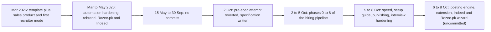
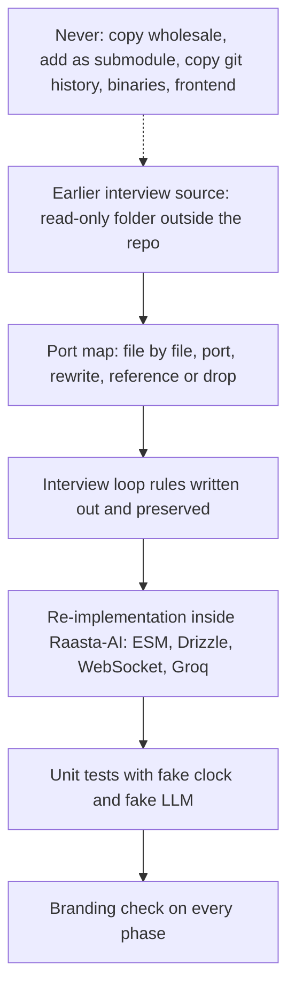

# Part 7 · Implementation Journey

[← Index](README.md) · Previous: [Part 6 · Cross-cutting concerns](06-cross-cutting.md) · Next: [Part 8A · Panel questions](08a-panel-questions.md)

> **Rule for this file.** It is the story of how the system came to exist, told from evidence: the git history (121 commits), the specification and progress log in `docs/ai-hiring/` (21 documents, 2,826 lines), and the working tree. Dates are commit dates or the dates written in the progress log. Where the story has a hole (the 2026-05-15 → 2026-09-30 silence, supervisor meetings, who wrote the earlier interview project) it says **[GAP]** instead of filling the hole. The earlier standalone interview project is mentioned **only here** (and in one panel question), with a ledger of what was reused, adapted, integrated and newly built.

## Contents

* [7.1 The journey at a glance](#71-the-journey-at-a-glance)
* [7.2 Phase by phase](#72-phase-by-phase)
* [7.3 The interview-module integration](#73-the-interview-module-integration)
* [7.4 Real-world incidents that changed the design](#74-real-world-incidents-that-changed-the-design)
* [7.5 Lessons learned](#75-lessons-learned)
* [7.6 Where the project stands today](#76-where-the-project-stands-today)

---

## 7.1 The journey at a glance

**How to read it.** Left to right is calendar time, not effort. The box that matters most for the story is the fourth one: the team **stopped coding, wrote a specification, and then built to it**. The third box is the honest hole in the record: four and a half months with no commits; the team should be ready to say what happened (exams, report, supervisor feedback) because the panel can see it in `git log`.

**The numbers behind the story (all counted on 2026-10-08):**

| Measure | Value | Source |
|---|---|---|
| Commits / distinct authors | 121 / 3 (99 + 22 + 1) | `git shortlog -sn --all` |
| Uncommitted paths | 134 | `git status` |
| Specification documents | 21 files, 2,826 lines (`docs/ai-hiring/01…21`) | `wc -l` |
| Hiring-pipeline code (lines of `.js/.ts/.py`) | `libs/hiring` 3,440 · `libs/interview` 3,950 · `libs/ai` 600 · `libs/agent` 1,590 · `libs/system` 1,314 · `libs/poster` 2,766 · interview engine 549 · AI engine 1,685 (incl. 442 test lines) · candidate room (`app/interview`) 1,776 · recruiter dashboard 6,575 · hiring APIs 1,969 · browser extension 683 | `wc -l` |
| Tests | 6,696 lines under `tests/`; **436 JS tests + 37 Python tests, all passing** | run 2026-10-08 |
| Test count over time (progress log) | 34 Python (Phase 4) → 116 (P5) → 134 (P6) → 149 + 37 (P7) → 170 (agent) → 191 (UI) → 209 → 239 → 266 → 275 → 379 (2026-10-07) → **436** (now) | `docs/ai-hiring/16` |
| Phase gates passed | Phases 0–8 ticked; Phase 9 (hardening, Compose, seed, load test) **not started** | `docs/ai-hiring/16` |

---

## 7.2 Phase by phase

Every phase followed the cycle drawn in [2E §E.1](02e-development-process.md#e1-methodology-as-practised): read the named documents, write a plan, get approval, implement, run the acceptance checks, verify end to end on a local database, write down what was found, tick the checklist, commit as `feat(hiring): phase N – name`. The table below gives, per phase, what it produced, the decisions worth defending, what went wrong, and how it was verified.

### Phase 0 · Foundations and restructure (2026-10-02, `d18727d`)

| | |
|---|---|
| **Built** | The folder skeleton (`libs/ai`, `libs/hiring`, `libs/interview`, `services/*`, `workers`, `tests`); `libs/ai/llm.js` (Groq through the OpenAI SDK with `chatText`, `chatJSON`, `transcribe`, an `LlmError` taxonomy); `libs/hiring/config.js` and `statuses.js`; `libs/hiring/queue.js` (pulled forward from Phase 1 because the worker needs `enqueue()`); skeleton programs: interview engine (`/health` and a ticket-checked WebSocket), hiring worker (consumer-group loop and a `ping` job), AI engine (`/health` plus auth); `scripts/check-branding.sh`; env scaffolding. |
| **Decisions** | Relative imports in everything the satellite programs import, because the `@/` alias exists only inside Next.js (`libs/mailgun.js` was changed to `../config`); one shared LLM client instead of per-feature clients; database SSL made configurable (`DATABASE_SSL`) because the original forced `ssl: 'require'` and broke local Postgres. |
| **Problems** | `npm run build` failed on lint errors in five older non-hiring files; fixed afterwards in `e0356f7`. Docker images could not be built in the dev container. |
| **Verified** | Build with lint skipped; the three programs start and answer `/health`; branding check passes. |

### Phase 1 · Data layer and resume storage (`8a95c2d`)

| | |
|---|---|
| **Built** | Tables and columns in **both** `libs/schema.js` and `libs/schema.ts`; hand-written `drizzle/0009_ai_hiring.sql`; `libs/hiring/storage.js` with a `local` and an `s3` driver and HMAC-signed `/api/files/<token>` links; `libs/hiring/resume-text.js` (PDF/DOCX/TXT extraction); the apply route rewritten (validate, store, extract, deduplicate, enqueue); resume download route; candidate PATCH uses `canTransition`. |
| **Decisions** | Hand-written idempotent SQL (never `drizzle-kit generate`) because the journal was already out of sync; store the **file** (the old code kept only a name) so a recruiter can open the original; duplicates answered 409 (the route also serialises concurrent submissions with a Postgres advisory lock); `pdf-parse` listed in `serverComponentsExternalPackages` because bundled by webpack it breaks. |
| **Problems** | Added `STORAGE_SIGNING_SECRET` (not in the original plan) to sign download links. |
| **Verified** | Migration applied twice cleanly and matched `schema.ts` (`db:push` reported no changes); a PDF was stored and downloaded byte-identical; a second application with the same email returned 409. The LLM parse was exercised with a stub (no Groq key in the container). |

### Phase 2 · Stage-1 AI screening and shortlist (`214c7e1`)

| | |
|---|---|
| **Built** | `libs/ai/prompts/fit.js`, `libs/hiring/fit-scorer.js` (rubric prompt, deterministic post-processing, skill synonyms), `shortlist.js` (`applyShortlist`), worker handlers `screen-candidate` and a debounced `shortlist-job`, screen/shortlist APIs, fit badges and a "Hiring automation" card in the UI. |
| **Decisions** | The LLM judges, **code verifies** (skills recomputed, personal fields stripped, outputs clamped); a rule, not the model, decides who is shortlisted; a 30-second debounce so a burst of screenings triggers one shortlist run. |
| **Problems** | The real-score acceptance (strong CV ≥ 75, unrelated < 40, ±5 stability) **could not be run** without a Groq key; it is still not recorded as met [GAP]. |
| **Verified** | Local Postgres + Redis + worker with a stub model: 10 fixtures → 9 screened (the unreadable scan skipped the model), exactly 3 shortlisted with `minFitScore` 70 and `maxShortlist` 3. |

### Phase 3 · Question bank (`68bbf24`)

| | |
|---|---|
| **Built** | `prompts/questions.js`, `libs/interview/question-generator.js` with validation, handlers `ensure-questions` and `personalise-questions`, question APIs, and an editor page with drag-and-drop ordering. |
| **Decisions** | A bank per job (generated once, editable) plus 0–2 personalised gap questions per candidate; an interview takes a **snapshot** of the questions, so editing the bank never changes an interview already running. |
| **Verified** | Stub model: an 8-question bank (warm-up, technical, role, behavioural), an invalid question dropped, append/replace/reorder/edit/soft and hard delete, snapshot unchanged after edits. The real-model check (8 valid questions, ≥ 3 keywords each) is **not recorded** [GAP]. |

### Phase 4 · AI engine (Python) (`ef94290`)

| | |
|---|---|
| **Built** | FastAPI service split into routers (`tts`, `voice`, `emotion`, `gaze`, `media`, optional `face`) with bearer-token auth that fails closed, storage-key inputs, `/media/concat` with ffmpeg, a Dockerfile. |
| **Decisions** | Keys, not file paths, cross the boundary; models are downloaded at runtime into a cache volume, **never committed**; the heavy face-emotion router is behind `FACE_ANALYSIS_ENABLED`. |
| **Problems** | `huggingface.co` and `download.pytorch.org` were **blocked in the dev container**, so TTS and speech emotion were tested with stand-in models only; the real "/tts returns a playable WAV" acceptance had to wait for a machine with access. |
| **Verified** | 34 pytest tests (now 37); real storage, concatenation, voice metrics, and gaze with the real MediaPipe model on a real face. |

### Phase 5 · Interview engine (`3c1a2aa`, 21:45)

| | |
|---|---|
| **Built** | Token and ticket module, mappers, answer analyzer, scorer, follow-up generator, TTS client, repository, event bus; **`InterviewSession`** (the loop) and **`SessionManager`**; Deepgram and Whisper STT adapters; the WebSocket engine; `scripts/interview-test-client.js`. |
| **Decisions** | The loop's rules were **preserved on purpose** (single-flight lock before any `await`, pre-speak guard with rollback, reschedule in `finally`, follow-up cap, score lookup from the full question list, a skip heuristic that logs); the session takes injected dependencies so it can be tested with fake timers; sessions live in memory with a 15-second snapshot, which keeps the loop simple and makes horizontal scaling a declared non-goal. |
| **Problems found in the end-to-end run** | Whisper's final transcripts lag behind speech, so the silence window ended answers early; it now also counts voice activity. |
| **Verified** | 116 unit tests (all 11 scenarios of the test plan); end to end with espeak-generated WAVs, a stub LLM and a scripted transcriber: a 3-question interview (12 turns, 5 scored responses), `answer_done` → next question in < 50 ms, a mid-answer drop resumes the same question with the away time excluded, speaking during processing merges into the answer and never produces two questions. Real Groq/Deepgram latency was **not measured** [GAP]. |

### Phase 6 · Candidate room and invitations (2026-10-03, `f1eaa62`)

| | |
|---|---|
| **Built** | Public token routes with rate limits; the room (`app/interview/[token]`: welcome, consent, device check, interview, completed, error states); PCM downsampler worklet, recorder, resumable upload queue, WebSocket client with reconnect; `invitations.js` and `emails.js`; handlers `send-invite`, `send-reminder`; expiry and abandon sweeps; recruiter invite/resend/extend/cancel. |
| **Decisions** | The candidate has **no account**: a 256-bit link whose hash is stored, a short-lived ticket for the socket; the page never shows scores; resend and reminder **rotate** the token; the test run produced exactly one invitation email per shortlisting. |
| **Problems** | AudioWorklets never loaded in browsers started from the dev shell on the development machine, so the room falls back to a `ScriptProcessor` path after 5 seconds (same 16 kHz output). |
| **Verified** | Windows end-to-end, 56/56 API checks (invite in 0.5 s and exactly one; 404/410/409/403/429 codes; full interview through the link; resend invalidates the old link; reminder rotates; no token in any log) and 17/17 browser checks with a fake microphone and camera (refresh resumes the same question). Real-voice acceptance with echo cancellation on a desktop was **still open** at that point. |

### Phase 7 · Stage-2 analysis and final evaluation (`a329837`)

| | |
|---|---|
| **Built** | Handlers `assemble-recording`, `analyse-interview`, `finalize-candidate`, `send-outcome-email`; `analysis-client.js`; **`final-evaluator.js`** (communication formula, weighted final score, LLM summary, decision guard); decision APIs. |
| **Decisions** | Final score and decision are **pure formulas**, unit-tested; the LLM only writes the narrative; a candidate who answered 1 of 3 questions is `needs_review`, never auto-applied; rejections need approval unless `autoFinalize`. |
| **Problems** | A race when audio and video were assembled concurrently; `/media/concat` did not handle a browser reload mid-interview (several recorder streams); `librosa` was blocked by Windows Smart App Control on the dev PC, so voice analysis was rewritten to not need it (jitter/shimmer are null without it). |
| **Verified** | 149 JS and 37 Python tests; Windows end-to-end with the real AI engine, 39/39 checks (communication 76, final 69 with breakdown, name scrubbed from the summary, 66 s after the last upload; autoFinalize off stays `interview_completed`; on + no video applies with eye contact dropped). |

### Phase 8 · Recruiter UI and the supervised agent (2026-10-04/05, `a11db5f`)

| | |
|---|---|
| **Built** | The **supervised recruiter agent** (`libs/agent/`: Assisted/Autopilot policy table, escalations, `agent-advance` ticks, an approval inbox with an audit trail, pause/resume/stop, dry-run preview), the Decisions page, interviews list and detail with Live/Summary/Q&A/Transcript/Recording/Communication/Integrity tabs, live SSE, recording deletion, a six-stage Kanban with transition-aware drops, the admin queue card. |
| **Decisions** | The original plan was "agent pipeline steps 8–14 with a resume-from endpoint"; it was **replaced** by an event-driven, supervised design. The reason is not written down (reconstructed: it matches hard rule 6, a human in the loop for rejections): the agent never decides on its own what matters, and the recruiter's own actions win over the agent's queued requests. |
| **Problems** | Recording links were unresolved promises (signing is async); a candidate with an approved-but-unapplied request reappeared in the old decisions list; badge wrapping on narrow screens. |
| **Verified** | 170 then 191 tests; agent run 44/44 on a fresh test database (Assisted stops before publishing; exactly three approvals JD → final shortlist; Autopilot respects the daily invite cap); browser pass with throw-away users. **Not built:** the optional "Hiring" stats card on Home (later replaced by the overview page). |

### Phase 9 · Hardening, deployment, demo — **not done**

Unchecked: rate limits on public routes, token/PII log audit, `docker-compose.yml`, `Dockerfile.web`, `Dockerfile.node`, `nginx/raasta.conf`, a 3-interview load test, `scripts/seed-hiring-demo.js`, a rehearsed demo script, report updates. These items are the bridge to [Part 9](09-future-work.md); the security findings in [6.2.7](06-cross-cutting.md#627-security-findings-register-ranked) are the same story from the other side.

### Changes between phases (each logged with its evidence)

| Date | Change | Why |
|---|---|---|
| 2026-10-03 | Settings screen rebuilt (profile, security, preferences) | the commit message says the screen was rebuilt "with working" profile, security and preferences |
| 2026-10-03 | Models switched to GPT-OSS (`3eb4998`); engine socket path fixed (`87e6140`); stalled-screening flag and no retry for hopeless jobs (`c1d51b2`); LinkedIn login selectors (`5c10176`) | Groq retired Llama 3.x; a path mismatch; a job retried forever; LinkedIn changed its form |
| 2026-10-05 | Per-platform job posts and a publish panel (migration `0012`), custom dialogs instead of `confirm/alert`, hiring agent separated from the sales agent | publishing needed per-platform text and limits |
| 2026-10-05 | Setup guide (start/stop/watch the programs from the web app) | four programs were hard to run by hand |
| 2026-10-05 | Hiring worker started by the web server | a reported stuck agent run turned out to be no worker running, plus a card that never refreshed |
| 2026-10-05 | `npm run serve` and the dev warm-up; migration `0013` indexes | `npm run dev` took ~51 s of compile time to visit the main screens; now ~2.5 s |
| 2026-10-07 | Interview hardening and camera behaviour tracking | a real interview failed (see 7.4) |
| 2026-10-06 → 08 | Posting engine, browser extension, Indeed and Rozee.pk work | no open posting APIs (see [4D](04d-functionality-publishing.md)) |

---

## 7.3 The interview-module integration

> **The one section where the origin of the interview agent is discussed.** Everywhere else in this documentation the interviewer is simply "Raasta AI Interviewer", a module of Raasta-AI. Here is the honest account of how it came about.

### 7.3.1 Starting state: two codebases

| | **Raasta-AI at the end of May 2026** (`main` at `fa594fe`) | **The earlier standalone interview project** (kept outside the repo as a read-only reference) |
|---|---|---|
| Purpose | LinkedIn/Rozee.pk client acquisition and a first recruiter mode (jobs, AI post, public apply form, LLM resume parsing) | An AI interviewer that **joined a video meeting as a bot** and interviewed a candidate, with scoring and analysis |
| Stack | Next.js 14, Drizzle/PostgreSQL, NextAuth, Groq | Express-style Node backend, **MongoDB/Mongoose**, **OpenAI `gpt-4o`** with tool-calling, a hosted third-party meeting-bot API (transcripts arrived by webhook), a React/TypeScript frontend, a small Python server for TTS and analysis |
| Size (lines of `.js/.ts/.tsx/.py`, counted on 2026-10-08) | the whole app: see 7.1 | backend 109 files / 20.8 k lines; frontend 90 files / 16.5 k lines; Python server 3 files / 1.2 k lines |
| Candidate screening | substring count of skills (`minSkillMatch`); the resume **file was not stored**; PDF text by regex | none (interviews only) |
| Where candidates came from | the apply form | a separate CV/roles/questions module of its own |

**The gap the integration closes.** The FYP promised "AI resume screening" and an "AI interview"; Raasta-AI had neither in a usable form, and the earlier project had the interview idea but not the recruitment pipeline around it. The task was to make the interview a **native stage of the Raasta-AI pipeline** (screening → shortlist → invite → interview → analysis → decision), not a bolt-on service.

### 7.3.2 The merge strategy: a port map, not a `git merge`

**How to read it.** The solid path is what happened: study the source, write a **port map** (`docs/ai-hiring/04`) that says for each source file whether to port, rewrite, use as reference or drop, extract the behaviour rules that had been "tuned against real interviews" and write them down, then re-implement against Raasta's own architecture and test the result. The dashed box is the set of things CLAUDE.md **forbids** (hard rule 2).

**Alternatives that were not chosen, and why**

| Option | Why not |
|---|---|
| Run the old project as a service next to Raasta-AI | two databases (Mongo and Postgres), two auth systems, two UIs, a paid meeting-bot dependency, and no shared candidate or job data |
| Copy the code in and adapt it | would import MongoDB, `gpt-4o`, the bot webhooks, the old frontend and binaries; violates the single-identity and single-database rules |
| Add it as a git submodule | same entanglement and it would carry the other project's history and name |
| Rewrite the interview from scratch without looking | would discard behaviours already tuned on real interviews (single-flight locking, the pre-speak guard, the seven follow-up conditions, the scoring rubric) |
| **Port the rules, rewrite the code (chosen)** | keeps the knowledge, drops the stack, gives one product with one database |

### 7.3.3 Debranding

| Rule (from `docs/ai-hiring/04` and CLAUDE.md) | How it was enforced |
|---|---|
| The earlier project's name never appears in code, comments, strings, file or folder names, env vars, package names, database names, logs, commit messages or documents | `npm run check:branding` (`scripts/check-branding.sh`) greps the whole repository (excluding `node_modules`, `.git`, build and runtime folders); the script builds the name from two fragments at run time so that it **does not contain the name itself**. It is part of every phase's acceptance checks. It passes today **including this documentation set**. |
| The interviewer is called "Raasta AI Interviewer" | `INTERVIEWER_NAME` with that default; the greeting and email text use it |
| Concepts are renamed to Raasta's vocabulary | "bot" → interviewer; `sessionId` (a timestamp) → `interviews.id` (a UUID); "webhook from the meeting service" → "STT event"; "Role" → job; "CV" → candidate |
| Nothing foreign is copied | no `*.exe`, `*.h5`, `*.task`, `*.traineddata`, test output, uploads, READMEs, diagrams, design-system folder, frontend or git history; model weights download at run time into `MODEL_CACHE_DIR` |

### 7.3.4 What changed, area by area

| Area | Before (earlier project) | After (Raasta-AI) | Where |
|---|---|---|---|
| **Medium** | a bot joined a hosted video meeting; audio and transcripts came from a third party | an **in-browser room**: the candidate's microphone streams PCM over a WebSocket to our engine; speech-to-text is Deepgram `nova-3` (Whisper fallback); no meeting service | `app/interview/[token]`, `services/interview-engine`, `libs/interview/stt` |
| **Candidate identity and access** | whoever had the meeting link | a **capability link** (256-bit, stored as SHA-256, expiry, rotated by reminders, per-route rate limits) exchanged for a 10-minute HS256 WebSocket ticket; explicit **consent** before anything is captured | `libs/interview/tokens.js`, `public-access.js`, `app/api/interview/[token]/*` |
| **Staff authentication** | its own auth module | dropped; NextAuth sessions and `withAuth` + ownership filters protect recruiter views | [6.1](06-cross-cutting.md#61-authentication-and-authorization) |
| **Data model** | one MongoDB `Interview` document with embedded transcripts, responses and analysis; separate CV, roles and questions modules | four relational tables (`interview_questions`, `interviews`, `interview_turns`, `interview_responses`) plus JSON columns (`state` snapshot, `analysis`, `client_info`, `integrity_events`); candidates, jobs and questions are Raasta's own rows | `libs/schema.{js,ts}`, `drizzle/0009`, `libs/interview/repository.js` |
| **Language model** | OpenAI `gpt-4o`, tool-calling | Groq through one shared client with JSON mode and validation, `LLM_MODEL` / `LLM_FAST_MODEL` configurable; the three separate LLM checks of the answer analyzer became **one** JSON call | `libs/ai/llm.js`, `answer-analyzer.js` |
| **Routing and transport** | REST routes plus webhooks from the meeting service | Next.js route handlers (token routes), a **WebSocket** for the live loop, **Redis pub/sub** to the recruiter's live view, **Redis Streams jobs** for analysis | `app/api/interview/*`, `services/interview-engine`, `workers/hiring-worker.js` |
| **Recording** | downloaded from the meeting service | recorded in the candidate's browser, uploaded as ≤ 10 MB parts with retries, joined by **ffmpeg in the worker** (AI engine as fallback) | `upload/route.js`, `libs/interview/media-tools.js` |
| **Analysis** | Python scripts bridged from Node | the Python service is a small authenticated HTTP API taking storage keys; voice pace/pauses/fillers are also computed in Node so a score does not depend on it | `services/ai-engine`, `voice-metrics.js` |
| **Recruiter and candidate UI** | a React/TypeScript frontend (`LiveInterview`, `InterviewDetail`, `QuestionBank`) | rebuilt in Next.js + DaisyUI: the candidate room and the recruiter's Live/Summary/Q&A/Transcript/Recording/Communication/Integrity/Behaviour tabs; the old pages were only **reference** | `app/interview`, `app/dashboard/recruiter/interviews` |
| **Pipeline position** | stand-alone | a **status** in the candidate machine (`shortlisted` → `interview_invited` → … → `interview_completed` → final), reached automatically by the shortlist hook | `libs/hiring/statuses.js`, `shortlist-hooks.js` |
| **Tests** | none carried over (the old tests were dropped) | 95 tests on the conversation and access layer alone, written against fake clocks and a fake LLM | [6.7](06-cross-cutting.md#67-testing-and-coverage) |

### 7.3.5 Ledger: reused · adapted · integrated · newly built · dropped

| Category | What | Evidence |
|---|---|---|
| **Reused (the knowledge, not the text)** | The loop's rule set: greeting then start trigger, answer accumulation, finalise on a client signal or silence, **single-flight lock acquired before any await**, **pre-speak guard with rollback** (> 10 new characters means the candidate kept talking), reschedule in `finally`, follow-up depth cap, skip-if-already-answered heuristic. The **seven-condition answer analyzer** (incomplete, new topic, skill avoided, contradiction, deep experience, natural cues, multi-step). The **scoring rubric** bands (90/70/50/30) and the keyword fallback `0.7×coverage + 0.3×length`. The **follow-up prompt structure** and its fallback table. The Python analysis approach (MediaPipe gaze, Wav2Vec2 emotion, voice metrics, Kokoro TTS). | `docs/ai-hiring/04` "Interview loop rules"; implemented in `session-engine.js`, `answer-analyzer.js`, `answer-scorer.js`, `follow-up.js`, `services/ai-engine/` |
| **Adapted (same idea, new stack)** | CommonJS → ESM with injected dependencies; OpenAI tool-calling → JSON mode; Mongoose → Drizzle (`repository.js`); the session map + debounce timers + periodic save (`botService`) → `SessionManager` with 15 s snapshots and resume; TTS service → `tts-client.js` returning bytes; the Python server split into routers with storage-key inputs and bearer auth; `skip` heuristic now **logged** and **disabled when fewer than 6 questions remain**; the score is looked up from the **full** question list (a regression the earlier code had when the asked question had already left the queue). | `tests/hiring/session-engine.test.js` (scenarios 5, 6, 10), `docs/ai-hiring/17` |
| **Integrated with Raasta-AI** | `mappers.js` turns Raasta candidates and jobs into the interviewer's context; the question bank is Raasta's generated, editable `interview_questions`; invitations, tokens, reminders and expiry; the hiring worker queue; the final evaluator and decision queue; notifications; ownership and admin rules; the supervised agent. | `libs/interview/mappers.js`, `libs/hiring/*`, `libs/agent/*` |
| **Newly built (no counterpart in the earlier code)** | The in-browser room (consent, device check, worklet/ScriptProcessor, resumable upload queue); the WebSocket protocol, tickets and reconnect/resume window; capability-link security; Deepgram streaming adapter; **echo guard**, **STT junk cleaning**, **intent rules** ("end the interview", refusals); ffmpeg recording join; Node voice metrics and communication score; **camera behaviour tracking** in the browser; final score and decision guard; recruiter live view, transcript-to-recording sync, deletion; the whole screening → shortlist stage in front of it. | `libs/interview/{echo-guard,intent,behavior,media-tools,voice-metrics}.js`, `app/interview/[token]/lib/*` |
| **Dropped** | MongoDB models; the old auth, CV, roles and questions modules; all meeting-bot API calls; audio/video download services; webhook routes; the old frontend, design-system and diagrams; scripts and tests; binaries; the git history. | `docs/ai-hiring/04` file map |

**Measured, not just claimed: how much text was carried over.** For the nine source files that the port map says to port or rewrite, I counted lines of at least 25 characters that appear **identically (after trimming whitespace)** in the Raasta-AI file that replaced them. This detects literal copy-and-paste; it does **not** detect reused ideas, which the table above admits are substantial.

| Earlier file | Lines | Raasta-AI replacement | Lines | Identical substantive lines |
|---|---|---|---|---|
| interview loop controller | 1,000 | `libs/interview/session-engine.js` | 845 | **0** of 481 |
| bot/session service | 658 | `services/interview-engine/session-manager.js` | 412 | **0** of 210 |
| answer analyzer | 458 | `libs/interview/answer-analyzer.js` | 145 | 4 of 91 (4.4 %) |
| answer scoring service | 235 | `libs/interview/answer-scorer.js` | 62 | **0** of 37 |
| LLM service (follow-up) | 373 | `libs/interview/follow-up.js` | 61 | 1 of 37 (2.7 %) |
| TTS service | 155 | `libs/interview/tts-client.js` | 41 | **0** of 21 |
| Python server | 896 | `services/ai-engine/{main.py,routers,core}` | 1,243 | 14 of 661 (2.1 %) |
| eye-gaze service | 286 | `services/ai-engine/core/gaze.py` | 157 | 10 of 92 (10.9 %) |
| facial-emotion script | 575 | `services/ai-engine/routers/face.py` | 72 | 2 of 38 (5.3 %) |

The nine earlier files total 4,636 lines of the ≈ 38,500 in the reference folder (about 12 %); the rest was dropped or used as reference only. Read the result as: **the behaviour was inherited by specification; the code was written anew** (the highest overlap is 10.9 %, in the gaze module).

### 7.3.6 Problems met during the integration, and how each was solved

| # | Problem | Cause | Solution | Evidence |
|---|---|---|---|---|
| 1 | No meeting service to deliver audio | design change to an in-browser room | PCM over WebSocket, streaming STT, half-duplex microphone, consent screen | Phases 5–6 |
| 2 | Answers ended too early | Whisper's final transcripts lag behind speech | the silence window also counts voice activity; Deepgram streaming added | Phase 5 log |
| 3 | The interviewer heard itself | speakers feed the candidate's microphone | microphone closed while the interviewer speaks (450 ms tail); question text heard back is cut from the transcript | `echo-guard.js`, 2026-10-07 |
| 4 | Phantom sentences ("Thank you.", Portuguese or Japanese words) | speech models hallucinate on noise | Whisper locked to English (`STT_LANGUAGE`), foreign-script filter, junk cleaning | `stt/clean.js` |
| 5 | The skip heuristic could drop questions from short banks | a risk identified in the port map before coding | logged, and disabled below 6 remaining | `session-engine.js` |
| 6 | Some scores were never written | score lookup used the queue, where the asked question had already left | look up in the full list; regression test | scenario 10 |
| 7 | Follow-ups empty or cut off | GPT-OSS reasoning tokens consumed `max_tokens: 150` (148 reasoning tokens, empty reply, found by calling the model) | larger budgets, one retry with 3×, `reasoningEffort: low` on the live path | `libs/ai/llm.js` |
| 8 | Model deprecated | Groq retired Llama 3.x | env-configurable model names; switch to `openai/gpt-oss-120b` / `20b` | `3eb4998` |
| 9 | Recording existed but nothing was analysed | joining depended on the Python service, which was not running; the error was swallowed | ffmpeg join in the worker, failures kept and retried, UI says how many parts arrived | 2026-10-07 |
| 10 | Browser audio never started | AudioWorklet not loading in some shells | `ScriptProcessor` fallback after 5 s | Phase 6 |
| 11 | Engine unreachable from the room | wrong socket path | fixed (`87e6140`) | commit |
| 12 | Voice analysis crashed on Windows | `librosa` blocked by Smart App Control | analysis without it (jitter/shimmer null) | Phase 7 |
| 13 | TTS untestable | model hosts blocked in the dev container | stand-in models in tests; browser voice as the runtime fallback | Phase 4 |
| 14 | `@/` alias breaks outside Next.js | the engine and worker run under `tsx` | relative imports rule for shared folders | CLAUDE.md |
| 15 | Migrations cannot be generated | Drizzle journal out of sync, two schema files | hand-written idempotent SQL; every change in both schema files | CLAUDE.md rule 3 |
| 16 | Concurrent audio/video assembly race | audio and video were assembled at the same time (details beyond "fixed" are not in the log) | fixed during Phase 7 | Phase 7 log |

### 7.3.7 Current status of the integrated module

| Aspect | Status | Evidence |
|---|---|---|
| Conversation loop (greeting, questions, follow-ups, closing, resume) | **Working and tested** | 29 session-engine tests, 11 session-manager tests, scripted end-to-end runs |
| Candidate room with consent, device check, recording, resume after reload | **Working** (verified in Chromium with a fake mic/camera; a real interview was run on 2026-10-07) | Phase 6 log; 2026-10-07 entry |
| Live recruiter view, transcript, recording tab with sync, integrity and behaviour tabs | **Working** | Phase 8 browser run; 2026-10-07 |
| Scoring, communication score, final score, decision guard | **Working** (formulas hand-checked and tested) | Phase 7 |
| Analysis of a **real** recording | **Verified once** (858 s audio, 848 s video, communication score 59 with the AI engine off, face found in 99.8 % of samples) | 2026-10-07 entry |
| Latency target ≤ 4 s with real providers | **Not measured** [GAP] | Phase 5 log |
| A full spoken interview end to end after the 2026-10-07 hygiene fixes | **Not verified live**: the engine was not running during that session; echo and junk filters are proven by unit tests on lines from the real transcript | 2026-10-07 entry |
| Deepgram under load; several simultaneous interviews | **Not tested** [GAP] (Phase 9 load test not done) | Phase 9 unchecked |
| Real Kokoro TTS audio on the demo machine | **Verify before the demo** (tested with stand-ins; browser voice is the fallback) | Phase 4 log |
| Quality of AI judgement (answer scores, follow-ups) | **Not measured** [GAP] | [5.6](05-ai-components.md#56-how-quality-was-measured-and-how-it-should-be) |

### 7.3.8 Provenance: what the panel can and cannot see

* The reference folder on the development machine is a git repository with **one commit** (2026-10-02, by Zain Abbas). That commit cannot show who wrote the original code, when, or under what licence.
* **[GAP — the team must settle this before the viva]**: one truthful sentence about the earlier project's authorship and licence (who wrote it, whether it was part of coursework or an earlier personal/team project, and whether anyone else holds rights). A panel that asks "is this your own work?" is asking exactly this.
* What the repository *does* prove: the code in Raasta-AI is a re-implementation (no wholesale copying, 0–11 % identical lines per file as measured above), the dependency on the old stack was removed, the behaviour rules were written down in `docs/ai-hiring/04` before coding, and the result is tested.

**Panel soundbite (30 s).** "The interview idea existed as a separate prototype that depended on a meeting bot, MongoDB and GPT-4o. We wrote a port map, kept the conversation rules that had been tuned on real interviews, and re-implemented everything on our own stack: browser room, WebSocket, Postgres, Groq. Nothing is copied verbatim — we measured it — and the module is now a status in our hiring pipeline with 95 tests on the conversation layer alone. What we added is most of what makes it a product: consent, access control, recording, analysis, scoring, the recruiter's tools."

---

## 7.4 Real-world incidents that changed the design

Each row is a failure observed in real use, followed by the change it caused. These are the strongest evidence that the system was exercised outside the happy path.

| Date | Incident (evidence) | Root cause | Change | Lesson |
|---|---|---|---|---|
| 2026-10-03 | AI calls began failing | Groq **retired Llama 3.x** models | model names moved to env; GPT-OSS adopted; error taxonomy `LlmError` | never hard-code a vendor's model |
| 2026-10-03 | Screening kept retrying a job that could never succeed | no stall detection | `stalled` flag and no retry for unrecoverable cases | retry rules need a stop condition |
| 2026-10-05 | An agent run looked stuck | no worker process was running; the agent card did not refresh | web server starts and restarts the worker; Setup guide; status strips | make the operational state visible |
| 2026-10-05 | `npm run dev` too slow to demo | each screen compiles on first visit (≈ 51 s to visit the main screens) | `npm run serve` (production build), warm-up, indexes → ≈ 2.5 s | measure, then fix the biggest cause |
| 2026-10-07 | A real interview had **no recording, no communication score and a damaged transcript** | recording parts uploaded (86 audio, 85 video) but joining depended on a service that was down, and the error was swallowed; echo and junk text polluted the transcript; reasoning tokens truncated follow-ups | ffmpeg in the worker with retries, Node voice metrics, echo guard, STT cleaning, intent rules, token-budget fix, camera behaviour tracking | never let an optional service block a required result; log failures loudly |
| 2026-10-06 → 08 | Indeed's bot check, then a **paused employer account** (cause unknown) and a block page for the engine's window | platform enforcement | visible-window posting engine that hands over at every check, cool-offs, a practice site per platform, stop live runs | design for the platform saying no |
| 2026-10-08 | Rozee.pk's "Post a job" form no longer exists; it is a new AI wizard | platform redesign | engine rewritten against the wizard; publishing left to the person because it spends a credit | automation against UIs has a half-life |

---

## 7.5 Lessons learned

| Lesson | Evidence in this project |
|---|---|
| **Specification first beat coding first.** The unspecified attempt was reverted within about 30 minutes of being committed; nine phases then landed in four days with acceptance checks. | `f51fd8e` → `08899de`; `docs/ai-hiring/16` |
| **Port rules, not code.** Behaviour tuned on real interviews survived; the old stack did not. | 7.3 |
| **Put judgement in code where it matters.** Thresholds, scores, state machines and security are deterministic and unit-tested; the model writes text and gives a first opinion. | Parts 4–5 |
| **Make failures visible.** The Setup guide, queue card and recording-parts counter exist because "it silently did nothing" cost time twice. | 7.4 |
| **Test with fakes, then confirm with reality.** 436 fast tests, plus a few real runs that found what fakes could not (reasoning tokens, echo, recording join). | 6.7, 7.4 |
| **Write down what you did not verify.** The progress log's "not verified live" entries are what let this documentation separate fact from hope. | `docs/ai-hiring/16` |
| **Do not let the older half rot.** The sales half has the open routes and the stale model name; it was frozen when the hiring pipeline took priority. | [6.2.7](06-cross-cutting.md#627-security-findings-register-ranked) |
| **Commit.** 134 paths of valuable work are only on one disk. | `git status` |

---

## 7.6 Where the project stands today

| Module | State | Notes |
|---|---|---|
| Client acquisition (campaigns, leads, scraping, AI messages, invites, acceptance tracking) | **Implemented, older, lightly tested** | open routes and a retired default model [GAP]; LinkedIn automation depends on selectors and owner-accepted risk |
| Job posting (AI post, per-platform text, publish panel, LinkedIn automation) | **Implemented** | Rozee.pk and Indeed through the posting engine/extension/Copy-and-open; engine's live runs against Indeed paused |
| Public apply form, resume storage and parsing | **Implemented and tested** | rate limits missing |
| AI screening and shortlist | **Implemented and tested** | accuracy not measured |
| Question bank | **Implemented** | quality not measured |
| Invitations, reminders, expiry | **Implemented and tested** | |
| AI interview room and engine | **Implemented, tested, used once for real** | latency, scale and accuracy not measured |
| Analysis and final evaluation | **Implemented and tested** | communication score validated on n = 1 |
| Recruiter UI, decisions, supervised agent | **Implemented and tested** | |
| Setup guide, worker host, performance work | **Implemented and tested** | |
| Hardening, Docker/Compose, deployment, demo seed, load test | **[PLANNED] — Phase 9 not started** | see [Part 9](09-future-work.md) |
| CI, retention policy, subject-access, encryption of stored sessions | **[GAP]** | see [6.10](06-cross-cutting.md#610-consolidated-risk-register-what-to-fix-first) |
