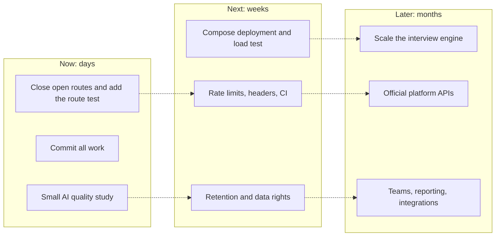

# Part 9 · Future Work

[← Index](README.md) · Previous: [Part 8B · Weaknesses, demo, cheat sheet](08b-weaknesses-demo-cheatsheet.md) · Next: [Part 10 · Coverage checklist](10-coverage-checklist.md)

> **How this list was built.** Every item answers a limitation that this documentation already states: a security finding (SEC-nn in [6.2.7](06-cross-cutting.md#627-security-findings-register-ranked)), a weakness (W-nn in [8B](08b-weaknesses-demo-cheatsheet.md#8b1-known-weaknesses-with-honest-framing-and-fix)), a gap in Part 5, or an unchecked item in Phase 9 ([7.2](07-implementation-journey.md#phase-9--hardening-deployment-demo--not-done)). Nothing here is a new idea invented to look ambitious. Effort figures are the author's estimates, not measurements. Everything in this Part is **[PLANNED]**.

## Contents

* [9.1 Roadmap in one picture](#91-roadmap-in-one-picture)
* [9.2 Now: before the evaluation](#92-now-before-the-evaluation)
* [9.3 Next: before any pilot with real candidates](#93-next-before-any-pilot-with-real-candidates)
* [9.4 Later: towards a product](#94-later-towards-a-product)
* [9.5 Research directions worth a thesis chapter](#95-research-directions-worth-a-thesis-chapter)
* [9.6 What we would deliberately not build](#96-what-we-would-deliberately-not-build)

---

## 9.1 Roadmap in one picture

**How to read it.** Three horizons from left to right; every box is dashed because none exists yet. The arrows show dependencies, not a schedule: for example the load test (Next) must exist before the engine redesign (Later) so that the redesign is driven by a measured limit.

---

## 9.2 Now: before the evaluation

Small, high-leverage work that removes the most embarrassing questions.

| ID | Item | Addresses | Effort | Done when |
|---|---|---|---|---|
| F1 | **Close the nine open routes** (wrap in `withAuth`, filter by owner, whitelist fields on message update, delete or gate the three development routes); make the cron route refuse an unset secret | SEC-01…06, W1, W2 | 3 h | a script lists every `route.js` handler; each is wrapped or on an allow-list |
| F2 | **Route-protection test**: a test that walks `app/api/**/route.js` and fails if a handler is neither `withAuth`-wrapped nor on a reviewed allow-list | W1, [6.7.4](06-cross-cutting.md#674-what-is-not-tested-say-this-before-the-panel-asks) | 1 h | the test fails on a deliberately unprotected route |
| F3 | **Commit** the 134 uncommitted paths in logical commits; tag the demo build | W18 | 30 min | `git status` clean |
| F4 | **Complete `.env.example`** with every name the code reads (no values) and a short comment per group | SEC-11 | 1 h | a new machine can start from the file |
| F5 | **Small AI quality study**: rank 30 CVs against two recruiters (Spearman), grade 50 answers by two humans (Pearson), repeat one CV five times (spread) | W9, [5.6](05-ai-components.md#56-how-quality-was-measured-and-how-it-should-be) | 2 days | numbers in a table in Part 5 |
| F6 | **Log token usage** per call (`response.usage`) with a stage label; run 10 interviews and report cost per application and per interview | W15, [6.5.6](06-cross-cutting.md#656-ai-cost) | 1 h + run | a cost table replaces "unknown" |
| F7 | **Update the report** (LLM not spaCy; Node worker; new use cases) and fix the false encryption claim in `LINKEDIN_INTEGRATION.md`; remove dead `libs/mongoose.js`, `libs/gpt.js` and the tracked debug screenshots | W5, W24, W25 | 2 h | documents agree with code |
| F8 | **Write down the facts outside the repository**: supervisor review dates, requirement sources, each member's non-code work, authorship and licence of the earlier prototype | W26, W27 | 2 h | the fill-in tables in 2E and 7.3.8 are complete |

---

## 9.3 Next: before any pilot with real candidates

| ID | Item | Addresses | Effort | Done when |
|---|---|---|---|---|
| N1 | **Rate limiting and bot control** on register, sign-in, apply (reuse the Redis limiter) plus a CAPTCHA on the apply form | SEC-08, W3 | 4 h | 100 rapid posts are refused after the limit |
| N2 | **HTTP security headers** (CSP, HSTS, frame ancestors, referrer, permissions policy that allows microphone and camera only on the interview route) | SEC-10, W4 | 1 h | a header scan passes |
| N3 | **CI**: lint, branding check, JS and Python tests on every push; `npm audit` and `pip-audit` weekly | W16, OWASP A06 | 2 h | green badge on the default branch |
| N4 | **Retention and data rights**: scheduled purge of resumes and recordings after N days; delete-by-prefix when a candidate or job is deleted; admin export and delete for a candidate | W6, [6.3](06-cross-cutting.md#63-privacy-and-data-protection) | 1–2 days | a test candidate disappears from DB and storage |
| N5 | **Encrypt stored platform sessions** (authenticated encryption, key from the environment) and stop keeping full CV text in `parsed_data._resumeText` after parsing, or encrypt it | SEC-07, W5 | 3 h + migration | database dump shows ciphertext |
| N6 | **Blind screening**: remove name and contact details from the raw CV text before the scoring call; run the counterfactual test (same CV, swapped names and universities) | W10, [5.5](05-ai-components.md#55-fairness-explainability-and-human-oversight) | 1 day | mean score difference within a stated tolerance |
| N7 | **Fit score computed from sub-scores**: ask the model for four sub-scores and compute the weighted sum in code | W12 | half a day | rubric weights live in code and tests |
| N8 | **Parse in the worker**: move resume parsing out of the apply request, add a content check (magic bytes) and a parse timeout | SEC-12, W7, [6.5.4](06-cross-cutting.md#654-what-breaks-at-10-and-at-100-scenario-reasoning) | 1 day | apply returns at once; a corrupt file cannot stall a request |
| N9 | **Accent and camera robustness tests**: same scripted answers in several voices and accents (word error rate and score), same session under different lighting | W11 | 1–2 days | disparity report |
| N10 | **Docker Compose deployment** (web, worker, interview engine, AI engine, Redis, nginx with TLS) and a **seed script** for a demo job with 10 applicants; rehearse the demo | W16, Phase 9 | 1–2 days | one command brings the stack up on a clean VM |
| N11 | **Load test**: three, then twenty scripted interviews with the existing test client; record p50/p95 latency, CPU and memory | W17 | 1 day | numbers in 6.5.1 |
| N12 | **Route-level and UI tests**: handler tests for ownership and status codes; a few Playwright flows (sign-in, apply, decision) | W20 | 2 days | route layer covered |
| N13 | **Reviewer controls**: let the recruiter edit an answer's score with a note, and ask a second reviewer on borderline cases | [5.5](05-ai-components.md#55-fairness-explainability-and-human-oversight) | 1–2 days | audit trail shows who changed what |
| N14 | **Candidate transparency**: a plain-language notice, a way to request a human review, and an outcome email that says what happens next | Part 3 §4.4, Q49 | 1 day | review request recorded |
| N15 | **Sales module hardening**: current default model, authentication on the internal calls (replace the unused `x-internal-call` header with a shared secret), the bulk-generation insert, tests | W23 | 2–3 days | sales APIs pass the F2 test |

---

## 9.4 Later: towards a product

| ID | Item | Why |
|---|---|---|
| L1 | **Make the interview engine horizontally scalable**: keep session state in Redis (or shard by interview id with sticky routing), autoscale engines, set per-engine limits from the load test | the only part that cannot scale by adding processes ([6.5.2](06-cross-cutting.md#652-where-the-limits-come-from-component-by-component)) |
| L2 | **Official platform integrations** (partner APIs where available) in place of browser automation; keep the extension as a fallback | the largest external risk ([6.4](06-cross-cutting.md#64-third-party-platform-automation-legal-and-ethical-position)) |
| L3 | **Teams and permissions**: organisations, roles beyond admin and recruiter, shared jobs, audit log of who viewed what | the single-owner model does not fit a company |
| L4 | **Integrations**: calendar for human final interviews, ATS/HRIS export, Slack/Teams notifications | closes the loop after the AI stage |
| L5 | **Observability**: central logs, metrics, request ids across web → queue → worker, error tracking, alerts on queue depth and dead letters | operations at scale |
| L6 | **TypeScript migration** and removal of the duplicate schema file; a baseline migration that rebuilds the database from scratch | W19 in [8B](08b-weaknesses-demo-cheatsheet.md#8b1-known-weaknesses-with-honest-framing-and-fix) |
| L7 | **Multilingual interviews** (Urdu and English), with per-language speech and fairness validation | the target market |
| L8 | **OCR** for scanned CVs; **embeddings** as a cheap pre-filter when applicant volume is high | scope gaps in [1.3.3](01-big-picture.md#13-what-multi-platform-actually-means-here) and Q26 |
| L9 | **Mobile-friendly interview** (phone browsers), with tested audio paths | scope choice today |
| L10 | **Self-hosted model option** for sensitive deployments (open-weight LLM and speech models on the company's own machine) | data leaves the system today ([6.3](06-cross-cutting.md#63-privacy-and-data-protection)) |
| L11 | **Legal and ethics review**: a data-protection impact assessment, review of face-related processing, written candidate notice, processor agreements with providers | no legal review was done |

---

## 9.5 Research directions worth a thesis chapter

These are the ideas that turn a working system into a research contribution.

1. **Calibrating the pipeline from recruiter behaviour.** Every override a recruiter makes (shortlisting below the threshold, rejecting a suggested shortlist) is a free label. Logging overrides with the evidence shown would allow estimating the threshold and the final weights, and measuring where the model and humans disagree.
2. **A fairness benchmark for AI screening in the local setting.** Build the counterfactual CV set (names, universities, locations typical of the market) and the accent audio set, publish the method and report disparities for the models used. The protocol is already written in Part 5.
3. **Explainability that recruiters actually use.** Compare the current "evidence before number" layout with a score-first layout in a small user study: time to decide, agreement with a reference panel, and over-trust.
4. **Prompt-injection robustness for hiring.** A small adversarial set of CVs and spoken answers, measuring score inflation, and a mitigation (output verification and a second-model check).
5. **Interview design.** Which question types and follow-up policies best separate strong from weak candidates, tested against recruiter judgements.
6. **Cost-quality trade-off.** Cheap model for screening and an expensive one only for borderline cases, measured against a fixed human baseline.

---

## 9.6 What we would deliberately not build

| Not building | Reason |
|---|---|
| Fully automatic rejection | removes the safeguard the whole design rests on; legally and ethically unsafe without validation |
| Emotion or personality scoring as a decision input | weak validity, high fairness risk; camera and voice signals stay secondary, labelled and optional |
| A free-roaming LLM agent that chooses its own actions | unauditable; the policy-table workflow is a deliberate choice |
| Stealth-first platform automation as the main path | account loss is certain at scale; assisted and official routes are the durable ones |
| A native mobile app before the web interview is validated | adds surface area without answering the open questions |
